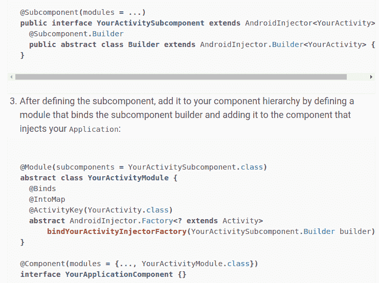

# dagger.android 缺失文档，第 3 部分:片段

> 原文：<https://dev.to/autonomousapps/the-daggerandroid-missing-documentation-part-3-fragments-12go>

欢迎来到本系列第三部分的 dagger.android 。如果你刚刚加入我们，你可以在这里查看前两部分:

1.  [第 1 部分—基本设置](https://dev.to/autonomousapps/the-daggerandroid-missing-documentation-33kj)
2.  [第二部分—视图模型和视图模型工厂](https://dev.to/autonomousapps/dagger-dot-android-part-2-viewmodels-and-viewmodel-factories-10ii)
3.  这部分

在第 3 部分中，我们将学习注入`Fragment` s，注入*保留的*T1(其中 [getRetainInstance()](https://developer.android.com/reference/android/support/v4/app/Fragment.html#getRetainInstance()) 返回 true)，共享主机`Activity`拥有的对象，以及一个包含自定义 [ViewModelProvider 的](https://developer.android.com/reference/android/arch/lifecycle/ViewModelProvider.Factory) [ViewModel](https://developer.android.com/reference/android/arch/lifecycle/ViewModel) s 的陷阱。工厂 s。

# 注射一次`Fragment`

[众所周知](https://stackoverflow.com/questions/9245408/best-practice-for-instantiating-a-new-android-fragment)，试图在一个片段上执行构造函数注入是非常糟糕的。

```
// NEVER DO THIS
class VeryBadFragment(private val someInt: Int) : Fragment 
```

Enter fullscreen mode Exit fullscreen mode

Android Studio 的 new-fragment 向导总是添加一个默认的(无参数)构造函数，这是有原因的，因为该框架有时可能需要在以后重新创建您的片段，如果这样做，它将调用无参数构造函数，使您的应用程序处于糟糕的状态，或者如果您没有这样的构造函数，甚至会导致崩溃。这就是这样的代码如此普遍的原因:

```
class GoodFragment : Fragment {
  companion object {
    fun newInstance(someInt: Int): GoodFragment {
      // Gross, looks like Java
      val args = Bundle()
      args.putInt("SOME_INT", someInt)
      val fragment = GoodFragment()
      fragment.arguments = args
      return fragment
    }
  }

  // You cannot have two companion objects in a single class; this is just a demonstration
  companion object {
    fun newInstance(someInt: Int): GoodFragment {
      // So much nicer! Uses `T.apply()` from Kotlin stdlib and
      // `bundleOf(vararg pairs: Pair<String, Any?>)` from android-ktx
      return GoodFragment().apply {
        arguments = bundleOf("SOME_INT" to someInt)
      }
    }
  }
} 
```

Enter fullscreen mode Exit fullscreen mode

我们这样做是因为框架可以在以后重用参数的`Bundle`,但是它不记得你调用了一个非默认的构造函数。然而，这回避了一个问题:我们如何注入复杂的对象？

## 第一步:实施`HasSupportFragmentInjector`

我们要做的第一件事是实现[HasSupportFragmentInjector](https://google.github.io/dagger/api/2.13/dagger/android/support/HasSupportFragmentInjector.html)接口。这样做最合理的地方是在片段的主机活动上，但是您也可以让您的自定义`Application`类这样做(稍后您将看到一个这样的例子)。

```
class SimpleFragmentActivity : AppCompatActivity(), HasSupportFragmentInjector {

  @Inject lateinit var fragmentInjector: DispatchingAndroidInjector<Fragment>
  override fun supportFragmentInjector(): AndroidInjector<Fragment> = fragmentInjector

  override fun onCreate(savedInstanceState: Bundle?) {
    AndroidInjection.inject(this)
    super.onCreate(savedInstanceState)
    setContentView(R.layout.activity_simple_fragment)
  }
} 
```

Enter fullscreen mode Exit fullscreen mode

你会从第 1 部分的[中认出这个模式，当我们的`MainApplication`实现了`HasActivityInjector`接口并被注入了`DispatchingAndroidInjector<Activity>`的实例。](https://dev.to/autonomousapps/the-daggerandroid-missing-documentation-33kj)

## 第二步:匕首魔法

实现那个接口是不够的。我们还需要让匕首知道一些事情。

```
@Module abstract class SimpleFragmentActivityModule {
  @ContributesAndroidInjector abstract fun simpleFragment(): SimpleFragment
} 
```

Enter fullscreen mode Exit fullscreen mode

同样，这非常类似于我们在[第 1 部分](https://dev.to/autonomousapps/the-daggerandroid-missing-documentation-33kj)中看到的为活动生成子组件定义的代码。

现在我们有了这个模块，我们需要把它安装在某个地方。

```
@Module
abstract class ScreenBindingModule {
  @ActivityScoped
  @ContributesAndroidInjector(modules = [
    // Right here.
    SimpleFragmentActivityModule::class
  ]) 
  abstract fun simpleFragmentActivity(): SimpleFragmentActivity
} 
```

Enter fullscreen mode Exit fullscreen mode

您可能还记得，`ScreenBindingModule`本身安装在我们的根，`@Singleton`作用域的组件中。

## 第三步:有值得注射的东西

让我们稍微编辑一下我们的活动课。

```
class SimpleFragmentActivity : AppCompatActivity(), HasSupportFragmentInjector {

  // Everything else as before

  // Yes, I'm kind of embarrassed at the class name in retrospect, but it didn't seem so 
  // bad when I had IDE auto-completion...
  @Inject lateinit var viewModelFactory: SimpleFragmentActivityViewModelFactory
  private val viewModel: SimpleFragmentActivityViewModel by lazy {
    ViewModelProviders.of(this, viewModelFactory)
        .get(SimpleFragmentActivityViewModel::class.java)
  }
} 
```

Enter fullscreen mode Exit fullscreen mode

我们正在注入一个视图模型工厂，但它可能是任何东西。事实证明，我们也想将它注入到我们的片段实例中，这就是`HasSupportFragmentInjector`的全部动机。让我们来看看我们的样本片段类:

```
class SimpleFragment : Fragment() {

  @Inject lateinit var viewModelFactory: SimpleFragmentActivityViewModelFactory
  private val viewModel: SimpleFragmentActivityViewModel by lazy {
    ViewModelProviders.of(activity!!, viewModelFactory)
        .get(SimpleFragmentActivityViewModel::class.java)
  }

  override fun onAttach(context: Context) {
    // This static method ends up calling 
    // `((activity as HasSupportFragmentInjector).inject(this)`, which is where the 
    // interface comes into play
    AndroidSupportInjection.inject(this)
    super.onAttach(context)
  }
} 
```

Enter fullscreen mode Exit fullscreen mode

您可能已经注意到，我们在调用`super.onCreate(Bundle?)`之前在`onCreate(Bundle?)` *中注入活动。在片段中，我们希望更快地注入( [docs](https://google.github.io/dagger/android) )，所以我们使用`onAttach(Context)`；同样，我们在*调用`super.onAttach(Context)`之前*这样做。*

其实就是这样。你现在知道如何在 Android 中注入一个片段，这将适用于 90-95%的情况。然而，还有一些挥之不去的问题....

## 为什么要在片段中注入视图模型工厂？

毕竟下面的不就行了吗？

```
class SimpleFragment : Fragment() {

  private val viewModel: SimpleFragmentActivityViewModel by lazy {
    // Don't do this. Really. You'll regret it.
    ViewModelProviders.of(activity!!).get(SimpleFragmentActivityViewModel::class.java)
  }

  override fun onAttach(context: Context) {
    AndroidSupportInjection.inject(this)
    super.onAttach(context)
  }
} 
```

Enter fullscreen mode Exit fullscreen mode

我的意思是，它肯定*似乎*工作。我得到了预期的视图模型，应用程序没有崩溃....

[T2】](https://res.cloudinary.com/practicaldev/image/fetch/s--XTYpwWp2--/c_limit%2Cf_auto%2Cfl_progressive%2Cq_auto%2Cw_880/https://i.imgur.com/62mfaQJ.png)

提示:还记得我之前说过的框架调用片段的默认构造函数吗？有一次是在**返回导航**期间。如果稍后我们导航*回到*这个片段，我们的应用*将*崩溃。这是因为 Android 框架实际上在完成我们活动的`onCreate`之前实例化并附加了片段*！上面的代码第一次工作是因为视图模型已经被创建了，并且是活动的关键——这意味着我们只是从一个`Map<Activity, ViewModel>`获得一个现有的视图模型。然而，在向后导航期间，当片段被创建*第一个*时，那个`map.get(activity)`调用返回`null`，我们就倒霉了。因此，当我们*确实*需要创建一个新的视图模型时，我们需要视图模型工厂用于向后导航的情况。*

叹气。安卓。#编程指南

# 注射一个保留的片段，或者，永远不要注射一样东西两次

首先，我们应该解决这个问题:您可能应该避免使用保留的片段。虽然它们似乎解决了一个重要的问题(在旋转中保持状态)，但是它们是以你的理智为代价的。

既然已经解决了这个问题，让我们假设我们已经有了一个保留的片段，并且我们不会很快重构它——那么我们如何注入它，为什么它与注入一个普通的片段有什么不同呢？

这是我们第一次天真的尝试:

```
// RetainedFragment.kt
class RetainedFragment : Fragment() {

  @Inject lateinit var thing: Thing

  override fun onAttach(context: Context) {
    AndroidSupportInjection.inject(this)
    super.onAttach(context)
  }

  override fun onCreate(savedInstanceState: Bundle?) {
    super.onCreate(savedInstanceState)
    retainInstance = true // yup, a retained fragment
  }
}

@Module
abstract class RetainedFragmentModule {
  @Binds @FragmentScoped abstract fun bindThing(impl: ThingImpl): Thing
}

// ScreenBindingModule.kt
@Module
abstract class ScreenBindingModule {
  @FragmentScoped
  @ContributesAndroidInjector(modules = [RetainedFragmentModule::class]) 
  abstract fun upgradeRetainedFragment(): RetainedFragment
}

// MainApplication.kt
// Implements HasSupportFragmentInjector because our fragment is scoped just below 
// `@Singleton`
class MainApplication : Application(), HasActivityInjector, HasSupportFragmentInjector 
```

Enter fullscreen mode Exit fullscreen mode

现在一件有趣的事情将会发生。让我们假设我们想要保留片段的全部原因是为了让`thing`不受设备旋转的影响。我们的主机活动可以被销毁并随意重新创建，但是我们保留的片段只能创建一次。

事实证明，每次你调用`AndroidSupportInjection.inject(this)`，你都会得到一个新的`thing`。即使您限定了绑定代码的范围，也没关系。为了理解这一点，我们需要了解更多关于`AndroidInjection`和`AndroidSupportInjection`职业，以及“魔法”注解`@ContributesAndroidInjector`。

## @ ContributesAndroidInjector

这确实是一点“语法糖”(在匕首的意义上，所以它让你流血)，它取代了类似于后面的[:](https://google.github.io/dagger/android)

[T2】](https://res.cloudinary.com/practicaldev/image/fetch/s--z10wg1cW--/c_limit%2Cf_auto%2Cfl_progressive%2Cq_auto%2Cw_880/https://i.imgur.com/8oY9hU3.png)

您可以看到为什么注释更可取。但是*点*是你正在做的是定义一个`Subcomponent.Builder`，而不是`Subcomponent`本身！归结到它的本质，你正在创造一个`Map<HasSupportFragmentInjector, Subcomponent.Builder>`。因此，每当您调用`Android[Support]Injection.inject(this)`时，`Android[Support]Injection`类从映射中获取子组件**构建器**，创建一个新的**子组件，然后使用该子组件注入您的对象。这就是为什么每次你注射你保留的碎片时`thing`都是新的。dagger 框架没有保留对子组件*的引用，即使您对它进行了限定*，所以它没有地方存储这些引用。**

## 不要注射两次

其实有很多方法可以避免这个问题。无论如何，对我来说，最难的部分是首先理解为什么这是一个问题。我来分享一下我的解决方案。

```
class RetainedFragment : Fragment(), HasViewInjector {

    @Inject lateinit var thing: Thing

    override fun onAttach(context: Context) {
        if (!::thing.isInitialized) {
            AndroidSupportInjection.inject(this)
        }
        super.onAttach(context)
    }
} 
```

Enter fullscreen mode Exit fullscreen mode

也许有点不雅，但很有效！由于 [Kotlin 1.2](http://kotlinlang.org/docs/reference/whatsnew12.html#lateinit-top-level-properties-and-local-variables) ，现在可以检查一个`lateinit var`是否已经被初始化，所以我使用这个特性来决定是否注入我的片段。我可能也声明了我的属性`@Inject var thing: Thing?`并使用了一个空检查，但是这样我就不得不到处使用安全访问操作符(`?.`)。另一种可能性是注入`onCreate`,因为我知道对于一个保留的片段，只调用一次。我不喜欢这种方法，因为它直接违背了`dagger.android`文档中的建议，也违背了我自己处理碎片和它们怪异的生命周期的经验。

底线:永远不要注射两次。