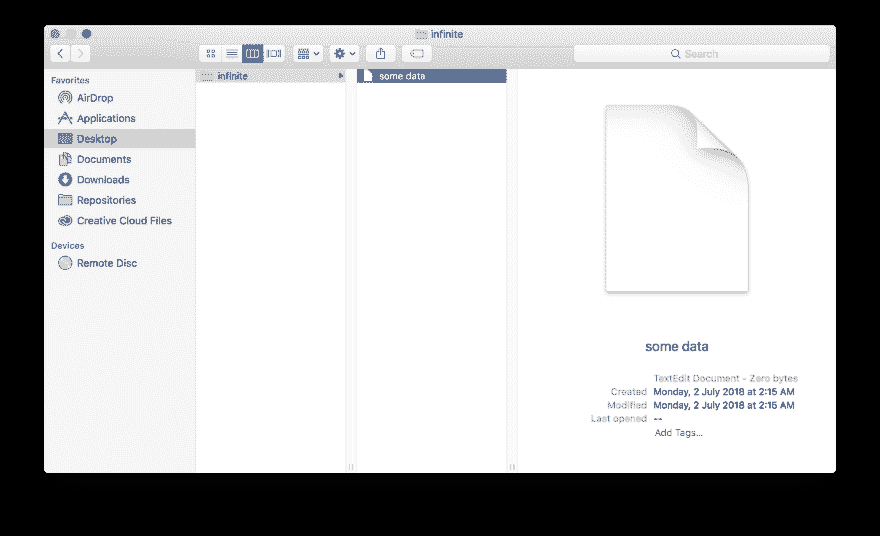

# 可以存储互联网的数据库

> 原文：<https://dev.to/ravernkoh/the-database-that-can-store-the-internet-2man>

如果你能把整个互联网保存到一个数据库里，那不是很棒吗？那么，你现在可以这样做了！Infinite 利用操作系统中的一个简单的漏洞，使您能够存储无限量的数据，而不用使用一个字节。

## 工作原理

文件包含以字节为单位的数据。如果一个文件包含`Hello!`，就占了 7 个字节(记得算上换行符)。如果一个文件包含`Bye bye~`，它将占用 9 个字节。*简单的*。

如果一个文件什么都不包含呢？这个文件会占用多少字节？没错，0！但是文件仍然可以存储数据，即使它不包含任何内容。在哪里？当然是以它的*名*！如果我们以它的名字存储数据，我们现在可以有一个文件存储数据，但不包含任何内容，因此占用 0 字节！

这里，有一些证据。

[T2】](https://res.cloudinary.com/practicaldev/image/fetch/s--67WW_tGG--/c_limit%2Cf_auto%2Cfl_progressive%2Cq_auto%2Cw_880/https://raw.githubusercontent.com/ravernkoh/infinite/master/assets/how-it-works.png)

## 喜欢！

这个项目的源代码可以在这里找到。随意给它一个⭐️，并在生产中使用它🤪！