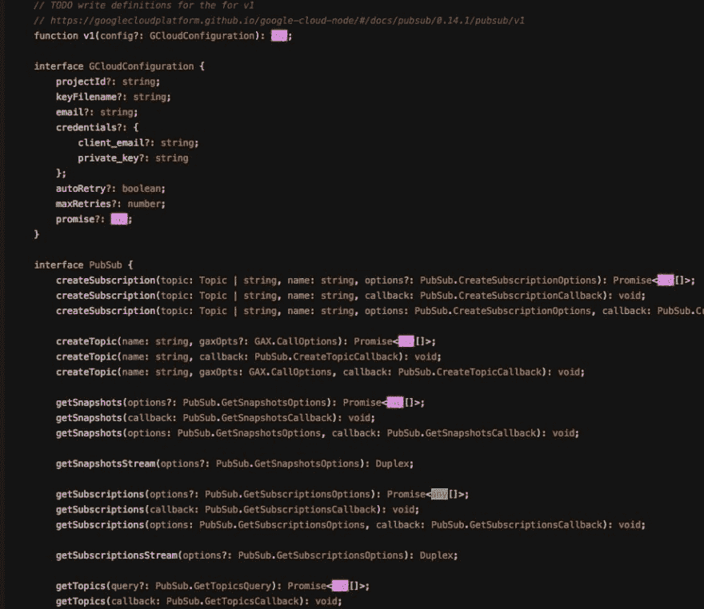
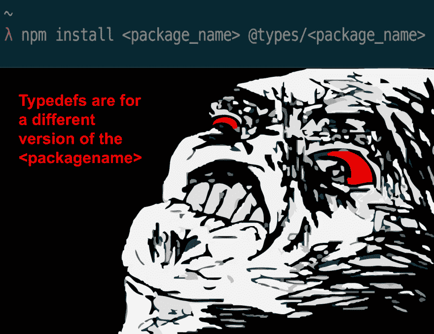

# JS 的经济学

> 原文：<https://dev.to/_gdelgado/the-economics-of-js-182d>

## tldr；

web 平台的民主化带来了 JS 替代品的大量涌入——其中一些最终将取代 JS，成为在 web 上编写用户界面的事实上的工具。

## JavaScript 已经达到了顶峰

很容易忘记 JS 的早期历史。这种语言是由一个人在短短几天内开发出来的,他并不知道“互联网浏览器”最终将主宰软件领域，从而使 JS 成为数百万用户的默认语言。**经济因素，而不是 JavaScript 固有的特性，是它变得如此突出的原因**。没有其他方法可以增加网页的互动性和趣味性。JS 垄断了前端语言。

自成立以来，JS 一直在不断发展；推动了所能完成的极限，同时也极大地改善了语言的人机工程学。在这个时代，我们在处理异步时被宠坏了，但是我们都记得回调地狱是标准的时候。创建复杂应用程序的障碍已经逐渐减少。

但是在任何增加的东西变得没有多大益处之前，一个人能做的改变和能添加到语言中的特性是有限的。这只是一个像万有引力一样真实的经济规律。

我认为 JS 最后一次改变游戏规则的更新是`async / await`。之后的一切都很美好，但不是革命性的。本质上；JS 只会变得稍微好一点，但在可预见的未来，它将基本保持原样。

在其最佳状态下，JS 很好使用，但它并不是解决每一个可以想象的任务的工具，因为有些人被引导去相信。

## 网络平台的民主化

随着 JS 的进化放缓，网络平台正在经历民主化。您不再需要使用 JavaScript 向您的用户交付 web 应用程序。在网络平台出现之初，情况并非如此。垄断不复存在，前端编程语言的市场开始类似于自由市场；大量替代语言的出现推动了这一趋势。

像 [WebAssembly](http://webassembly.org/) 这样的技术正在打开解决问题的大门，这些问题过去被限制在 JavaScript 语言的领域内，可以说 JavaScript 语言可以更好地处理大规模的软件复杂性。

## 软件复杂度和 JS

随着 JS 应用变得越来越雄心勃勃，管理软件复杂性的需求也增加了。单元测试已经不够了。林挺已经不够了。

出于这种需要，出现了 [Flow](https://flow.org/) 和 [TypeScript](https://www.typescriptlang.org/) 来帮助将类型系统引入 JS，从而帮助提高软件正确性。

这暗示了我们已经达到了 JS 的能力极限。我们在非类型化的语言上强加类型。这些不是玩具项目——对这个功能集有很多需求；只要看看每个 npm 包每天的下载量就知道了。

我感谢上帝给了我打字稿。这让我的日常工作压力小了很多。但它并非没有粗糙的边缘:

> Gio[@ _ gdelgado](https://dev.to/_gdelgado)这是一个 Google 包 w aprx 的 TS 声明文件的源代码。大约 170，000 次/月。最终人们在编写这些文件时变得懒惰，开始告诉编译器，“啊，别担心！”
> 
> 【any】类型违背了静态类型的目的。
> 
> facepalm。2018 年 3 月 15 日下午 16:39

上面的推文在我看来公平地代表了 TypeScript 生态系统。大量过时或不恰当的字体令人震惊。正如我在 twitter 帖子中提到的:我会考虑为这个确定类型的项目做贡献，但从它的外观来看，我得到的印象是它是一个失败的事业。

TypeScript 中对`any`的大量使用令人悲哀。通过使用`any`,你已经把所有的类型安全扔出了窗外。现在你正在编写一个 JS 的 Java 风格版本，它有*一些*类型的安全性，但是由于`any`逃逸，它不能得到保证。

我认为这部分是因为 JS 生态系统移动的速度太快了:每写一个 typedef，就有 3 个新的包出来，一周后，由于一个主要的版本碰撞，前面提到的 typedef 变得过时了(我只是估计，所以如果我错了，请纠正我)。以这种速度是不可能跟上的。基本原理是，“我稍后会修改类型，但是现在我只想说一切都是一个`any`”

或者这个怎么样？

[T2】](https://res.cloudinary.com/practicaldev/image/fetch/s--uAWJ94nE--/c_limit%2Cf_auto%2Cfl_progressive%2Cq_auto%2Cw_880/https://i.imgur.com/Mu4MJiI.png)

> 因此，不仅 typedefs 是错误的，充斥着`any`，而且它们也是过时的。有时由几个版本组成。

因此，我们面对过多的非常大的 JS 项目，当前的解决方案是在动态语言之上建立一个类型系统。这对于那些太大而不能完全重写的项目来说是完全有意义的...但是所有较小的项目呢？为什么不干脆使用另一种(更好的)语言呢？

#### 一种范式的转变

现在有很多关于函数式编程的讨论。许多人已经意识到面向对象架构的危险，我们正慢慢看到向函数式编程和无状态架构的转变。

这种转变本质上对 JS 并不是坏事，因为它具有 FP 特性，然而，大多数 JS 程序员不知道如何进行函数式编码。

此外，很像在 typescript 中，如果您允许转义，您将使用转义。也就是说；如果你能使用一个`for`循环比提前考虑一个更功能化(和更持久)的方法更快地获得一个特性，那么你最终会屈服于诱惑。同样，这是经济学在起作用:遵循阻力最小的路径要容易得多，强制性地编写代码通常需要较少的考虑。

## 远离 JS

如上所述，web 平台对新语言的开放证明了对软件复杂性的更好保证的需求。

现在有了用 JS 之外的语言编写 web 应用程序的可行替代方法，我们将开始看到这些语言在严肃项目中的使用越来越多。最明显的原因在脸书。

*   [原因 1](https://reasonml.github.io/)
*   [榆树](http://elm-lang.org/)
*   [ClojureScript](https://clojurescript.org/)
*   [纯脚本](http://www.purescript.org/)

这些是我所知道的编译成 JS 的语言，我确信还有更多值得一试的语言。关键是这里有一个明显的趋势。很多人对 JS 写复杂软件的能力不满意。

这并不是说你不能用 JS 写复杂的软件。只是这样做要困难得多。

在用 JS 编写应用程序时，您必须处理这些事情:

*   没有类型系统(如果您使用 Flow 和 TS，请尽情处理它们的冗长——更不用说`any`的阴险用法了)
*   围绕语言的怪癖(不要使用`==`,否则你会隐式地强制类型！不要使用`arguments`,因为它实际上不是一个数组！在这个上下文中,`this`是什么意思？)
*   高度分散的包装生态系统。解决同一个问题有许多备选方案:
    *   “哦你想单位考试？嗯，就用摩卡+柴+西农吧。或者开玩笑。或者艾娃。或者磁带。或者……”
    *   哪一个是正确的？只有 JS dev 专家能告诉你。
    *   现在您需要一个捆绑器(Webpack 是当前的标准——这是一个美化了的编译器)
    *   你用的是 CommonJS 还是 AMD 的模块？
    *   你在编译你的代码吗？
    *   您使用的是哪个版本的 Node？

JS 有点像第 22 条军规:它可能是最容易入门的语言之一，但是它的简单性意味着它也是最难掌握的语言之一。构建一个健康的、可维护的代码库所需要的纪律和技能就是证明。

JS 入门的简单性进一步降低了复杂性。你迟早会搬起石头砸自己的脚，因为在这门语言中，你能做什么和不能做什么基本上没有限制。然后你就只能盯着一堆代码气味的粪坑，没有任何帮助。

液体错误:内部

> 嗯，也许 JS 一开始就不利于可维护性？

告诉一个 JS 开发新手，“写干净的代码”，让我知道结果如何。相反，在写作中，比如说 Elm 或 Rust 要明智得多。你有一个编译器**帮助你**。它确保你的代码会如你所愿地运行，而且它[会在你运行的过程中给你提供反馈](http://elm-lang.org/blog/compiler-errors-for-humans)。相对于 JS，用许多其他语言编写不干净的代码要困难得多。

你想重构你的 JS 代码库的一大块吗？我当然希望您已经编写了足够多的单元测试，并且您的 ESLint 配置可以捕捉其他错误(以至于您基本上已经完成了编译器开箱即用的工作)。

#### NPM =丛林=充满不可预知的包裹

在发布到 npm 之前，您不需要对您的包/库进行单元测试。JS 中也没有编译器来保证你写的包不会崩溃。

所以你从 npm 下载的包基本上是你自己的风险。这就是为什么在 npm 中需要一个下载计数器。逻辑是，“如果其他人正在下载这个包，那么它肯定是安全的”。但显然这并不总是如此，因为边缘案例往往需要很长时间才能浮出水面。

这与任何严格类型语言中的包生态系统(crates.io、Hackage、Elm-Package 等)形成了鲜明的对比...).你不需要一个下载计数器，因为你知道软件包在登陆到软件包生态系统之前必须被编译。把预上传编译看作一种石蕊测试，它设置了对质量的一致期望。

这些其他语言的另一个好处是，它们是由非常熟练的开发人员组成的社区支持的(来自代码训练营的开发人员的涌入无助于缓解困扰 npm 的代码质量问题)。这并不是说你在 JS-land 没有惊人的 dev(你有)，而是 JS 的人才分布有着海量的标准差。

## 网络平台中的均衡

在后端生态系统中，可以完全自由地选择最能解决当前任务的语言。没有不像前端世界的垄断。但是我已经提到过，这种情况不再存在，随着时间的推移，我们将会看到不使用 JS(或者使用 JS 作为应用程序的次要组件:很像 Elm 中的[端口的概念)构建的难以置信的大型复杂前端应用程序的出现](https://guide.elm-lang.org/interop/javascript.html)

这在经济学中被称为[均衡](https://en.wikipedia.org/wiki/Economic_equilibrium)，现在是我们在前端开发生态系统中达到它的时候了。