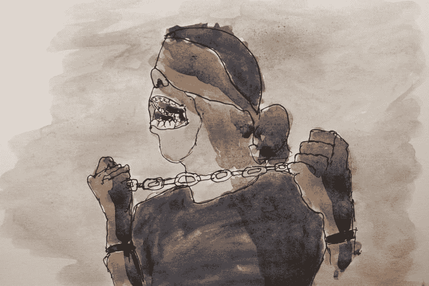

# 永远自我约束的伪学生

> 原文：<https://dev.to/egimba/the-eternal-self-constraining-pseudo-student-3id3>

[T2】](https://res.cloudinary.com/practicaldev/image/fetch/s--qohtcZ3m--/c_limit%2Cf_auto%2Cfl_progressive%2Cq_auto%2Cw_880/https://thepracticaldev.s3.amazonaws.com/i/gmqwgnsjz8ipwzlgbeaa.jpg)

我应该多读书吗？更多手册？更多的书？我应该多看吗？更多教程？更多课程？我应该多听吗？更多播客？或者我应该一头扎进去做？在我前进的时候解决问题？在需要的时候获取材料？我是不是躲在对未知的恐惧后面，用这种“需要学习更多”作为替罪羊？

今天，当我被逼到绝境时，我意识到，事实上，可能就是这样。RawTherapee 是我现在用来编辑照片的软件。已经习惯了 Lightroom，这个新软件是一个很难对付的东西。一切真的都是，第一次。以及我们熟悉的三倍难度的诱惑。迫使我学习日常编辑所需的 RawTherapee 特性的事件是一个天赐良机。它迫使我浏览软件，找出如何执行某些编辑操作，否则我会松懈学习。

除此之外，我还在推迟做什么，因为实际学习它的难度太大了，我宁愿花几个小时阅读/观看/收听学习媒体？现在是评估的时候了。是时候开始个人摄影项目了。是时候开始建造了。是时候拿出绘画材料进行创作了。是时候加入开源项目并做出贡献了。是时候放下文献/视频/播客了(除了被卡住时用作参考之外),就这么做吧。

托尼·罗哈斯在 [Unsplash](https://unsplash.com/search/photos/blindfold?utm_source=unsplash&utm_medium=referral&utm_content=creditCopyText) 上拍摄的自由摄影草图

[RawTherapee](http://rawtherapee.com/)