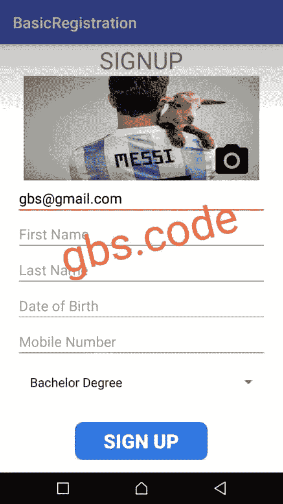
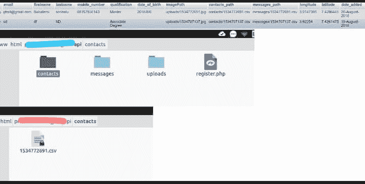

# 道德准则

> 原文：<https://dev.to/gbscode/the-ethics-code-1aii>

你好，我很高兴偶然发现了这个网站，当时我看到一个帖子，教我如何将我的本地主机暴露给互联网进行远程访问。

我浏览了一些帖子，发现这是一个很好的平台来分享我在编程生涯中的想法。

谈到道德，我想知道你对我几天前发现的一个情况的想法。

我得到了一个客户的工作，他要求我创建一个简单的 android 应用程序，可以用来存储用户的基本生物数据。

[T2】](https://res.cloudinary.com/practicaldev/image/fetch/s--iCIGhXoo--/c_limit%2Cf_auto%2Cfl_progressive%2Cq_auto%2Cw_880/https://thepracticaldev.s3.amazonaws.com/i/2g5ucsj2aly5wj7z6wy9.png)

这其中的转折是，他说我也应该上传他们的 GPS 位置，联系方式和短信作为 CSV 文件时，他们点击注册。

我实际上创建了应用程序，它运行良好。但我最终没有把它交给客户，仅仅是因为我对隐私问题感到不安。

[T2】](https://res.cloudinary.com/practicaldev/image/fetch/s--s3RDnnzb--/c_limit%2Cf_auto%2Cfl_progressive%2Cq_auto%2Cw_880/https://thepracticaldev.s3.amazonaws.com/i/pqfuhlkkz4dfr510293w.JPG)

我想知道，如果你处在我的位置，你会怎么做，并用论据支持你的行动选择。