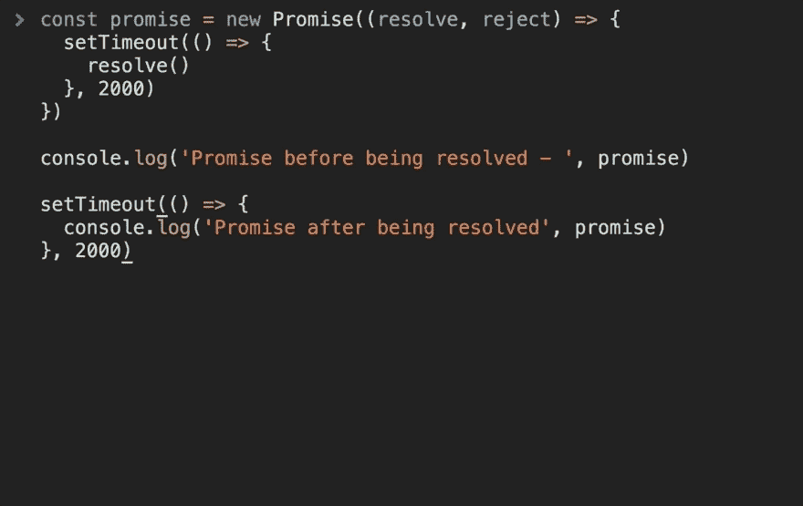

# 异步 JavaScript 的演变:从回调，到承诺，再到异步/等待

> 原文：<https://dev.to/tylermcginnis/the-evolution-of-async-javascript-from-callbacks-to-promises-to-asyncawait-34h1>

在这篇文章中，您将了解历史背景以及三种最流行的 JavaScript 异步模式——回调、承诺和异步/等待——背后的优缺点。

* * *

这篇文章最初发表在 TylerMcGinnis.com 大学，是他们在 T2 大学高级 JavaScript 课程的一部分。

* * *

### 视频

[https://www.youtube.com/embed/gB-OmN1egV8](https://www.youtube.com/embed/gB-OmN1egV8)

### 岗位

我最喜欢的网站之一是[BerkshireHathaway.com](http://www.berkshirehathaway.com/)——它简单、有效，自 1997 年推出以来一直做得很好。更值得注意的是，在过去的 20 年里，这个网站很有可能从未出现过任何问题。为什么？因为都是静态的。自 20 多年前推出以来，它几乎没有什么变化。事实证明，如果你预先准备好了所有的数据，那么建立网站是相当简单的。不幸的是，现在大多数网站都没有。为了弥补这一点，我们发明了“模式”来处理我们的应用程序获取外部数据。像大多数事情一样，这些模式都有随着时间的推移而改变的权衡。在这篇文章中，我们将分析三种最常见模式的优缺点，`Callbacks`、`Promises`和`Async/Await`，并从历史的角度讨论它们的意义和发展。

让我们从这些数据获取模式的 OG 开始，回调。

### 回调

> 我假设你对复试完全不了解。如果我假设错了，就向下滚动一点。

当我第一次学习编程时，它帮助我把函数想象成机器。这些机器可以做你想让它们做的任何事情。它们甚至可以接受输入并返回值。每台机器上都有一个按钮，当你想让机器运转时，你可以按这个按钮。

```
function add (x, y) {
  return x + y
}

add(2,3) // 5 - Press the button, run the machine. 
```

Enter fullscreen mode Exit fullscreen mode

无论是**我**按下按钮，**你**按下按钮，还是**别人**按下按钮都无所谓。不管你喜欢与否，只要按下按钮，机器就会运转。

```
function add (x, y) {
  return x + y
}

const me = add
const you = add
const someoneElse = add

me(2,3) // 5 - Press the button, run the machine.
you(2,3) // 5 - Press the button, run the machine.
someoneElse(2,3) // 5 - Press the button, run the machine. 
```

Enter fullscreen mode Exit fullscreen mode

在上面的代码中，我们将`add`函数分配给三个不同的变量，`me`、`you`和`someoneElse`。需要注意的是，最初的`add`和我们创建的每个变量都指向内存中的同一个位置。它们在不同的名称下实际上是完全相同的东西。所以当我们调用`me`、`you`或`someoneElse`时，就好像我们在调用`add`。

现在，如果我们把我们的`add`机器传递给另一台机器会怎么样？请记住，谁按()按钮并不重要，如果按了，它就会运行。

```
function add (x, y) {
  return x + y
}

function addFive (x, addReference) {
  return addReference(x, 5) // 15 - Press the button, run the machine.
}

addFive(10, add) // 15 
```

Enter fullscreen mode Exit fullscreen mode

你的大脑可能会对此感到有点奇怪，但这里并没有什么新的东西。我们没有在`add`上“按下按钮”，而是将`add`作为参数传递给`addFive`，将其重命名为`addReference`，然后我们“按下按钮”或调用它。

这突出了 JavaScript 语言的一些重要概念。首先，正如您可以将字符串或数字作为参数传递给函数一样，您也可以将对函数的引用作为参数传递。当你这样做的时候，你作为参数传递的函数叫做**回调**函数，而你传递回调函数的函数叫做**高阶函数**。

因为词汇很重要，所以这里是相同的代码，变量被重新命名以匹配它们所演示的概念。

```
function add (x,y) {
  return x + y
}

function higherOrderFunction (x, callback) {
  return callback(x, 5)
}

higherOrderFunction(10, add) 
```

Enter fullscreen mode Exit fullscreen mode

这种模式应该看起来很熟悉，到处都是。如果您曾经使用过任何 JavaScript 数组方法，那么您就使用过回调。如果你用过 lodash，你就用过回调。如果您曾经使用过 jQuery，那么您就使用过回调。

```
[1,2,3].map((i) => i + 5)

_.filter([1,2,3,4], (n) => n % 2 === 0 );

$('#btn').on('click', () =>
  console.log('Callbacks are everywhere')
) 
```

Enter fullscreen mode Exit fullscreen mode

一般来说，回调有两种流行的用例。第一个，也是我们在`.map`和`_.filter`示例中看到的，是将一个值转换成另一个值的很好的抽象。我们说“嘿，这里有一个数组和一个函数。继续，根据我给你的函数给我一个新的值。第二种，也是我们在 jQuery 示例中看到的，是将函数的执行延迟到特定的时间。“嘿，这里有这个功能。只要单击 id 为`btn`的元素，就调用它。”我们要关注的是第二个用例，“将一个函数的执行延迟到一个特定的时间”。

现在我们只看了同步的例子。正如我们在本文开始时所讨论的，我们构建的大多数应用程序并没有预先获得它们需要的所有数据。相反，他们需要在用户与应用程序交互时获取外部数据。我们刚刚看到了回调如何成为一个很好的用例，因为它们允许你“延迟一个函数的执行直到一个特定的时间”。不难想象，我们如何将这句话应用于数据获取。我们可以延迟一个函数的执行*直到我们得到我们需要的数据*，而不是延迟一个函数的执行直到*一个特定的时间*。这可能是最流行的例子，jQuery 的`getJSON`方法。

```
// updateUI and showError are irrelevant.
// Pretend they do what they sound like.

const id = 'tylermcginnis'

$.getJSON({
  url: `https://api.github.com/users/${id}`,
  success: updateUI,
  error: showError,
}) 
```

Enter fullscreen mode Exit fullscreen mode

在获得用户数据之前，我们无法更新应用程序的 UI。那我们该怎么办？我们说，“嘿，这有个东西。如果请求成功，继续调用`success`传递用户数据。如果没有，继续调用`error`并向其传递错误对象。您不需要担心每个方法做什么，只要确保在应该调用它们的时候调用它们就行了”。这是对异步请求使用回调的完美演示。

* * *

至此，我们已经了解了什么是回调，以及它们如何在同步和异步代码中发挥作用。我们还没有谈到的是回调的阴暗面。看看下面这段代码。你能看出发生了什么吗？

```
// updateUI, showError, and getLocationURL are irrelevant.
// Pretend they do what they sound like.

const id = 'tylermcginnis'

$("#btn").on("click", () => {
  $.getJSON({
    url: `https://api.github.com/users/${id}`,
    success: (user) => {
      $.getJSON({
        url: getLocationURL(user.location.split(',')),
        success (weather) {
          updateUI({
            user,
            weather: weather.query.results
          })
        },
        error: showError,
      })
    },
    error: showError
  })
}) 
```

Enter fullscreen mode Exit fullscreen mode

如果有帮助的话，你可以在这里玩一下[现场版](https://codesandbox.io/s/v06mmo3j7l)。

请注意，我们增加了几层回调。首先，我们说在点击 id 为`btn`的元素之前，不要运行初始 AJAX 请求。一旦按钮被点击，我们就发出第一个请求。如果该请求成功，我们会发出第二个请求。如果请求成功，我们调用`updateUI`方法，将从两个请求中获得的数据传递给它。不管你第一眼是否理解了代码，客观地说，它比之前的代码要难读得多。这就把我们带到了“回调地狱”这个话题。

作为人类，我们自然会按顺序思考。当你在嵌套的回调函数中嵌套了回调函数时，它会迫使你脱离自然的思维方式。当你的软件被阅读的方式和你的自然思维方式不一致时，错误就发生了。

像大多数软件问题的解决方案一样，让“回调地狱”变得更容易使用的一个常用方法是模块化您的代码。

```
function getUser(id, onSuccess, onFailure) {
  $.getJSON({
    url: `https://api.github.com/users/${id}`,
    success: onSuccess,
    error: onFailure
  })
}

function getWeather(user, onSuccess, onFailure) {
  $.getJSON({
    url: getLocationURL(user.location.split(',')),
    success: onSuccess,
    error: onFailure,
  })
}

$("#btn").on("click", () => {
  getUser("tylermcginnis", (user) => {
    getWeather(user, (weather) => {
      updateUI({
        user,
        weather: weather.query.results
      })
    }, showError)
  }, showError)
}) 
```

Enter fullscreen mode Exit fullscreen mode

如果有帮助的话，你可以在这里玩一下[现场版](https://codesandbox.io/s/m587rq0lox)。

好吧，函数名有助于我们理解发生了什么，但是它在客观上“更好”吗？差不了多少。我们已经在回调地狱的可读性问题上贴了一个创可贴。问题仍然存在，我们自然地顺序思考，即使有了额外的函数，嵌套回调也打破了顺序思考的方式。

* * *

回调的下一个问题与控制反转有关。当你写一个回调函数时，你假设你要回调的程序是负责任的，并且会在应该调用它的时候调用它。你实际上是把你的程序的控制权转交给另一个程序。当您处理像 jQuery、lodash 甚至普通 JavaScript 这样的库时，可以放心地假设回调函数将在正确的时间使用正确的参数被调用。然而，对于许多第三方库来说，回调函数是你与它们交互的接口。完全有可能的是，第三方库可能会有意或无意地破坏它们与您的回调的交互方式。

```
function criticalFunction () {
  // It's critical that this function
  // gets called and with the correct
  // arguments.
}

thirdPartyLib(criticalFunction) 
```

Enter fullscreen mode Exit fullscreen mode

因为您不是调用`criticalFunction`的人，所以您无法控制调用它的时间和参数。*大多数情况下*这不是一个问题，但一旦出现，这就是一个大问题。

* * *

### 承诺

你曾经没有预约就去一家繁忙的餐馆吗？当这种情况发生时，餐馆需要一种方法在桌子空出来时与你联系。历史上，当你的桌子准备好了，他们会叫你的名字并大声喊出来。然后，自然而然地，他们决定开始变得新奇起来。一个解决办法是，他们不会记下你的名字，而是记下你的电话号码，一旦有空桌就发短信给你。这让你不在大喊大叫的范围内，但更重要的是，这让他们可以随时在你的手机上投放广告。听起来熟悉吗？应该的！好吧，也许不应该。是暗喻回调！把你的号码给餐馆就像给第三方服务一个回拨功能。你*期望*餐馆在有空位时给你发短信，就像你*期望*第三方服务在他们说的时间和方式调用你的功能一样。一旦你的号码或回拨功能落入他们手中，你就失去了所有的控制权。

谢天谢地，还有另一个解决方案。通过设计，它允许您保持所有的控制。你可能以前也经历过——就是他们给你的那个小蜂鸣器。你知道，这个。

[T2】](https://res.cloudinary.com/practicaldev/image/fetch/s--rBmecrKO--/c_limit%2Cf_auto%2Cfl_progressive%2Cq_auto%2Cw_880/https://tylermcginnis.cimg/posts/advanced-javascript/buzzy.png)

如果你以前从未用过，这个想法很简单。他们没有记下你的名字或号码，而是给了你这个装置。当设备开始发出嗡嗡声并发光时，您的桌子就准备好了。你仍然可以做任何你想做的事情，因为你在等待你的桌子空出来，但是现在你不必放弃任何东西。其实恰恰相反。他们必须给**你**一些东西。没有控制反转。

蜂鸣器将始终处于三种不同状态之一- `pending`、`fulfilled`或`rejected`。

`pending`是默认的初始状态。当他们给你蜂鸣器的时候，它就在这个状态。

当蜂鸣器闪烁时，表示您的桌子准备好了。

`rejected`出现故障时蜂鸣器所处的状态。也许餐厅就要打烊了，或者他们忘了有人把餐厅租出去过夜了。

再次强调，重要的是要记住，你，蜂鸣器的接收者，拥有所有的控制权。如果蜂鸣器进入`fulfilled`，你可以回到你的桌子。如果它被放入`fulfilled`中，而你想忽略它，酷，你也可以这样做。如果它被放进`rejected`，那就糟了，但是你可以去别的地方吃。如果什么都没发生，并且停留在`pending`，你永远也不会吃东西，但是你实际上什么也没吃。

现在你是餐厅蜂鸣器的大师了，让我们把这些知识应用到重要的事情上。

如果给餐馆你的号码就像给他们一个回拨功能，那么收到这个小玩意儿就像收到所谓的“承诺”。

一如既往，让我们从**为什么**说起。承诺为什么存在？它们的存在是为了使异步请求的复杂性更易于管理。就像蜂鸣器一样，`Promise`可以处于三种状态之一，`pending`、`fulfilled`或`rejected`。与蜂鸣器不同的是，这些状态代表的不是餐厅餐桌的状态，而是异步请求的状态。

如果异步请求仍在进行中，`Promise`的状态将为`pending`。如果异步请求成功完成，`Promise`将变为`fulfilled`状态。如果异步请求失败，`Promise`将变为`rejected`状态。蜂鸣器的比喻非常准确，对吧？

既然你已经理解了承诺存在的原因以及它们可能处于的不同状态，那么我们还需要回答三个问题。

1)你如何创造承诺？如何改变承诺的状态？
3)当承诺的状态发生变化时，你如何倾听？

##### 1)你如何创造承诺？

这个很简单。您创建了一个`Promise`的`new`实例。

```
const promise = new Promise() 
```

Enter fullscreen mode Exit fullscreen mode

##### 2)如何改变承诺的状态？

`Promise`构造函数接受一个参数，一个(回调)函数。这个函数将被传递两个参数，`resolve`和`reject`。

`resolve` -允许您将承诺状态更改为`fulfilled`的功能

`reject` -允许您将承诺状态更改为`rejected`的功能。

在下面的代码中，我们使用`setTimeout`等待 2 秒钟，然后调用`resolve`。这将把承诺的状态更改为`fulfilled`。

```
const promise = new Promise((resolve, reject) => {
  setTimeout(() => {
    resolve() // Change status to 'fulfilled'
  }, 2000)
}) 
```

Enter fullscreen mode Exit fullscreen mode

我们可以通过在创建承诺后立即记录它，然后在调用`resolve`后大约 2 秒钟后再次记录来看到这种变化。

[T2】](https://res.cloudinary.com/practicaldev/image/fetch/s--z0kgJ4o1--/c_limit%2Cf_auto%2Cfl_progressive%2Cq_66%2Cw_880/https://tylermcginnis.cimg/posts/advanced-javascript/resolve.gif)

注意承诺从`<pending>`到`<resolved>`。

#### 当承诺的状态改变时，你如何倾听？

在我看来，这是最重要的问题。我们知道如何创建承诺并改变其状态，这很酷，但如果我们不知道在状态改变后如何做任何事情，这就毫无价值了。

我们还没有谈到的一件事是承诺到底是什么。当您创建一个`new Promise`时，您实际上只是在创建一个普通的旧 JavaScript 对象。这个对象可以调用两个方法，`then`和`catch`。这是钥匙。当承诺的状态变为`fulfilled`时，传递给`.then`的功能将被调用。当承诺的状态变为`rejected`时，传递给`.catch`的功能将被调用。这意味着一旦你创建了一个承诺，如果异步请求成功，你将把你想要运行的函数传递给`.then`。如果异步请求失败，您将传递想要运行的函数到`.catch`。

让我们看一个例子。我们将再次使用`setTimeout`在两秒钟(2000 毫秒)后将承诺的状态更改为`fulfilled`。

```
function onSuccess () {
  console.log('Success!')
}

function onError () {
  console.log('💩')
}

const promise = new Promise((resolve, reject) => {
  setTimeout(() => {
    resolve()
  }, 2000)
})

promise.then(onSuccess)
promise.catch(onError) 
```

Enter fullscreen mode Exit fullscreen mode

如果您运行上面的代码，您会注意到大约 2 秒钟后，您会看到“成功！”在控制台里。再次说明，发生这种情况的原因有两个。首先，当我们创建承诺时，我们在大约 2000 毫秒后调用了`resolve`——这将承诺的状态更改为`fulfilled`。其次，我们将`onSuccess`函数传递给了 promises 的`.then`方法。通过这样做，我们告诉承诺在承诺的状态变为`fulfilled`时调用`onSuccess`，这在大约 2000 毫秒后发生了。

现在让我们假设发生了不好的事情，我们想将承诺的状态更改为`rejected`。我们不叫`resolve`，而是叫`reject`。

```
function onSuccess () {
  console.log('Success!')
}

function onError () {
  console.log('💩')
}

const promise = new Promise((resolve, reject) => {
  setTimeout(() => {
    reject()
  }, 2000)
})

promise.then(onSuccess)
promise.catch(onError) 
```

Enter fullscreen mode Exit fullscreen mode

这次不是调用`onSuccess`函数，而是调用`onError`函数，因为我们调用了`reject`。

* * *

现在您已经了解了 Promise API，让我们开始看一些真正的代码。

还记得我们之前看到的最后一个异步回调例子吗？

```
function getUser(id, onSuccess, onFailure) {
  $.getJSON({
    url: `https://api.github.com/users/${id}`,
    success: onSuccess,
    error: onFailure
  })
}

function getWeather(user, onSuccess, onFailure) {
  $.getJSON({
    url: getLocationURL(user.location.split(',')),
    success: onSuccess,
    error: onFailure,
  })
}

$("#btn").on("click", () => {
  getUser("tylermcginnis", (user) => {
    getWeather(user, (weather) => {
      updateUI({
        user,
        weather: weather.query.results
      })
    }, showError)
  }, showError)
}) 
```

Enter fullscreen mode Exit fullscreen mode

我们是否可以在这里使用 Promise API 来代替回调？如果我们将 AJAX 请求包装在承诺中会怎么样？然后我们可以根据请求的进展简单地选择`resolve`或`reject`。让我们从`getUser`开始。

```
function getUser(id) {
  return new Promise((resolve, reject) => {
    $.getJSON({
      url: `https://api.github.com/users/${id}`,
      success: resolve,
      error: reject
    })
  })
} 
```

Enter fullscreen mode Exit fullscreen mode

很好。注意`getUser`的参数已经改变。它不接收`id`、`onSuccess`、`onFailure`，只接收`id`。不再需要另外两个回调函数，因为我们不再反转控制。相反，我们使用 Promise 的`resolve`和`reject`函数。如果请求成功，将调用`resolve`，如果有错误，将调用`reject`。

接下来让我们重构`getWeather`。我们将遵循同样的策略。我们将使用`resolve`和`reject`，而不是使用`onSuccess`和`onFailure`回调函数。

```
function getWeather(user) {
  return new Promise((resolve, reject) => {
    $.getJSON({
      url: getLocationURL(user.location.split(',')),
      success: resolve,
      error: reject,
    })
  })
} 
```

Enter fullscreen mode Exit fullscreen mode

看起来不错。现在我们需要更新的最后一件事是我们的点击处理程序。记住，这是我们想要的流程。

1)从 Github API 获取用户的信息。2)使用用户的位置从雅虎天气 API 获取天气信息。3)用用户信息和他们的天气更新用户界面。

让我们从#1 开始——从 Github API 获取用户信息。

```
$("#btn").on("click", () => {
  const userPromise = getUser('tylermcginnis')

  userPromise.then((user) => {

  })

  userPromise.catch(showError)
}) 
```

Enter fullscreen mode Exit fullscreen mode

注意，现在不是`getUser`接受两个回调函数，而是它返回给我们一个可以调用`.then`和`.catch`的承诺。如果`.then`被调用，它将被用户的信息调用。如果`.catch`被调用，它将被错误调用。

接下来让我们做#2 -使用用户的位置来获取他们的天气。

```
$("#btn").on("click", () => {
  const userPromise = getUser('tylermcginnis')

  userPromise.then((user) => {
    const weatherPromise = getWeather(user)
    weatherPromise.then((weather) => {

    })

    weatherPromise.catch(showError)
  })

  userPromise.catch(showError)
}) 
```

Enter fullscreen mode Exit fullscreen mode

注意，我们遵循了与#1 中完全相同的模式，但是现在我们调用了`getWeather`,将从`userPromise`获得的`user`对象传递给它。

最后，#3 -用用户信息和他们的天气更新用户界面。

```
$("#btn").on("click", () => {
  const userPromise = getUser('tylermcginnis')

  userPromise.then((user) => {
    const weatherPromise = getWeather(user)
    weatherPromise.then((weather) => {
      updateUI({
        user,
        weather: weather.query.results
      })
    })

    weatherPromise.catch(showError)
  })

  userPromise.catch(showError)
}) 
```

Enter fullscreen mode Exit fullscreen mode

这里是完整的代码，你可以随意使用。

我们的新代码是*更好的*，但是仍然有一些我们可以改进的地方。在我们做出这些改进之前，您需要了解承诺的另外两个特性，将参数从`resolve`链接和传递到`then`。

#### 链接

`.then`和`.catch`都会返回一个新的承诺。这似乎是一个小细节，但它很重要，因为这意味着承诺可以被锁住。

在下面的例子中，我们调用`getPromise`,它返回一个承诺，这个承诺将在至少 2000 毫秒内解决。从那里，因为`.then`将返回一个承诺，我们可以继续将我们的`.then`链接在一起，直到我们抛出一个`new Error`，它被`.catch`方法捕获。

```
function getPromise () {
  return new Promise((resolve) => {
    setTimeout(resolve, 2000)
  })
}

function logA () {
  console.log('A')
}

function logB () {
  console.log('B')
}

function logCAndThrow () {
  console.log('C')

  throw new Error()
}

function catchError () {
  console.log('Error!')
}

getPromise()
  .then(logA) // A
  .then(logB) // B
  .then(logCAndThrow) // C
  .catch(catchError) // Error! 
```

Enter fullscreen mode Exit fullscreen mode

酷，但是为什么这很重要呢？还记得在回拨部分，我们谈到了回拨的一个缺点是，它们迫使你脱离自然的、顺序的思维方式。当你把承诺串联起来时，它不会强迫你脱离自然的思维方式，因为串联起来的承诺是连续的。`getPromise runs then logA runs then logB runs then...`。

为了让你能看到更多的例子，这里有一个当你使用`fetch` API 时的常见用例。`fetch`将返回一个承诺，该承诺将通过 HTTP 响应来解决。要获得实际的 JSON，您需要调用`.json`。因为有了链接，我们可以按顺序思考这个问题。

```
fetch('/api/user.json')
  .then((response) => response.json())
  .then((user) => {
    // user is now ready to go.
  }) 
```

Enter fullscreen mode Exit fullscreen mode

现在我们知道了链接，让我们重构前面的`getUser` / `getWeather`代码来使用它。

```
function getUser(id) {
  return new Promise((resolve, reject) => {
    $.getJSON({
      url: `https://api.github.com/users/${id}`,
      success: resolve,
      error: reject
    })
  })
}

function getWeather(user) {
  return new Promise((resolve, reject) => {
    $.getJSON({
      url: getLocationURL(user.location.split(',')),
      success: resolve,
      error: reject,
    })
  })
}

$("#btn").on("click", () => {
  getUser("tylermcginnis")
    .then(getWeather)
    .then((weather) => {
      // We need both the user and the weather here.
      // Right now we just have the weather
      updateUI() // ????
    })
    .catch(showError)
}) 
```

Enter fullscreen mode Exit fullscreen mode

看起来好多了，但是现在我们遇到了一个问题。你能发现它吗？在第二个`.then`中，我们想要调用`updateUI`。问题是我们需要通过 T2、T3 和 T4。目前我们是如何设置的，我们只接收到`weather`，而不是`user`。我们需要想出一种方法来实现它，这样`getWeather`返回的承诺就可以通过`user`和`weather`来解决。

这是钥匙。`resolve`只是一个函数。您传递给它的任何参数都将被传递给赋予`.then`的函数。这意味着在`getWeather`内部，如果我们自己调用`resolve`，我们可以传递给它`weather`和`user`。然后，我们链中的第二个`.then`方法将接收`user`和`weather`作为参数。

```
function getWeather(user) {
  return new Promise((resolve, reject) => {
    $.getJSON({
      url: getLocationURL(user.location.split(',')),
      success(weather) {
        resolve({ user, weather: weather.query.results })
      },
      error: reject,
    })
  })
}

$("#btn").on("click", () => {
  getUser("tylermcginnis")
    .then(getWeather)
    .then((data) => {
      // Now, data is an object with a
      // "weather" property and a "user" property.

      updateUI(data)
    })
    .catch(showError)
}) 
```

Enter fullscreen mode Exit fullscreen mode

> 你可以在这里玩[最终代码](https://codesandbox.io/s/9lkl75vqxw)

在我们的点击处理程序中，你会真正看到承诺的力量比回调更大。

```
// Callbacks 🚫
getUser("tylermcginnis", (user) => {
  getWeather(user, (weather) => {
    updateUI({
      user,
      weather: weather.query.results
    })
  }, showError)
}, showError)

// Promises ✅
getUser("tylermcginnis")
  .then(getWeather)
  .then((data) => updateUI(data))
  .catch(showError); 
```

Enter fullscreen mode Exit fullscreen mode

遵循这种逻辑感觉很自然，因为这是我们习惯的思维方式。`getUser then getWeather then update the UI with the data`。

* * *

现在很明显，承诺极大地增加了我们异步代码的可读性，但是有没有一种方法可以让它变得更好呢？假设您是 TC39 委员会的成员，并且您有权为 JavaScript 语言添加新特性。如果有的话，你会采取什么步骤来改进这些代码？

```
$("#btn").on("click", () => {
  getUser("tylermcginnis")
    .then(getWeather)
    .then((data) => updateUI(data))
    .catch(showError)
}) 
```

Enter fullscreen mode Exit fullscreen mode

正如我们已经讨论过的，代码读起来非常好。就像我们的大脑工作一样，它是有顺序的。我们遇到的一个问题是，我们需要将数据(`users`)从第一个异步请求一直线程化到最后一个`.then`。这没什么大不了的，但是它让我们改变了我们的`getWeather`函数，也传递了`users`。如果我们用编写同步代码的方式来编写异步代码会怎么样？如果我们这样做，这个问题将完全消失，它仍然会按顺序读取。我有个想法。

```
$("#btn").on("click", () => {
  const user = getUser('tylermcginnis')
  const weather = getWeather(user)

  updateUI({
    user,
    weather,
  })
}) 
```

Enter fullscreen mode Exit fullscreen mode

那太好了。我们的异步代码看起来和同步代码一模一样。我们的大脑不需要采取额外的步骤，因为我们已经非常熟悉这种思维方式。可悲的是，这显然行不通。如你所知，如果我们运行上面的代码，`user`和`weather`都只是承诺，因为那是`getUser`和`getWeather`返回的。但是记住，我们在 TC39 上。我们完全有能力给我们想要的语言添加任何特性。照这样，这段代码很难运行。我们必须以某种方式教会 JavaScript 引擎了解异步函数调用和常规同步函数调用之间的区别。让我们在代码中添加几个关键字，使它在引擎上更容易。

首先，我们给主函数本身添加一个关键字。这可能会提示引擎，在这个函数内部，我们将会有一些异步函数调用。这个就用`async`吧。

```
$("#btn").on("click", async () => {
  const user = getUser('tylermcginnis')
  const weather = getWeather(user)

  updateUI({
    user,
    weather,
  })
}) 
```

Enter fullscreen mode Exit fullscreen mode

酷毙了。那似乎是合理的。接下来，让我们添加另一个关键字，让引擎确切地知道何时被调用的函数是异步的，并且将返回一个承诺。还是用`await`吧。比如"嘿，引擎。这个函数是异步的，返回一个承诺。不要像你通常做的那样继续下去，而是继续下去，等待承诺的最终价值，并在继续下去之前归还它。随着我们新的`async`和`await`关键字的使用，我们的新代码将如下所示。

```
$("#btn").on("click", async () => {
  const user = await getUser('tylermcginnis')
  const weather = await getWeather(user.location)

  updateUI({
    user,
    weather,
  })
}) 
```

Enter fullscreen mode Exit fullscreen mode

相当狡猾。我们已经发明了一种合理的方法，让我们的异步代码看起来和行为起来就像是同步的。现在下一步是让 TC39 上的人相信这是一个好主意。幸运的是，正如你现在可能已经猜到的，我们不需要做任何令人信服的事情，因为这个特性已经是 JavaScript 的一部分，它被称为`Async/Await`。

不相信我？[这是我们添加了 Async/Await 的实时代码](https://codesandbox.io/s/00w10o19xn)。你可以随意摆弄它。

* * *

#### 异步函数返回承诺

现在您已经看到了 Async/Await 的好处，让我们讨论一些重要的小细节。首先，任何时候你添加`async`到一个函数，这个函数将隐式返回一个承诺。

```
async function getPromise(){}

const promise = getPromise() 
```

Enter fullscreen mode Exit fullscreen mode

即使`getPromise`实际上是空的，它仍然会返回一个承诺，因为它是一个`async`函数。

如果`async`函数返回一个值，该值也将被包装在一个承诺中。这意味着你必须使用`.then`来访问它。

```
async function add (x, y) {
  return x + y
}

add(2,3).then((result) => {
  console.log(result) // 5
}) 
```

Enter fullscreen mode Exit fullscreen mode

* * *

#### 无异步等待不好

如果你试图在一个不是`async`的函数中使用`await`关键字，你会得到一个错误。

```
$("#btn").on("click", () => {
  const user = await getUser('tylermcginnis') // SyntaxError: await is a reserved word
  const weather = await getWeather(user.location) // SyntaxError: await is a reserved word

  updateUI({
    user,
    weather,
  })
}) 
```

Enter fullscreen mode Exit fullscreen mode

我是这样想的。当你给一个函数添加`async`时，它做两件事。它使得函数本身返回(或包装返回的内容)一个承诺，并使得您可以在其中使用`await`。

* * *

#### 错误处理

你可能已经注意到我们有一点作弊。在我们的原始代码中，我们有办法使用`.catch`来捕捉任何错误。当我们切换到 Async/Await 时，我们删除了这段代码。对于 Async/Await，最常见的方法是将代码封装在一个`try/catch`块中，以便能够捕捉错误。

```
$("#btn").on("click", async () => {
  try {
    const user = await getUser('tylermcginnis')
    const weather = await getWeather(user.location)

    updateUI({
      user,
      weather,
    })
  } catch (e) {
    showError(e)
  }
}) 
```

Enter fullscreen mode Exit fullscreen mode

* * *

这篇文章最初发表在 TylerMcGinnis.com 大学，是他们在 T2 大学高级 JavaScript 课程的一部分。