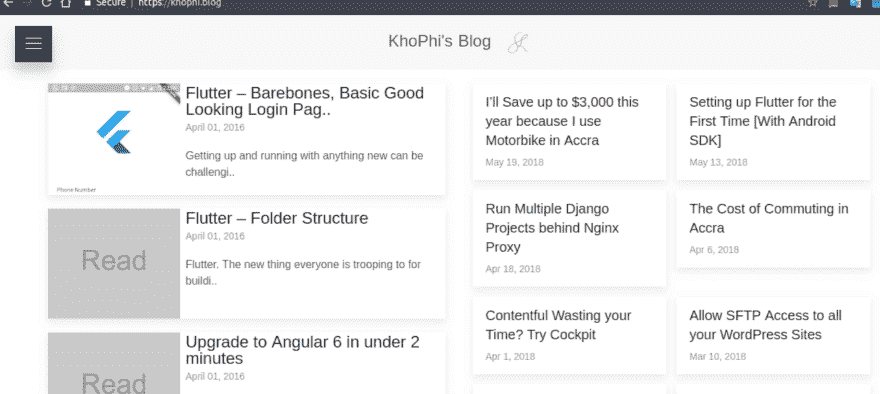

# 我梦寐以求的最快的 PWA 博客体验

> 原文：<https://dev.to/khophi/the-fastest-pwa-blog-experience-ive-always-dreamed-of-2n89>

渐进式网络应用(PWA)是现在的主流。我很高兴通过 API 使用我的 WordPress 博客，它有一个新的 UI，使用 Angular 作为 PWA 构建

> Khophi 上有一个额外的功能。博客。向下滚动以尝试它。

今年早些时候，我想要一个游乐场来玩。我的博客由 WordPress 驱动，有一个无聊的用户界面(有点)，尽管它完成了工作。

除了 UI，加载时间对我来说也是一个问题。我停止在博客上展示广告，希望它能提高加载速度。

好吧，这一步确实有帮助，但没多大作用。

我可以向我的服务器投入更多的火力，或者进行更多的缓存和其他优化，让事情进展得更快。

或者，我可以通过它的 API 来使用 WordPress。我选择了这个选项。博客诞生了。

## PWAs——我可能是被迷住了。帮帮我！

在将近一年的时间里，我所能想到的就是如何最好地利用不断改进的 web 技术来构建更好的、移动就绪的、更丰富的应用程序。

因此，根据[离子](https://ionicframework.com/pwa)的定义，PWA 基本上是，

> “是提供令人难以置信的移动应用体验的新方式，这些体验高度优化、可靠，并且完全可以在网络上访问。”

这是一个网站，一个网络应用程序，但移动用户可以同时在手机上体验作为移动应用程序的应用程序。

Angular 是我构建 PWAs 的首选。

## 故 Khophi。博客

我建造了霍菲。博客要尽可能简约，最大限度地关注速度。因此，这个网站的一切都是快速、精简、流线型的，而且取决于你问谁，无聊！也没有广告。

为了实现以上目标， [Angular Framework](https://angular.io/) 是 UI 管道前端框架的选择。修饰和时尚部分由 [UI 套件](https://getuikit.com/)处理。

后端是[blog.khophi.co](https://blog.khophi.co/)(一个 WordPress CMS)，它公开了前端使用的 API 端点。

当您仔细阅读代码时，您应该会遇到利用如下功能的特性

*   它是 PWA，可安装在手机和桌面上
*   角度动画
*   使用@Input 和@ Ouput 进行组件交互
*   处理离线模式
*   代码可重用性(通过组件)
*   HTTP 服务
*   无限滚动
*   Web 共享 API
*   缓存内容以供脱机查看

## 发展

我一直在寻找让应用程序运行得更快的方法，并且在思考为了达到这个目的我可能需要移除什么。

> “似乎完美不是在没有更多可以添加的时候达到的，而是在没有更多可以去除的时候达到的。”——安东尼·德·圣埃克苏佩里

该项目在 [Bitbucket](https://bitbucket.org/seanmavley/blognext) 上可用，欢迎 PR 和/或 [Issues](https://bitbucket.org/seanmavley/blognext/issues?status=new&status=open) 。

## 奖金

你现在可以通过 Khophi.Blog 试用你的 WordPress 博客。

步骤是

*   访问 khophi.blog
*   点击/点击汉堡包菜单
*   选择“尝试”
*   在那里输入你的 WordPress 站点 URL。不要以 https://开头，也不要以域后的任何内容结尾。例如 theafricandream.net
*   博客将改变为从你的 WordPress 博客加载内容。根据你对你的 WordPress 站点的复杂程度，有些东西可能会坏掉。乐于听到所有的错误，如果有的话。

简单地提出一个问题，我会看看。如果公关也是，那更好。

请看下面的 GIF 来学习如何做。

[T2】](https://res.cloudinary.com/practicaldev/image/fetch/s--UAN8zqW4--/c_limit%2Cf_auto%2Cfl_progressive%2Cq_66%2Cw_880/https://blog.khophi.co/wp-content/uploads/2018/06/Peek-2018-06-14-14-44.gif)

输入你的 WordPress 网址，通过 KhoPhi Blog 开始探索你的博客。我希望你喜欢 PWAs 带来的速度和轻松。

有一天，我可能会用[和](https://www.khophi.blog)完全取代[blog.khophi.co](//blog.khophi.co)！

> 本文分享自[Blog.Khophi.co](https://blog.khophi.co/khophi-blog-the-fastest-blog-experience-ive-always-dreamed-of/)