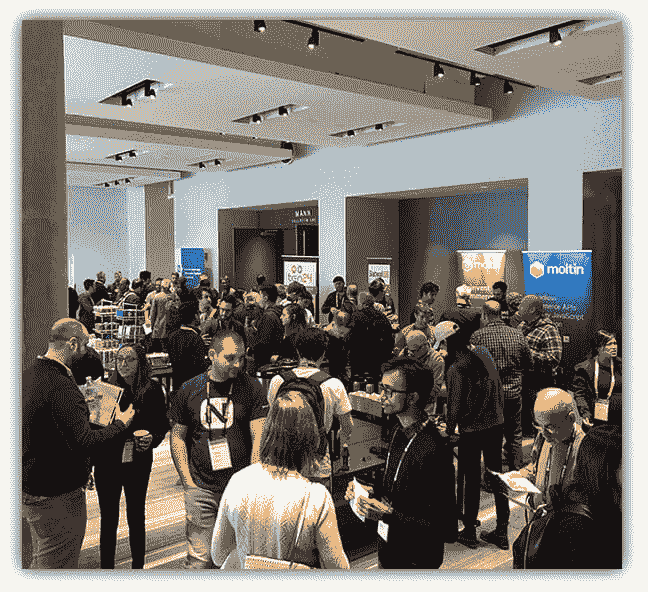
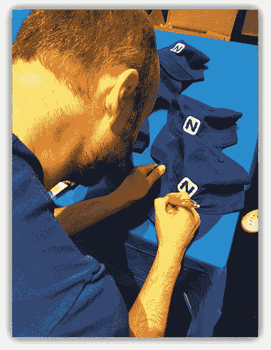

# jsMobileConf 展示了 JavaScript 的光明未来

> 原文：<https://dev.to/progress/the-future-of-javascript-is-bright-at-jsmobileconf-17j6>

几周前，Progress 在波士顿举办了一场面向开发者的活动，他们关注传统 JavaScript 生态系统之外的领域。

[T2】](https://res.cloudinary.com/practicaldev/image/fetch/s--bEzgRNCa--/c_limit%2Cf_auto%2Cfl_progressive%2Cq_auto%2Cw_880/https://github.com/rdlauer/articles/raw/master/misc/jsmobileconf-recap/crowd.jpg)

200 多名与会者聚集在波士顿市中心的雅乐轩酒店，参加各种各样的演讲，几乎涵盖了受 JavaScript 影响的所有技术。最初是一个纯移动会议(因此得名！)，jsMobileConf 被它的演讲者塑造成了一个前沿 JavaScript 演讲的主持人。从区块链到虚拟现实到机器学习到人工智能到移动应用到物联网，我们涵盖了一系列令人兴奋的新机会。

> 我们很快了解到 JavaScript 被独特地定位为各种新技术的门户。

## 从{N}开发者日到 jsMobileConf

前几年，今天的 jsMobileConf 被称为 NativeScript 开发者日(一个专注于 NativeScript 开发者的活动)。在波士顿的 2016 年活动和纽约市的 2017 年活动之后，很明显我们可以为 JavaScript 社区提供更多。我们很高兴地说，这是一个巨大的成功！

> [@ BOS _ tech events](https://twitter.com/BOS_TechEvents?ref_src=twsrc%5Etfw)[# jsmobilecoff](https://twitter.com/hashtag/JSMobileConf?src=hash&ref_src=twsrc%5Etfw)太棒了！学到了很多，遇到了行业领袖和鼓舞人心的技术女性！【pic.twitter.com/99m93XZ9if T4】
> 
> — Michelle (@Maverick_7_) [October 27, 2018](https://twitter.com/Maverick_7_/status/1056062299776135168?ref_src=twsrc%5Etfw)

演讲者阵容的质量是一流的，Ethan Marcotte(他创造了“响应式设计”这个术语)做了开场主题演讲:

> 非常感谢各位！非常感谢邀请我！真的很荣幸成为[# jsmobilecoff](https://twitter.com/hashtag/jsmobileconf?src=hash&ref_src=twsrc%5Etfw)的一小部分
> 
> — Ethan Marcotte (@beep) [October 25, 2018](https://twitter.com/beep/status/1055472463314862080?ref_src=twsrc%5Etfw)

其他著名的(和受欢迎的)会议包括西蒙·麦克唐纳的《FaaS 和无服务器》,戴安娜·罗德里格兹的《解决冒名顶替综合症》,以及克里斯·弗里茨的《继续...信不信由你...写伟大的文档！

> 。 [@cotufa82](https://twitter.com/cotufa82?ref_src=twsrc%5Etfw) 在[# jsmobilecof](https://twitter.com/hashtag/JSMobileConf?src=hash&ref_src=twsrc%5Etfw)震撼她关于冒名顶替综合症的演讲！！！【pic.twitter.com/QyuEcbCfwv T4】
> 
> — Brandon Satrom 🥕👖 (@BrandonSatrom) [October 25, 2018](https://twitter.com/BrandonSatrom/status/1055526234539651072?ref_src=twsrc%5Etfw)

微软自己的 Burke Holland 在 VS Code 和 Live Share 上做了一个很棒的演讲，他还欣赏了 Macy Kuang 的 VR 游戏演示:

> 🥽 ⚡💡更多 [#jsMobileConf](https://twitter.com/hashtag/jsMobileConf?src=hash&ref_src=twsrc%5Etfw) 同乐 [@MiaomiaoGames](https://twitter.com/MiaomiaoGames?ref_src=twsrc%5Etfw) 展台游戏冠军: [@burkeholland](https://twitter.com/burkeholland?ref_src=twsrc%5Etfw) 💡pic.twitter.com/Q1d74YgP39 的⚡🥽
> 
> — 😆Tara Z. Manicsic🐺 ([@tzmanics](https://dev.to/tzmanics) ) [October 26, 2018](https://twitter.com/Tzmanics/status/1055939666166333441?ref_src=twsrc%5Etfw)

我要特别感谢我们所有的演讲者，是他们让这场精彩的演出得以上演。

甚至是塞巴斯蒂安·维特亚历克，他被发现分发签名！

[T2】](https://res.cloudinary.com/practicaldev/image/fetch/s--s4llEuIP--/c_limit%2Cf_auto%2Cfl_progressive%2Cq_auto%2Cw_880/https://github.com/rdlauer/articles/raw/master/misc/jsmobileconf-recap/autographs.jpg)

## ICYMI

如果您错过了今年的 jsMobileConf，不要担心，我们会支持您。

所有的会议都被记录了下来，并将在未来几周内在 YouTube 频道上发布。演讲者幻灯片已经在[Github 库](https://github.com/rdlauer/jsmobileconf-2018-speakers)中可用！

感谢每一个让 jsMobileConf 如此成功的人，从组织者到演讲者到与会者...**当然还有赞助商**:

*   [进度](https://progress.com/)
*   [nStudio](https://nstudio.io/)
*   [十月二十四日](https://www.ten24web.com/)
*   [鼹鼠](https://moltin.com/)
*   [线程](https://www.threadlearning.com/)

我认为我的同事 Brian Rinaldi 最好地总结了 jsMobileConf:

> 举办会议最大的好处是有机会见到了不起的人——演讲者和与会者。对于[# jsmobilecoff](https://twitter.com/hashtag/jsMobileConf?src=hash&ref_src=twsrc%5Etfw)来说更是如此！谢谢你们让它变得如此棒。🙏
> 
> — Brian Rinaldi ([@remotesynth](https://dev.to/remotesynth) ) [October 26, 2018](https://twitter.com/remotesynth/status/1055953623719600128?ref_src=twsrc%5Etfw)

**明年见！**