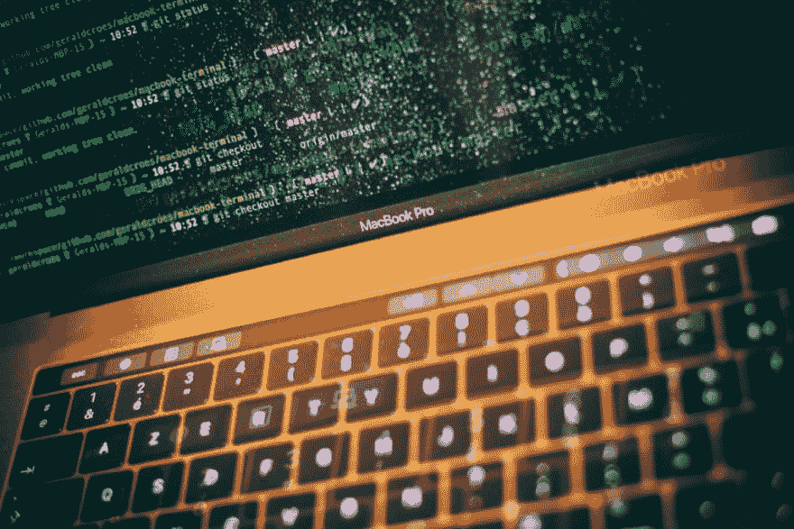
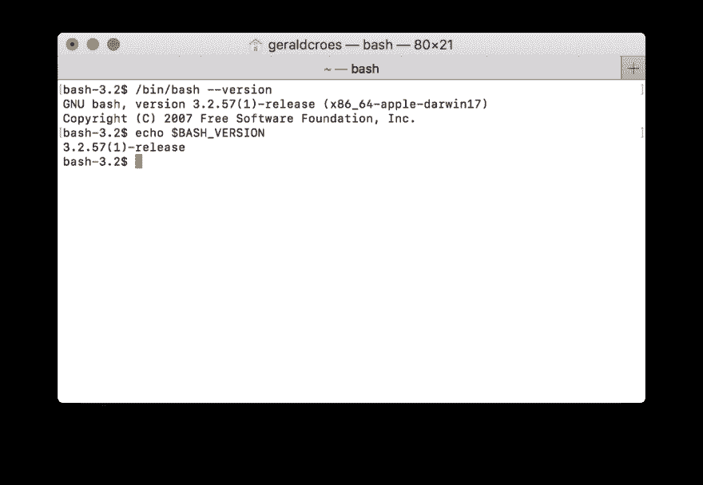

# 好的(Tweak)，坏的(Mac)，丑的(Terminal)

> 原文：<https://dev.to/geraldcroes/the-good-tweak-the-bad-mac-and-the-ugly-terminal-3eg3>

[T2】](https://res.cloudinary.com/practicaldev/image/fetch/s--71qB8T6m--/c_limit%2Cf_auto%2Cfl_progressive%2Cq_auto%2Cw_880/https://cdn-images-1.medium.com/max/1024/1%2ATwaNryU2UWiaCufqOq2RaA.jpeg)

> 我已经换成 Mac 了…为了工作…

好了，我已经说了。

感觉像是认错。一个无法得到宽恕的忏悔。一个坦白，随之而来的是蔑视，在我(有 Linux 头脑的)同事眼中的蔑视。所以我会给他们一个好的理由...

> …到目前为止，我很喜欢它。

尽管我是一个狂热的 Linux 粉丝，但我习惯于使用一堆那里没有的应用程序，而 Mac(尽管价格昂贵)似乎是虚拟机地狱的替代物。远非完美，但它是 Unix 系统和最终用户通用机器之间的良好平衡。

然而，来自 Linux，终端的开箱即用体验令人震惊。默认设置简直糟糕透了——过时了，没有自动完成功能，没有颜色……没有乐趣。

但是经过一些调整后，我感觉就像在家里一样，这篇文章是关于共享配置选项的，这样像我这样的人就可以继续享受他们心爱的命令行。

这是我们的起点。

 

<figcaption>人们不喜欢码头……你别说了！</figcaption>

### 第一步——自制

因为有 App Store 之外的生活，所以你在 Mac 上的第一步应该是安装 Homebrew。这不是强制性的。它只是让你的生活更容易(你决定)。

根据其网站的说法，家酿是“Mac 上缺失的软件包管理器”

用 Linux 的话来说，就是我们的 *apt* ， *yum* ， *dnf* ，或者 *pkg* (看你从哪里来了)。

安装 Homebrew 是一行程序: