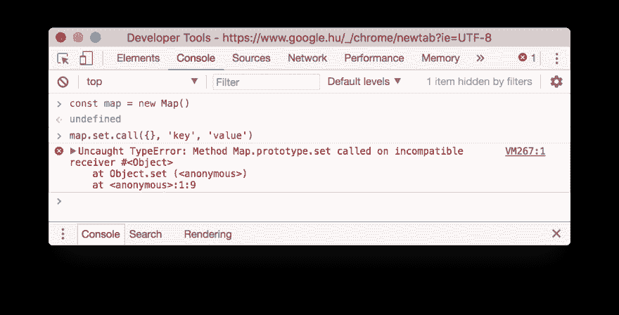
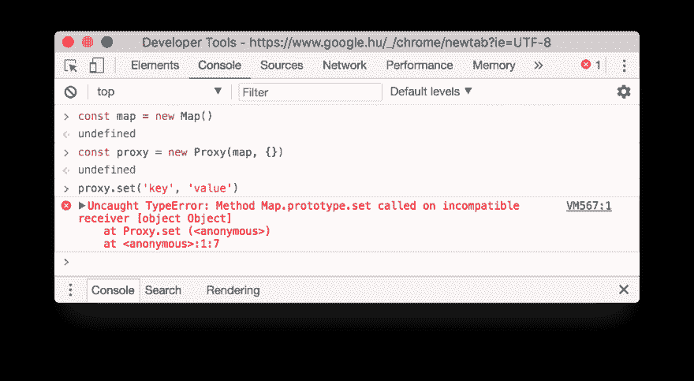

# React Easy State 背后的思想是:利用 ES6 代理

> 原文：<https://dev.to/solkimicreb/the-ideas-behind-react-easy-state-utilizing-es6-proxies-1dc7>

前端开发人员经常将透明反应(MobX、Vue 或 React Easy State 的核心)称为魔力，但这并没有什么魔力。它基于一个非常简单的想法，可以用下面的代码片段来演示。

```
import React from 'react'
import { view, store } from 'react-easy-state'

const notepad = store({
  author: 'Mr. Note Maker',
  notes: []
})

const NotesApp = view(() =>
  notepad.notes.map(note => <Note note={note} />)
)

const Note = view(({ note }) =>
  <p>{note.text} by {notepad.author}</p>
) 
```

您可以完美地定义何时重新呈现`NotesApp`和`Note`:何时添加或删除新注释，以及何时修改作者或注释的文本。幸运的是，这一结论不是由复杂的人类直觉，而是简单的可编程 if-else 逻辑驱动的。

> 如果状态存储的一部分(在组件的渲染中使用)发生变化，请重新渲染组件以反映新的状态。

您的大脑正在创建以下关于对象属性的三元关系—在渲染方法中使用。

| 目标 | 财产 | 成分 |
| --- | --- | --- |
| appStore | 笔记 | NotesApp |
| notes 数组 | 长度 | NotesApp |
| 笔记对象 | 文本 | 注意 |
| appStore | 作者 | 注意 |

当一个对象的属性被修改时，你下意识地收集属于那个`(object, property)`对的所有组件。让我们把这个过程变成代码吧！

*本文的其余部分假设您对 ES6 代理和 React Easy State 有基本的了解。如果你不知道我在说什么，快速看一下 [MDN 代理文件](https://developer.mozilla.org/en-US/docs/Web/JavaScript/Reference/Global_Objects/Proxy)和 [React Easy State](https://github.com/solkimicreb/react-easy-state) 回购就足够了。*

## 制作无功铁芯

为了构建`(object, property, component)`关系，我们必须知道`NotesApp`和`Note`在渲染时使用了哪些对象和属性。开发人员可以通过看一眼代码就知道这一点，但是库却不能。

我们还需要知道对象的属性何时发生变化，以便从保存的关系中收集相关的组件并呈现它们。

这两个问题都可以用 ES6 代理来解决。

```
import { saveRelation, renderCompsThatUse } from './reactiveWiring'

export function store (obj) {
  return new Proxy(obj, traps)
}

const traps = {
  get (obj, key) {
    saveRelation(obj, key, currentlyRenderingComp)
    return Reflect.get(obj, key)
  },
  set (obj, key, value) {
    renderCompsThatUse(obj, key)
    return Reflect.set(obj, key, value)
  }
} 
```

`store`代理拦截所有的属性获取和设置操作，并分别构建和查询关系表。

还有一个大问题:get 陷阱中的`currentlyRenderingComp`是什么，我们如何知道哪个组件正在渲染？这就是`view`发挥作用的地方。

```
let currentlyRenderingComp = undefined

export function view (Comp) {
  return class ReactiveComp extends Comp {
    render () {
      currentlyRenderingComp = this
      super.render()
      currentlyRenderingComp = undefined
    }
  }
} 
```

用一个简单的逻辑包装一个组件并检测它的渲染方法。它在组件渲染时为组件设置了`currentlyRenderingComp`标志。这样，我们就拥有了在 get 陷阱中建立关系所需的所有信息。`object`和`property`来自陷阱参数，`component`是由`view`设置的`currentlyRenderingComp`。

让我们回到 notes 应用程序，看看反应式代码中发生了什么。

```
import React from 'react'
import { view, store } from 'react-easy-state'

const notepad = store({
  author: 'Mr. Note Maker',
  notes: []
})

const NotesApp = view(() =>
  notepad.notes.map(note => <Note note={note} />)
)

const Note = view(({ note }) =>
  <p>{note.text} by {notepad.author}</p>
) 
```

1.  `NotesApp`第一次渲染。
2.  `view`在`NotesApp`组件渲染时将`currentlyRenderingComp`设置为该组件。
3.  `NotesApp`迭代`notes`数组，并为每个音符渲染一个`Note`。
4.  `notes`周围的代理拦截所有 get 操作，保存`NotesApp`使用`notes.length`渲染的事实。它创建了一个`(notes, length, NotesApp)`关系。
5.  用户添加了新的注释，这改变了`notes.length`。
6.  我们的反应核心查找与`(notes, length)`相关的所有组件，并重新渲染它们。
7.  在我们的例子中:`NotesApp`被重新渲染。

## 真正的挑战

上一节向您展示了如何构建一个乐观的反应式内核，但是真正的挑战在于众多的陷阱、边缘案例和设计决策。在本节中，我将简要介绍其中的一些。

### 调度渲染

一个透明的反应库除了构建、保存、查询和清理相关 get/set 操作上的那些`(object, property, component)`关系之外，不应该做任何事情。执行渲染不是工作的一部分。

简单状态收集属性突变时的陈旧组件，并将它们的呈现传递给调度程序函数。然后，调度程序可以决定何时以及如何呈现它们。在我们的例子中，调度器是一个虚拟的`setState`，它告诉 React:‘我想被渲染，当你喜欢它的时候就做’。

```
// a few lines from easy-state's source code
this.render = observe(this.render, {
  scheduler: () => this.setState({}),
  lazy: true
}) 
```

一些反应库没有定制调度器的灵活性，调用`forceUpdate`而不是`setState`，翻译过来就是:‘现在渲染我！我不在乎你的优先权。

这还不明显——因为 React 仍然使用相当简单的渲染批处理逻辑——但随着 React 新的异步调度程序的引入，这将变得更加重要。

### 打扫卫生

保存和查询三元关系没有那么难。至少我是这么认为的，直到我不得不自己收拾残局。

如果不再使用存储对象或组件，则必须清理它们之间的所有关系。这需要一些交叉引用——因为这些关系必须可以被`component`、`object`和`(object, property)`对查询。长话短说，我搞砸了，Easy State 背后的反应核心泄露了整整一年的内存。

[T2】](https://res.cloudinary.com/practicaldev/image/fetch/s--FqetZFA---/c_limit%2Cf_auto%2Cfl_progressive%2Cq_auto%2Cw_880/https://thepracticaldev.s3.amazonaws.com/i/iau9fu624z8z18129qft.png)

在解决这个问题的无数“聪明”的方法之后，我解决了在所有渲染之前擦除组件的每一个关系。在渲染过程中，这些关系将从触发的 get 陷阱中再次建立。

这可能看起来有点矫枉过正，但是它对性能的影响非常低，并且有两个巨大的好处。

1.  我终于修复了内存泄漏。
2.  轻松状态变得适应渲染功能。它根据当前的应用程序状态动态地取消观察和重新观察条件分支。

```
import React from 'React'
import { view, store } from 'react-easy-state'

const car = store({
  isMoving: false,
  speed: 0
})

function Car () {
  return car.isMoving ? <p>{car.speed}</p> : <p>The car is parking.</p>
}

export default view(Car) 
```

`Car`不是——当`car.isMoving`为假时，在`speed`变化时不必重新渲染。

### 实施代理陷阱

Easy State 的目标是增加 JavaScript 的反应性，而不是彻底改变它。为了实现反应性增强，我必须将基本操作分成两组。

*   Get-like 操作从对象中检索数据。这些包括枚举、迭代和简单的属性 get/has 操作。关系保存在它们的拦截器中。

*   类似集合的操作使数据变异。这些操作包括属性添加、设置和删除操作，它们的拦截器查询关系表中的陈旧组件。

| 类似 get 的操作 | 类似集合的操作 |
| --- | --- |
| 得到 | 增加 |
| 有 | 设置 |
| 列举 | 删除 |
| 循环 | 清楚的 |

在确定了这两个组之后，我必须一个接一个地检查操作，并以无缝的方式给它们添加反应性。这需要对基本的 JavaScript 操作有深刻的理解，ECMAScript 标准在这里有很大的帮助。如果你不知道下面所有问题的答案，请查看一下。

*   什么是属性描述符？
*   属性集操作遍历原型链吗？
*   可以用 delete 操作符删除属性访问器吗？
*   get 操作的目标和接收方有什么区别？
*   有没有拦截对象枚举的方法？

### 管理动态商店树

到目前为止，你已经看到了`store`用反应代理包装对象，但是这只会产生一个级别的反应属性。为什么`person.name.first`改变后下面的 app 会重新渲染？

```
import { store, view } from 'react-easy-state'

const person = store({
  name: { first: 'Bob', last: 'Marley' }
})

export default view(() => 
  <div>{person.name.first + person.name.last}</div>
) 
```

为了支持嵌套属性，我们的 reactive core 的“get part”必须稍加修改。

```
import { saveRelation } from './reactiveWriring'

const storeCache = new WeakMap()

export function store (obj) {
  const reactiveStore = storeCache.get(obj) || new Proxy(obj, traps)
  storeCache.set(obj, reactiveStore)
  return store
}

const traps = {
  get (obj, key) {
    saveRelation(obj, key, currentlyRenderingComp)
    const result = Reflect.get(obj, key)
    if (typeof result === 'object' && currentlyRenderingComp) {
      return store(result)
    }
    return storeCache.get(result) || result
  }
} 
```

最重要的部分是第 15-18 行之间的最后一个`if`块。

*   它通过在获取时将嵌套对象包装在反应代理中，使属性在任意深度上反应迟缓。

*   它只包装在组件渲染中使用的对象——多亏了`currentlyRenderingComp`检查。其他对象永远不会触发渲染，也不需要反应式仪器。

*   具有缓存的反应式包装器的对象肯定会在组件渲染中使用，因为第 15 行的`currentlyRenderingComp`检查已经为它们通过了。这些对象可能会触发属性突变的反应式呈现，因此 get 陷阱必须返回它们的包装版本。

这些点以及在每次渲染之前清理关系的事实，导致嵌套反应存储属性的最小自适应子集。

### 猴子修补内置对象

一些内置的 JavaScript 对象——比如 ES6 集合——有特殊的“内部插槽”。这些隐藏的代码片段不能被修改，它们可能对自己的`this`值有所期望。如果有人用意想不到的`this`呼叫他们，他们会以`incompatible receiver error`失败。

[T2】](https://res.cloudinary.com/practicaldev/image/fetch/s--cRR6MRVm--/c_limit%2Cf_auto%2Cfl_progressive%2Cq_auto%2Cw_880/https://thepracticaldev.s3.amazonaws.com/i/2l75o0nhylaivvxjp4x5.png)

不幸的是，在这些情况下，代理也是无效的接收者，代理包装的对象抛出同样的错误。

[T2】](https://res.cloudinary.com/practicaldev/image/fetch/s--OX_3nEmK--/c_limit%2Cf_auto%2Cfl_progressive%2Cq_auto%2Cw_880/https://thepracticaldev.s3.amazonaws.com/i/nhjj3ysgafsosfhip0cq.png)

为了解决这个问题，我必须为内置对象找到一个可行的替代代理。幸运的是，它们都有一个基于函数的接口，所以我可以求助于老式的猴子补丁。

该过程与基于代理的方法非常相似。内置的接口必须分成两组:类 set 操作和类 get 操作。然后，对象的方法必须用适当的反应逻辑来修补——即构造和查询反应关系。

### 一点直觉

当我说电抗核心仅由冷逻辑制成时，我有点过于概括了。最后，我也不得不使用一些直觉。

让一切都变得被动是一个不错的挑战，但是违背了用户的期望。我收集了一些元操作——人们不想被动的——并让它们失去了乐趣。

| 非反应式 get-like 操作 | 非反应式集合操作 |
| --- | --- |
| Object.getOwnPropertyDescriptor() | Object.defineProperty() |
| 众所周知的符号键控属性 | 众所周知的符号键控属性 |

这些选择是我在使用测试中凭直觉做出的。其他人可能对此有不同的方法，但我认为我收集了该语言的一个合理子集。上表中的每一项操作都有充分的理由不被动。

## 结论

本文中实现的反应式核心不在 React Easy 状态的源代码中。实际上，反应式逻辑在一个更通用的库中——称为[观察者实用程序](https://github.com/nx-js/observer-util)——而 Easy State 只是 React 的一个瘦端口。我有意简化了这一点，使其更容易理解，但提出的想法仍然是一样的。如果你已经做到了，我希望你学到了新的东西！

如果这篇文章引起了你的兴趣，请分享出来。还可以看看[易邦回购](https://github.com/solkimicreb/react-easy-state)并在离开前留下一颗星。

*谢谢！*
*(本文原载于[中](https://itnext.io/the-ideas-behind-react-easy-state-901d70e4d03e) )*