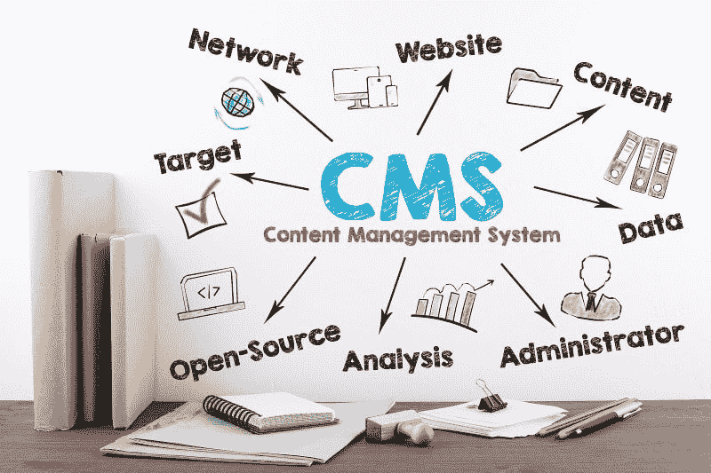

# 一个好的内容管理系统对你的网站的重要性

> 原文：<https://dev.to/martinroyfaris/the-importance-of-a-good-cms-for-your-website-35b2>

内容管理系统是一个网站的心脏和灵魂，就像网站是企业的心脏和灵魂一样！在当今时代，为你的企业建立一个在线实体是快速发展、吸引受众和提高效率的最佳方式。最大限度地减少了对体力劳动的需求，同时提高了您的业务绩效！这些网站是如何运作的？借助一个恒星的内容管理系统，内容管理系统的开发商是在高需求，由于需要一个好的网站！

**这就是为什么 CMS 能让您的企业受益匪浅的原因:**

**1)不需要编码知识:**拖放和放置-就这样，你的网站就准备好了！拥有一个 CMS 最有帮助的事情之一是缺乏编码知识不会以任何方式影响你。随着每个企业都必须迁移到网上，不可能每个所有者都学习编码；最好的替代方法是雇佣一个 CMS，然后立刻创建一个网站。

**2)无缝修改:**趋势永远不会一成不变，进化驱动着我们线上和线下！随着趋势的变化，企业也必须改变他们的风格——无论是设计还是功能。一个典型的网站将需要返工的代码和从头重新设计。然而，有了内容管理系统，你可以毫不费力地改变你的网站的外观，没有任何麻烦！

[T2】](https://res.cloudinary.com/practicaldev/image/fetch/s--Kiopeg3K--/c_limit%2Cf_auto%2Cfl_progressive%2Cq_auto%2Cw_880/https://thepracticaldev.s3.amazonaws.com/i/v7ej1r0ix57vgnhbj0w8.jpg)

指尖营销:在网上建立一个客户群是一项稍微困难的任务。人群被极度压抑，获得认可需要时间。这就是为什么营销对于希望获得在线优势的企业来说是至关重要的因素。在手工制作的网站上营销将会非常困难。然而，CMS 支持的网站带有插件和扩展，可以在社交媒体平台上实现无缝营销，这是电子邮件营销的工具！

**4)内容控制:**顾名思义“内容管理”；CMS 的主要目的是相同的！网站以博客、产品详情等形式承载大量内容。通过内容管理系统，管理信息变得更加容易。有了这些，你就可以确保你的网站功能顺畅。

一个强大的网站是企业最伟大的工具。随着网上的繁荣，每个企业都需要一个！想征服线上平台？打电话给 Openwave——新加坡最好的 [CMS 网站开发公司](https://www.openwavecomp.com.sg/content_management_system.html)，今天就搞定一个网站！我们的开发人员经验丰富，将确保你得到一个杀手级网站在任何时候。