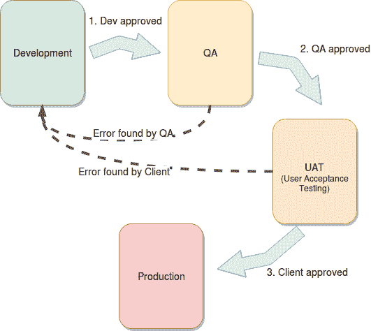
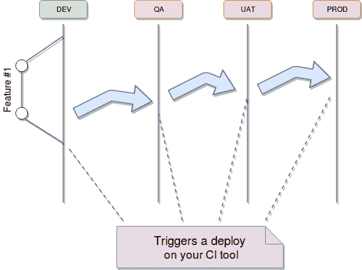

# 标准在开发团队中的重要性

> 原文：<https://dev.to/bnevilleoneill/the-importance-of-standards-in-development-teams-456>

[T2】](https://res.cloudinary.com/practicaldev/image/fetch/s--XH8Rdvq9--/c_limit%2Cf_auto%2Cfl_progressive%2Cq_auto%2Cw_880/https://cdn-images-1.medium.com/max/1024/1%2AECUKW80AL0h2AgGi_58Dew.jpeg)

很少有人喜欢被告知该做什么。更少的人喜欢有选择做什么的自由，但在如何做的问题上却没有自由。

这是完全正常的，甚至是人类，我们(尤其是在 IT 行业)喜欢认为我们更了解，我们的方式是最好的方式。只要你一个人工作，这对你来说很好，很多项目都是这样。

如果项目足够小，你可能是团队中唯一的开发人员，可能与设计师和标记作者打交道(如果是一个 web 项目)，你肯定可以告诉他们你希望事情如何完成。

但即便如此，你才是设定标准的人。因此，当谈到作为一个团队与其他开发人员一起工作时，你最好也这样做，否则你很快就会意识到他们有自己的标准，并且(就像你一样)他们也在等待每个人来遵循他们。

[T2】](https://logrocket.com/signup/)

### 标准、标准、标准

对于一个快乐的、无戏剧性的、工作的开发团队来说，这都是关于标准的。不要误解我的意思，你最终会遇到麻烦，这在人与人之间的交往中是很正常的，但是标准会帮助你大大降低这种可能性。

那么你应该考虑为你的团队设立什么样的标准呢？

### 通信标准

我知道这听起来可能很傻，每个人都知道如何与他人交谈。但这个想法是为了确保重要的信息不会被遗漏，无关的交流不会扰乱主频道。

这里有一些你可能想考虑的想法，但是当然，你必须让它们适应你的现实:

#### 日常闲聊

即使是同处一地的团队，持续的聊天室也是很棒的。“持久”是关键词，因为如果你需要记住某人说过的话，你希望这种交流的大部分内容易于搜索。也许是开发环境的登录凭证？当然，这种信息应该在某种维基上，但是你知道那是怎么回事。很多人倾向于忽略它，并问他们的队友(因为这样更快，对吗？).

同样，你需要坐下来思考一下你的团队将会讨论什么。因为最有可能的情况是，如果你正在处理一个两人以上的团队，你可能会涉及几个不同的主题，例如，前端相关的东西、后端开发、部署通知、技术问题、开发运维问题以及你想要划分的最重要的主题: **random** 。

是的，你必须为愚蠢和笑话，以及随机出现在你的群聊中的 YouTube 和 Twitter 链接找到一个出口。如果你不这样做，那么人们会使用“官方”渠道。相信我。

通过分离主题(即使是愚蠢的主题)，你可以确保信息流不会交叉，最终你会有一个单独的聊天室，人们在那里讨论一个角度错误，与 GIT 服务器的连接问题，并在同一时间分享一个愚蠢的猫视频。是啊。

这种方法很棒，对 Slack、Hipchat 或类似的工具也很有效，选择你的毒药，只要确保它能够处理它们。

最后，关于远程团队的一个注意事项:如果你的整个团队是远程的，地理上分散的(这是每年越来越多发生的事情)，持续的聊天室是必须的，因为交流必须是异步的。是的，你可以用电子邮件来做这件事，但是在你将要阅读的时候，电子邮件也可以用于其他不太自然的交流方式。

#### 其实重要而相关的交流

电子邮件和聊天对人们来说有不同的含义，而后者通常意味着更直接、更中肯的沟通(即使是异步进行的)，前者往往被忽略，内部优先级较低(这意味着，人们可能会等更长时间才能阅读你的电子邮件，特别是如果有很多邮件的话)。

也就是说，有些信息你会希望你的团队能够回头去看。电子邮件有利于发布信息，如内部团队动态变化、发布说明、路线图变更等。

#### 只在需要的时候见面

最后，如果电子邮件和聊天不能解决问题，你还应该考虑一个面对面的例子(或者像视频电话一样面对面)，只有相关人员才能解决任何问题(这里不是指个人问题，而是指他们试图解决但无法通过文本解决的任何问题)。

这里的关键是避免仅仅为了见面而见面，因为这是你能拥有的最耗费精力的交流方式。无论什么时候见面，每个参与的人都必须打破他们的注意力，100%地关注这个会议，这是他们不需要为电子邮件(他们可以在专注于他们的任务时不读它)或聊天信息做的事情。

就我个人而言，我更喜欢在需要的时候召开临时会议，但避免安排重复的会议，尤其是如果他们只是为了“同步”，这可能通过其他渠道完成。试着坐一会儿，看看你的日历，算出你为你的团队安排的会面时间。到时候你就知道到底值不值得了。就像我到目前为止提到的所有东西一样，它不是一条规则，而是一套你可能想要采纳并制定自己的指导方针。

### 编码标准

现在，交流是重要的，为整个团队制定标准肯定会帮助你与他们恰当地互动，但是如果我们谈论的是有益于开发团队的标准，我们需要触及编码标准。

#### 风格多变

您希望确保所有优秀的开发人员都按照相同的风格指南编写代码。为什么？因为你们总有一天会处理这些代码。

如果你有前端和后端团队，你可以考虑在不同的子团队之间有不同的风格指南。

如果一个团队在开发 JavaScript，而另一个团队在使用 Java，那么共享风格可能没有什么意义。尽管如此，如果双方都使用 JavaScript(在后端使用 Node.js ),共享代码的样式实际上可能是个好主意。

团队成员之间不一致的风格相当于一群作家同时用英语和早期现代英语写一个故事，你能想象吗？

*“准备开拔！我要用你们的生命来填饱肚子，淘气的侏儒！男主角说，试图隐藏他对蘑菇的不理智的恐惧而不被人注意。*

你肯定能读出来，你能理解它，这是真的。但是您正在做额外的认知努力来执行翻译(或者标准化，如果您愿意的话)，这是您在团队成员之间共享风格时试图避免的。您消除了理解其他人的代码所需的额外努力，允许您和其他人在需要时随意添加和更改代码。

这也有助于在进行代码评审时发现问题(任何足够大的开发团队都应该遵循的实践)。

对于大多数编程语言来说，已经存在大量广为接受的编码风格指南(举几个例子， [Airbnb](https://github.com/airbnb/javascript) 有一个针对 JavaScript 的指南， [Google](http://google.github.io/styleguide/javaguide.html) 发布了他们的 Java 风格指南， [PEAR](http://pear.php.net/manual/en/standards.php) 有一个针对 PHP 的指南)。

你绝对可以抓一个或者为你的团队创造一个。也许是几个现有的混合或者也许只是你习惯的编码方式，你希望每个人都那样做。无论对你和你的团队起作用的是什么，这里的要点是在团队中使用一个单一的标准。

如果您决定创建自己的网站，需要注意以下几点:

*   **评论** —不要忘记他们，他们需要在场，有意义。这是关键，在构造函数上面写“构造函数方法”没有意义。但是，如果你解释它接收的复杂参数，它肯定会有帮助。关于评论，重要的是它们需要有帮助，为了评论而评论是没有意义的，无论如何都要避免。
*   **函数/方法和变量的命名约定** — 。在创建您最终可能会使用的代码时，了解您的团队成员使用的是 camelCase 还是 snake_case 非常有用。如果你曾经使用过 PHP 4 或 PHP 5(是的，那是很久以前了)，你就会明白我的意思。语言本身对于本地函数的名字没有内在的一致性，所以你总是被迫回到文档中去理解它们是如何命名的。了解你的队友用什么语言命名实体也很有用，比如，他们用英语吗？西班牙语？克林贡语？它们都是有效的选择，只是要确保每个人都以同样的方式做。
*   **测试** —会有测试吗？您可能希望确保作为他们代码的一部分，他们也添加了相应的单元测试。也许对于每个功能，他们可能需要覆盖至少 80%的单元测试？这只是一个数字，这里的要点是:你可以使用这些标准来确保他们的输出达到一定的质量水平。也就是说，你也应该记住单元测试并不神奇，所有测试都通过的 100%覆盖率并不一定意味着代码没有 bug，它只是向那个被称为“无 bug 之地”的难以找到的梦幻之地(大多数时候)更近了一步。
*   **代码特征** —其他不太重要(在我看来)的代码特征，比如避免在不同 ide 上换行的最大行长度、代码块样式(如果适用)、缩进(你是用制表符还是空格？)等等。这些有助于改善开发人员的体验，尤其是如果您的团队使用不同的 ide。

根据所使用的语言，可能还有其他方面与您的项目相关，例如，基于 JavaScript 的项目使用分号，或者在 PHP 文件中是否使用“”或“ ?>”标记。

> 这里要记住的重要的事情是，没有好的或坏的风格，只有对你的团队起作用的和不起作用的。如果你是创建指南的人，试着考虑他们的意见和经验。

最后，作为创建编码风格指南的一个额外的建议，你要找到一种自动化检查和平衡系统的方法。你可以编写并分发你的风格指南，但是你需要一种方法来确保每个人都遵守它。否则，事情可能会失去控制(取决于你的团队，你可能最终让开发人员认为他们知道得更多，这是完全正常的)，所以你应该考虑为最常见的编程语言实现众多工具之一。

### 发展过程

我们可以看的最后一部分是实际的开发过程。我的意思是，一旦开发人员知道如何以适合每个人的方式编写他们的代码，他们也应该就如何将代码从他们的开发笔记本电脑转移到生产环境达成一致。

任何明智且足够大的项目在代码实际进入生产之前都应该有几个阶段，只是为了确保它按预期工作，并且它确实是产品所有者(无论是付费客户还是您组织内的内部团队)希望得到的。

#### 定义您的环境

这是一个取决于你的项目需求的标准，你可能需要一个非常严格的质量保证过程，或者你可能有一个不想参与其中的产品负责人。

您可能没有 QA 团队可以与您一起工作，或者您可能只有测试自动化工程师。有许多变量需要考虑，有了所有这些变量，您需要定义代码将如何一直流向产品，以及通过哪些环境。

开始新项目时，我喜欢使用以下设置:

[T2】](https://res.cloudinary.com/practicaldev/image/fetch/s--NiFfqzHI--/c_limit%2Cf_auto%2Cfl_progressive%2Cq_auto%2Cw_880/https://cdn-images-1.medium.com/max/531/1%2AcK-2rUAxbdTLCZi7cxzXHw.png)

它涵盖了基础知识:

*   一个开发环境，在这里你可以测试你的代码和团队其他成员的代码。如果您正在开发的系统足够复杂，这可能是您无法在个人工作站上完成的事情。
*   一个测试环境供你的 QA 团队审查你的工作，一个代码更稳定的地方，没有在以前的环境中可以发现的明显的集成问题。
*   **为你的产品负责人**(无论是付费客户还是你公司的内部团队)提供一个地方来回顾已完成的功能，仔细检查你是否交付了那个人期望得到的东西。
*   **最后，一个生产环境，**一旦你的代码被所有相关人员批准，你的代码将被部署到这个环境中。

无论您决定采用哪种设置，都要确保记录流程并正确地通知您的团队。这里的要点是界定每个子团队的访问和控制。

例如，您的测试人员不应该要求访问开发环境，您的开发人员不应该访问生产环境。无论需要进行什么部署，都应该使用某种 CI 工具(比如 Jenkins 或 Bamboo)自动完成。

#### 控制你的版本…或者类似的事情

我想在这里提到的最后一点，我认为真正受益于标准过程的是你和你的团队处理代码版本控制的方式。无论你是使用 GIT、SVN 还是 CVS(哦，上帝，请不要),从来没有一种方法可以使用它们来有效地版本化你的源代码，让团队成员遵循不同的策略可能会导致严重的问题。

就我个人而言，我更喜欢在我的项目中使用 GIT，因为它是一个对如何进行版本控制提供很多控制的工具，它通过其分支策略节省了很多磁盘空间，并且它背后有一个很好的社区。

特别是对于这个工具，有很多策略来处理版本控制，主要是使用 GIT 的分支模型。

我倾向于为每个环境建立主要的“核心”分支，并为要使用的特性建立几个小分支，以避免在合并和测试之前混淆不稳定的代码。

因此，如果您将这些核心分支与您的 CI 系统联系起来，那么无论何时在它们中执行合并，您都可以自动化部署(通过在分支/环境之间提升代码，您可以直接控制这些合并何时发生)。

下图提供了代码从一个环境流向另一个环境的一般高级概述:

[T2】](https://res.cloudinary.com/practicaldev/image/fetch/s--DeiDrIvo--/c_limit%2Cf_auto%2Cfl_progressive%2Cq_auto%2Cw_880/https://cdn-images-1.medium.com/max/609/1%2AcZXWbVUeF-sT1gMkBRgQKQ.png)

就像环境一样，这是一个记录的关键过程，理想情况下，甚至在项目开始之前，为了避免不同的团队成员重写他们各自的代码之间的任何问题。无论您决定采用什么策略，请确保您清楚流程和要使用的实际命令，这是至关重要的，因为不是每个人都对这些版本控制系统有相同的知识和理解。因此，不要害怕记录实际的命令，或者为您常用的 IDE 提供屏幕截图，并一步一步地解释如何执行代码提升。

### 所以，总而言之

希望到目前为止，所有这些要点已经让您了解了在您的项目中使用标准的好处，无论是对于您的开发团队的实际源代码，还是对于任何软件开发项目中涉及的其他相关过程。

学会热爱标准，但要确保它们不是一成不变的。如果他们不为你的团队工作，确保你能适应和重写任何需要的东西。记住，他们不是要强制推行一种工作方式，而是帮助促进队友之间的互动。

### Plug: [LogRocket](https://logrocket.com/signup/) ，一款适用于网络应用的 DVR

<figcaption>[https://logrocket.com/signup/](https://logrocket.com/signup/)</figcaption>

LogRocket 是一个前端日志工具，可以让你回放问题，就像它们发生在你自己的浏览器中一样。LogRocket 不需要猜测错误发生的原因，也不需要向用户询问截图和日志转储，而是让您重放会话以快速了解哪里出错了。它可以与任何应用程序完美配合，不管是什么框架，并且有插件可以记录来自 Redux、Vuex 和@ngrx/store 的额外上下文。

除了记录 Redux 操作和状态，LogRocket 还记录控制台日志、JavaScript 错误、堆栈跟踪、带有头+正文的网络请求/响应、浏览器元数据和自定义日志。它还使用 DOM 来记录页面上的 HTML 和 CSS，甚至为最复杂的单页面应用程序重新创建像素级完美视频。

免费试用。

* * *