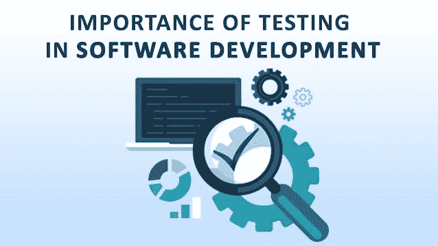

# 测试在软件开发中的重要性

> 原文：<https://dev.to/wenso_smith/the-importance-of-testing-in-software-development-1aag>

一个产品要经过多层次的测试方法，以确保其可靠的功能。这是产品开发过程中最重要的一步。它不能在测试之前投放市场，通常在实际产品制造之前就已经完成了。有许多理由支持测试的重要性:

它有助于识别开发阶段可能出现的任何缺陷或错误。

[T2】](https://res.cloudinary.com/practicaldev/image/fetch/s--56rjbQLj--/c_limit%2Cf_auto%2Cfl_progressive%2Cq_auto%2Cw_880/https://cdn-images-1.medium.com/max/638/0%2AlsC2cF6Tbb0dJLTX.jpg)

任何产品的成功都是由其质量和客户对该产品的信任度来衡量的。

为了交付高质量的产品或软件应用程序，需要适当的测试。这提高了给予客户的支持或设施的水平。此外，经过良好测试的产品维护成本更低，因此提供的结果更加准确、一致和可靠。

设计任何产品或软件都会产生大量的费用，因此应用程序或产品提供积极的结果以避免任何不必要的或突然的费用是至关重要的。

为了巩固你在市场上的地位，产品的性能应该非常好而且耐用。这种确定性只能通过适当的测试方法来实现。

说到测试，主要有两种类型的测试。首先是 [**软件测试**](http://www.wenso.co.uk/it-services/testing/) ，其次是**临时测试**。

软件测试通常用于测试程序员开发的软件。这个过程包括对与软件产品相关的各种信息的评估。一旦实现了软件测试过程，企业日常活动的效率就会提高。今天的公司在高度竞争的环境中工作。每个人都在努力以其优异的表现达到顶峰。因此，产品的质量变得非常重要。通过软件测试，可以查明产品中的特定缺陷，以便可以采取适当的解决方案来提高产品的质量。它还有助于发现任何缺陷或错误，以提高系统的整体容量和准确性。

**软件测试的几个好处是:**

如果开发的应用程序质量好且持久，那么即使它发挥到了最大能力，它也会表现得很好。有了经过充分测试的结果，软件甚至可以被配置为在不太理想的情况下运行。

在测试的帮助下，可以提高软件的整体安全性，但是，这个过程本质上并不简单。

另一种测试是临时测试，这种测试是非结构化的，或者不是按顺序进行的。它也被称为黑盒测试或行为测试。

这种测试是在没有任何正式过程的情况下进行的，例如测试计划、文档、测试用例等。即使在实施过程中，也没有遵循正式的程序。

特别测试通常是为了找出正式流程未能识别的问题或错误。做所有这些测试的人应该对将要测试的产品或应用程序有很好的详细的了解。在遵循特定测试方法时，测试人员只打算拆分系统，而不遵循任何对齐的处理器，也不考虑任何特定的用途。

*最初发表于*[*【www.wenso.co.uk】*](http://www.wenso.co.uk/news/importance-testing-software-development/)*。*