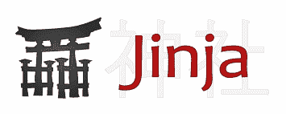
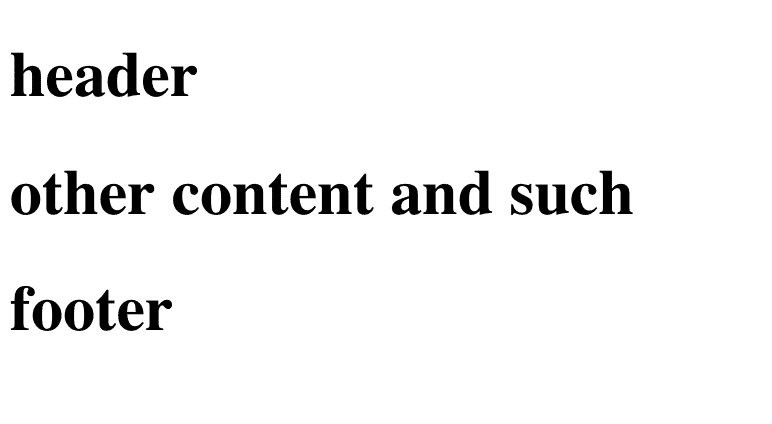
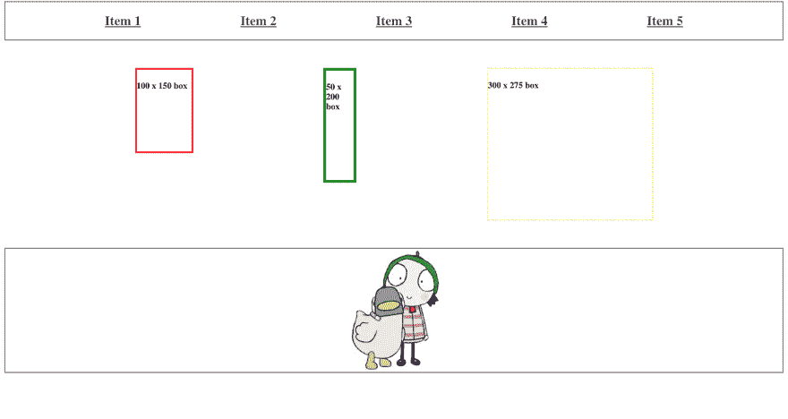

# Jinja2 模板:Python 的 Web 模板

> 原文：<https://dev.to/kaelscion/the-jinja-template-because-im-a-python-developer-3mll>

[T2】](https://res.cloudinary.com/practicaldev/image/fetch/s--adPE2Ah1--/c_limit%2Cf_auto%2Cfl_progressive%2Cq_auto%2Cw_880/https://thepracticaldev.s3.amazonaws.com/i/ed30f2dq5cwj4lqttngt.png)

> ***原载于编码鸭博客:【www.ccstechme.com/coding-duck-blog】T2*T5】**

不久前，我和我的一个朋友/同事就他正在做的一个项目进行了一次对话。他负责两个人的运营，主要负责数字媒体和营销。有时，他会为某人建立一个网站，以配合他希望为他们创造的数字存在。他对自己的网络开发技能毫不掩饰。"我去主题森林，下载一个主题，改变颜色，图片和文字."我真的很佩服这种诚实。他有市场营销和商业背景，知道大多数人在创业时宁愿和尽可能少的供应商和承包商打交道，所以他提供了 Wordpress 重新换肤功能，让自己成为一站式商店。当他的客户成熟了一点，正在寻找比他能提供的更灵活、更有活力的东西时，我通常会收到他的来信。虽然我知道一个真正的 PHP 高手可以让 WordPress 做一些非常可笑的事情，但是 PHP 从来没有吸引过我，所以当有人问我的时候，我会用 Flask 来构建。

有一天他问我 web 开发人员如何用 Flask、Django、Angular、React、Node 等手工搭建网站。“实际上这和 WordPress 没什么不同，”我回应道，“我们只是告诉代码把东西放在哪里，以及如何让它们看起来更像一个拖放界面。”

听到这里，他开始咯咯地笑，摇着头。他的反应主要基于他对我的了解。我是典型的开发人员/工程师/程序员类型。对我来说，编码是我做这件事的唯一原因；因为我喜欢解谜。当然，我需要支付账单，尽管从技术上来说我经营着自己的生意，但我远不是一个商人。对我来说，是机器。我喜欢和他们说话，听他们回应。我遇到过许多机器，我称之为“厚脸皮”，很难操作。这让他们在我眼里有了个性；对他们来说，多年的忽视或不良配置的结果，就像我们过去负面的生活经历:他们被它塑造，被它塑造...

[T2】](https://i.giphy.com/media/AqPRIe2gIxrP2/giphy.gif)

另一方面，他在努力生活，尽可能地把食物放在餐桌上。过了一会儿，他回答说:“当然，对像你这样的人来说。但是，即使当我不得不在 WordPress 上谷歌一些东西并插入代码时，我知道页面的顶部进入 wp-header.php，底部进入 wp-footer.php 等等。你做的事情没那么容易。”

***哦不？？？？*T3】**

许多人害怕编程语言，当他们被要求阅读一门语言时，就会陷入极度恐慌的状态。这可能类似于某人看到书架上一本书的标题，但却是另一种语言。他们会立即离开，因为阅读一门你不懂的语言是令人生畏的。这导致了误解。你们中的一些人可能对某些前端如何搭配有误解。也许你认为 JS 最适合 JS，web 应用应该只使用 Node、React 或 Angular Typescript 编译器。但相信这一点，就等于在书架上看到《悲惨世界》,还以为你不会读它，因为你会说英语。然而，如果你拿起它，打开它，你会看到标题是法语，因为作者是法国人，这个故事最初是用法语写的，它发生在法国。但是这本书本身被翻译成了英语。现在，维克多·雨果的散文是否可以被理解，即使他的散文是用你的语言写的，这本身就是另一个问题。但关键是，设计一个 Jinja2 应用程序和设计一个 Wordpress 应用程序并没有什么不同。诀窍是:模板。现在，我不是指你从 ThemeForest.net 下载的模板，你必须首先付费，但几乎没有粒度控制。我说的是你自己构建的网络应用的主题。最好的网页模板毕竟是免费的网页模板，对不对？为此，我们将不使用预先制作的模板库，我们将使用带有引擎的构建库。问题中的模板引擎:Jinja2。让我们消除一些误解:

典型的基础模板如下所示:

```
 <html>
  <head>
    
    Hey there {{ user }}
    
    I don't know you!
    
  </head>
  <body>
    <header>
        
    </header>
    <div class="content">
        
    </div>
    <footer>
        
    </footer>
  </body>
</html> 
```

Enter fullscreen mode Exit fullscreen mode

所以这个模板展示了一个模块化的 HTML 文档，它导入并使用其他 HTML 文档来填充内容的空间。这三个 HTML 文档中的每一个都包含一个“h1”标签，用于标识它在文档中的位置。在当前状态下，它看起来如下:

[T2】](https://res.cloudinary.com/practicaldev/image/fetch/s--orZ2B1U4--/c_limit%2Cf_auto%2Cfl_progressive%2Cq_auto%2Cw_880/https://thepracticaldev.s3.amazonaws.com/i/75a8mfr5wu09xxlzvdi3.png)

现在我们已经有了这个基础模板，让我们修改导入的文件。header.html 现在的样子:

```
<nav style="display: flex; flex-direction: row; justify-content: space-evenly; border: 2px solid gray;">
    <h1><a href="#">Item 1</a></h1>
    <h1><a href="#">Item 2</a></h1>
    <h1><a href="#">Item 3</a></h1>
    <h1><a href="#">Item 4</a></h1>
    <h1><a href="#">Item 5</a></h1>
</nav> 
```

Enter fullscreen mode Exit fullscreen mode

内容文件:

```
 <div class="content" style="padding-top: 50px; display: flex; flex-direction: row; justify-content: space-evenly;">
    <div class="box1" style="width: 100px; height: 150px; border: 3px solid red;">
        <h4> 100 x 150 box</h4>
    </div>
    <div class="box2" style="width: 50px; height: 200px; border: 5px solid green;">
        <h4> 50 x 200 box</h4>
    </div>
    <div class="box3" style="width: 300px; height: 275px; border: 2px dotted yellow;">
        <h4> 300 x 275 box</h4>
    </div>   
</div> 
```

Enter fullscreen mode Exit fullscreen mode

aaaaaaand 和页脚:

```
 <footer style="margin-top: 50px; display: flex; justify-content: center; border: 2px solid gray;">
    
</footer> 
```

Enter fullscreen mode Exit fullscreen mode

一旦 Jinja 模板通过 Flask 呈现，看起来就像这样:

[T2】](https://res.cloudinary.com/practicaldev/image/fetch/s--t-cU8DLB--/c_limit%2Cf_auto%2Cfl_progressive%2Cq_auto%2Cw_880/https://thepracticaldev.s3.amazonaws.com/i/2k8pmey17zrzzc1exdp7.png)

那么我们为什么要关心这个呢？我们可以把所有这些放在一页上，不用担心进口和垃圾。嗯，我们关心的是模块化。使用这种模板引擎允许我们将 web 应用程序组装成彼此独立的部分。假设在你的 web 服务器上发生了一些奇怪的事情,“header.html”文件无法呈现。那真的很烦人。但是，网页仍然会显示，只是少了标题。这可能会惹恼你的用户，但他们不会得到 404，这可能会阻止他们下次回来。

那么，我们如何记住 Jinja 的语法呢？

最简单的方法如下:每个 Jinja 特定的标签需要两个符号来封装条件(if、for、while)或变量。启闭符号是 ***总*** 一个括号“{”或“}”。如果你要求金贾*做*某事(比如条件语句、循环语句、包含语句或块语句)，这个语句也由百分比/模数符号“%”构成。如果你要求 Jinja*说出*某事(在循环中显示一个变量或迭代器)，那么这个项目被包装在另一组括号
“{”，“}”中。这条一般的经验法则适用于绝大多数的烧瓶管道。如果您想了解更多细节，请查看文档，可在此处找到[。](http://flask.pocoo.org/docs/1.0/)

如果您对未来的文章有任何问题或要求，请在下面留下评论，我希望这已经为您清除了一些 Jinja 和 Python web 模板！