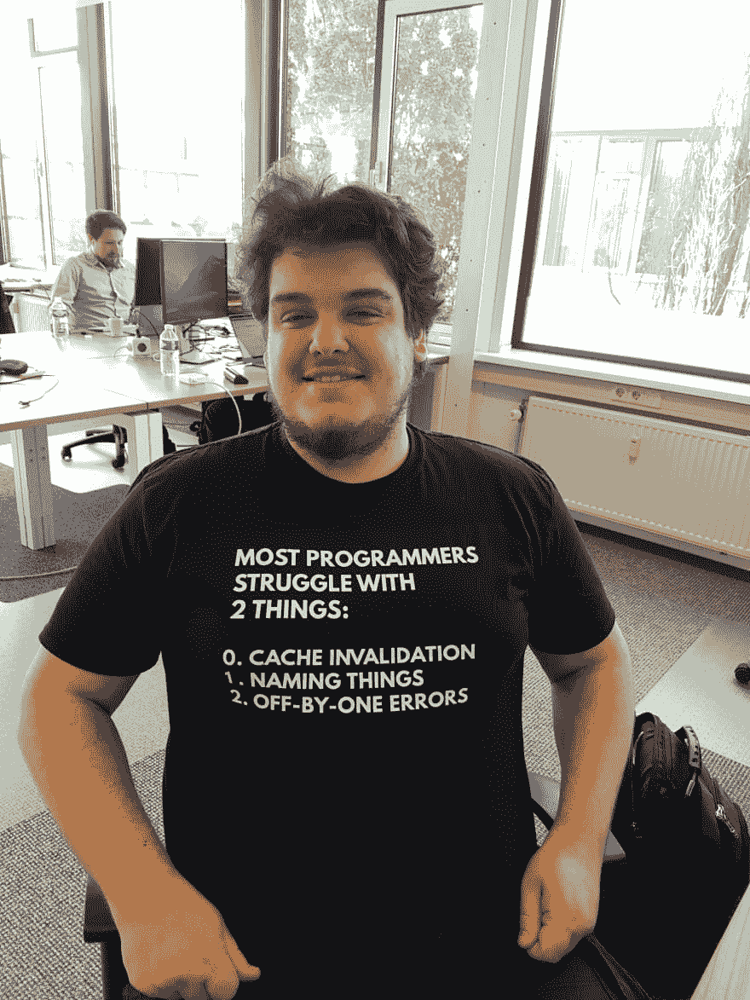

# 最新的编程创新-第 9 期

> 原文：<https://dev.to/basvanessen/the-latest-programming-innovations---issue-9-4n9h>

由 [Jexia 专家](https://www.getrevue.co/profile/jexia?utm_campaign=Issue&utm_content=topprofilename&utm_medium=email&utm_source=Programming+Innovations)每月简讯第 9 期[免费订阅此处](https://www.getrevue.co/profile/jexia)

**深入研究软件工程。导致新的工具、方法和系统。[杰夏](https://www.jexia.com)专家工程师[乔尔·布莱恩·胡利亚诺](https://www.linkedin.com/in/joeljuliano/)和[马克·盖勒](https://www.linkedin.com/in/mark-geller-4b859676/)为您提供最新文章。**

* * *

## 退出隐藏模式:

**[1。普鲁米让你用代码](https://techcrunch.com/2018/06/18/pulumi-wants-to-let-you-manage-your-infrastructure-with-code/?utm_campaign=Revue%20newsletter&utm_medium=Newsletter&utm_source=Programming%20Innovations)** 管理你的基础设施

Pulumi 想让开发者和运营团队更容易通过编写代码来定义他们的基础设施。

**[2。受保护的代码，即使你忽略安全威胁](https://techcrunch.com/2017/10/11/shiftleft-promises-to-protect-your-code-even-when-you-ignore-security-threats/?utm_campaign=Revue%20newsletter&utm_medium=Newsletter&utm_source=Programming%20Innovations)**

Shiftleft 表示他们能够做到这一点，因为他们在运行之前对代码及其所有依赖项进行了研究。

**[3。Zenaton 让您轻松构建和运行工作流](https://techcrunch.com/2018/06/18/zenaton-lets-you-build-and-run-workflows-with-ease/?utm_campaign=Revue%20newsletter&utm_medium=Newsletter&utm_source=Programming%20Innovations)**

法国公司 [Zenaton](https://zenaton.com/) 希望处理应用程序中最繁琐的部分——异步作业和后台任务。

## 可通过回购和文件进行评估:

**[4。Droix:自动修复安卓应用中的崩溃](https://droix2017.github.io/?utm_campaign=Revue%20newsletter&utm_medium=Newsletter&utm_source=Programming%20Innovations)**

安卓应用无处不在，频频苏？车祸造成的紧急情况——导致可怜的 UX 和经济损失。还有[看报](http://www.shinhwei.com/droixicse_camera.pdf)。

**[5。区块链软件开发外包](https://devpost.com/software/chainsoft?utm_campaign=Revue%20newsletter&utm_medium=Newsletter&utm_source=Programming%20Innovations#updates)**

科学家们提出了 chain soft——一个外包软件开发和不信任 的各方之间通过区块链 自动付款的平台。还看了[他们的论文](https://dl.acm.org/citation.cfm?id=3211934%20technology)。

**[6。自动减少花费在故障分析上的时间](https://github.com/tum-i22/Aletheia?utm_campaign=Revue%20newsletter&utm_medium=Newsletter&utm_source=Programming%20Innovations)**

测试和调试非常耗时。Aletheia 帮助开发人员和测试人员减少失败分析的时间。还要看[它的论文](https://dl.acm.org/citation.cfm?id=3183486)和看视频。

## 只能通过阅读报纸来评估:

**[7。自动回答 API 相关问题](https://dl.acm.org/citation.cfm?id=3194965&utm_campaign=Revue%20newsletter&utm_medium=Newsletter&utm_source=Programming%20Innovations)**

SOTU 自动从教程和堆栈溢出中找到与 API 相关的自然语言问题的答案。

**[8。快速了解源代码变化](https://www.computer.org/csdl/proceedings/compsac/2018/2666/00/266601a074-abs.html?utm_campaign=Revue%20newsletter&utm_medium=Newsletter&utm_source=Programming%20Innovations)**

在版本控制系统中，开发人员经常将多种源代码编辑保存到一个提交中，这是什么？难以理解和还原。借助可视化工具，科学家可以更好地展示变化的细节，并以树形结构排列编辑内容，以表达多组变化。

**[9。Le-git-imate:自动验证 git 库](https://dl.acm.org/citation.cfm?id=3196523&utm_campaign=Revue%20newsletter&utm_medium=Newsletter&utm_source=Programming%20Innovations)T3】**

基于 Web 的 Git 托管服务，如 GitHub 和 GitLab，是管理和与 Git 存储库交互的流行选择。然而，它们缺少一个重要的安全特性——签署 Git 提交的能力。

**[10。DWEN:在 repos](https://dl.acm.org/citation.cfm?id=3195092&utm_campaign=Revue%20newsletter&utm_medium=Newsletter&utm_source=Programming%20Innovations)T3 中检测重复的错误报告**

捕获和标记重复的 bug 报告是至关重要的，以避免将相同的 bug 分配给 di？不同的开发者。

**[11。自动分配一个错误报告给最好的解决者](https://www.matec-conferences.org/articles/matecconf/pdf/2018/32/matecconf_smima2018_03031.pdf?utm_campaign=Revue%20newsletter&utm_medium=Newsletter&utm_source=Programming%20Innovations)T3**

在大型开源软件项目中，将 bug 报告分配给最合适的修复者是一件非常耗时的工作。

**[12。D2Spec:自动提取 API 规范](https://ece.uwaterloo.ca/~lintan/publications/webapi-msr18.pdf?utm_campaign=Revue%20newsletter&utm_medium=Newsletter&utm_source=Programming%20Innovations)**

API 规范是机器可读的 API 描述。结合相关的工具，它们简化了并支持 API 的使用。然而，尽管API 的数量在快速增长，规范却很少，它们的创建和维护现在严重依赖于人工？由第三方 和第三方 组成。

**[13。通过指标自动比较库质量](https://dl.acm.org/citation.cfm?id=3183418&utm_campaign=Revue%20newsletter&utm_medium=Newsletter&utm_source=Programming%20Innovations)**

为了执行一个特定的任务，通常需要大量的库？这个功能。但是选择合适的库并不容易，因为开发人员通常不知道它们的优缺点。

**[14。改进开发人员讨论期间的虚拟协助](https://arxiv.org/pdf/1806.05130.pdf?utm_campaign=Revue%20newsletter&utm_medium=Newsletter&utm_source=Programming%20Innovations)**

科学家提升了软件工程中虚拟助手的地位。虚拟助手技术发展很快，但在开发软件 方面的应用却落后于其他领域。研究人员在开发者 关于漏洞修复的对话中测试言语行为类型的自动检测。

**[15。给片段和它们的轮廓分配相似的向量](https://guxd.github.io/papers/deepcs.pdf?utm_campaign=Revue%20newsletter&utm_medium=Newsletter&utm_source=Programming%20Innovations)**

CODEnn 将代码片段 和自然语言描述共同嵌入到一个高维向量空间中，使得代码片段和其对应的描述具有相似的向量。

## 马克的特别推荐:

**[16。用小型发射机](http://openaccess.thecvf.com/content_cvpr_2018/CameraReady/2406.pdf?utm_campaign=Revue%20newsletter&utm_medium=Newsletter&utm_source=Programming%20Innovations)透过墙壁发现人类**

本文演示了通过墙壁和遮挡准确的人体姿态估计。我们利用 WiFi 频率中的无线信号穿过墙壁并从人体反射的事实。

**[17。用人工智能](https://theblog.adobe.com/spotting-image-manipulation-ai/?utm_campaign=Revue%20newsletter&utm_medium=Newsletter&utm_source=Programming%20Innovations)处理图像**

Adobe 研究人员 Vlad 应用人工智能和机器学习来更容易、可靠和快速地检测数字图像的一部分是否被操纵，如果是，修改了哪些方面。

**[18。人类青睐由机器学习制作的故事书](https://arxiv.org/pdf/1805.04833.pdf?utm_campaign=Revue%20newsletter&utm_medium=Newsletter&utm_source=Programming%20Innovations)**

人类法官更喜欢由脸书人工智能研究人员构建的算法生成的故事，而不是来自强大的非层次模型的 。

## 最后，Mark 分享了一些额外的智慧:

[T2】](https://res.cloudinary.com/practicaldev/image/fetch/s--DqNx2tOq--/c_limit%2Cf_auto%2Cfl_progressive%2Cq_auto%2Cw_880/https://s3.amazonaws.com/revue/iteimg/003/148/925/original/Jexia-Mark.jpg%3F1530197734)