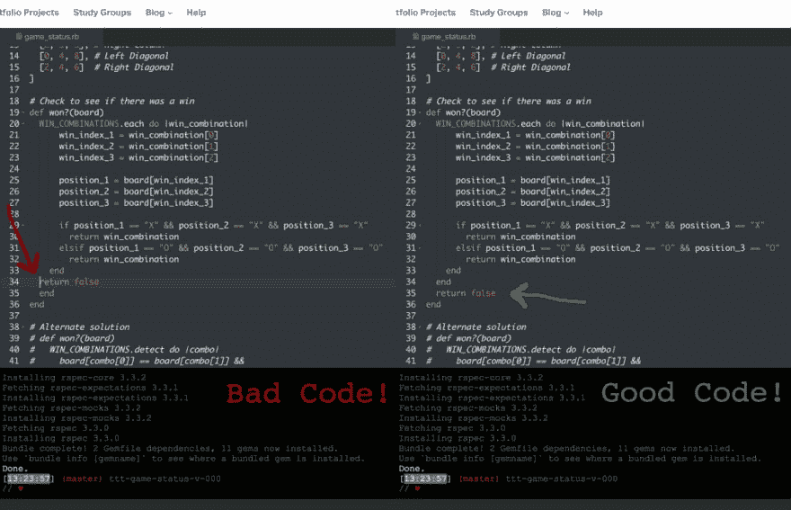

# 小事很重要

> 原文：<https://dev.to/meg_gutshall/the-little-things-matter-56i6>

我在熨斗学校参加[在线软件工程项目已经正式一个月了！很艰难(*真的*艰难)...但是我还在这里！我刚刚完成了“Ruby 开发简介”部分，并一步一步地学习了如何用 Ruby 语言编写一个井字游戏。到目前为止，我已经注意到，一旦我解决了在实验室中遇到的困难，我就对材料有了相当全面的理解。当我解开这些结的时候，我发现自己在脑海中一遍又一遍地重复着，“不要对自己太苛刻了！”](https://flatironschool.com/career-courses/coding-bootcamp/online/)

你看，这对我来说是全新的。我从没接触过 Ruby，直到我开始在熨斗工作。我发现这是一种非常用户友好的语言，但是不可避免的(并且比我希望的更频繁)，我仍然会迷路。这真的很令人沮丧，我不得不不断提醒自己，有点跑题没关系。困惑是学习新事物的一部分，作为一个初学者，在克服学习曲线时保持耐心是很重要的。

耐心是关键——我稍后会解释更多——但首先我需要给你多一点关于我自己的背景。让我们坐上时间机器，回到十年前…

我刚刚进入天普大学，是一名大一新生，没有申报专业。尽管我的父母都被 STEM 相关的领域所吸引，我还是决定在文学院开创自己的道路。因为需要一门语言，我把西班牙语加进了我的课程表，并最终爱上了它，在第三学期宣布西班牙语为我的专业。经过四年的学习和多次访问西班牙语国家，我现在可以说我是一个流利的演讲者。

那么这跟 Ruby 和熨斗程序有什么关系呢？

当我浏览这些课程时，我发现学习 Ruby 和学习西班牙语有很多相似之处。一个让我印象深刻的是:**小事也重要**。

如果你是一名程序员，我敢肯定你以前至少经历过一次这种情况:你正在编写一个程序，并试图让它通过测试，但你一直收到一个错误信息。你尝试了所有你能想到的方法去解决它，但是接下来的事情，你知道三个小时过去了，你仍然困在那该死的考试中！！是的，那是上周六下午的我，我快绝望了。

幸运的是，当你陷入困境时，Flatiron 的平台 Learn.co 可以让你与技术教练实时聊天——我可能应该在斗争中利用大约 30-40 分钟，而不是让自己完全疯掉。我接通了技术教练詹姆斯(大声喊詹姆斯！)然后我们开始工作。他似乎有点困惑，因为对他来说一切都没问题，所以我们一次尝试一些小的调整，看看我们是否能让代码通过。最后，我们发现我在程序的错误部分返回了`false`。如果在迭代中返回`false`,该方法只接受数组中的第一个对象，并在迭代其余对象之前结束。换句话说，不好。

[T2】](https://res.cloudinary.com/practicaldev/image/fetch/s--t8I5mIGo--/c_limit%2Cf_auto%2Cfl_progressive%2Cq_auto%2Cw_880/https://thepracticaldev.s3.amazonaws.com/i/f45v0xw6jf3n51vqqb6k.jpg)

啊！！在经历了所有的困惑、努力和挫折之后，最终的结果是仅仅切换了两行代码就让程序通过了测试。两行！就是这样！我自嘲了一下，非常感谢詹姆斯，并且能够自己编写出程序的其余部分，完成井字游戏状态实验室。(喝着受之无愧的啤酒)我又一次对自己说:“要有耐心。你很快就会明白的。

这一经历让我想起了西班牙语初学者常犯的错误。有许多西班牙语-英语同源词——这些词听起来非常相似，因为它们在拉丁语中有相同的词根来源(即，apartment 和 apartamento)——正因为如此，许多初学者会不小心用错词或完全编造一个新词。例如，许多学生错误地说“estoy embarazada”，意思是“我怀孕了”，而不是“estoy avergonzada”，意思是“我很尴尬”。这是一个有趣的解释给一个新的西班牙语发言人。:)

即使改变一个句子中一个单词的一个字母，也能完全改变句子的意思。在坦普尔的一堂课上，我的一个朋友本想说“不要这样，不要这样。”但结果却是“不，我不喜欢男人”一个意思是“我不吃早餐，除非我饿了。”另一个，“我不吃早餐，除非我有一个男人。”嗯……我们被这个逗笑了。

不用说，在学习环境中，西班牙语中的这些小错误可能比 Ruby 中的错误有趣得多，Ruby 中的错误往往令人沮丧。但就像我之前说的，对自己有耐心很重要，因为如果你不小心，小错误会滚雪球般变成糟糕的情况。我在古巴和墨西哥都迷路过(两次),因为发音错误或混淆了常用词。这些都是令人沮丧且代价高昂的教训。

一旦我到达更复杂的实验室，我想它会非常相似，但只是在更大的范围内，所以弄乱一点点代码会有更大的后果。因此，我把我早期学习西班牙语时学到的一课应用到编程中:**要有耐心。如果你关注小事情，你就不会让它们变成大问题。**