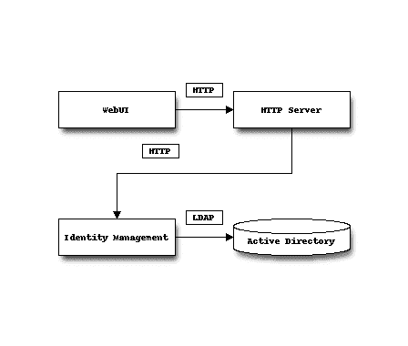
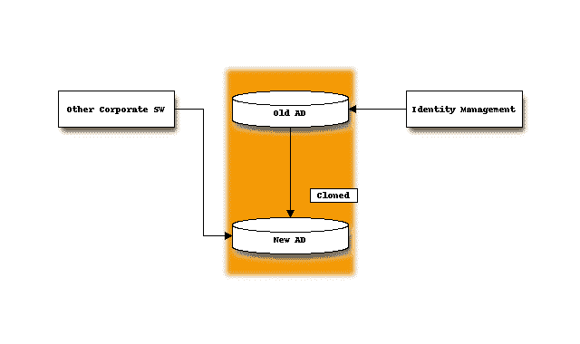

# 神奇的密码

> 原文：<https://dev.to/stealthmusic/the-magical-password-3fen>

### 车票

我们从一位客户那里收到了一张支持票:

> 我无法登录系统。我在 123 部门工作。请将在该部门工作的所有用户添加到系统中。谢了。

该系统由几个微服务组成，其中一个负责管理身份、角色和权限。用户是从客户的公司 Active Directory 导入的。客户知道，我们通过一个特殊的查询来挑选广告用户。

[T2】](https://res.cloudinary.com/practicaldev/image/fetch/s--3MCDCF7C--/c_limit%2Cf_auto%2Cfl_progressive%2Cq_auto%2Cw_880/https://thepracticaldev.s3.amazonaws.com/i/2i9prauqgz3x4qnsgznt.png)

现在，客户提出，用户在一个特定的部门，不属于 LDAP 查询。所以我们加了那个部门。并解决了罚单。

### 一周后

> 你好，我仍然无法登录。还有两个用户无法登录。其他的都没问题。

现在，我们检查了身份管理服务的日志文件。很明显:密码是错的。

我们通知客户检查密码，并关闭了机票。

> 嗨，我一整天都在一遍又一遍地输入同一个密码，我完全确定，密码是正确的！

在那一点上，我们感到有点不安全。我们在身份管理方面有缺陷吗？这项服务已经比较成熟，在很多系统中都有使用。

> 你的密码中有什么奇怪的字符吗？
> 
> > 是啊，算是吧。

显然，我们不能要求客户告诉我们密码。所以我们在测试 LDAP 中创建了一个用户，密码类似于`§$%!&/()&/)?=#*`。在我们的环境下非常有效。在浏览器- >身份管理- > LDAP 的处理链中是否存在一些奇怪的字符编码问题？

> 你能直接登录即时通讯而不是应用程序网站吗？
> 
> > 没错。仍然无法登录。

更多的用户开始使用该系统，但无法登录。我们开始害怕了。

> 你能把你的密码改成没有任何特殊字符的吗？
> 
> > 试过了-也不管用！

### 几周过去了

我们与身份管理的产品开发部门进行了交谈。他们构建了一个具有增强日志记录的特殊版本。我们部署了它。

> 请尝试登录并告诉我们用户和时间。
> 
> > 无名氏，10 点 42 分

```
[10:42:01.132] [ERROR] User <john.doe> tried to login with incorrect password. 
```

Enter fullscreen mode Exit fullscreen mode

> 你真的确定你使用了正确的密码吗？
> 
> > 是啊！

此时，距离最初的支持票发出已经过去了几个月。我们花了几天的时间来分析这个问题，客户希望用这个系统来提高效率。但是运气不好。

直到他们系统管理员发来的邮件:

> 顺便说一下，我刚刚意识到，你使用了错误的 LDAP 网址。

### WAT!?

但是他们的大多数员工都可以登录！？

我们知道，公司的一些部门已经被分离出来，成为一个独立的法人单位。

一切都有道理:没有神奇的密码。我们完全走错了路。他们只是克隆了运行活动目录的虚拟机，一个保留在外部公司，另一个克隆的由我们的客户使用。猜猜看，我们连接的是什么广告？不幸的是第一个。他们拆分了公司，分离了地点，但没有分离网络。他们没有删除第一个广告中保留在被删除部分的员工。

[T2】](https://res.cloudinary.com/practicaldev/image/fetch/s--Y06zUEB1--/c_limit%2Cf_auto%2Cfl_progressive%2Cq_auto%2Cw_880/https://thepracticaldev.s3.amazonaws.com/i/wx7h5yzckhsfrhropq50.png)

因此，基本上所有的用户都可以登录，但那些改变了密码的人却不能登录。很明显，随着时间的推移，用户的数量在增加，因为根据他们的安全策略，他们被迫更改密码。

我们了解到，寻找一个 bug，你不应该坚持一个可能的原因(在这种情况下，一个特定的密码问题)，而是缩小一点，看看大的图片。