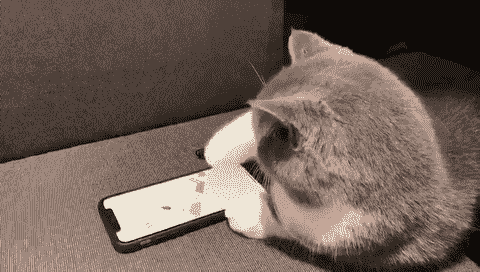

# 消息机器人

> 原文：<https://dev.to/yechielk/the-messaging-bot-59ka>

### 用 Twilio 给我的 Twitter 机器人添加短信通知

你可能还记得，最近我做了一个 Twitter 机器人，每当纽约市暂停备用路边停车规则时，它就会转发(你可以在这里关注它[)。](https://twitter.com/AlterSideBot)

这个机器人大受欢迎；写这篇文章的时候已经有超过 150 个追随者了，但是它有它的局限性。

首先，有些人并不关注他们的推特信息；一条转发很容易迷失在一个活跃的订阅源的噪音中。还有一些人没有 Twitter(当我告诉家人这个机器人时，这是我最大的抱怨)。

#### Enter Twilio

Twilio 是一个 API，它可以用来将你的应用程序与一个可以拨打/接收电话和短信的电话号码连接起来。

我听说了很多很棒的东西，说它很容易使用，用它做东西很酷，所以我想这将是一个很好的尝试项目。

炒作是合理的。API 非常用户友好，文档非常清晰，他们甚至有一个游戏来帮助你入门(试试吧: [TwilioQuest](https://www.twilio.com/) )。

我写了一篇关于在我的应用程序中添加短信和语音功能的技术部分的博文(你可以在 Twilio 的博客[这里](https://www.twilio.com/blog/2018/04/sms-notifications-ruby-on-rails.html)阅读)。这篇文章将集中在应用程序的用户方面。
T3T5】

#### 它是如何工作的？

这个应用程序非常简单。

将以下号码保存到您的电话簿中:347–404–5618

现在，您可以使用以下命令与我的应用程序进行交互:

**SUBSCRIBE** :让你订阅当备用路边停车规则暂停时接收短信通知。

**退订**:如果你想停止收到通知(别担心，我不会生气的)。

**状态**:如果您只是想了解规则的最新状态(是否暂停)而不订阅

此外，您还可以随时拨打同一号码(347–404–5618)了解最新状态。

#### 闲点零钱？

如果我认为我的 Twitter 机器人是成功的，我的短信应用程序让我完全没有准备。一天之内，我有了 60 多个粉丝，一周之内，我就有了 100 个粉丝(在我写这篇文章的时候是 140 个)。

> ye chiel K[@ ye chiel K](https://dev.to/yechielk)OMG 我已经有 67 个订户了😱照这样下去，我的点数很快就会用完。
> 
> 我没想到这一关...🤔[twitter.com/AlterSideBot/s…](https://t.co/xRWx0xH9s1)2018 年 3 月 13 日下午 14:15备用侧停车机器人 @AlterSideBot好消息！@AlterSideBot 提醒现在可以通过短信发送。文本订阅(347) 404-5618，以便在#NYCASP 规则暂停时接收文本消息。随时以文本状态获取#NYCASP 规则的最新状态。你可以随时退订。【T30

问题是，与我的 Twitter 机器人不同，这个应用程序可能会让我花钱。不是很多(向 150 个订阅者发送一次暴风雪的通知花费 2.10 美元)，但是它有可能增加。

我不打算赚钱(没有人想在他们的手机上放广告)，但是如果你喜欢短信通知，请考虑给我的 PayPal 账户发一美元、两美元或五美元。如果你的捐款超过 5 美元(仅略多于 2 场暴风雪或法定假日)，你甚至会得到一张特别的限量版 Rabbi On Rails 贴纸，作为我的感谢，只是记得在 PayPal 付款时附上你的邮寄地址。

你也可以随意关注我的推特机器人 [@AlterSideBot](https://twitter.com/AlterSideBot) 或者我 [@yechielk](https://twitter.com/yechielk)

* * *

*这篇文章是从我的博客 [Rabbi On Rails](https://blog.yechiel.me/using-twilio-to-add-sms-notifications-27e7e4834623) 交叉发布的。
你可以在那里了解更多关于我的编程之旅，或者在 Twitter 上关注我 [@yechielk](https://twitter.com/yechielk)*