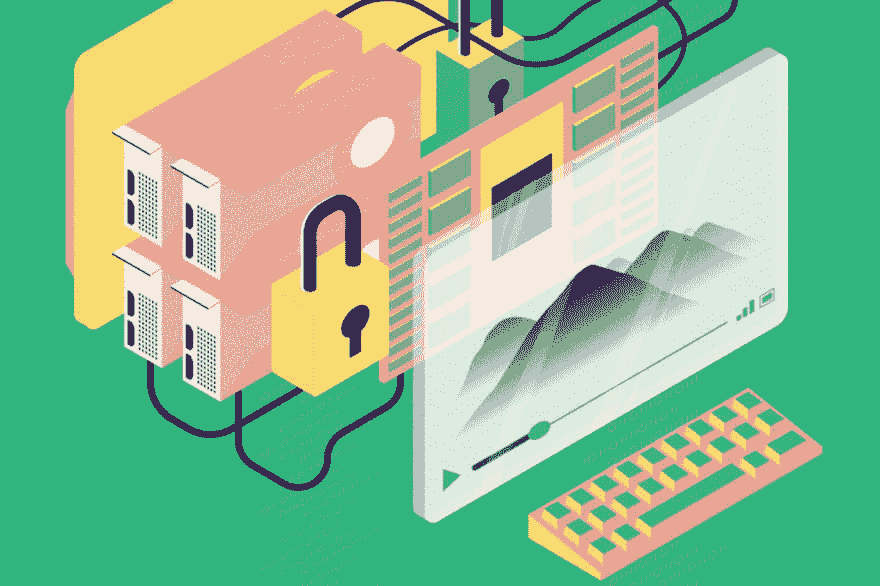

# 最有争议的 HTML5 扩展

> 原文：<https://dev.to/bnevilleoneill/the-most-controversial-html5-extension-4jcn>

[T2】](https://res.cloudinary.com/practicaldev/image/fetch/s--qG9uC98R--/c_limit%2Cf_auto%2Cfl_progressive%2Cq_auto%2Cw_880/https://cdn-images-1.medium.com/max/1024/1%2ANCQ_6Gvlyuu5v6pZtRTXcA.png)

加密媒体扩展(eme)是一个备受争议的，最近添加到 HTML5 规范中的扩展。它们旨在为在浏览器中播放的媒体提供数字版权管理(DRM)支持。

财力雄厚的大公司将从 eme 的实施和采用中获益。W3C 一推出 eme，电子前沿基金会(EFF)就带着一封公开信[退出了 W3C 集团。自由软件基金会(FSF)也呼吁 W3C 集团拒绝 EME 的提议。](https://www.eff.org/pages/objection-rechartering-w3c-eme-group)

另一方面，所有主流浏览器都推出了对 EME 规范的支持，并被网飞这样的内容提供商投入使用。

为什么 eme 是一个如此有争议的概念？要回答这个问题，我们需要挖掘技术背后的动机。

### 动机

当媒体(例如音乐或电影)被记录在模拟媒体(例如磁带)上时，对可以发生的共享量有一个固有的限制。拷贝磁带意味着质量下降，因此创建拷贝的拷贝会使原始内容基本上无法使用。这意味着艺术家可以安全地发布他们的作品，而不用太担心每个人都可以免费得到一份拷贝。

然后，我们转向内容的数字拷贝，这意味着可以轻松创建无损拷贝。这时，数字版权管理(DRM)软件的概念出现了。

DRM 允许出版商控制消费者如何查看他们的内容。有许多不同的 DRM 方案，但每一个都有相同的基本结构:发行商用密钥加密内容，发行商随后在有限的时间内将密钥交给用户。当然，我们遗漏了很多细节。暂时抓住基本思路就够了。

DRM 一直备受争议。自由软件基金会建议，由于 DRM 阻止你对你购买的内容做什么(例如，你不能任意复制它)，它“[创造了一个损坏的商品](https://www.defectivebydesign.org/what_is_drm_digital_restrictions_management)；它阻止你做没有它可能做的事情。”索尼 BMG 公司曾在未经用户许可的情况下在客户的电脑上安装了[rootkit，以实施数字版权管理，这当然于事无补。](https://en.wikipedia.org/wiki/Sony_BMG_copy_protection_rootkit_scandal)

到目前为止，我们讨论的大多数 DRM 技术都是在人们仍然购买 DVD/CD 并使用桌面软件在机器上消费内容的时代开发的。这两者本质上都是过去的行为。

我们通过网飞、Spotify、Pandora、Apple Music 等服务来消费电影和音乐。，通常通过网络。由于与内容合作伙伴的协议，网飞等人有义务用 DRM 提供他们的内容。此外，网络流媒体可能是网飞的一大应用。这使得在网络上实施 DRM 成为网飞等人要解决的一个极其重要的问题。

这就是 eme 发挥作用的地方。它们本质上是一种允许浏览器通过加密介质与 DRM 系统通信的技术。它们使得 DRM 软件能够在浏览器上工作，并将加密的内容传递给用户。这意味着网飞可以为你提供一部加密的受 DRM 保护的电影。

### 理工大

EMEs 背后的技术特别有趣，也是围绕该标准的争议的一部分。

比方说 *Felix* 是一项电影流媒体服务，它通过浏览器提供电影，并使用 eme 来保护其提供的内容。假设用户想要播放 Felix 的一些加密内容。事情是这样的:

*   浏览器将加载这些内容，意识到它是加密的，然后触发一些 Javascript 代码。
*   这个 Javascript 将获取加密的内容，并将其传递给一个叫做内容解密模块(CDM)的东西——稍后会详细介绍。
*   CDM 然后将触发一个请求，该请求将由 Felix 转发给*许可证服务器*。这是一个 Felix 控制的服务器，它决定是否允许特定用户播放特定内容。如果许可证服务器认为我们的用户可以观看该内容，它将向 CDM 发回该内容的解密密钥。
*   CDM 随后将解密内容，并开始为用户播放。

整个过程中最重要的部分是清洁发展机制。就其本质而言，CDM 必须是 Felix 信任的一段代码。如果不是，Felix 不能确定它会做它想要它做的事情。这意味着 CDM 必须与浏览器一起提供。有几个不同的 CDMs 提供商，包括谷歌的 Widevine 和 T2 的 Adobe Primetime。这两者都为 Felix 等内容提供商实施 DRM 提供了必要的加密支持。

### 论战

欧洲、中东和非洲之争的背后有多个故事。首先，像自由软件基金会这样的团体对 DRM 有一种固有的反对。他们认为，在网络上引入 DRM 将会极大地减少消费者随心所欲使用设备的自由。

此外，DRM 还防止对内容的合法修改，如给视频添加字幕。这意味着改善网络可访问性的合法软件将受到 eme 引入的不利影响。

> DRM 中没有对安全研究人员的保护:如果你篡改 DRM，你通常会被认为是一个做错事的人，即使你是为了研究目的而这么做的。

反对 DRM 的阵营已经存在了很长一段时间——eme 是他们反对 DRM 的另一个前线，鉴于 web 已经成为内容分发的主导形式，这一点尤为重要。这种反对是不可轻视的。网络中立运动的领导人之一 Tim Wu 出于这些原因反对 eme。[以太坊基金会](https://ethereum.org/)也公开反对将 EMEs 作为一种标准来实施。

### 内容解密模块

但是，围绕 CDMs，还有另一个角度来对抗 eme。目前，CDM 基本上是浏览器自带的闭源二进制 blobs。

这意味着 eme 导致在浏览器中引入闭源软件。由于浏览器构成了软件生态系统中如此重要的一部分，开源实现对于安全性、消费者保护等无疑是非常重要的。

此外，无法使用闭源 CDM 实施可能会导致浏览器领域缺乏竞争力。过去，围绕闭源编解码器及其在 Linux 中的位置有过类似的争论。然而，有争议的是，在传统的开放网络中，闭源软件的作用更加重要。

### 将会发生什么*对应该发生什么*

既然我们已经考虑了辩论的状况，我将步入竞技场。这里有两个重要的问题:什么样的*会发生*和什么样的*会发生*。前者更容易回答；后者更主观。

有巨大的经济激励指向 EME 的采用。正如我提到的，资金雄厚的演员致力于使他们成为网络的核心部分。此外，从技术角度来看，eme 对大多数互联网用户来说都非常有效，这使得内容提供商没有什么动力拒绝使用 eme。

正如 W3C 对 eme 的肯定所表明的那样，这种趋势有利于该标准，并将持续相当长的一段时间。为了抵制这种运动，用户必须确信 eme 的危害足够大，从而选择不使用它们的提供商。我没有看到任何证据表明目前普通用户的情况是这样的。

> 这意味着我相信网络正朝着 DRM 更大的扩散发展，而不是更小。

现在，来看一个更难的问题:什么样的*应该发生。我有一些明确的信念，例如，安全研究人员应该被免除与违反 DRM 相关的处罚；应该有社区可以依赖的 CDMs 的开源实现，等等。*

在其他问题上，我不太确定。对我来说，内容提供商应该能够保护他们花费数百万美元制作的内容。但是，这其中的含义(网络可访问性降低，消费者权利减少)也让我感到害怕。此外，我确信在音频/视频媒体元素上引入 DRM 将逐渐导致更多内容上的 DRM。

同时持有这些信念是一种逃避，因为目前似乎没有一个解决方案能让所有人都满意。也许当聪明人解决这个问题时，事情会有所改变。

### Plug: LogRocket，一款用于网络应用的 DVR

[T2】](http://logrocket.com)

LogRocket 是一个前端日志工具，可以让你回放问题，就像它们发生在你自己的浏览器中一样。LogRocket 不需要猜测错误发生的原因，也不需要向用户询问截图和日志转储，而是让您重放会话以快速了解哪里出错了。它可以与任何应用程序完美配合，不管是什么框架，并且有插件可以记录来自 Redux、Vuex 和@ngrx/store 的额外上下文。

除了记录 Redux 操作和状态，LogRocket 还记录控制台日志、JavaScript 错误、堆栈跟踪、带有头+正文的网络请求/响应、浏览器元数据和自定义日志。它还使用 DOM 来记录页面上的 HTML 和 CSS，甚至为最复杂的单页面应用程序重新创建像素级完美视频。

* * *