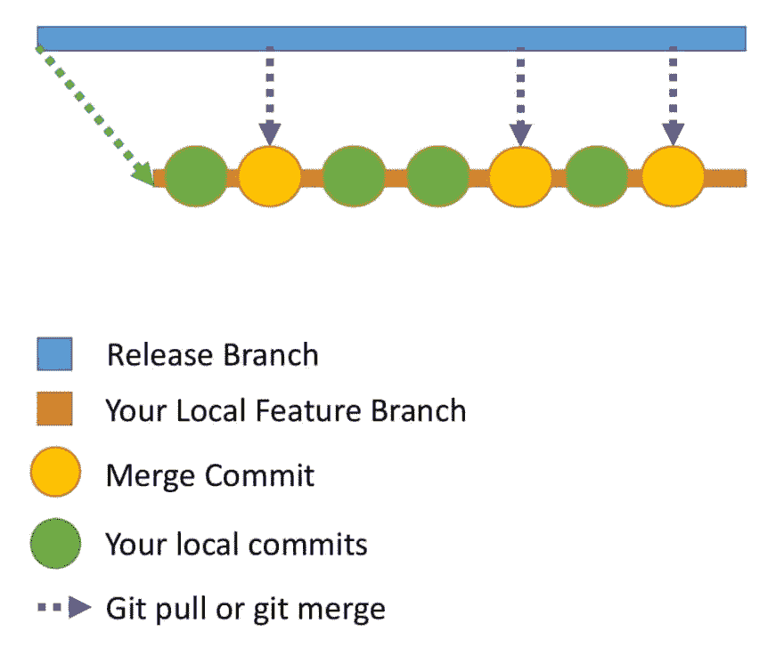
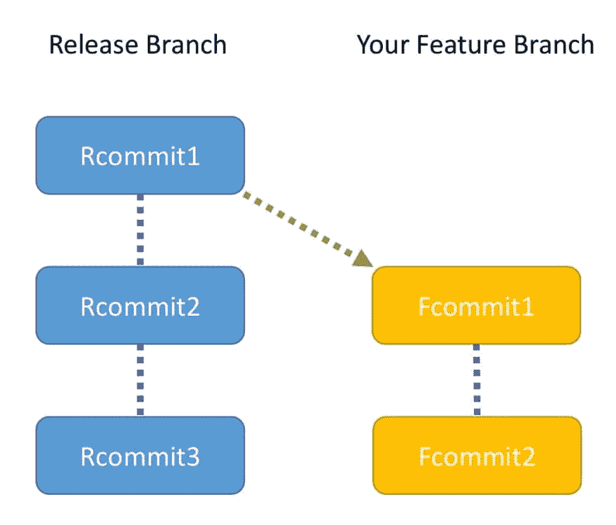
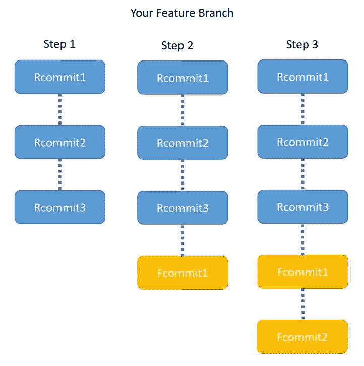

# Git Rebase 的奥秘

> 原文：<https://dev.to/adityasridhar/the-mystery-of-git-rebase-2k2h>

**本帖原载于[medium.freecodecamp.org](https://medium.freecodecamp.org/how-to-become-a-git-expert-e7c38bf54826)T3】**

我在提交中犯了一个错误，我该如何修复它？

我的提交历史一团糟，我如何让它变得更整洁？

如果你曾经有过以上的疑问，那么这篇文章就适合你。

如果你不知道 Git 基础知识，请点击这里查看我的关于 Git 基础知识的博客。为了充分利用本文，您有必要了解 Git 的基础知识。

首先这篇文章将解释关于 git 修正，然后它将解释关于 git rebase😃

# 我犯了一个错误。我该怎么办？

<figure>

[T2】](https://res.cloudinary.com/practicaldev/image/fetch/s--2OZ88SVt--/c_limit%2Cf_auto%2Cfl_progressive%2Cq_auto%2Cw_880/https://thepracticaldev.s3.amazonaws.com/i/n99krmiy8jjaptjocp9q.jpg)

<figcaption>"broken ceramic plate on floor" by [chuttersnap](https://unsplash.com/@chuttersnap) on [Unsplash](https://unsplash.com)</figcaption>

</figure>

## 场景 1

假设您提交了一堆文件，并意识到您输入的提交消息实际上并不清楚。现在您想要更改提交消息。为此，您可以使用`git commit --amend`

```
git commit --amend -m "New commit message" 
```

## 场景二

假设您想要提交六个文件，但是由于失误，您最终只提交了五个文件。您可能认为可以创建一个新的提交，并将第 6 个文件添加到该提交中。

这种方法没有错。但是，为了保持一个整洁的提交历史，如果您能够以某种方式将这个文件添加到您以前的提交本身中，不是更好吗？这也可以通过`git commit --amend`完成:

```
git add file6
git commit --amend --no-edit 
```

`--no-edit`表示提交消息不变。

## 场景三

每当您在 Git 中提交时，提交都有一个作者姓名和作者电子邮件。通常，当您第一次设置 Git 时，您会设置作者姓名和电子邮件。您不需要担心每次提交的作者细节。

也就是说，对于一个特定的项目，你可能想要使用不同的电子邮件 id。您需要使用命令:
为该项目配置电子邮件 id

```
git config user.email "your email id" 
```

假设您忘记了配置电子邮件，并且已经完成了第一次提交。`Amend`也可以用来改变你之前提交的作者。可以使用以下命令更改提交的作者:

```
git commit --amend --author "Author Name <Author Email>" 
```

## **点到即止**

仅在您的本地存储库中使用`amend`命令**。对远程存储库使用`amend`会造成很多混乱。**

 **# 我的提交历史一塌糊涂。我该怎么处理？

假设您正在编写一段代码。您知道代码大约需要 10 天才能完成。在这十天内，其他开发人员也将向远程存储库提交代码。

保持您的本地存储库代码与远程存储库中的代码同步是一个很好的做法。这避免了以后当您提出拉请求时的大量合并冲突。因此，您决定每两天从远程存储库中提取一次变更。

每次您将代码从远程存储库提取到本地存储库时，都会在本地存储库中创建一个新的合并提交。这意味着您的本地提交历史将会有很多合并提交，这可能会让审查者感到困惑。

<figure>

[T2】](https://res.cloudinary.com/practicaldev/image/fetch/s--F5S1lZPh--/c_limit%2Cf_auto%2Cfl_progressive%2Cq_auto%2Cw_880/https://thepracticaldev.s3.amazonaws.com/i/yswzlv0jtew96eo8dqca.jpg)

<figcaption>Here is how the commit history would look in your local repository.</figcaption>

</figure>

## 如何让提交历史看起来更整洁？

这就是 **rebase** 来拯救的地方。

## 什么是 rebasing？

我通过一个例子来解释一下。

<figure>

[T2】](https://res.cloudinary.com/practicaldev/image/fetch/s--CJLtCjhz--/c_limit%2Cf_auto%2Cfl_progressive%2Cq_auto%2Cw_880/https://thepracticaldev.s3.amazonaws.com/i/57ffuenbtxj0b3h84k8q.jpg)

<figcaption>This diagram shows the commits in the release branch and your feature branch</figcaption>

</figure>

1.  发布分支有三个提交:Rcommit1、Rcommit2 和 Rcommit3。
2.  您从发布分支创建了您的特性分支，而它只有一个提交，即 Rcommit1。
3.  您已经向功能分支添加了两个提交。它们是 Fcommit1 和 Fcommit2。
4.  您的目标是将发布分支中的提交放到您的特性分支中。
5.  您将使用 rebase 来完成这项工作。
6.  设发布分支的名称为**发布**，特征分支的名称为**特征**。
7.  可以使用以下命令进行重置:

```
git checkout feature
git rebase release 
```

## 重置基础

在重新构建基础时，您的目标是确保特性分支从发布分支获得最新的代码。

Rebasing 尝试逐个添加每个提交，并检查冲突。这听起来令人困惑吗？

让我借助图表来解释一下。

这显示了 rebasing 在内部实际做了什么:

[T2】](https://res.cloudinary.com/practicaldev/image/fetch/s--pNxsSy-s--/c_limit%2Cf_auto%2Cfl_progressive%2Cq_auto%2Cw_880/https://thepracticaldev.s3.amazonaws.com/i/bjyz80xr9597lwv3jjzc.jpg)

## 第一步

1.  当您运行这个命令时，Feature 分支被指向 Release 分支的头。
2.  现在特性分支有三个提交:Rcommit1、Rcommit2 和 Rcommit3。
3.  您可能想知道 Fcommit1 和 Fcommit2 发生了什么。
4.  提交仍然存在，并将在下面的步骤中使用。

## 第二步

1.  现在 Git 尝试将 Fcommit1 添加到特性分支。
2.  如果没有冲突，Fcommit1 将添加到 Rcommit3 之后
3.  如果有冲突，Git 会通知您，您必须手动解决冲突。冲突解决后，使用以下命令继续重置基础

```
git add fixedfile
git rebase --continue 
```

## 第三步

1.  一旦添加了 Fcommit1，Git 将尝试添加 Fcommit2。
2.  同样，如果没有冲突，Fcommit2 将添加到 Fcommit1 之后，并且重置基础成功。
3.  如果有冲突，Git 会通知您，您必须手动解决它。解决冲突后，使用步骤 2 中提到的相同命令
4.  在整个重新构建基础完成之后，您会注意到特征分支有 Rcommit1、Rcommit2、Rcommit3、Fcommit1 和 Fcommit2。

## 分注

1.  在 Git 中，Rebase 和 Merge 都很有用。一个不比另一个好。
2.  在合并的情况下，您将有一个合并提交。在重定基础的情况下，没有像合并提交那样的额外提交。
3.  一个最佳实践是在不同点使用命令。当您使用来自远程存储库的最新代码更新本地代码存储库时，请使用 rebase。在处理“拉”请求时，使用“合并”将特征分支与“发布”或“主”分支合并。
4.  使用 Rebase 会改变提交历史(使它更整洁)。但话虽如此，更改提交历史有其风险。因此，确保永远不要在远程存储库中的代码上使用 rebase。始终只使用 rebase 来改变本地回购代码的提交历史。
5.  如果对一个远程存储库进行 rebase，会造成很多混乱，因为其他开发人员不会识别新的历史。
6.  此外，如果在远程存储库上进行 rebase，当其他开发人员试图从远程存储库获取最新代码时，可能会产生问题。所以我再重复一遍，总是只对本地存储库使用 rebase😃

# 恭喜恭喜😃

在这篇文章中，你已经了解了:

*   修改提交
*   重定…的基准

这两个都是非常有用的概念。去探索 Git 的世界，了解更多信息。

### 欢迎在 [LinkedIn](https://www.linkedin.com/in/aditya1811/) 与我联系，或在 [twitter](https://twitter.com/adityasridhar18) 关注我。

### 如果你喜欢这个帖子，你可以去我的网站【https://adityasridhar.com T2】查看其他类似的帖子**