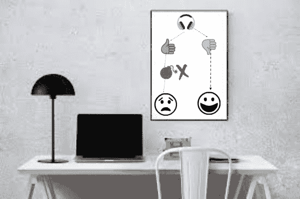

# 程序员的新黄金法则

> 原文：<https://dev.to/bengreenberg/the-new-golden-rule-of-programmers-32p3>

[T2】](https://res.cloudinary.com/practicaldev/image/fetch/s--rt6j_tZ---/c_limit%2Cf_auto%2Cfl_progressive%2Cq_auto%2Cw_880/https://thepracticaldev.s3.amazonaws.com/i/jon740l0glyi5ndjvp7w.jpg)

242 年前，美国签署了《独立宣言》,随之而来的是一种新的治理模式。这个政府经历了许多高潮和低谷，它继续发展和适应。然而，贯穿始终的一个基本理念仍然是一个根本的基础，即人们有权对自己的生活行使自主权，可以以我们理解意义的各种方式构建对他们来说有意义的生活。

美国独立 242 年后，现在是时候让全世界的程序员宣布我们的独立，并为我们的行业制定一条新的黄金法则了。就像殖民者从大洋彼岸的压迫性统治当局那里寻求自由一样，世界上的程序员也从降低我们的生产力、破坏我们的思维过程以及总的来说扰乱工作流程的不必要的干扰中寻求自由。

是的，我说的是困扰我们社区的最阴险的问题:

**耳机中断**

我们都知道。我们都经历过。你进入状态了。你的耳机将声音输入你的耳朵，激发并保持你的注意力，无论是 NPR 播客、金属、爵士、乡村音乐，还是任何你喜欢的音乐。然后你感觉到了。想要引起你注意的人的眼睛在你的后脑勺烧了一个洞。有人说，“打扰一下？、”“请问？”开始渗入你的意识。然后升级，接下来是轻拍肩膀。如果这些都没有引起反应，你的耳机就被摘下来了。

你转身面对那个如此渴望引起你注意的人。它一定非常重要。

*   “只是想让你看看外面的雨云。看来今天要下大雨了！”
*   “我能从休息室给你拿点东西吗？我要去喝杯咖啡。”
*   "周末有什么计划吗？"
*   “你屏幕上的是英语吗？好像是《黑客帝国》里的！”
*   “你知道{随机同事}马上要去度假了吗？多幸运啊！”

这些都是耳机中断领域的真实例子。

所以，朋友们，在这个烧烤、挥舞旗帜、陶醉于美国体验的日子里(向我来自其他国家的朋友们道歉)，让我们为全球程序员宣布一条新的黄金法则。

如果耳机是开着的，而且不是紧急情况，它可以等。

对于我们所有的非编程同事，我们肯定地说，我们喜欢你，我们喜欢与你交谈，我们喜欢喝咖啡休息，一起度过美好时光。耳机根本不是我们不喜欢你的标志。相反，它们是一种必要的工具，让我们能够专注于我们这个现代时代的开放式平面办公室。

如果我们愿意，它不仅仅是一个梦。我们可以让这成为现实。

戴耳机？它可以等待。