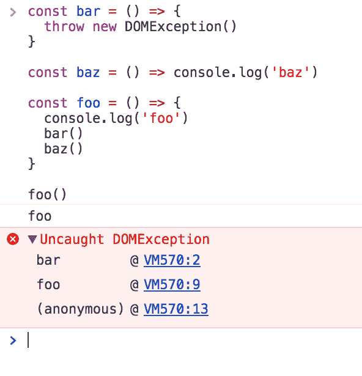
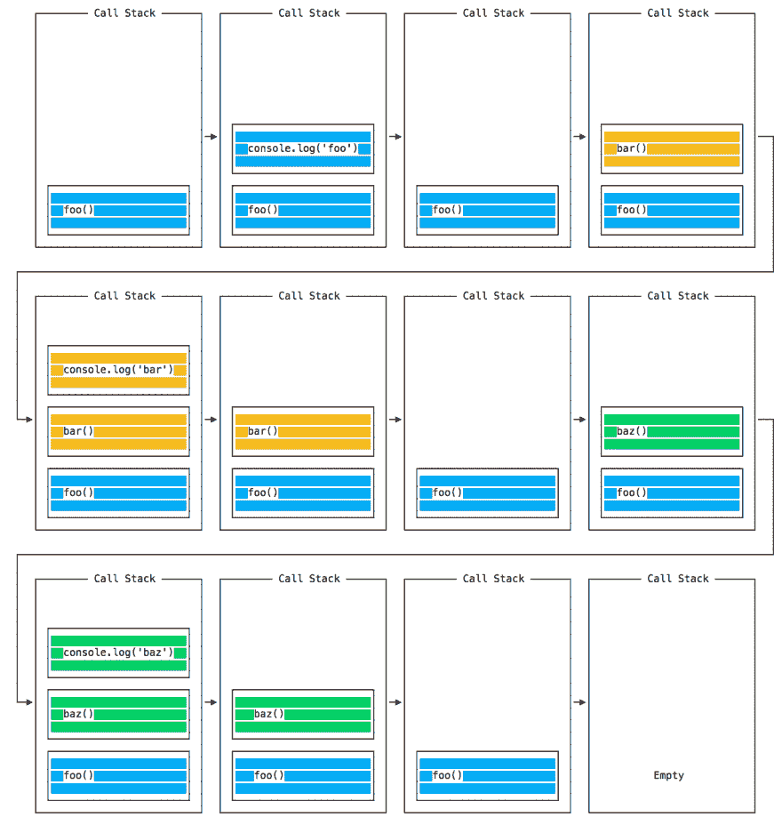
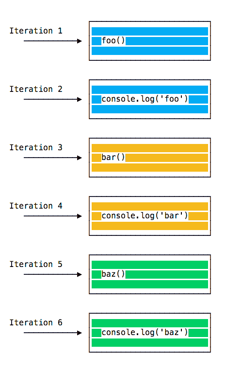
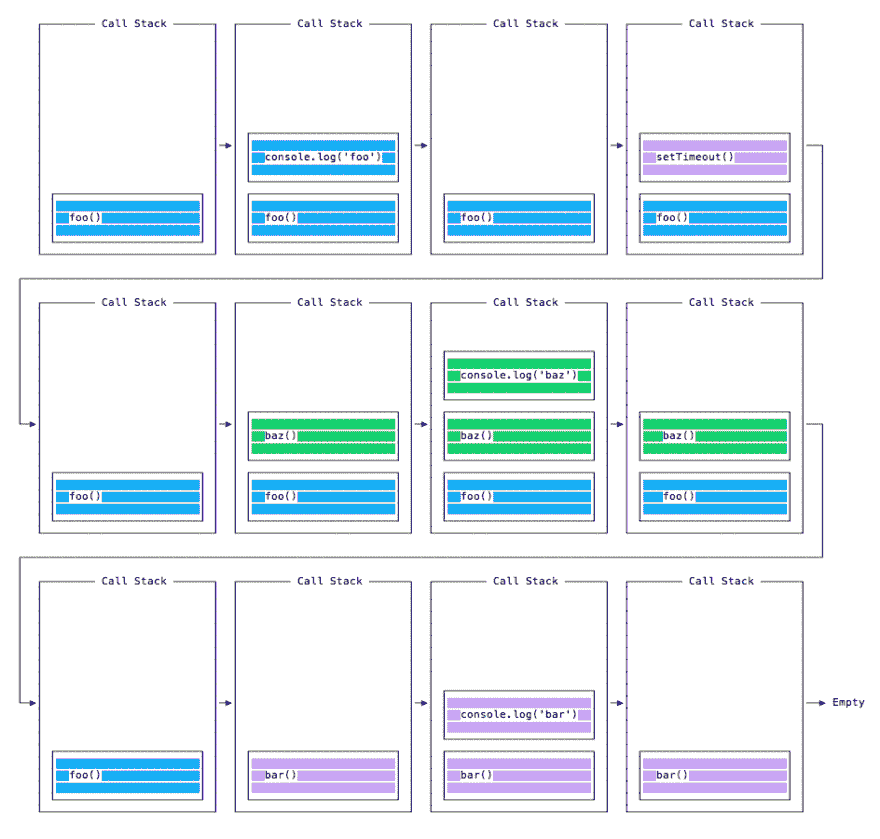
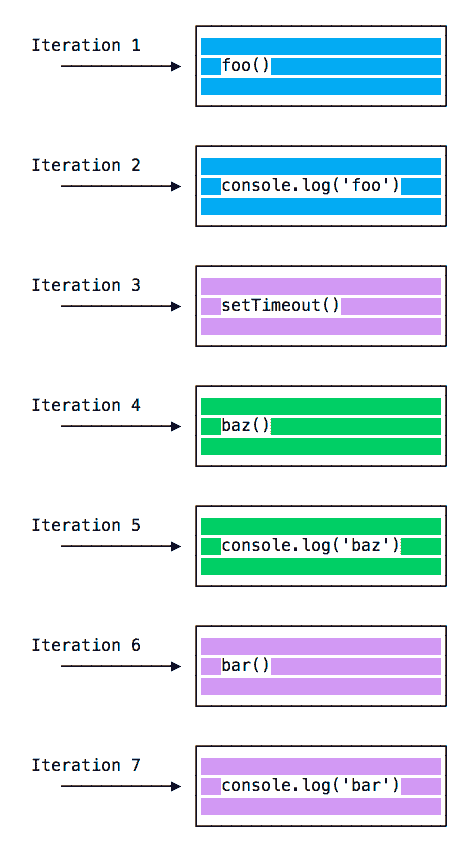

# Node.js 事件循环

> 原文：<https://dev.to/flaviocopes/the-nodejs-event-loop-3c35>

## 简介

**事件循环**是理解 Node 最重要的方面之一。

为什么这如此重要？因为它解释了 Node 如何能够异步并具有非阻塞 I/O，所以它基本上解释了 Node 的“杀手级应用程序”,它的成功之处就在于此。

Node.js JavaScript 代码在单线程上运行。一次只能发生一件事。

这是一个实际上非常有用的限制，因为它大大简化了您的编程方式，而不用担心并发问题。

你只需要注意如何编写代码，避免任何可能阻塞线程的事情，比如同步网络调用或无限循环。

一般来说，在大多数浏览器中，每个浏览器选项卡都有一个事件循环，以使每个进程都是独立的，并避免网页出现无限循环或繁重的处理来阻塞整个浏览器。

该环境管理多个并发事件循环，例如处理 API 调用。Web Workers 也在他们自己的事件循环中运行。

你主要需要关心的是*你的代码*将在一个单一的事件循环上运行，并在编写代码时牢记这一点以避免阻塞它。

## 阻塞事件循环

任何花费太长时间将控制返回到事件循环的 JavaScript 代码都将阻塞页面中任何 JavaScript 代码的执行，甚至阻塞 UI 线程，并且用户不能四处点击、滚动页面等等。

JavaScript 中几乎所有的 I/O 原语都是非阻塞的。网络请求、文件系统操作等等。阻塞是个例外，这就是为什么 JavaScript 如此依赖回调，最近又依赖于[承诺](https://flaviocopes.com/javascript-promises/)和[异步/等待](https://flaviocopes.com/javascript-async-await/)。

## 调用堆栈

调用堆栈是一个 LIFO 队列(后进先出)。

事件循环不断检查**调用堆栈**以查看是否有任何需要运行的函数。

这样做的时候，它会将找到的任何函数调用添加到调用堆栈中，并按顺序执行每个函数调用。

您知道在调试器或浏览器控制台中您可能熟悉的错误堆栈跟踪吗？浏览器在调用堆栈中查找函数名，以通知您哪个函数发起了当前调用:

[T2】](https://res.cloudinary.com/practicaldev/image/fetch/s--O-Kg1crv--/c_limit%2Cf_auto%2Cfl_progressive%2Cq_auto%2Cw_880/https://thepracticaldev.s3.amazonaws.com/i/499di1lk0vmkdqwo69bb.png)

## 简单的事件循环解释

我们来举个例子:

```
const bar = () => console.log('bar')

const baz = () => console.log('baz')

const foo = () => {
  console.log('foo')
  bar()
  baz()
}

foo() 
```

Enter fullscreen mode Exit fullscreen mode

这段代码打印

```
foo
bar
baz 
```

Enter fullscreen mode Exit fullscreen mode

不出所料。

当这段代码运行时，第一个`foo()`被调用。在`foo()`里面我们先叫`bar()`，然后我们叫`baz()`。

此时，调用堆栈如下所示:

[T2】](https://res.cloudinary.com/practicaldev/image/fetch/s--u5udXH6h--/c_limit%2Cf_auto%2Cfl_progressive%2Cq_auto%2Cw_880/https://thepracticaldev.s3.amazonaws.com/i/725hl9terb81ktkmtce3.png)

每次迭代中的事件循环都会查看调用堆栈中是否有内容，并执行它:

[T2】](https://res.cloudinary.com/practicaldev/image/fetch/s--EW1i_QTu--/c_limit%2Cf_auto%2Cfl_progressive%2Cq_auto%2Cw_880/https://thepracticaldev.s3.amazonaws.com/i/1dij3nmczd348aamh9lo.png)

直到调用堆栈为空。

## 排队功能执行

上面的例子看起来很正常，没有什么特别的:JavaScript 找到要执行的东西，并按顺序运行它们。

让我们看看如何推迟一个函数直到堆栈清空。

`setTimeout(() => {}), 0)`的用例是调用一个函数，但是在代码中每执行一个函数就执行一次。

举这个例子:

```
const bar = () => console.log('bar')

const baz = () => console.log('baz')

const foo = () => {
  console.log('foo')
  setTimeout(bar, 0)
  baz()
}

foo() 
```

Enter fullscreen mode Exit fullscreen mode

这段代码打印出来，也许令人惊讶:

```
foo
baz
bar 
```

Enter fullscreen mode Exit fullscreen mode

当这段代码运行时，首先调用 foo()。在 foo()内部，我们首先调用 setTimeout，将`bar`作为参数传递，我们指示它尽可能快地立即运行，将 0 作为计时器传递。然后我们调用 baz()。

此时，调用堆栈如下所示:

[T2】](https://res.cloudinary.com/practicaldev/image/fetch/s--PFFmxNYS--/c_limit%2Cf_auto%2Cfl_progressive%2Cq_auto%2Cw_880/https://thepracticaldev.s3.amazonaws.com/i/cp4ur885ophtvz39g9re.png)

下面是我们程序中所有函数的执行顺序:

[T2】](https://res.cloudinary.com/practicaldev/image/fetch/s--FhZeIvlC--/c_limit%2Cf_auto%2Cfl_progressive%2Cq_auto%2Cw_880/https://thepracticaldev.s3.amazonaws.com/i/b1ccu4ynsu3ru4i1wk8b.png)

为什么会这样？

## 消息队列

当调用 setTimeout()时，浏览器或 Node.js 启动[定时器](https://flaviocopes.com/timer-api/)。一旦定时器到期，在这种情况下，当我们将超时设置为 0 时，回调函数将被放入**消息队列**。

消息队列也是用户发起的事件(如点击或键盘事件，或[获取](https://flaviocopes.com/fetch-api/)响应)在代码有机会对其做出反应之前进行排队的地方。或者还有像`onLoad`这样的 [DOM](https://flaviocopes.com/dom/) 事件。

**循环优先于调用栈，它首先处理它在调用栈中找到的所有东西，一旦那里什么都没有，它就去拿事件队列中的东西。**

我们不用等类似`setTimeout`、fetch 或者其他的东西来做自己的工作，因为它们是浏览器提供的，它们活在自己的线程上。例如，如果您将`setTimeout`超时设置为 2 秒，您不必等待 2 秒——等待会在其他地方发生。

## ES6 作业队列

[ECMAScript 2015](https://flaviocopes.com/ecmascript/) 引入了作业队列的概念，由 Promises 使用(也在 ES6/ES2015 中引入)。这是一种尽快执行异步函数结果的方法，而不是放在调用堆栈的末尾。

在当前函数结束前解析的承诺将在当前函数结束后立即执行。

我觉得这很像在游乐园坐过山车:消息队列让你和其他人一起排队，而工作队列是一张快速通行证，让你在完成前一次后可以乘坐另一次。

示例:

```
const bar = () => console.log('bar')

const baz = () => console.log('baz')

const foo = () => {
  console.log('foo')
  setTimeout(bar, 0)
  new Promise((resolve, reject) =>
    resolve('should be right after baz, before bar')
  ).then(resolve => console.log(resolve))
  baz()
}

foo() 
```

Enter fullscreen mode Exit fullscreen mode

这张照片

```
foo
baz
should be right after foo, before bar
bar 
```

Enter fullscreen mode Exit fullscreen mode

这是 promises(和 Async/await，它是建立在 Promises 之上的)和通过`setTimeout()`或其他平台 API 的普通老式异步函数之间的一个巨大差异。