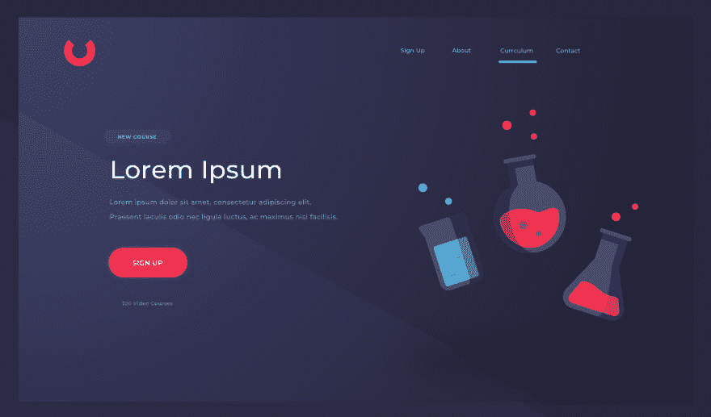
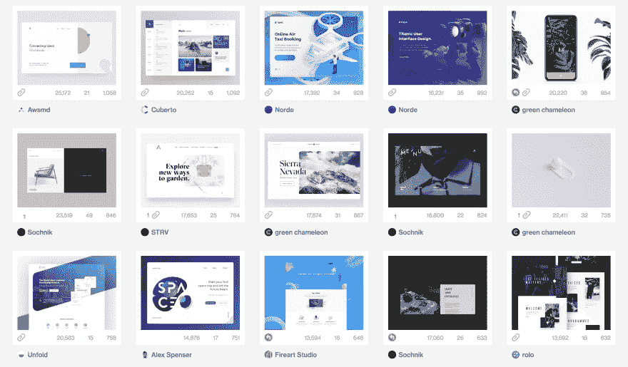
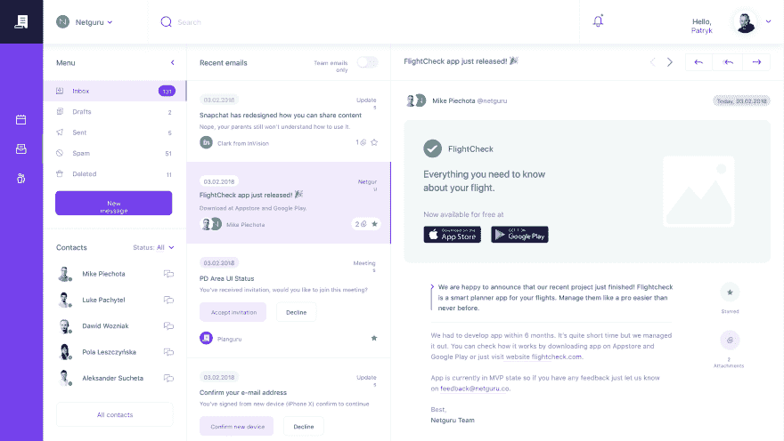
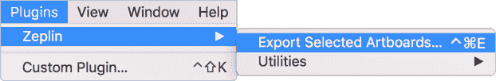
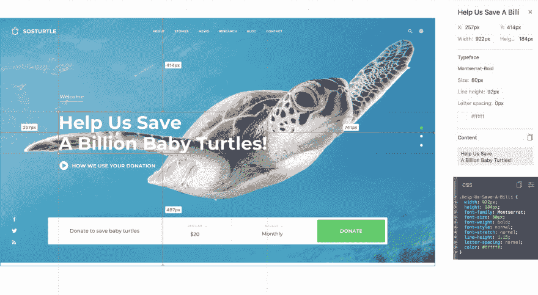
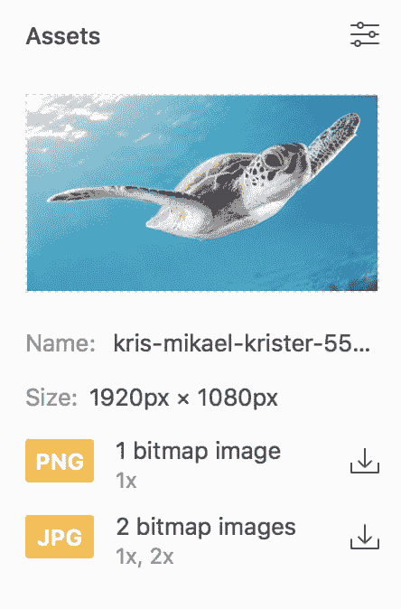
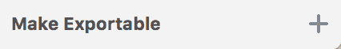

# 让每个人都想雇佣你的投资组合黑客

> 原文：<https://dev.to/microverse/the-portfolio-hack-that-will-make-everyone-want-to-hire-you-1og8>

 *一个漂亮的草图设计，可以让你的作品脱颖而出*

如果你是一名软件开发人员，正在申请你的第一份工作，拥有一份出色的投资组合应该是你的首要任务之一。

尽管你的简历是绝对重要的，也是雇主首先要看的，但你的作品集将是你脱颖而出的秘密武器，展示你参与过的项目的复杂性。

然而，即使你建造了一些真正复杂的项目，如果你不能以一种会引起雇主注意的方式展示出来，你所有的努力都将是徒劳的。

简单来说，**如果你的投资组合不好看，你在雇主眼里就不会好看。**

我知道这一点，因为我帮助来自世界各地的人们成为 web 开发人员，并获得他们的第一份远程工作。每天，我都看到拥有强大的投资组合对他们获得第一份工作的机会有着巨大的影响。

如果你想找一份前端或全栈 web 开发人员的工作，这一点尤其重要。你的 HTML 和 CSS 技能是重要的，但你最终应该建立伟大的用户界面/UX。

在实际工作中，你的团队中很可能会有一名设计师负责设计 UI/UX。然而，你需要展示你能根据设计师的规格制造出漂亮的产品。

如果没有设计师帮你设计作品，你会怎么做？

这是不再那么秘密的了😉我们要求学生使用的黑客工具。

## 诀窍:使用别人的设计来构建一些完全规范的项目

如果你想让你的作品脱颖而出，建立一些漂亮的前端项目，传达你对细节的关注和对伟大的 UI/UX 的热爱。

你可以复制任何你喜欢的网站(比如 Pinterest)。然而，如果你做了一些没有多少人知道的漂亮的东西，会给人留下更好的印象。

一种方法是访问 dribbble.com，找到一些你可以建立的概念网站。许多设计师花时间重新想象某些网站如果从零开始构建会是什么样子。然而，这些设计经常得不到实施。这就是你进来的地方:只需选择一个并从头开始构建它。[这里有几个例子](https://dribbble.com/search?q=concept+website)——如果你遵循这个想法，记得链接到原设计者。

 *在滴滴上找到的几个概念网站*

然而，这种方法的问题是**这些设计中的大部分都有视觉资产(例如，背景图像),您不能将其导出以包含在您的实现中**。此外，作为一名初级开发人员**，你可能还没有注意到设计师考虑的所有小细节**(比如边距、填充、字体大小等等)。

这里有一个替代方法，可以让你的作品集看起来和原始设计一样令人惊叹。找到免费的草图模板，将它们导出到 Zeplin，并根据详细的规格进行构建。

让我们一步一步地分析这种方法:

### 第一步:下载免费草图模板

草图是当今产品设计师最常用的设计工具之一。只要去谷歌搜索*免费素描模板网站。*打开其中一些结果，找到您想要构建的网站设计。[这里的](https://freebiesbug.com/sketch-freebies/showtrackr/)是我用这种方法发现的一个很好的例子。

现在[下载](https://www.sketchapp.com/get/)并安装 Sketch(有 30 天的免费试用)并用它打开你在上一步下载的草图模板。

确保设计是完整的，并且是你想要建造的东西。一旦你找到一个你喜欢的设计，进入下一步。

### 第二步:将设计导出到 Zeplin

Zeplin 是另一个神奇的工具，旨在帮助设计人员和开发人员更有效地相互协作。

设计师将他们的设计上传到 Zeplin，Zeplin 显示所有的字体大小、边距和填充，这样开发人员就可以在没有任何设计知识的情况下轻松获得这些细节。Zeplin 甚至为您生成了许多组件的 CSS 代码。最后，它还允许您从原始草图文件中导出所有图像，以便您可以在构建网站时轻松使用它们。

去报名参加泽普林。您可以使用他们对 1 个项目有效的免费帐户(这就是您所需要的)。现在重启 Sketch，进入**插件**菜单。如果你看到一个叫做**泽普林**的选项，你就可以开始了。如果您没有看到该选项，请按照这些说明[手动安装插件。](https://support.zeplin.io/sketch-integration/installing-sketch-plugin)

一旦 Zeplin 插件安装在 Sketch 中，进入插件> Zeplin 并点击**导出所选画板**。您下载的草图设计可能有多个画板，每个画板对应于应用程序/网站的不同视图。

 *如何用草图将设计导出到泽普林*

按照说明，将您想要实现的所有画板上传到 Zeplin。

### 第三步:根据详细的规格建立设计

在 Zeplin 中打开你最近上传的设计，注意当你悬停在设计的每个元素上时，你得到了多少细节。由于设计是使用 Sketch 中的图层组织的，Zeplin 可以区分每个元素，并向您显示诸如字体大小和元素之间的间距等规格。

 *一个导出到 Zeplin 的草图设计，在这里可以看到所有的规格甚至生成的 CSS 代码*

如果你想导出一个图像，点击 Zeplin 中的图像，在右边的菜单中寻找下载 PNG 图像的选项。

 *如何从泽普林*下载视觉资产

如果您没有看到该选项，请返回到 Sketch，单击您想要导出的图像，然后单击显示 **Make Exportable** *的选项。*之后，只需将画板重新上传到 Zeplin，然后重试。

草图中的  *选项使图像可在泽普林*中导出

最后，只要使用所有这些详细的规格和高质量的资产来建立网站。记住，伟大的用户界面是由数百个微小的细节组成的。尽管您可能无法单独欣赏这些细节，但使用 Zeplin 的规范仔细实现每一个细节，您将会看到最终结果看起来比您以前构建的任何东西都更漂亮。

## 添加点睛之笔

遵循这种方法不仅能帮助你拥有一份吸引潜在雇主注意力的优秀投资组合。它还会帮助你欣赏设计师工作背后的巨大努力，* *它会让你更好地与团队中的设计师一起工作。* *这本身也是一次很好的学习经历，雇主会很看重这一点。

你可以按照同样的方法找到现有的投资组合设计，以建立你的实际投资组合页面。你不需要从头开始设计你的作品集，让它独一无二，你只需要里面的内容真实可信。

记得把你之前所有的项目都加到你的作品集里，甚至是后端的。对于这些，试着用一些酷的字体在纯色上显示项目的标题，或者只是项目 UI 的一小部分。这将使你的投资组合设计保持一致。

每个项目都应该列出所使用的技术，甚至一个小的描述。更重要的是，你应该链接到这些项目的实时版本(这是你的新前端项目将会大放异彩的地方)和包含你的项目代码的 GitHub repos。

最后，不要忘记附上您的联系信息、您的 GitHub 个人资料的链接，以及将使您的作品集与众不同的其他东西的列表(例如，开源贡献、您撰写的文章以及任何其他关于您的独特之处)。

## 包装完毕

建立一个引人注目的投资组合是一个非常强大的技巧，但是不要忘记你最终将不得不通过技术和行为面试，以显示你可以完成工作并得到这份工作。

在 Microverse，我们要求我们的学生在我们的培训项目中花将近 180 个小时来研究编码结构和算法，并为面试做准备。一定要为下一步做好准备。

如果你对这篇文章中解释的投资组合方法或者找工作有任何问题，请随时在 Twitter 上关注我，问我任何问题。