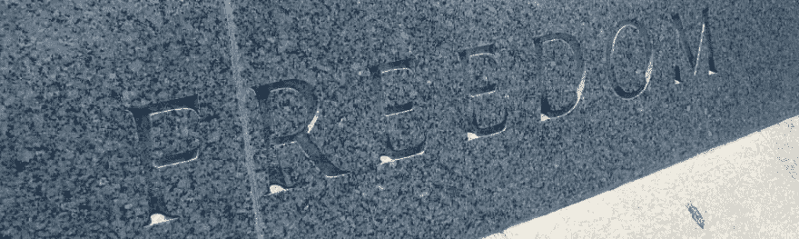

# 自由和开源软件的问题

> 原文：<https://dev.to/plainprogrammer/the-problem-with-free-open-source-software-fo4>

 

<figcaption>[【自由】](https://www.flickr.com/photos/nolanus/6812409085/in/photolist-bnZnT4-7NGTnv-5Vo6MT-73uXv-33GuaA-aWMPDp-9zxhTP-qwRFHX-4n5Lux-D5m1-geAjvM-2tHd8Z-aptaHZ-4nGMEH-7mhj7t-d7ArX3-7xXuE6-92zW2-eqcQt-8fVCnt-axoGj5-r17PuT-9Gp4WH-9gGeF8-5fUmnN-78Hr8W-9BX9Gq-o5ntva-8F7XDx-8fCPTt-2qc2UL-8F7YX4-5882mE-9RjiJk-aFMghP-auXmba-e5JnF6-p1yraV-ciWbyN-ai3x3Q-6H2hE-61gTgE-gAAfTi-e5qbYs-nN2qtS-qUY83b-ooAVA8-JxKyuk-5ex3uR-auXmqD)作者[塞巴斯蒂安·福什](https://www.flickr.com/photos/nolanus/ "Go to Sebastian Fuss's photostream") — [版权所有](https://creativecommons.org/licenses/by-sa/2.0/)</figcaption>

早在 21 世纪初，我就开始讨论自由和开源软件的相对优点和问题。讨论的焦点之一是自由软件所定义的第一种自由:

> 出于任何目的，按照自己的意愿运行程序的自由

同样的自由也在[开源定义](https://opensource.org/osd)的第五条中被确认。讨论的重点是自由和开放源码软件的道德地位，因为它与专利软件有关。我的对手提出，任何非自由或开源的软件在道德上都是邪恶的，而我则捍卫创作者决定其软件使用范围的权利。我仍然袖手旁观我的立场，不会翻新它在这里。任何软件开发者都有权定义他们的软件如何被使用以及被谁使用。但是，我也相信自由和开放源码软件在很多情况下都比私有软件优越。 ***那些理由中最重要的是自由。***

#### 自由不自由

自由是有后果的。采取行动就必须接受这种行动的后果。有时候，这些结果不是我们喜欢的，而其他时候，我们无法控制这些结果。当后果变得如此令人不快，以至于我们认为问题出在自由本身时，麻烦就来了。这是一个总是潜伏在我们视线之外的陷阱，诱惑我们为了舒适而限制自由。但是，事实是，为了获得舒适，我们必须完全放弃自由。

#### 否认自由

今天，我看到了一条关于一个我从未听说过的项目的推文，这个项目做了一些他们有权做的事情，但他们完全不知道其全部后果:

> Lerna 是一个管理多个包的 JavaScript 项目的流行工具，它在麻省理工学院的许可证中增加了一个条款，阻止各种公司使用未来的版本:[https://t.co/ikypwrT84G](https://t.co/ikypwrT84G)——你对这种善意的道德立场有什么看法？pic.twitter.com/GF1PGBpEcP
> 
> —JavaScript Daily(@ JavaScript Daily)[2018 年 8 月 29 日](https://twitter.com/JavaScriptDaily/status/1034842426861645824?ref_src=twsrc%5Etfw)

Lerna 项目最初是在最宽松的开源许可下被许可的:麻省理工学院许可(T2)。但是，他们决定增加一个附加条款:

> 由于以下实体或其任何子公司与美国移民和海关执法局(“ICE”)合作，因此不得向其授予以下许可证:

具体的公司名单并不重要，任何关于美国移民和海关执法政策的政治观点也是如此。这一变化的结果是 Lerna 使得他们的项目对自由和开源软件社区的其他人来说是不可触及的。通过拒绝任何人或团体使用他们的项目的自由，他们已经使他们的项目与任何支持自由软件或开放源码定义的项目不兼容。

这不是自由或开源软件第一次处理道德问题。早在 2012 年[就有人呼吁](https://dzone.com/articles/jsonorg-license-literally-says)JSON.org 使用的许可证包含明确的道德条款。事实上，这一模棱两可的条款仍然包含在[的许可证](https://www.json.org/license.html)中。Debian 项目[已经将这个许可证贴上了非自由的标签](https://wiki.debian.org/qa.debian.org/jsonevil)，因为它强加了这个附加条款。

开源倡议在他们的 FAQ 中明确表示，当他们回答问题“我能阻止“邪恶的人”使用我的程序吗？”时，限制一个人或团体是不允许的

> 不。开源定义规定开源许可不得歧视个人或团体。给每个人自由意味着也给邪恶的人自由。

#### 意想不到的后果

Debian 项目和开放源码倡议如此明确的原因是，这样的限制不能被可靠地限制。Debian 认识到 JSON 许可中的附加条款会污染他们的项目，并要求所有用户遵守条款，这是他们甚至无法可靠执行的事情。限制自由总是会波及并影响到其他人。

道德和伦理决定存在于文化背景中，这使得它们实际上不可能事先被可靠地定义。由于自由软件或开源运动都不是无所不知的，他们在自由方面犯了错误。但是，Lerna 项目的维护者、最初的 JSON 实现者和其他人将继续狂妄自大地认为，他们可以通过不仅拒绝给他们所认为的敌人自由，而且拒绝给其他所有想要使用或生产自由开源软件以保护自由的人自由来充分应对邪恶。

#### 自由是问题(也是解决方案)

归根结底，自由是个问题。它有代价，也有后果。但是，自由是值得拥有的，即使是在软件领域。自由意味着用一些人用来作恶的同样的工具，我们有权利用同样的工具行善。但是，我们不能在不冒他人作恶的自由风险的情况下保持有效行善的自由。这就是风险，但是，在这种情况下，我认为这是一个值得冒的风险。