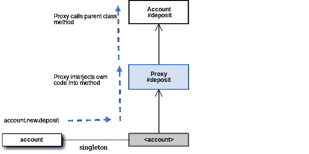
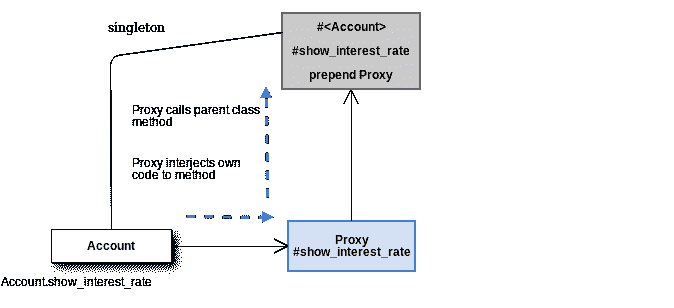

# 代理模式再探。

> 原文：<https://dev.to/redfred7/the-proxy-pattern-revisited--38b4>

## [T1】简介](#intro)

代理是大多数编程语言中最流行的设计模式之一。代理只是一个位于客户端代码和服务对象之间的对象。客户端代码直接处理代理，而不是服务对象。
<sup>[1](#serviceobject)</sup>

## 古老的方式

不管是什么用例，Ruby 实现代理的惯用方式是利用`method_missing`方法，正如 Russ Olsen 的开创性著作《Ruby 中的[设计模式》所描述的那样。](http://designpatternsinruby.com/)

```
# the service object
class Account
  def initialize(balance)
    @balance = balance
  end

  def deposit(amount)
    @balance += amount
  end

  def withdraw(amount)
    @balance -= amount
  end

  def self.interest_rate_for(a_balance)
    a_balance > 10_000 ? '3.2%' : '5.5%'
  end

end

# the proxy object
class AccountProxy
  require 'etc'
  def initialize(real_account)
    @real_account = real_account
  end

  def method_missing(name, *args)
    raise "Unauthorised access!" unless Etc.getlogin == 'fred'
    @real_account.send(name, *args)
  end
end

## client code
acc = Account.new(100)
proxy = AccountProxy.new(acc)
proxy.deposit(10)
proxy.withdraw(50) 
```

在这个简单的代理示例中，我们拦截所有对`AccountProxy`的方法调用，进行基本的安全检查，然后将方法委托给真正的`Account`对象来完成实际的工作。

这是在 Ruby 中创建代理的一种简洁而有效的方法，但是它有一些缺点:

1.  客户端代码需要调用一个单独的对象，例如 AccountProxy 而不是 Account。很明显，我们没有处理“真正的”服务对象，如果您必须重写现有的客户端代码，这不仅是一件麻烦的事情，而且还可能导致恶意行为者试图绕过代理。
2.  `method_missing`是一个包罗万象的陷阱。它会捕捉每一个方法调用，我们需要长时间努力思考哪些方法要委托给“真正的”对象，哪些要在我们的代理中处理(例如，`#to_s`)
3.  使用`method_missing`会影响性能。当调用一个对象上的方法时，Ruby 解释器将首先在对象层次结构中寻找方法，当找不到时，它将返回到层次结构树中，开始寻找一个`method_missing`实现。每一次方法调用都会发生这种情况。
4.  我们的代理不支持类方法。为此，我们需要为`Account`的 singleton 类提供一个单独的代理对象。

## 新方式

Russ 的书出版几年后，Ruby 2.0.0 发布并引入了[模块#prepend](http://ruby-doc.org/core-2.2.0/Module.html#method-i-prepend_features) 。`Module#prepend`的工作方式是在调用代码(也称为“接收器”对象)和执行前置的模块或类之间插入前置模块。

你已经能看出其中的联系了吗？前置模块*位于接收器和服务对象*之间。听起来很熟悉？哦，是的，这正是代理应该做的！

知道了这一点，我们可以使用`#prepended` hook 方法来动态地实现我们的代理中前置模块的所有方法，确保在调用原始方法实现之前添加我们额外的安全检查。

```
 module Proxy
  require 'etc'

  # Dynamically re-creates receiver's class methods, intercepts calls 
  # to them and checks user before invoking parent code
  #
  # @param receiver the class or module which has prepended this module
  def self.prepended(receiver)
    obj_mthds = receiver.instance_methods - receiver.superclass.instance_methods
    obj_mthds.each do |m|
      args = receiver.instance_method(m).parameters # => [[:req, :x], [:req, :y]]
      args.map! {|x| x[1].to_s}
      Proxy.class_eval do
        define_method(m) do |*args|
          puts "*** intercepting method: #{m}, args: #{args}"
          raise "Unauthorised access!" unless Etc.getlogin == 'fred'
          super(*args)
        end
      end
    end
  end

end #module

class Account
  def initialize(balance)
    @balance = balance
  end

  def deposit(amount)
    @balance += amount
  end

  def withdraw(amount)
    @balance -= amount
  end

  def self.interest_rate_for(a_balance)
    a_balance > 10_000 ? '3.2%' : '5.5%'
  end

  prepend Proxy

end 
```

我们所做的就是利用`#prepend`影响 Ruby 对象模型的方式来找出被拦截的对象定义了哪些方法，然后在我们的代理中实现它们，同时添加我们自己的代码。为了调用最初的实现，我们再次利用了被拦截的对象是我们的代理模块的父对象这一事实，所以我们需要做的就是调用`#super`(不再有难看的`#send`调用)

[T2】](https://res.cloudinary.com/practicaldev/image/fetch/s--a6GtdOs9--/c_limit%2Cf_auto%2Cfl_progressive%2Cq_auto%2Cw_880/https://cacoo.com/diagrams/0iRB3WrIhseOvudw-33260.png)

让我们编写一些客户端代码来练习我们的帐户:

```
acc = Account.new(100)

puts acc.deposit(10)
puts acc.withdraw(50)
puts Account.interest_rate_for(2000) 
```

哪些输出:

```
*** intercepting method: deposit, args: [10]
110
*** intercepting method: withdraw, args: [50]
60
5.5% 
```

这很酷，但它的美妙之处还不止于此。我们可以使用完全相同的机制来拦截类方法调用。我们需要做的就是将代理添加到帐户的 singleton 类中:

```
 class Account
  def initialize(balance)
    @balance = balance
  end

  def deposit(amount)
    @balance += amount
  end

  def withdraw(amount)
    @balance -= amount
  end

  def self.interest_rate_for(a_balance)
    a_balance > 10_000 ? '3.2%' : '5.5%'
  end

  class << self
    prepend Proxy
  end

  prepend Proxy

end 
```

对象模型又一次被操纵为对我们有利:

[T2】](https://res.cloudinary.com/practicaldev/image/fetch/s--kGrYo9U5--/c_limit%2Cf_auto%2Cfl_progressive%2Cq_auto%2Cw_880/https://cacoo.com/diagrams/Q1qefWY6I0sa0gOw-33260.png)

现在，通过再次运行我们的客户端代码，我们看到 Account 类的实例和类方法都被代理捕获:

```
acc = Account.new(100)

puts acc.deposit(10)
puts acc.withdraw(50)
puts Account.interest_rate_for(2000) 
```

哪些输出:

```
*** intercepting method: deposit, args: [10]
110
*** intercepting method: withdraw, args: [50]
60
*** intercepting method: interest_rate_for, args: [2000]
5.5% 
```

这种代理方式有许多优点:

1.  它是透明的。客户端代码不需要更改，甚至不需要知道正在使用代理，我们只需要将代理模块添加到服务对象类中。
2.  这是表演。一些基本的基准测试表明，与 method_missing 代理相比，性能提高了 3-4 倍。
3.  它对实例和类方法都有效。

现在你知道了:建立代理的另一种方式。Ruby 一直在发展，我们也一样。25 岁生日快乐！

封装了一些业务逻辑的 Ruby 对象