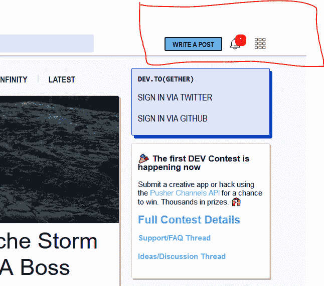

# 开发通知图标背后的心理

> 原文：<https://dev.to/mckabue/the-psychology-behide-the-notification-the-devto-icon-18io>

[T2】](https://res.cloudinary.com/practicaldev/image/fetch/s--6aKwwbTT--/c_limit%2Cf_auto%2Cfl_progressive%2Cq_auto%2Cw_880/https://thepracticaldev.s3.amazonaws.com/i/sjyj46r745nk9j0nc7eu.PNG)

一段时间以来，我一直试图理解为什么戴夫。添加了一个活动的通知图标，好像有人已经登录，而不是一个登录/注销锁，或文本- `login/logout`。

我真的很喜欢这个想法，这就是我在分别点击图标并进入登录/注册页面后注册的方式。

这是常规的东西吗？