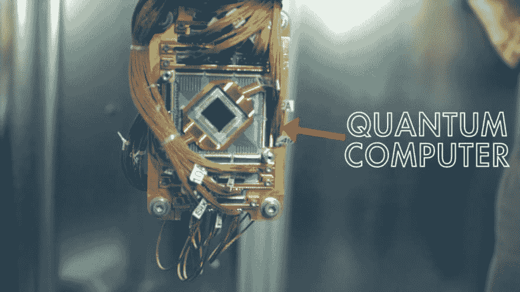

# 开发量子计算机的探索，谁将赢得这场竞赛？

> 原文：<https://dev.to/bradjoh47905297/the-quest-to-develop-quantum-computers-who-is-winning-the-race-nic>

在过去的几年里，科技怪兽美国在推动其经济和国家安全的前沿创新方面引领了世界。今天，美国与中国和欧盟竞争，根据量子科学的强度，建立以下机械飞跃。

[IBM](https://www.ibm.com/) 和[微软](https://www.microsoft.com/)，财富 500 强名单中引人注目的名字正在启动美国创造量子计算的使命，不久之后，中国的大学也加入了这一暂时的时尚，无限制地建立创新。

## 量子计算将是未来的趋势

量子登记发送亚原子粒子的发展来处理目前个人电脑不能处理的信息。量子计算的想法，目前通常是假设的，需要以一定的速度执行计算，使目前的个人电脑看起来更像一个数学设备！被迷住了？请继续阅读。

尽管完全工作的量子电脑可能还需要 10 年才能进入现实世界，但新的风险和新职业正在蚕食这一创新，直接完成了天际线。量子计算在信息安全、精确的长期气候估计、电子通信以及新处方和新材料的创新工作中提供了更突出的进展。

[T2】](https://res.cloudinary.com/practicaldev/image/fetch/s--bWXlN6OJ--/c_limit%2Cf_auto%2Cfl_progressive%2Cq_auto%2Cw_880/https://thepracticaldev.s3.amazonaws.com/i/4ikewbycvv035emtge9u.jpg)

## 量子计算基于“量子叠加”概念

传统的个人电脑，类似于今天使用的工作站或平板电脑，在其 CPU 中使用很少的电子“开-关”开关，称为并行的 1 和 0，其中 1 是“开”，0 是“关”。这个时代的超级个人计算机能以更高的速度进行计数，它们还模仿同样的“开关”例子。

量子电脑利用“量子比特”，这是一种亚原子粒子，模仿“量子叠加”的概念，可以同时“开”和“关”。这使得量子个人电脑能够以比我们今天拥有的最出色的超级电脑快无数倍的速度进行复杂的计算。

## 关于量子计算的辩论:谁赢得了这场竞赛？

对量子计算的推测达到了新的高度。中国和欧盟已经投入了数十亿美元用于新的研究办公室和量子努力的硬件。特别是中国，已经将其量子计算活动提升到一个国家目标，即在未来十年超越美国。

无论如何，中国对量子计算活动的普遍猜测是模糊的，因为有报道称中国政府正在安徽合肥建设一个 100 亿美元的量子信息科学国家实验室，预计将于 2020 年开放。正如 2016 年 7 月的一份政府报告所指出的，美国补贴的量子注册审查多年约为 2 亿美元，一些分析师和组织不接受这个数字是足够的风险。

### 国家量子倡议法案

在一项持续的进展中，美国众议院科学、空间和技术委员会于 2018 年 7 月 27 日确认了国家量子倡议法案。《国家量子倡议法案》阐明了量子科学将在以后发挥的主导作用。这张票据保证了资产；通过制定一个十年计划来推动美国的量子进步和创新应用，可以获得资产和支持，使美国成为量子创新的全球先锋。

《国家量子倡议法案》通过倾向于集中研究漏洞，打造更接地气的劳动力，并创造方法让美国组织和专家在量子计算方面保持优势，来支持不同政府组织之间的基本研究，培训和评估改进。

### 在这场量子竞赛中，中国并没有落后

正如美国贸易代表的一份报告所指出的，量子材料科学是中国政府通过其科技部正在加强其创新能力的领域，这让美国的组织感到不安。正如 Patinformatics(一家主要的全效益预警公司，在专利审查上花费大量时间)发布的信息所表明的那样，中国科学院和北京大学是寻求更多量子数据创新许可证的著名中国研究公司之一。

在击败不同国家的旅程中，中国政府通过支持组织和分析师模仿美国和其他地方在量子计算方面所做的改进，贡献了数十亿美元。中国人肯定取得了相当大的进步。

从他们的专利申请来看，中国科学家正专注于加密技术的进步。中国国家新闻机构报道称，中国政府已经推进了世界上第一颗量子交换卫星，该卫星保证在 2017 年从太空发送主要的无法破解的代码。

## 量子计算:未来之路

美国国会 2000 年成立的美中经济与安全审查委员会在其最新报告中表示，中国已经关闭了美国在量子数据科学方面的机械漏洞，这是美国人很久以前就掌握的一个领域。在 R&D 融资和政府支持的帮助下，中国的专家和企业正在快速前进。在未来的环境中，谁将赢得决定性的量子计算之战，统治量子革命，这将引起人们的兴趣。