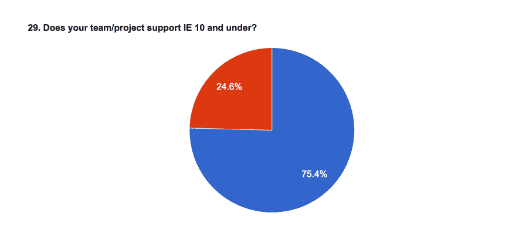
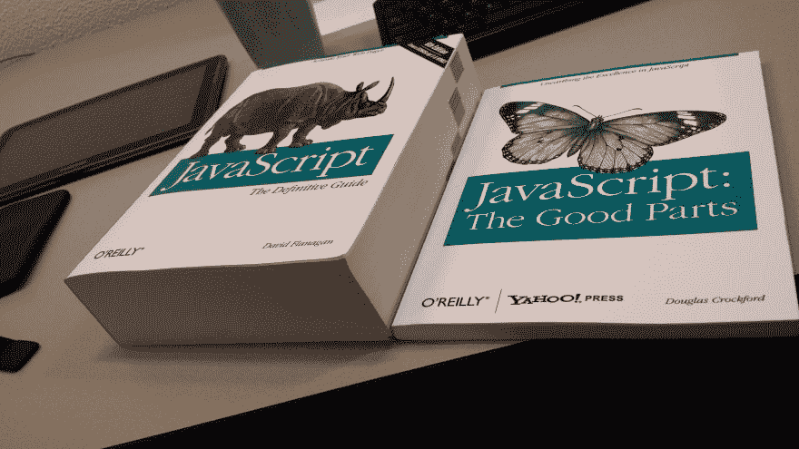

# 随着时间的推移，正确的想法会变成错误的想法

> 原文：<https://dev.to/ben/the-right-idea-becomes-the-wrong-idea-over-time-4dbc>

#### 2008:不要用 JavaScript 构建你的服务器端应用。你疯了吗？

* * *

#### 2018:用 JavaScript 构建你的服务器端应用。这可能是你能做出的最实际的选择之一。

* * *

不管你是否相信 2018 年的说法，它至少是可信的。然而，我发现自己观察到人们过度沉迷于过去的建议，即使整个生态系统已经围绕着那个特定的建议进化。

在这方面，JavaScript 对我来说很突出。如果我是你，我会像躲避瘟疫一样避开 2008 JavaScript。但是 2018 年的 JavaScript 实际上是一种完全不同的语言。对我的口味来说，这个生态系统仍然有点疯狂，但语言本身不再是不可行的了。

<figure>

[https://www.youtube.com/embed/c1QcjsjjtRc](https://www.youtube.com/embed/c1QcjsjjtRc)

<figcaption>This is a time-travel joke built around Japan's industrial advances</figcaption>

</figure>

过去的伤疤得到了过多的关注。对于我们中的一些人来说，我们永远不想在生活中再次看到 JavaScript，但 2018 JavaScript 是一个明智的选择，具有精彩的工具。事情并不完美，但它不再是默认的意大利面。我们想出了很多办法，构建了全新的运行时。我们写了很多新代码。

JavaScript 是这里的例子，但这适用于一般情况。新的软件概念保留旧的名字。旧的最佳实践腐烂了，却没有得到适当的抛弃。真正让我想提出这一点的是我们刚刚结束的网络调查的[状态的一个特殊结果。](https://dev.to/devteam/state-of-the-web-data---call-for-analysis-2o75)

[T2】](https://res.cloudinary.com/practicaldev/image/fetch/s--Sd_MuNFB--/c_limit%2Cf_auto%2Cfl_progressive%2Cq_auto%2Cw_880/https://cl.ly/92d8209fb944/Image%25202018-08-29%2520at%25208.28.04%2520PM.png)

25%的团队仍然支持 IE 10 及以下版本！！我完全支持浏览器支持，但这只是 25%的团队支持的 0.5%的浏览器活动！这对我来说简直是疯了。有很多用例可以强制支持这些旧的浏览器，但我肯定不是 25%的情况。

人们支持旧版本的 IE 浏览器，因为他们做出了选择，并且再也没有重新使用它。人们讨厌 JavaScript，因为他们有过一些糟糕的经历，而且从来没有让旧伤疤愈合。

你不用爱 JavaScript，我自己也不是 JS 大咖，但是老笑话已经死了。

[T2】](https://res.cloudinary.com/practicaldev/image/fetch/s--sj24y6Ot--/c_limit%2Cf_auto%2Cfl_progressive%2Cq_auto%2Cw_880/https://i.redd.it/h7nt4keyd7oy.jpg)

我认为这是我们行业中最有趣的笑话之一。如果有什么不同的话，我为我们不能像以前那样抱怨 JavaScript 而感到悲哀。