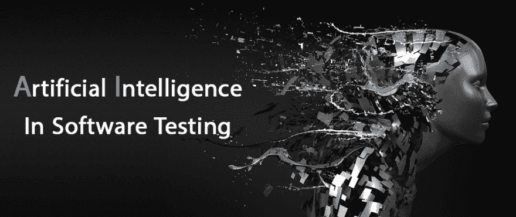

# 人工智能在软件测试中的作用

> 原文：<https://dev.to/pradeeparthiban/the-role-of-ai-in-software-testing-4g29>

[T2】](https://res.cloudinary.com/practicaldev/image/fetch/s--_5gsqJ1y--/c_limit%2Cf_auto%2Cfl_progressive%2Cq_auto%2Cw_880/https://thepracticaldev.s3.amazonaws.com/i/i1iaii11v8y3x427b0r8.png)

我们都知道，在最近几年，人工智能已经被证明在各种各样的领域对人类有很大的帮助，如统计学、图形研究、天文学等等。但是现在关心的问题是这个理论是否能够给软件测试领域带来必要的和预期的变化。来自世界各地的软件测试人员和开发人员正在尝试各种方法来整合这个想法，以创建一个新版本的技术先进的世界。

这个新的介绍会成为拯救还是毁灭的原因？即使仍然存在潜在的不确定性，人工智能理论的使用在一定程度上已经变得丰富。根据《泰晤士报高等教育版》的报道，中国以超过 41000 篇关于人工智能的研究论文领先，许多国家都在遵循这一理论来履行各种职能。

让我们看一看人工智能的属性及其相关的软件测试方面！

什么是人工智能？我们都知道，机器人和技术发达的机器正在迅速取代人类劳动，无论是机器人还是任何自动化机器。现在，当机械力量正在被人工力量取代时，为什么不把人类的自然智能换成类似的东西呢？这个命题导致了人工诱导智能这一新概念的发展，它在任何意义上都类似于人类智能，但更高级、更快。这就是所谓的人工智能。这实际上是一种针对任何情况的概率方法。

除此之外，人工智能技术的行为和人类一样，产生的结果也一样。迄今为止开发的一些使用人工智能的最佳技术是语音识别、虚拟代理、机器学习平台、机器人流程自动化等等。

人工智能在这些领域的成功已经驱使软件头脑在开发软件和测试软件的不同参数方面使用相同的理论。

AI 在软件测试中的要求是什么？软件测试人员在自动化上比人工检查过程受益更多。术语“软件测试”围绕着许多算法和技术过程，这些算法和技术过程检查软件的质量、输出、市场效率和其他属性。

现在，软件测试并不涉及软件测试目的的一两个步骤。相反，开发的整个软件要经过一系列重复的测试，在每一个级别，都要用不同的方法检查参数。这需要智力、大量的人力和时间。此外，各大软件巨头花费的收入高达数十亿美元。人工智能的使用肯定会去掉测试过程中需要的所有多余的东西。人工智能算法和各种过程是基于引入自动化和对软件中的任何故障或错误进行更好的“智能”分析。整个工作是在低维护的情况下完成的，因为人工智能意味着人工诱导的智能，足够的脑力来运行这些过程而不需要大量的关心。

AI 在软件测试中的好处
人工智能应用的好处是广泛的；有些人可以修改现有的测试方法，而其他人肯定会在软件测试领域引入令人兴奋的变化。

1.  提高质量
    随着人工诱导智能的应用，软件的质量将得到广泛发展。由于所有的测试方法都是自动进行的，而且非常可靠，所以质量会大大提高。此外，随着市场效率的提高，应用程序的寿命将大大增加。

2.  有效且值得信赖的人工智能算法已经在软件测试中引入了有效性。人工智能理论还通过减少人力和密集成本增加了测试方法的可靠性。该过程是可信的，因为将通过检查代码来检查错误，这些代码不会在没有解决错误的情况下将错误置之不理。

3.  最早的反馈
    随着人工智能测试过程的自动化，软件开发人员将获得关于应用程序工作和效率的快速反馈报告。此外，错误和争议将很快得到解决，因此，产品可以很快投放市场。

4.  改进的可追溯性
    由于测试算法已预装在机器中，并基于统计和其他类型的数学概念，因此跟踪测试路径并确保每一步都清晰仔细地完成变得非常容易。此外，将有可能知道发生了什么类型的错误，因此，找到它们的解决方案将变得更容易。

5.  集成平台
    整个过程在一个集成的嵌入式平台上进行。这将使软件开发人员更容易在客户的网站上推出网站。因此，执行过程将变得更加缓慢。

人工智能在软件测试领域的应用仍在研究中。然而，预计很快软件世界将会看到过程的巨大变化！