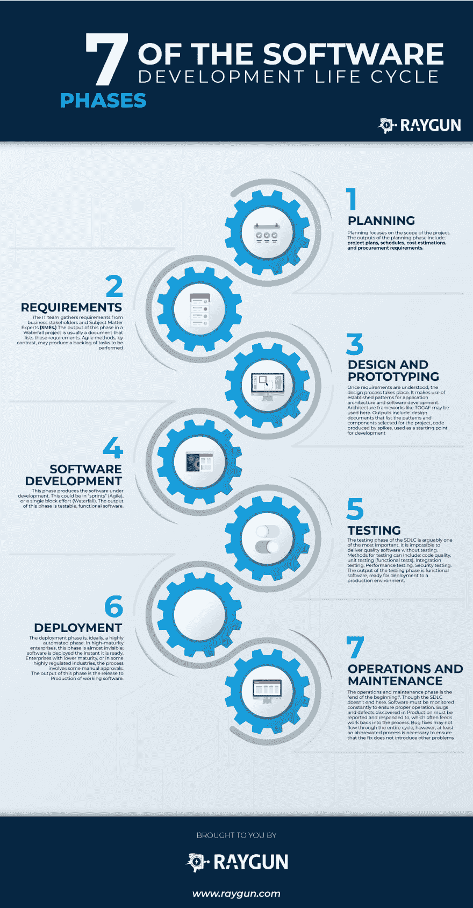
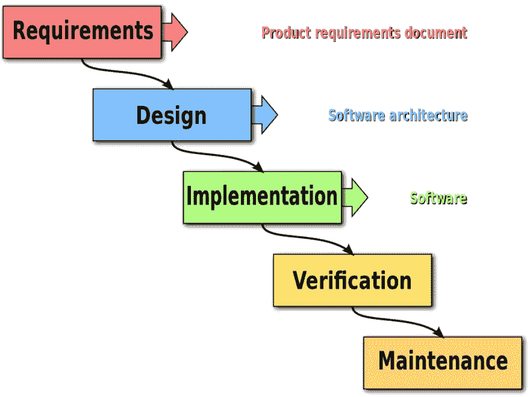
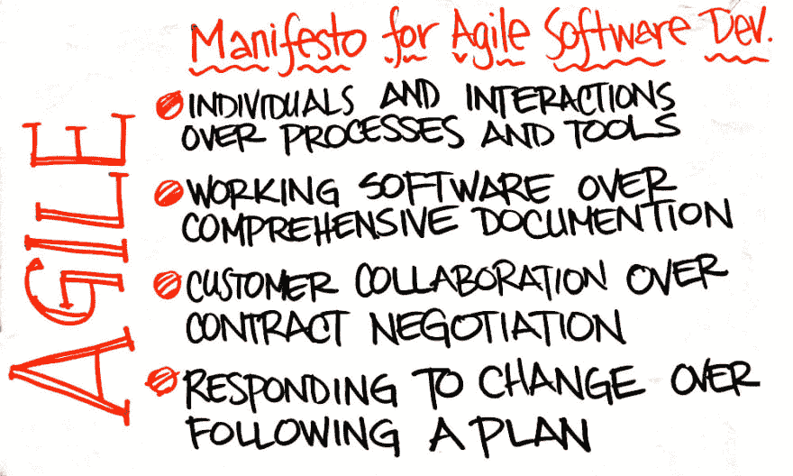

# SDLC: 7 个阶段、流行模式、优势及更多

> 原文：<https://dev.to/raygun/the-sdlc-7-phases-popular-models-benefits--more--1goo>

*原载于 [Raygun 博客](https://raygun.com/blog/software-development-life-cycle/)T3】*

软件开发生命周期(SDLC)是一个术语，用于解释软件如何通过一系列步骤交付给客户。这些步骤将软件从构思阶段带到交付阶段。

我们已经分解了从高层次理解 SDLC 所需的一切，包括以下几点。

1.  [SDLC 的历史](#history)
2.  [什么是 SDLC，它为什么会发展？](#what-is-the-sdlc)
3.  [SDLC 是如何工作的？](#how-does-sdlc-work)
4.  [SDLC 的优势](#benefits)
5.  [SDLC 的七个阶段](#the-seven-phases)
6.  [SDLC 信息图的七个阶段](#infographic)
7.  [流行的 SDLC 型号](#models)
8.  [SDLC 最佳实践](#practices)
9.  [SDLC 管理系统](#systems)

## SDLC 的历史

“软件开发人员”这个职业从第一台计算机及其操作员开始就存在了，可以追溯到 ENIAC 和真空管时代。自从计算机发明以来，开发软件的实践和方法已经发展了几十年。

那些方法已经适应了计算机硬件、开发工具和关于软件开发团队的组织管理的现代思想的艺术状态。随着这一进步，新的软件开发方法已经从世界各地的私有和公共软件开发工作中发展出来。

这些方法在方法上千差万别，但它们有一个共同的目标:尽可能便宜地开发软件，高效地开发软件，高效地开发软件。

## 什么是 SDLC？

软件是通过一系列步骤开发和交付的复杂产品。这是所有各种方法的一个共同点:无论如何，软件和所有产品一样，都是从一个想法开始的。这个想法然后变成一个文档，或者可能是一个原型，这取决于使用的方法。

无论是文档、图表还是工作软件，一个步骤中创建的*工件*成为下一个步骤的*输入*。最终，软件被交付给客户。这些方法使用的步骤序列通常被称为*软件开发生命周期(SDLC)。)*

## SDLC 是如何工作的？

软件开发的过程是一个永无止境的循环。软件应用程序的首次发布很少是“完成的”几乎总是有额外的特性和错误修复等待设计、开发和部署。

来自[错误监控软件](https://raygun.com/platform/crash-reporting)的关于可用性和 bug 的报告反馈到软件开发过程中，并成为新的功能请求和对现有功能的改进。这就是为什么软件开发*生命周期*是软件开发方法的最通用术语。该过程的步骤及其顺序因方法而异。不管用什么方法，它们通常都是循环运行的，从每次迭代开始。

## SDLC 的好处

> “如果你没有计划，你就是在计划失败。”——本杰明·富兰克林

没有某种计划，很难进行复杂的团队工作，比如软件开发。每种软件开发方法(下面将详细介绍几种)都是如何开发软件的框架。关于哪种方法总体上是最好的，哪种方法最适合特定类型的软件，以及如何衡量软件开发的成功，有很多争论。然而，有一点是肯定的:任何一个 T1 计划都比没有 T3 计划的 T2 要好。

没有某种结构化的计划，软件开发团队往往会变成“一群猫”开发者不知道他们应该创造什么。项目经理不知道项目完成的进度。没有计划，企业甚至没有办法决定最终产品是否满足他们的要求。

SDLC 形式的正式定义的软件开发方法有很多好处:

*   每个步骤的通用词汇表
*   定义开发团队和涉众之间的沟通渠道
*   明确开发人员、设计人员、业务分析师和项目经理的角色和职责
*   从一个步骤到下一个步骤的明确定义的输入和输出
*   一个确定性的“完成定义”,可用于确认一个步骤是否真正完成

## SDLC 的七个阶段

[单击此处跳转至 SDLC 信息图的 7 个阶段。](#sdlc-infographic)

从一种方法到另一种方法，这些步骤(非常)大致相同。它们倾向于以这种顺序发生，尽管它们也可以混合在一起，使得几个步骤并行发生。

正如我们将在后面讨论的，敏捷方法倾向于将所有这些步骤“缠绕”成一个紧密的、快速重复的循环。瀑布方法倾向于依次采取这些步骤。一个步骤的输出成为下一个步骤的输入。

### 1。规划

规划阶段涉及项目和产品管理的各个方面。这可能包括:

*   资源分配(人力和物力)
*   容量规划
*   项目进度安排
*   估价
*   准备金提取

规划阶段的输出包括:项目计划、时间表、成本估算和采购需求。理想情况下，项目经理和开发人员与运营和安全团队合作，以确保代表所有观点。

### 2。要求

企业必须与 IT 团队沟通，传达他们对新开发和增强的需求。需求阶段从业务涉众和主题专家(SME)那里收集这些需求。)

架构师、开发团队和产品经理与 SME 一起工作，记录需要通过软件自动化的业务流程。瀑布项目中这个阶段的输出通常是一个列出这些需求的文档。相比之下，敏捷方法可能会产生待执行任务的积压。

### 3。设计和原型制作

一旦理解了需求，软件架构师和开发人员就可以开始设计软件了。设计过程使用应用程序架构和软件开发的既定模式。架构师可以使用诸如 TOGAF 之类的架构框架从现有的组件中组合一个应用程序，促进重用和标准化。

开发人员使用经过验证的设计模式来以一致的方式解决算法问题。这个阶段可能还包括一些快速原型制作，也称为[尖峰](https://en.wikipedia.org/wiki/Spike_%28software_development%29)，来比较解决方案以找到最合适的。这一阶段的产出包括:

*   列出为项目选择的模式和组件的设计文档
*   由尖峰产生的代码用作开发的起点

### 4。软件开发

这个阶段产生正在开发的软件。根据方法论的不同，这个阶段可能会在有时间限制的“冲刺”中进行(敏捷)，也可能作为一个单独的工作块进行(瀑布)。)不管采用什么方法，开发团队都应该尽快开发出可以工作的软件。企业利益相关者应该定期参与，以确保他们的期望得到满足。这个阶段的输出是可测试的、功能性的软件。

### 5。测试

SDLC 的测试阶段可以说是最重要的阶段之一。没有测试就不可能交付高质量的软件。衡量质量需要各种各样的测试:

*   代码质量
*   单元测试(功能测试)
*   集成测试
*   性能试验
*   安全测试

确保测试定期运行，而不会因为权宜之计而被跳过的最好方法是将测试自动化。测试可以使用持续集成工具自动化，例如像 Codeship 这样的[。测试阶段的输出是功能软件，可以部署到生产环境中。](https://codeship.com/)

### 6。部署

理想情况下，部署阶段是一个高度自动化的阶段。在高成熟度的企业中，这个阶段几乎是看不见的；软件一旦准备好就被部署。成熟度较低的企业，或者在一些高度管制的行业，流程涉及一些人工审批。然而，即使在那些情况下，部署本身最好在[连续部署](https://raygun.com/blog/continuous-deployment/)模型中完全自动化。[应用发布自动化(ARA)](https://en.wikipedia.org/wiki/Application_release_automation) 大中型企业使用工具来自动将应用部署到生产环境中。ARA 系统通常与持续集成工具集成在一起。这个阶段的输出是工作软件的发布。

### 7。操作和维护

可以说，操作和维护阶段是“开始的结束”。软件开发*的生命周期*并没有在这里结束。必须持续监控软件以确保正常运行。生产中发现的 bug 和缺陷必须被报告和响应，这通常会将工作反馈到流程中。错误修复可能不会贯穿整个周期，但是，至少需要一个简短的过程来确保修复不会引入其他问题(称为[回归](https://en.wikipedia.org/wiki/Regression_testing))。)

### 软件开发生命周期信息图

[T2】](https://res.cloudinary.com/practicaldev/image/fetch/s--suqOEdks--/c_limit%2Cf_auto%2Cfl_progressive%2Cq_auto%2Cw_880/https://raygun.com/blimg/the-software-development-lifecycle/phases-infographic.png)

## 流行的 SDLC 型号

SDLC 中最著名的两种方法是*瀑布*和*敏捷*。下面是一个简短的解释，以及它们与 SDLC 的关系。

### 瀑布

[T2】](https://res.cloudinary.com/practicaldev/image/fetch/s--HLhn3rVI--/c_limit%2Cf_auto%2Cfl_progressive%2Cq_auto%2Cw_880/https://raygun.com/blimg/the-software-development-lifecycle/Waterfall_model.jpg)

软件开发的瀑布方法遵循一个严格的、预先确定的路径通过一组阶段。这种方法是由传统工程学发展而来的。具有讽刺意味的是，被认为是瀑布方法起源的论文描述它有根本性的缺陷。今天被称为“瀑布”的方法是错误地从对这部原著的误解中衍生出来的。尽管如此，瀑布成为了一种非常普遍的，甚至是全世界大型项目的标准方法。

瀑布方法始于漫长的规划和设计阶段。一旦开发完成，软件就要经过测试阶段，最后部署使用。许多人认为瀑布太死板，不能适应不断变化的需求。它不支持整个过程中的反馈，导致在开发过程中可能已经改变的需求的实现。瀑布中的这一弱点导致了更灵活的方法学的发展，比如敏捷。

### 敏捷

[T2】](https://res.cloudinary.com/practicaldev/image/fetch/s--rqhH-5S3--/c_limit%2Cf_auto%2Cfl_progressive%2Cq_auto%2Cw_880/https://raygun.com/blimg/the-software-development-lifecycle/agile-manifesto.jpg)

2001 年，一群软件开发人员起草并签署了敏捷软件开发宣言。阅读宣言，你可以清楚地看到瀑布(当时开发方法的事实上的标准)和敏捷(较新的方法)之间的对比。

宣言解决了瀑布带来的软件交付挑战的关键问题。瀑布往往是一条“单行道”，敏捷是一个更灵活的框架，允许不确定性。敏捷强调团队合作、原型和反馈循环，这些可以改变开发工作的方向，以响应不断变化的需求。

自从宣言签署以来，敏捷的几个变种已经出现了。Scrum 定义了特定的角色和事件，被称为*仪式*，作为其实践的一部分。[看板](https://www.versionone.com/what-is-kanban/)更简单，处方更少，更灵活。敏捷团队经常将这些结合在一起，以适应最适合他们的定制流程。

## SDLC 惯例

世界各地的许多公司仍然在使用瀑布，然而，敏捷正在迅速普及。无论使用哪种方法，都有减少风险和增加成功机会的实践。

### 源代码控制

中央源代码控制库的重要性怎么强调都不为过。不使用源代码控制的开发团队在代码和他们的过程中都在冒险。使用源代码控制通过确保定期将工作(代码)集中在一个地方来降低风险。如果开发人员工作站或文件服务器出现故障，中央存储库会化险为夷。现代源代码控制系统也支持持续集成。

### 持续整合

持续集成(CI)的目的是*保持软件处于功能状态。在普遍使用 CI 之前，开发团队会编写成千上万行代码，然后试图集成它们。一次集成这么多工作是乏味的、痛苦的，并且容易出错。CI 是一个在每次代码改变时构建软件*的自动化。*如果出现问题，CI 系统会提醒开发人员。遵循适当的 CI 实践，在构建成功之前不会做进一步的工作。这可以防止错误和缺陷发展成应该尽可能没有 bug 的软件。*

### SDLC 管理系统

大型、复杂的软件开发工作可能很难进行，也很难跟踪。围绕这个问题，一整类软件系统已经发展起来:[应用程序生命周期管理](https://en.wikipedia.org/wiki/Application_lifecycle_management)。努力越大，这些系统就变得越不可或缺。它们在工作管理、错误跟踪和分析方面提供了一些功能来帮助决策。

## 结论

所有的软件都是从一个概念开始，经过一系列的阶段，直到开发和部署一个版本。应用程序或系统的*软件开发生命周期*随着更新和新特性的出现而继续，直到它退役或被取代的那一天。软件开发的几种方法已经发展了几十年。

瀑布方法仍然很普遍，尽管敏捷正在大大小小的公司中迅速超越它。无论你选择哪种方法，都要使用合适的工具。没有它们，软件很难可靠地交付。没有完美的方法，但是使用一些方法总比没有好得多。

***想知道如何监控 SDLC 的性能问题吗？ [Raygun APM、真实用户监控和崩溃报告](https://raygun.com/)将检测性能问题，以便您可以快速修复它们。***