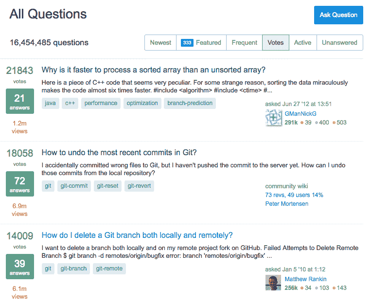
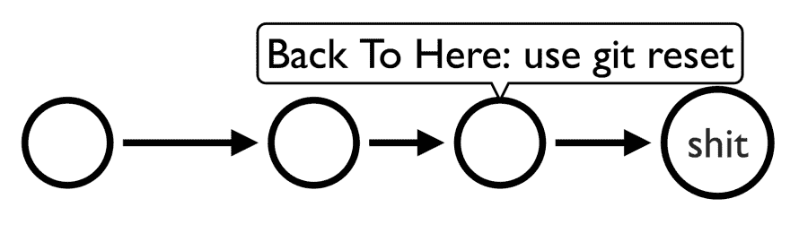
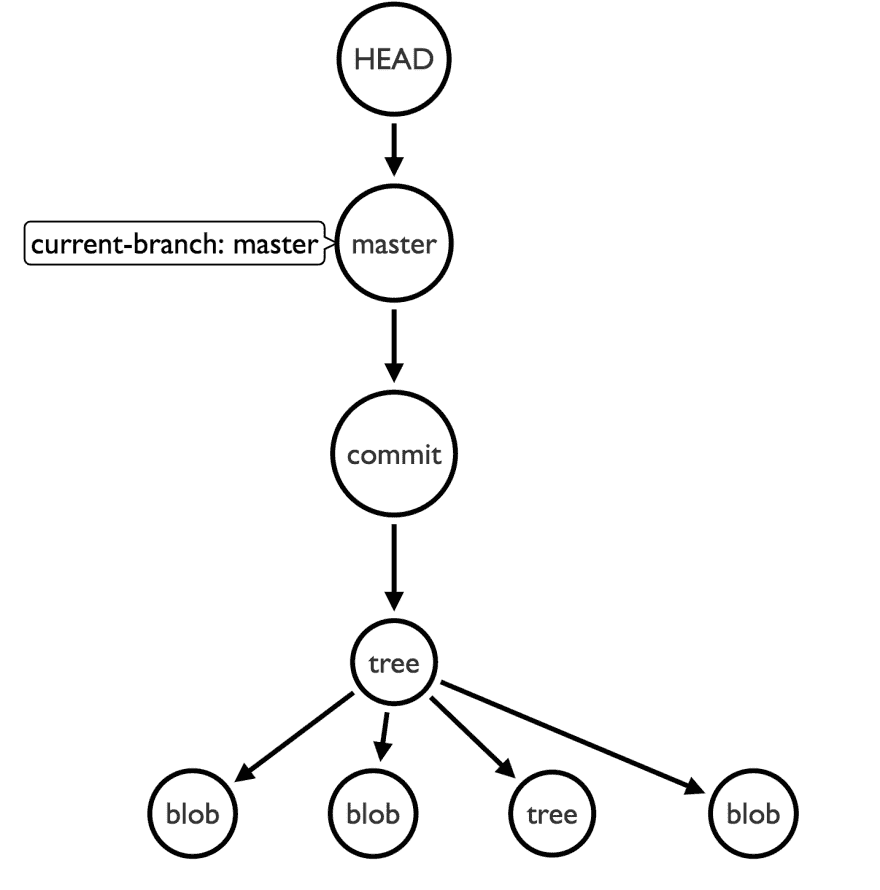

# StackOverflow 上第二高的投票问题是...

> 原文：<https://dev.to/tomerbendavid/the-second-most-voted-question-on-stackoverflow-is-60b>

如果你访问:[https://stackoverflow.com/questions?sort=votes](https://stackoverflow.com/questions?sort=votes)，你会在 StackOverflow 上看到投票最多的问题。

[T2】](https://res.cloudinary.com/practicaldev/image/fetch/s--KjeQX_Pw--/c_limit%2Cf_auto%2Cfl_progressive%2Cq_auto%2Cw_880/https://thepracticaldev.s3.amazonaws.com/i/9gg2c7r1wphf84q24hhq.png)

不难注意到，StackOverflow 上的前 4 个投票问题中有 3 个是在 git 上！

这可能意味着两件事情中的一件(或者两件都是)，git 很难/不直观，或者 git 是最常用的技术之一。是两者的结合。

当你试图理解 git 时，你会注意到，为了从你身上得到它想要的东西(或者你从它身上得到)，你需要理解底层的基础设施。这主要是因为您需要习惯它的 API，它与它的底层构建块紧密耦合。这是造成大部分混乱的原因，有人说 API(在我们的例子中是 CLI)是底层模型之上的一个有漏洞的抽象。

咆哮到此为止，让我们来分析一下 git 的最高投票问题。

问题是如何在 git 中撤销最近的提交？。

或者在一张图中:

[T2】](https://res.cloudinary.com/practicaldev/image/fetch/s--S9Bucuoj--/c_limit%2Cf_auto%2Cfl_progressive%2Cq_auto%2Cw_880/https://thepracticaldev.s3.amazonaws.com/i/ohrvazva91yxodmouzel.png)

用户说他已经提交了，但是还没有推送。

为什么您认为这在 git 中令人困惑？

1.  您可能期望一个带`revert/undo/checkout`的 api 进入一个不同的提交。
2.  已经提交了，你要用新的提交来撤销吗？你能回到过去吗？
3.  Git 说所有的东西都被永久保存，那么如何撤销呢？
4.  修复最近的提交(有一个命令可以完成)。
5.  回到历史的命令是什么？
6.  总是有这样的警告，关于改变和撤销已经推出的东西，我们有危险吗？

即使上面的一些 api 存在，但选项太多了，选择哪一个才是你最好的选择呢？

**我们来回顾一下第一个答案**

第一个回答建议他使用`git reset`命令。考虑 git 重置的最佳方式是，假设您可以让 HEAD 指针在 git 历史图中移动。

**术语太多了，头、复位、指针、图形**

在 git 中，我们承诺。每次提交都会添加到历史记录中，这是一次及时提交，对吗？
历史可以被描述为一个图，意味着每个提交指向另一个提交(在非合并提交的情况下是父提交)，因此我们有一个有向非循环图，又一个术语。

所以答案要求用户回到过去，这不正是他想要的吗？答案告诉他这样做:

[T2】](https://res.cloudinary.com/practicaldev/image/fetch/s--PlJuM_n7--/c_limit%2Cf_auto%2Cfl_progressive%2Cq_auto%2Cw_880/https://thepracticaldev.s3.amazonaws.com/i/r0tmezeql0deh1zeyi3g.png)

`git reset HEAD~`

我们已经回到了过去！

head 指向当前分支位置，`~`指向**减去一个**指针，HEAD 指向的当前提交的父提交。

因此，通过使用 reset 命令，我们告诉 git:

**Git 无论你现在指向什么(头)指向负 1 位，换句话说就是前一位**

git 很乐意为我们做这些。

请注意，由于我们没有为 reset 命令指定任何标志(如- hard ),它不会改变我们工作目录中的任何内容，因此只有头移动到了那里。

由于我们想要恢复当前工作目录中的某些内容，并且我们只是在该更改之前向后移动了头部，这意味着我们的当前目录现在被我们想要恢复的更改弄得乱七八糟。

因此，只需在工作目录中手动恢复本地更改，并再次提交

**关于头部的几句话**

我们说过 HEAD 指向当前检出分支中的最后一次提交。正如 [gitglossary](https://git-scm.com/docs/gitglossary) 告诉我们的:

> 负责人
> 当前分支。更详细地说:你的工作树通常来源于 HEAD 所指的树的状态。HEAD 是对存储库中一个 HEAD 的引用，除非使用分离的 HEAD，在这种情况下，它直接引用任意提交。

我明白我明白，所以 HEAD 通常指向当前分支，除非不是！当不是时，它直接指向提交

但是该提交的父代是什么呢？

由于我们已经将我们的`HEAD` one 提交移至过去，这意味着该过去点的未来的任何其他提交不再由该图指向——假设我们对该 HEAD~ parent 提交进行新的提交。这意味着我们不仅仅是追加到 git 历史中，我们还改变了历史，获取了父类(在我们的例子中是 HEAD~和一个新的提交，我们给了它一个不同的子类)。例如，如果我们用 HEAD~将一个提交移到过去，并从那里开始提交，那么来自原始 HEAD(HEAD ~的子节点)的提交将不再存在于标准历史日志中。因此，如果其他任何人提交了那个 child HEAD，并使用它来创建新提交(这个 HEAD commit 的新的 children，HEAD + 1，您可以称之为它)，就会产生问题(当然，假设我们与他共享我们的历史重写)。

因此，在我们进行 git 重置并在本地 repo 中返回一次提交后，我们通常会在工作目录中进行本地修复，然后提交。这个提交是一个新的提交，但是它与我们正在修复的提交具有相同的父提交，因此子提交对于我们和对于在我们的更改之前已经具有这个相同的存储库快照的其他人来说可能是不同的。

因此，如果其他用户已经提交了我们刚刚从回购中“分离”出来的旧提交，我们将它强制纳入远程回购，这将导致他们“从上游重定基础中恢复”和其他令人讨厌的事情。

我们可以把它推到主存储库中，但是要小心，因为这会给其他人带来麻烦，当他们试图把它拉出来，发现他们的父库和你的不同时会发生什么？

答案以“你本可以做`git commit --amend`”结束——对此表示赞同，但这是另一个答案，我们将在另一篇文章中对此进行调查。

**并非全部丢失**

最后一点，如果你想恢复 git 重置，你可以使用`reflog`来存储你做的所有事情的日志，就像 git 重置一样，你可以使用`reflog`来及时返回。这可以通过以下方式实现:

`git reset 'HEAD@{1}'`

它告诉 git，嘿 git 记得我想要一个重置，现在我想让你重置到一个之前的时间点，就在我重置之前。

**总结**

我们已经学会用`git reset`回到过去，显然这是 stackoverflow 中**第二多的投票问题**。

**附录 A -一些练习**

要不要“证明”一下上面的一些说法？毕竟我们说了很多关于头、分支、提交的事情，让我们看看。我们有一个本地 git 库，让我们打印它的头，它就在那里等着你去打印。

```
Step 1: Let's see what is HEAD, let's print the HEAD file

$ cat .git/HEAD # => HEAD is a file in .git directory - yeah on the base dir, let's print it.
ref: refs/heads/master # => So head is simply this line of text, this looks like a branch, let's print it.

# Step 2: HEAD --> master => OK so let's see what is master file

$ cat .git/refs/heads/master  # => Now we are printing what head points to, it should be the commit of the branch..
a15d580cc90d47a88f7f971914d45ff5a0e30eef # => So this is the commit which master points to.  But how do we know this number is a commit?

# Step 3 : Print the commit content, after all it was pointed indirectly by HEAD
$ git cat-file -t a15d580cc90d47a88f7f971914d45ff5a0e30eef
commit # => Yes git is saying this SHA-1 is a commit.  Was not persuaded yet? How about this:
$ git cat-file -p a15d580cc90d47a88f7f971914d45ff5a0e30eef
tree 7d80e5c527e9a1ec7f79f68386ce9710f1e048ce # It makes shadow like a commit.
parent ddf47ffcb19e2aee4839cae40e79fd7579fc637f # It has parents like a commit.
author Tom <tomer@email.com> 1537007909 +0300 # It has an author like a commit
committer Tom <tomer@email.com> 1537007909 +0300 # It has a committer.. like a commit

my commit message # => It talks like a commit.

# So its a commit! :)

# Step 4 : Did HEAD point to the tip of branch?
$ git log --oneline # => is the commit a15d580... really the head?
* a15d580 - (HEAD -> master) test (2 days ago) # => Yes a15d580 is indeed our latest commit where head points to!
* ddf47ff - (develop) added file to folder (9 days ago)
* 9d0e101 - hi (10 days ago) 
```

Enter fullscreen mode Exit fullscreen mode

基本上画面是这样的:

[T2】](https://res.cloudinary.com/practicaldev/image/fetch/s--ZoTleJJC--/c_limit%2Cf_auto%2Cfl_progressive%2Cq_auto%2Cw_880/https://thepracticaldev.s3.amazonaws.com/i/ymsw79nb828ya90332xb.png)

我们在上图中看到的是上面的 bash 命令，我们看到:

1.  头指向当前分支尖端。
2.  我们当前的分支引用指向我们分支中的一个提交，在我们的例子中它是最新的。
3.  提交指向一棵树。
4.  一棵树指向一个 blob 和树的列表(而树又指向一个树和 blob 的列表，树就是目录)。

因此，当我们要求 git 使用`git reset --soft HEAD~`移动到前一个提交时，我们要求 git，我们当前的分支(由头部指向)应该指向一个前一个提交，如此而已。

**让我们对之前的提交进行重置**

```
# Step 5 : Do the reset and see it's effect
$ git reset --soft HEAD~ # Git please move HEAD to point to one previous commit.

# Step 6: Now what is the reset effect on HEAD
$ cat .git/HEAD
ref: refs/heads/master # => Didn't move! it points to the same place to the master.
$ cat refs/heads/master
ddf47ff (HEAD -> master, develop) added file to folder # => Aha so master branch pointer did move and HEAD simply points to our branch as the diagram shows.
9d0e101 hi 
```

Enter fullscreen mode Exit fullscreen mode

**总结**

在附录 A 中，我们已经看到，我们可以深入 git，看看 HEAD 是什么，而不仅仅是定义，它是什么分支，git 重置的效果。阅读文档是一回事，实际上我们能在网站上看到它是一件幸事。git 目录，否则我们将只需要信任文档，这将是真的这么说，没有帮助。