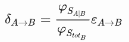
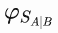
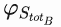
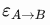
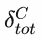

# 物品的秘密生活:信息隐藏

> 原文：<https://dev.to/riccardo_cardin/the-secret-life-of-objects-information-hiding-cpa>

*原贴于:[大泥球](http://rcardin.github.io/)T3】*

我在软件开发领域已经有一段时间了，如果我明白一件事，那就是编程不是一件简单的事情。此外，面向对象的编程甚至更难理解。在我大学毕业后，我对什么是*物体*的想法与我现在的想法相差甚远。上周我偶然看到一篇博文[再见，面向对象编程](https://medium.com/@cscalfani/goodbye-object-oriented-programming-a59cda4c0e53)。读完之后，我完全明白面向对象编程在很多层面上是多么容易被误解。我并不是说我有这个百万美元问题的最终答案，但是我将尝试给出我对面向对象编程理解的一个不同的视角。

## 简介

很可能，这将是我迄今为止写过的最难的帖子。推理到面向对象编程的基础并不是一件简单的事情。我认为我们首先要做的是定义*什么是对象*。

有一次，我试图给*对象*下一个定义:

> 面向对象[#编程](https://twitter.com/hashtag/programming?src=hash&ref_src=twsrc%5Etfw)的目标不是使用其组件的抽象表示来建模现实，组件偶然被称为“对象”。 [#OOP](https://twitter.com/hashtag/OOP?src=hash&ref_src=twsrc%5Etfw) 旨在将行为和数据组织在一起，使它们之间的依赖性最小化。
> 
> — Riccardo Cardin ([@riccardo_cardin](https://dev.to/riccardo_cardin) ) [May 3, 2018](https://twitter.com/riccardo_cardin/status/992138929800450048?ref_src=twsrc%5Etfw)

## 消息是核心

一开始，有程序设计。这种编程范式的代表是像 COBOL、C、PASCAL 和最近的 Go 这样的语言。在过程化编程中，构建块由过程表示，过程是一个函数(不是从数学角度来说)，它接受一些输入参数，并可能返回一些输出值。在评估过程中，一个程序可能会有*副作用*。

数据可以有某种原始形式，如`int`或`double`，或者它可以被组织成*记录*。记录是一组相关的数据，就像一个`Rectangle`，它包含两个原语`height`和类型`double`的`length`。使用 C 符号，矩形的定义如下。

```
struct Rectangle {
   double   height;
   double   length;
}; 
```

Enter fullscreen mode Exit fullscreen mode

尽管有输入和输出，但数据(记录)和行为(程序)之间没有直接联系。因此，如果我们想要为一个`Rectangle`的所有可用操作建模，我们必须创建许多将它作为输入的过程。

```
double area(Rectangle r)
{
    // Code that computes the area of a rectangle 
}
void scale(Rectangle r, double factor)
{
    // Code that changes the rectangle r, mutating its components directly
} 
```

Enter fullscreen mode Exit fullscreen mode

如您所见，每个过程都坚持相同类型的结构，即`Rectangle`。每个过程都需要一个在其上执行的结构的实例作为输入。此外，拥有`Rectangle`结构*实例的每段代码都可以在没有控制*的情况下访问其成员值。没有限制或授权的概念。

上述事实使得过程的定义非常冗长，并且它们的维护非常棘手。测试变得非常难以设计和执行，因为缺乏隐藏信息的*:一切都可以修改一切。*

面向对象编程的主要目标是将行为(也称为方法)与它们所操作的数据(也称为属性)绑定在一起。正如艾伦·凯曾经说过的:

> [..]这甚至与阶级无关。很抱歉，我很久以前就为这个主题创造了“对象”这个术语，因为它让许多人关注次要的概念。主要理念是“信息传递”[..]

类的概念让我们重新关注行为，而不是方法输入。你甚至不应该知道一个类的内部表示。你只需要它的*接口*。在面向对象编程中，上面的例子变成了下面的类定义(我选择使用 Scala 是因为它没有仪式感)。

```
trait Shape {
  def area: Double
  def scale(factor: Double): Shape
}
case class Rectangle(height: Double, length: Double) extends Shape {
  // Definition of functions declared abstract in Shape trait
} 
```

Enter fullscreen mode Exit fullscreen mode

举的例子很琐碎。从元素`height`、`length`和过程`scale`和`area`开始，可以非常直接地导出一个优雅的面向对象解决方案。然而，有没有可能将我们刚刚定义的`Rectangle`类的过程形式化(或者自动化)？我们来试着回答一下这个问题。

## 信息隐藏和类别定义

我们可以从一组非结构化的程序开始。

```
def scale(height: Double, length: Double, factor: Double): (Double, Double) = {
  (height \* factor, length \* factor)
}
def area(height: Double, length: Double): Double = {
  height * length
} 
```

Enter fullscreen mode Exit fullscreen mode

首先，我们注意到`height`和`length`参数出现在两个过程中。我们可以为每个参数创建一个类型，像`Height`和`Length`。然而，我们立即明白，在我们的用例中，这两个参数总是一起使用。不存在只使用两者之一的过程。

因此，我们决定创建一个结构来将它们绑定在一起。我们称这样的结构为`Rectangle`。

```
type Rectangle = (Double, Double) 
```

Enter fullscreen mode Exit fullscreen mode

我们也理解简单的结构不符合我们的需要。除了这两个过程之外，internal 不应该被其他任何东西改变(暂时忘记在 Scala 中元组是不可变的)。说实话，我们只对这两个程序感兴趣。因此，我们将对矩形信息的访问仅限于这两个过程。

我们如何做到这一点？我们应该把矩形的信息和与之相关的行为绑定在一起。我们需要一个*类*

```
case class Rectangle(height: Double, length: Double) {
  def scale(factor: Double): Rectangle = Rectangle(height * factor, length)
  val area: Double = height * length
} 
```

Enter fullscreen mode Exit fullscreen mode

好吧，只考虑我们拥有的用例，我们可以停在这里。解决方案已经是最优的了。我们把身高和身长的信息藏在了班级后面；行为是客户端唯一可以从外部访问的东西；想要使用矩形的客户端只能与类`Rectangle`的接口交互。

如果我们也想支持像正方形和圆形这样的形状呢？嗯，通过使用*接口*，它们是纯行为的类型，面向对象编程允许我们的客户从一个形状的具体实现中抽象出来。然后，上面的例子变成了下面的。

```
trait Shape {
  def scale(factor: Double): Shape
  def area: Double
}
case class Rectangle(height: Double, length: Double) extends Shape {
  // Definition of functions declared abstract in Shape trait
}
case class Square(length: Double) extends Shape {
  // Definition of functions declared abstract in Shape trait
}
case class Circle(ray: Double) extends Shape {
  // Definition of functions declared abstract in Shape trait
} 
```

Enter fullscreen mode Exit fullscreen mode

正如维基百科提醒我们的

> 信息隐藏是分离计算机程序中最有可能改变的设计决策的原理，从而保护程序的其他部分在设计决策改变时不被大量修改。这种保护包括提供一个稳定的接口，保护程序的其余部分不受实现的影响(最有可能改变的细节)。

### 信息隐藏和依赖程度

任何跟踪我一段时间的人都知道，我是类间依赖度最小化的忠实粉丝。我开发了一个小的理论框架，允许计算架构的依赖程度。这个框架基于一个类与其他类的依赖关系的数量以及这些依赖关系的范围，涉及到一个类的生命周期。

我已经在其他情况下使用过我的框架，比如当我谈到[单一责任原则](http://rcardin.github.io/solid/srp/programming/2017/12/31/srp-done-right.html)时。

这一次我将尝试使用它来勾画我们刚刚分析的流程，其目标是聚合同一类内部的信息和相关行为，*向该类的客户端隐藏*前者。我将尝试回答这个问题——为什么高度和长度被压缩在一个单一的类型中(顺便称为`Rectangle`)

简单回顾一下，我在帖子[中定义了依赖](http://rcardin.github.io/programming/oop/software-engineering/2017/04/10/dependency-dot.html)类`A`和`B`之间的依赖程度为

[T2】](https://res.cloudinary.com/practicaldev/image/fetch/s--_CFFANvO--/c_limit%2Cf_auto%2Cfl_progressive%2Cq_auto%2Cw_880/https://i.imgur.com/DzVYo20.png)

[](https://res.cloudinary.com/practicaldev/image/fetch/s--dpWvsTYS--/c_limit%2Cf_auto%2Cfl_progressive%2Cq_auto%2Cw_880/https://i.imgur.com/SIxpCGv.png) 是
类型`A`和`B`之间共享的代码数量(即 SLOC)。 [](https://res.cloudinary.com/practicaldev/image/fetch/s--BHbJnOaI--/c_limit%2Cf_auto%2Cfl_progressive%2Cq_auto%2Cw_880/https://i.imgur.com/XECvieP.png) 是
`B`类的代码总数(即 SLOC)。最后， [](https://res.cloudinary.com/practicaldev/image/fetch/s--AQnNvKX3--/c_limit%2Cf_auto%2Cfl_progressive%2Cq_auto%2Cw_880/https://i.imgur.com/p9sxE9R.png) 是介于 0 和 1 之间的因子，`A`和`B`之间的
范围越大，因子越大。

如果`Height`和`Lenght`都被定义为专用类型，那么需要使用矩形的客户端`C`就必须同时使用这两种类型。此外，为了放置方法`area`和`scale`，仍然需要`Rectangle`类型。使用这种配置，`Rectangle`、`Height`和`Length`被称为*紧耦合*，因为它们总是一起使用。

使用上面的定义，类`C`的依赖程度将会非常高。同样，由于在方法`area`和`scale`中引用了`Height`和`Lenght`，类`Rectangle`的依赖程度也会很高。

很可能，许多类配置可以降低上述示例的依赖程度。然而， [](https://res.cloudinary.com/practicaldev/image/fetch/s--5QFw1Luy--/c_limit%2Cf_auto%2Cfl_progressive%2Cq_auto%2Cw_880/https://i.imgur.com/RwDrT70.png) 值的最小化可以通过我们在上一段给出的解决方案来达到。

因此，在某种程度上，我们开始追踪一种新的设计架构的方式，以某种方式减少设计的艺术，找到一种架构，使依赖程度的数学函数最小化。很好。

## 结论

总而言之，使用一个玩具例子(我承认这一点)，我们试图勾勒出应该用于定义类型和类的非正式过程。我们从我们在过程编程范例中发现的不足开始，最终我们试图给出这个过程的数学公式。我们使用的所有想法都与基本概念*信息隐藏*紧密相关，我们确认这是面向对象编程中最基本的概念之一。

这个帖子只是我的看法。我无意贬低过程式编程，也无意赞美面向对象编程。

## 参考文献

*   [再见，面向对象编程](https://medium.com/@cscalfani/goodbye-object-oriented-programming-a59cda4c0e53)
*   [程序编程](https://en.wikipedia.org/wiki/Procedural_programming)
*   [艾伦·凯发消息](http://wiki.c2.com/?AlanKayOnMessaging)
*   [依赖关系](http://rcardin.github.io/programming/oop/software-engineering/2017/04/10/dependency-dot.html)
*   [单一责任原则做对了](http://rcardin.github.io/programming/oop/software-engineering/2017/04/10/dependency-dot.html)