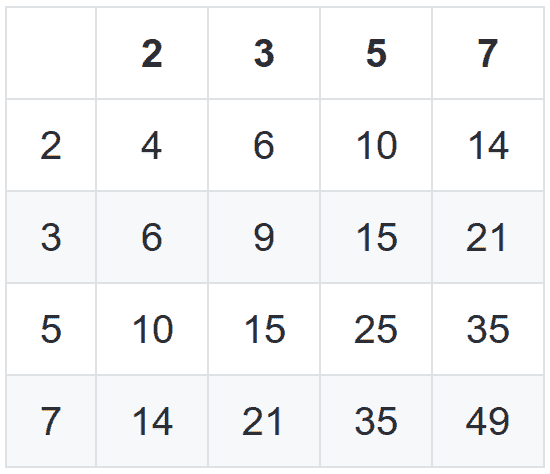

# 厄拉多塞的筛子

> 原文：<https://dev.to/nisevi/the-sieve-of-eratosthenes-528f>

用前 N 个素数生成乘法表。

[T2】](https://cdn-images-1.medium.com/max/1024/1*MWlNEtcGTEDid6GDTVtPDQ.jpeg)

### 简介

这篇文章是为了向你介绍我创建一个命令行工具来打印前 N 个质数的乘法表的步骤。结果是一个名为 [primes_table](https://rubygems.org/gems/primes_table) 的 gem，关于相关代码，你可以看看这个[库](https://github.com/nisevi/primes_table)。

#### 堆栈:

*   美沙酮一个创造命令行工具的了不起的项目；
*   Ruby 版本 2 . 5 . 0；
*   作为测试框架的 RSpec
*   [Simplecov](https://github.com/colszowka/simplecov) 用于代码覆盖；
*   [CodeClimate](https://codeclimate.com/github/nisevi/primes_table) 用于工程过程洞察和自动化代码审查；
*   [信号量](https://semaphoreci.com/nisevi/primes_table)用于持续集成；

#### 输入

命令行工具将接收两个参数`rows`和`columns`。

规格:

*   默认情况下，该表将生成为 10X10 的矩阵；
*   指定行或列时，仅考虑大于或等于 10 的值；
*   如果输入小于 10 的值，它将默认为 10；
*   只考虑整数值。例如，如果您输入一个字符串，它将被转换为一个整数，结果将是 0(零)，并将默认为 10，因为零小于 10；

#### 输出

前 N 个素数的乘法表。第一行和第一列分别是质数。

例如，默认输出将第一个质数作为第一列，直到数字 10。这意味着数字 2，3，5 和 7。第一排也一样。下图应该有助于您直观地看到所需的输出:

[T2】](https://cdn-images-1.medium.com/max/550/1*0x282WdYJKF9rBUsyH7DSA.png)

### 创造宝石

安装美沙酮后，您只需运行:

`methadone --readme --rspec --license apache primes\_table`

该命令将生成命令行工具的框架。

我创建了额外的几个选项，添加到您创建项目时已经包含的选项中。之后，所有选项都是:

*   `-h, --help`查看可用选项；
*   `-r, --rows ROWS`指定多少行；
*   `-c, --columns COLUMNS`指定有多少列；
*   它会给出你正在使用的宝石的版本；

下面的代码处理没有输入选项的情况。对于`rows`和`columns`，默认选项总是 10。