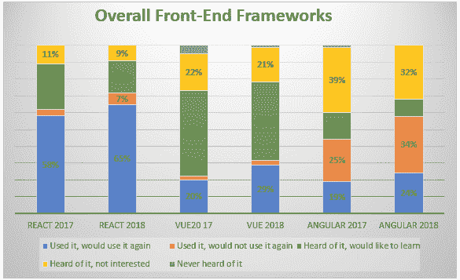
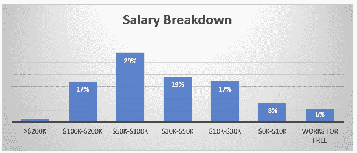
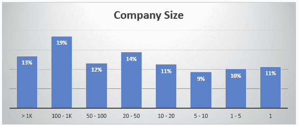
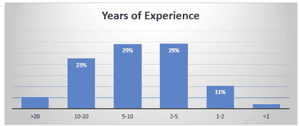
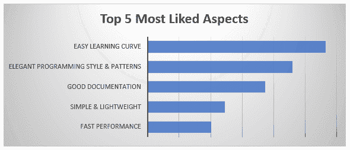
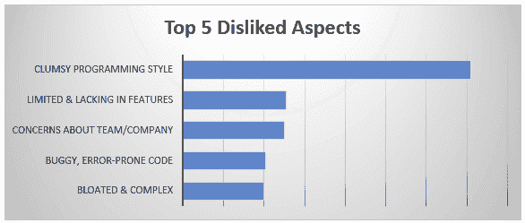
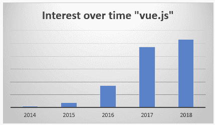

# Javascript 2018 的状态:对 Vue 的看法

> 原文：<https://dev.to/progresstelerik/the-state-of-javascript-2018-the-view-on-vue-2n5d>

2018 年[JavaScript 调查](https://2018.stateofjs.com/)结果刚刚发布，因此，随着我们进入年底，这是一个很好的时间来看看 [Vue.js](https://vuejs.org/) 并看看事情的发展方向。

由萨夏·格雷夫、T2、拉斐尔·本尼特和 T4 主持的年度 JavaScript 现状调查收集了 20，000 多名网络开发者对过去一年趋势的意见。虽然这不是整个行业，但可能是一个很好的样本，也是了解 Vue 命运的一个很好的起点。上面写了什么？

让我们直接进入正题 Vue 怎么样了？当然，这不是一个比赛，但仍然…让我们加入反应和角度的结果。为了真正回答这个问题，让我们也展示一下去年的数据，看看它们每年的趋势如何。是的，调查列出了一些其他框架，但与三大框架相比，它们都在“噪音”范围内，所以我没有把它们包括在内。

[T2】](https://res.cloudinary.com/practicaldev/image/fetch/s--cZAYIzDq--/c_limit%2Cf_auto%2Cfl_progressive%2Cq_auto%2Cw_880/https://d585tldpucybw.cloudfront.net/sfimages/default-source/default-album/vue01cf48ed25f6f645df9dbbf866f68aa2fa.png%3Fsfvrsn%3D70102507_0)

非常丰富多彩！那么这实际上告诉了我们什么呢？首先，在过去的一年中，这三个框架的使用量似乎都有所增加。除了将 React 或 Angular 数据的趋势与 Vue 进行比较之外，我不打算详细介绍它们。有一个博客覆盖了关于[反应](https://dev.to/progresstelerik/a-react-state-of-mind-state-of-javascript-survey-2018-de4)的数据，还有一个博客覆盖了[角度](https://dev.to/progresstelerik/the-state-of-js-survey-2018---the-angular-scoop-4b4j)的数据，这些数据更加详细。

有一点很突出，那就是现在几乎每个人都听说过 Vue。2017 年，约有 5%的人表示他们从未听说过 Vue，而去年这一比例降至 1%以下。

在过去的一年中，积极使用率从 20%上升到了 29%。这使它比 Angular 略高，大约是 React 的一半(我们不是在比较)。然而……与所有数据一样，我们需要将它放在上下文中，并将其与其他信息关联起来。可以说，Vue 是最容易掌握和开始使用的，所以这些数字可能包括更多的人在小项目或学习中使用它。这似乎得到了我去年与之交谈过的开发人员的反馈的证实。这并不意味着 Vue 没有被用在真正的项目中，只是这 29%可能比其他框架包含更多的“挑刺者”。尽管如此，还是有很多人在使用 Vue，而且人数还在增长。

请注意,“听说过，不感兴趣”和“听说过，想学习”的总数大致持平，略有下降。这与正在进行的采用是一致的，随着时间的推移，我们预计更多的“听说过，想学习”类别将转变为“用过的”类别。

需要注意的最后一个数据点是,“使用过它，不会再使用它”的比例非常小，并且只增加了很小一部分。它比 React 低，比 Angular 低很多(同样，不是我们在比较)。这是一个非常好的迹象。人们正在尝试它，他们正在使用它，他们喜欢它。

## 这些人是谁？

> 请注意，以下数据和图表仅面向 Vue 开发人员，而非全部调查受访者。

调查中还列出了一些人口统计信息。第一个是薪资信息。这是按框架划分的，对于 Vue，17%赚 10 万美元到 20 万美元，29%赚 5 万美元到 10 万美元。5 万至 20 万美元的范围涵盖了美国普通开发人员的工资。然而，有趣的是，19%的人把他们的薪水列为 3 万美元到 5 万美元，17%的人把他们的薪水列为 10K 美元到 3 万美元。这些人可能来自其他工资水平较低的国家，或者他们可能是一些学生、兼职承包商或从事其他工作的人，他们正在走向发展。这些类别可能表示使用 Vue 但不在生产环境中的一群人。

此外，如果你是 Vue 开发人员中少数几个年收入超过 20 万美元的人之一，请立即联系我，告诉我你是如何做到的。

[T2】](https://res.cloudinary.com/practicaldev/image/fetch/s--vDy9ktJl--/c_limit%2Cf_auto%2Cfl_progressive%2Cq_auto%2Cw_880/https://d585tldpucybw.cloudfront.net/sfimages/default-source/default-album/vue02ece27c39450a459faf8135422e88fa68.png%3Fsfvrsn%3De64460c2_0)

我们还获得了按框架划分的公司规模数据。在这里我们可以看到，对于 Vue，34%的人表示他们在一家拥有 100 多名员工的公司工作，20%的人表示他们在一家拥有 5 名或更少员工的公司工作，因此公司规模分布相当均匀。请注意，类别的重叠(例如“1-5”和“1”)并不是我的错误，这就是列出结果的方式。

[T2】](https://res.cloudinary.com/practicaldev/image/fetch/s--AbRetoqj--/c_limit%2Cf_auto%2Cfl_progressive%2Cq_auto%2Cw_880/https://d585tldpucybw.cloudfront.net/sfimages/default-source/default-album/vue032070878868964500b7b781d15f267e7e.png%3Fsfvrsn%3D34ba7264_0)

最后，他们列出了每个框架的多年经验，在这里我们也得到一个很好的传播。30%有 2-5 年，30%有 5-10 年经验，23%有 10-20 年经验。少于 2 年的是 13%,所以我们确实看到一些入门级的兴趣，但不如更有经验的开发人员多。

[T2】](https://res.cloudinary.com/practicaldev/image/fetch/s--raLY6INf--/c_limit%2Cf_auto%2Cfl_progressive%2Cq_auto%2Cw_880/https://d585tldpucybw.cloudfront.net/sfimages/default-source/default-album/vue044c37e965448c482aac7c05f7c096cc7c.png%3Fsfvrsn%3D2c3c8032_0)

## 更深的潜

查看特定于 Vue 的数据可以让我们更好地了解谁以及为什么人们在使用 Vue。

首先，在 Vue“最受欢迎”的方面中，排名第一的原因是“简单的学习曲线”，其次是“优雅的编程风格”和“良好的文档”。换句话说，很容易拿起来。另一方面，“快速性能”在列表中排名第五，所以人们在关心性能的实际应用中使用它。请注意，这些人说他们已经使用过它，并将再次使用它。

[T2】](https://res.cloudinary.com/practicaldev/image/fetch/s--0OukdjEu--/c_limit%2Cf_auto%2Cfl_progressive%2Cq_auto%2Cw_880/https://d585tldpucybw.cloudfront.net/sfimages/default-source/default-album/vue05.png%3Fsfvrsn%3Dd178c492_0)

在那些说他们已经使用过并且不会再使用它的人中，记住**这是非常小的百分比**，第一大原因是“笨拙的编程风格”。这似乎与另一组喜欢它的原因不一致，并表明 Vue 就像南瓜味啤酒。有些人就是喜欢，有些人觉得很恶心。这是风格和偏好的问题。(郑重声明，认为南瓜味啤酒很恶心的人是对的)。

[T2】](https://res.cloudinary.com/practicaldev/image/fetch/s---tpjBJ5k--/c_limit%2Cf_auto%2Cfl_progressive%2Cq_auto%2Cw_880/https://d585tldpucybw.cloudfront.net/sfimages/default-source/default-album/vue065d33da72467949edb2e253d2f2f9a000.png%3Fsfvrsn%3Dd6f9c66_0)

下一个有趣的数据集是快乐的 Vue 用户所在位置的细分。在中国、法国、印度尼西亚、泰国、越南、尼日利亚、墨西哥、秘鲁、巴西和其他一些国家，这一比例更高。满意度较低的地方包括美国、印度和澳大利亚。

报告总结(框架部分)指出，React 目前是热门框架，Vue 稳步增长。报告指出，Vue 的 GitHub 星级总数实际上已经超过 React。Angular 拥有相当大的用户群，虽然不是每个人都喜欢 Angular，但它似乎在某些情况下很适合，而且没有任何从舞台上消失的迹象。

## 但是等等，还有！

“JavaScript 现状”调查为我们提供了很好的信息，它确实从大量开发者那里收集了信息，但这并不是整个市场。它还会问某些问题，但不会问其他问题。还有其他一些值得比较的调查，其中之一是 Stackoverflow 的“[开发者调查结果](https://insights.stackoverflow.com/survey/2018/#overview)”。或者至少如果他们包括 Vue 的话会是这样，但目前他们还没有。Vue 可能正在飞速发展，但还没有普及。请注意，Stackoverflow 上有大量关于 Vue 的帖子。

2018 年 Stackoverflow 调查包括 Angular 和 React 以及。NET 等各种工具，唯独没有 Vue。有趣的是，在 Stackoverflow 调查中，Angular beats 以 37%比 28%的比例击败 React 成为最常用的框架。这似乎与 Javascript 调查结果不一致，在调查结果中，React 的优势超过 Angular。虽然这与 Vue 无关，但它凸显了真正挖掘调查数据的重要性——问题究竟是如何提出的？谁有权访问调查？谁完成了调查？等等。这也表明你需要小心不要过于依赖一个调查的结果。

关于 Stackoverflow 调查我补充两点说明。首先，它是在 2018 年初进行的，所以它已经快一年了。第二，我没有看到实际的调查，所以我(合理地)假设 Vue 只是被排除在选择列表之外，因为它根本不在结果列表中。

## 谁在招聘

我们还可以通过许多其他方式来看待 Vue 的增长。例如，我们可以浏览招聘信息，看看有多少公司将“Vue”列为职位描述的必备技能。在热门求职网站[Indeed.com](https://www.indeed.com/)上搜索“Vue ”,有 2661 个职位的描述中包含了“Vue”这个词。这些大多是给开发者的。如果我们真的想得到一个准确的数字，我们应该花一些时间，找到其他“Vue”结果过滤掉。我看到一个是指“Pearson Vue”，一个是关于“校园 Vue”，一个是关于“Playstation Vue”——但大多数是针对开发者的，我更希望看到市场的总体感觉，而不是一个完美的数字。"方向准确"

有趣的是，React 给了我们 58433 个工作岗位，Angular 给了 17219 个工作岗位。这两个结果看起来好像他们也大多是开发人员，尽管 React 数似乎相当高，任何详细的分析都需要花费一些时间来寻找要过滤掉的关键字。还要注意的是，一些招聘启事的措辞类似于“有 React、Angular 等技术方面的经验”。等等。”所以他们不一定要找 React 开发者。

尽管我列出了所有的警告，但这描绘了一幅非常清晰的市场图景，即 React 深入人心，Angular 仍然强劲，而 Vue 在生产使用中刚刚起步。随着我们在其他来源中看到的所有这种兴趣，我们应该预计在未来几年内，随着兴趣转化为使用，Vue 的职位发布将会增加。

## 谁在搜索

谷歌总是擅长一些分析，我们可以使用谷歌趋势来查看 Vue 在搜索基础上的受欢迎程度。这里，我们也需要注意如何构造查询。查看结果的时间线可以告诉我们很多信息，因为我们知道 Vue 何时出现(2014 年)，所以如果结果没有在 2014 年左右从零开始，然后稳步攀升，我们可能使用了错误的搜索词。我们也可以简单地谷歌“Vue”或其他变化，看看还有什么是我们可能需要过滤掉的排名。

搜索“Vue”趋势给我们的结果可以追溯到 2004 年，所以这显然不好。搜索[“Vue.js”趋势](https://trends.google.com/trends/explore?date=all&q=vue.js)给我们一条从 2014 年开始的曲线，然后从那里攀升，这样看起来不错，而且肯定没有其他“vue . js”可能会增加不想要的结果。另一方面，有些人可能只是在搜索“Vue”这个词，因为它的缩写更常见。只在“Vue.js”上搜索会漏掉那些人。

 

谷歌趋势数据

谷歌趋势上同样有趣的是“地区兴趣”报告，该报告将韩国列为第一。圣赫勒拿岛是第二名，我欢迎任何对此的解释。日本是第三，以此类推。我会更关心“圣赫勒拿”的结果(糟糕的数据？)只不过对美国进行趋势分析会得到非常相似的图表。从我们在这里看到的结果来看，Vue 显然仍在增长(我们缺少 2018 年 12 月的数据，这将使总数更高)。人们正在寻找有关它的信息。2018 年的增长不太可能赶上 2017 年的增长，但请记住，“Javascript 现状”调查显示，Vue 在 2018 年几乎没有不熟悉它的人。我不会展示 React 或 Angular 的比较，因为很难获得精确的苹果与苹果的搜索术语。

## 结论

所有这些数据源都有助于描绘 Vue 的采用情况及其在现实世界中的使用情况。然而，我不能强烈警告你把每一个来源仅仅当作一个数据点。正如我上面提到的，问了什么确切的问题或使用了什么搜索词，数据是如何收集的，谁有权做出贡献，等等。所有这些都会以这样或那样的方式扭曲数据。只有通过查看多个数据源，才能了解全局。总体情况是，Vue 可能是第三名，但它正在增长，它已经有了强大的追随者，而且很受欢迎。

我要补充的最后一个数据点是我在过去一年中参加了许多 Vue 会议的亲身经历。首先，去年增加了几个新的 Vue 会议，参加人数相当多。生态系统仍在增长，随着采用的增长，支持活动(如事件)和支持工具(如 Vue 的剑道 UI)也会增长。我在这些参加人数众多的 Vue 会议上与许多开发人员交谈过，他们非常热情，许多人都在真正的生产应用上使用 Vue。Vue 在这里，而且会一直在这里。至少现在是这样，因为在网络应用程序的世界里，唯一真正不变的是变化。