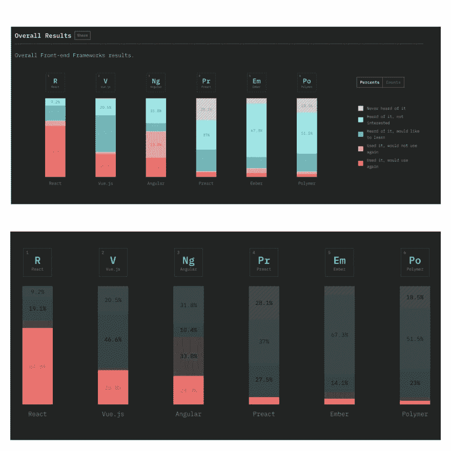
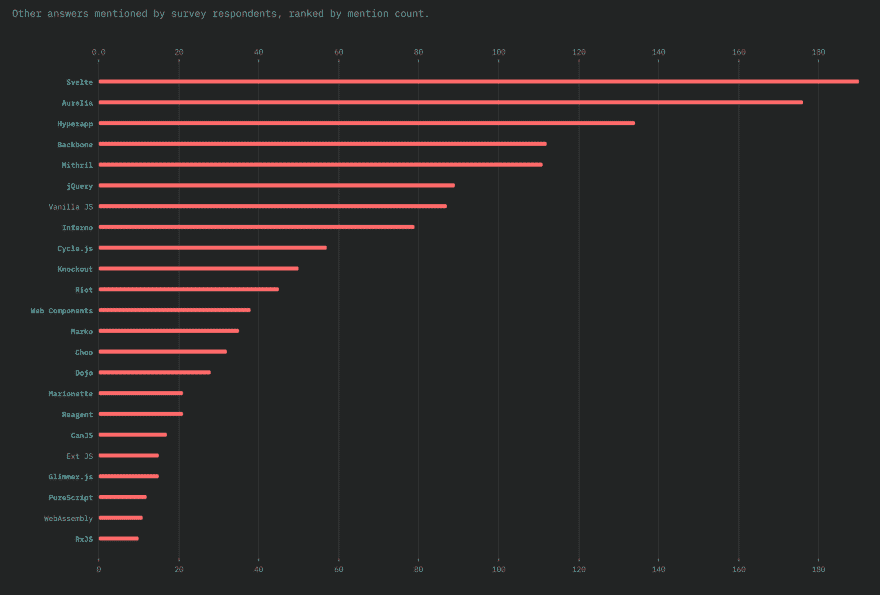
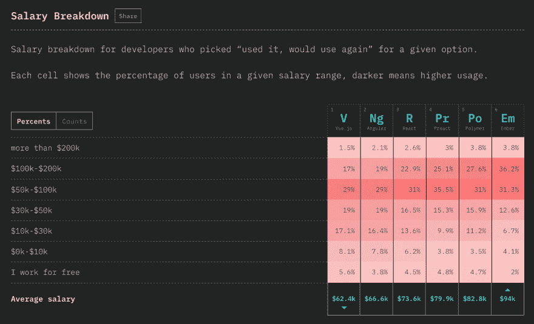
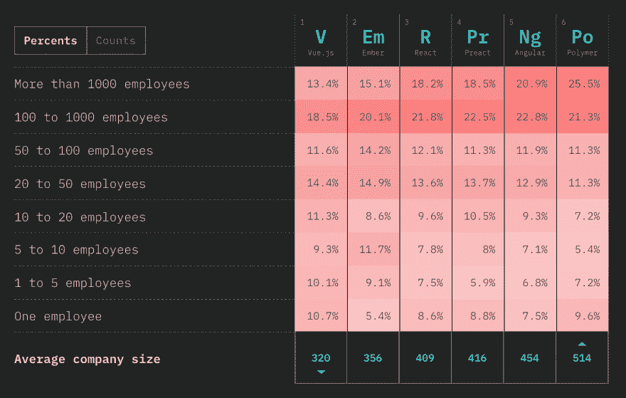
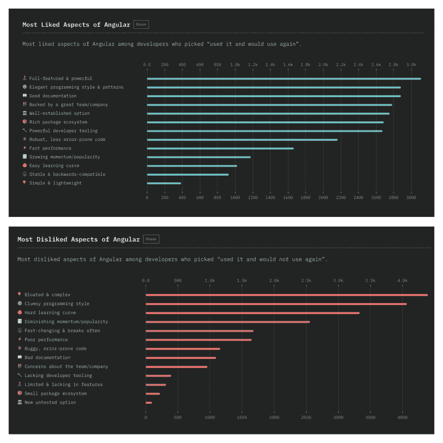
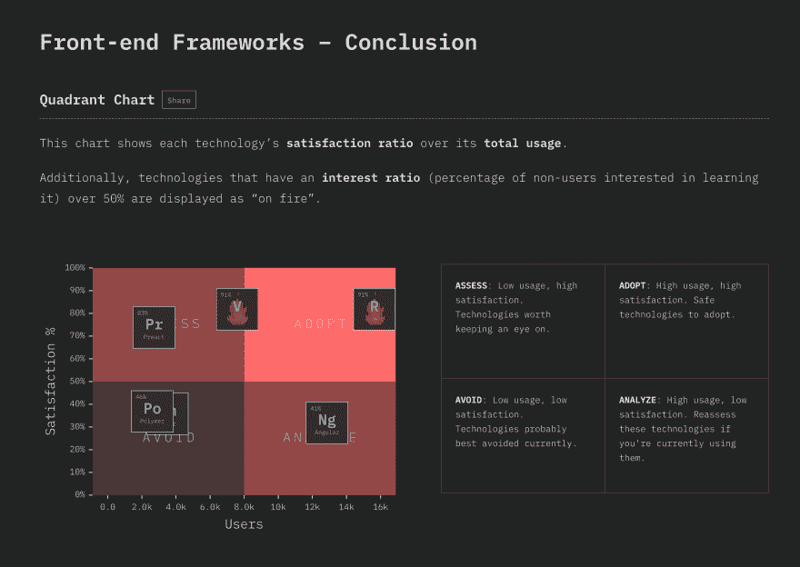
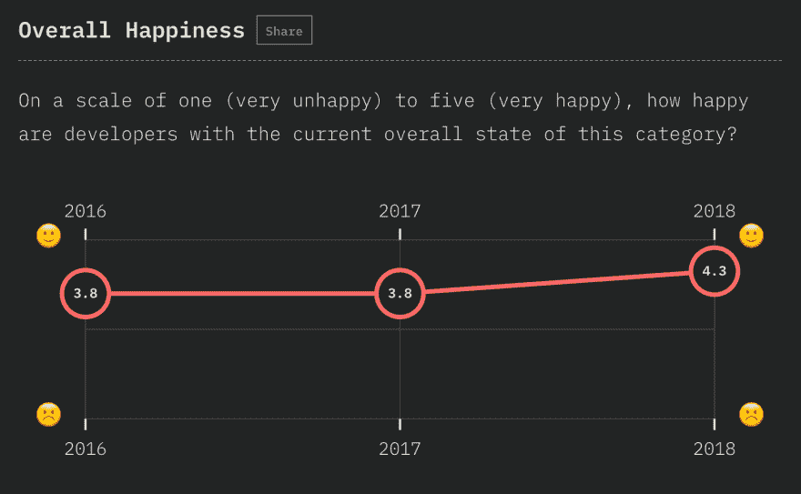

# 2018 年 JS 调查状况-角度勺

> 原文：<https://dev.to/progresstelerik/the-state-of-js-survey-2018---the-angular-scoop-4b4j>

当你本周坐下来参加感恩节或朋友聚餐时(如果你喜欢这种事情)，你可能会有兴趣知道 2018 年年度[JS 状态调查的结果。我们知道这个星期应该主要是花时间和心爱的人在一起，远离代码，所以我们将保持这个更新简短而甜蜜。我们将涉及很多领域，但主要侧重于角度。](%E2%80%9Dhttps://2018.stateofjs.com/%22)

[T2】](https://res.cloudinary.com/practicaldev/image/fetch/s--T2FGYVNl--/c_limit%2Cf_auto%2Cfl_progressive%2Cq_auto%2Cw_880/https://www.telerik.com/sfimages/default-source/blogs/2018/2018-11/state-of-js-2018/img-1.png%3Fsfvrsn%3D667ac0d7_2)

## 2018 年框架流行度

[T2】](https://www.telerik.com/sfimages/default-source/blogs/2018/2018-11/state-of-js-2018/img-2935c0ad7711045c4a0656cd28863b0ac.jpg?sfvrsn=d9876f18_2)

受欢迎程度的总体结果显示 React、Vue.js 和 Angular 领先，其次是 Preact、Ember 和 Polymer。如果我们只关注“使用过并会再次使用”这一类别，我们可以看到这三个框架的百分比细分，这使得这三个框架牢牢占据领先地位。令我惊讶的是，Preact 竟然位列前四，所以我在调查中仔细查看了*哪些*框架，并发现了这个可爱的列表:

[T2】](https://www.telerik.com/sfimages/default-source/blogs/2018/2018-11/state-of-js-2018/img-2.png?sfvrsn=229ba64b_2)

其他一些顶级框架没有进入前 6 名，包括 Svelte、Aurelia、Hyperapp 和 Backbone。都在 200 次提及以下。

现在可能是提醒大家的好时机:

> 这些结果只和他们调查的受众一样好，可能不能准确地代表整个开发社区。

因此，尽管看着结果并假设其背后的*原因*可能很有趣，但每个结果都应该有所保留。

[T2】](https://res.cloudinary.com/practicaldev/image/fetch/s--8cnj9Gs---/c_limit%2Cf_auto%2Cfl_progressive%2Cq_auto%2Cw_880/https://www.telerik.com/sfimages/default-source/blogs/2018/2018-11/state-of-js-2018/img-4.png%3Fsfvrsn%3D10410380_2)

## 2018 年前端框架开发人员薪资

我认为这是值得注意的，如果你查看这些相同框架的工资，图表几乎完全与受欢迎程度图表相反——Ember、Polymer 和 Preact 的总体平均工资最高。

[T2】](https://www.telerik.com/sfimages/default-source/blogs/2018/2018-11/state-of-js-2018/img-5.png?sfvrsn=5e92d879_2)

### 薪酬背后的发现

为什么不太受欢迎的框架薪酬更高？我怀疑和供求关系有关。如果没有很多开发人员*喜欢某个框架中的*编程，那么对他们的需求(以及薪水)应该会更高。

还有，侧面说明一下，这些人是世卫组织吗？

[T2】](https://www.telerik.com/sfimages/default-source/blogs/2018/2018-11/state-of-js-2018/img-6.png?sfvrsn=2eeb6a7a_2)

我很惊讶有这么多人免费工作，尽管总共只有大约 1000 人。我真心希望这些人是从事开源项目或非盈利性工作的人。我们作为开发者所做的事情是有价值的，我希望即使是最新的开发者也知道这一点。

## 2018 年框架公司规模

[T2】](https://www.telerik.com/sfimages/default-source/blogs/2018/2018-11/state-of-js-2018/img-7.png?sfvrsn=d5b3b683_2)

另一个不足为奇的结果是最大公司规模的两个主要框架——聚合物和棱角。这并没有让我感到惊讶，因为它们都是由一个巨大的公司 Google 创建、维护和测试的。因此，当其他大公司/团队考虑使用什么框架时，他们会选择一个由同样大的公司创建/测试的框架，这是有意义的。

## 测角结果

### 最喜欢/不喜欢棱角分明的方面

似乎 Angular 最受欢迎是因为它功能齐全、功能强大，并且有很好的文档。然而，它是最不受欢迎的，因为它过于臃肿和复杂，学习起来很困难。React 也不喜欢它的学习曲线，而 Vue.js 是唯一一个非常喜欢的(成千上万的投票者)因为它的学习曲线很容易。

[T2】](https://www.telerik.com/sfimages/default-source/blogs/2018/2018-11/state-of-js-2018/img-8.jpg?sfvrsn=90c88324_2)

同样，这些发现一点也不令我惊讶。我认为随着一个更大的生态系统和功能齐全的框架，一个更难的学习曲线将随之而来。我喜欢良好的文档是 Angular 受欢迎的另一个原因。好的文档是战胜困难的学习曲线的最好方法之一。

## 总体调查结果—结论

Angular 得出的结论并不像人们希望的那样乐观。

[T2】](https://www.telerik.com/sfimages/default-source/blogs/2018/2018-11/state-of-js-2018/img-9.png?sfvrsn=c6531428_2)

> 过去几年的另一个故事是 Angular 的衰落。虽然它在原始使用方面仍然排名很高，但它的满意度只有 41%，相当令人失望。因此，虽然由于其庞大的用户群，它可能不会去任何地方，但很难看到它将如何夺回其在前端宝座上的位置。-2018 年 JS 状态

出于几个原因，这一预测似乎有点过于悲观。诚然，Angular 不会去任何地方，因为它有庞大的用户群，但是，我相信，由于[Angular 正在稳步前进](https://dev.to/progresstelerik/whats-new-in-angular-7-24b2)以及[他们已经制定的未来计划](https://www.telerik.com/blogs/first-look-angular-ivy)，我们可能会在未来几年内颠覆王座。

我还认为，不幸的是，调查将 AngularJS 和 Angular 在今年和未来几年的调查中混为一谈。

[T2】](https://www.telerik.com/sfimages/default-source/blogs/2018/2018-11/state-of-js-2018/img-10.png?sfvrsn=b81c25f9_2)

AngularJS 是一个与 Angular 完全不同的框架，我相信它的用户会有完全不同的关注点和快乐水平。正因为如此，我真的不知道我们可以从这项调查中获得多准确的角度发现。

## 开发者快乐

[T2】](https://www.telerik.com/sfimages/default-source/blogs/2018/2018-11/state-of-js-2018/img-11.png?sfvrsn=6e131381_2)

看起来，作为开发人员，我们对 JS 框架的状态比过去两年更满意。对于我们 JS 社区来说，事情可能正在变得平稳。如果你是仍然不开心的人之一，那么问题可能是你的工作，而不是你正在使用的框架。

我将把我从一位业内朋友那里得到的价值百万美元的建议传递给大家。如果你在工作中不开心，花两周时间分析原因。写下这两周你能想到的所有你喜欢或讨厌的事情，不管这些事情看起来多么微不足道。(举个例子。查看公司邮件，设计用户界面，甚至是我的办公桌在办公室的什么位置。)一旦你列好了清单，狩猎就开始了。开始寻找那些做你喜欢的事情的公司。即使他们当时没有在招人，也给他们发一封电子邮件，附上你的简历，解释*你为什么要找他们*和*他们的价值观如何与你的*一致。

我希望这个建议有所帮助，即使这意味着你远离 Angular(我的真爱)。如果这意味着在我们的社区中有更快乐、更有生产力的开发人员，我会认为这是一个胜利。我希望你们都有一个美好的一周，不管你们是不是在庆祝火鸡日和快乐编码！