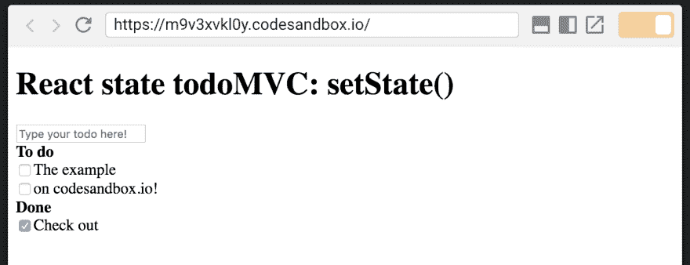

# 状态的状态:2018 年反应状态管理

> 原文：<https://dev.to/joshua/the-state-of-the-state-react-state-management-in-2018-2l0c>

[T2】](https://res.cloudinary.com/practicaldev/image/fetch/s--SMu1KSUv--/c_limit%2Cf_auto%2Cfl_progressive%2Cq_auto%2Cw_880/https://thepracticaldev.s3.amazonaws.com/i/j954wf72re89cn06fe5c.jpg)

在 React 中，管理状态的方式总是数不胜数。Redux 一直是一个受欢迎的选择，但是随着 React 16 和最近发布的库的出现，现在有了更多的选择。这些选项是什么，为什么您会使用其中任何一个选项而不是其他选项？

我在 React 中经历了一些管理状态的流行选择，并创建了非常简单的 todo 应用程序来演示它们的用法。我尽量让事情简单，这样你就可以直接对比这些例子了。源代码附有注释，所以看看哪一个最适合您的用例吧！

# React 的 setState()

由于某种原因，许多不同的 React 教程都在开始讨论状态。它是 React 的一部分，是框架工作方式的核心部分。

这在 [react 文档](https://reactjs.org/docs/state-and-lifecycle.html#adding-local-state-to-a-class)“状态”中被称为“本地状态”。这里我们称之为“setState()”，以区别于其他方法。

setState()是一种管理应用程序状态的简单方法，除了 React 之外不需要任何库。

使用 setState()有一些很好的理由:

*   您的状态不能完全描述为普通对象(您可以在 setState()中存储不可序列化的状态，例如 DOM 节点或具有循环引用的对象)

*   您的更改不是纯粹的函数，而是依赖于“外部世界”(如浏览器)来决定状态应该如何更改

*   你不需要 UI 的全局视图——你的状态永远不会被远程保存或存储。

### ✨举例

有带注释的源代码可用于比较示例。

[T2】](https://res.cloudinary.com/practicaldev/image/fetch/s--_fsImIm_--/c_limit%2Cf_auto%2Cfl_progressive%2Cq_auto%2Cw_880/https://thepracticaldev.s3.amazonaws.com/i/5g5xjtj4td4ywxzszsak.png)

[T2】](https://codesandbox.io/s/m9v3xvkl0y)

## Redux

当上述约束不再成立时，Redux 是使用 setState()的一种流行替代方法。Redux 是一组工具，用于以功能性的、一致的方式写入和读取全局状态。 [React redux](https://github.com/reduxjs/react-redux) 提供了一种将 redux 状态映射到 React 组件的便捷方式。

### 异步冗余

对于异步和远程状态， [Redux thunk](https://github.com/reduxjs/redux-thunk) 和 [Redux saga](https://github.com/redux-saga/redux-saga) 是热门选择。Redux thunk 使用 Redux 中间件来允许动作是异步函数，而 redux saga 使用一种模式来轻松处理异步行为和副作用。

Redux observables 是一种允许状态管理中所有 observables 功能的方式，通过一些中间件将 RxJS 插入 Redux。 [rxmarbles](http://rxmarbles.com/) 提供了一些很好的例子，让你知道这里有什么可能。

虽然 Redux thunk 和 Redux saga 使 Redux 的异步状态管理变得更加容易，但是对于开发人员来说，关于状态管理还有一件事情需要学习。

⚠️ Redux 是 React 中状态管理的事实上的标准，但是[你可能不需要 Redux](https://medium.com/@dan_abramov/you-might-not-need-redux-be46360cf367) (作者 Dan Abramov，Redux 的*合著者*！).选择比你需要的更复杂的东西会让你慢下来，让简单的状态变化变得复杂。这适用于列表中的其他项目——除了 setState()之外，您可能不需要任何东西。

要问的问题在[中有很好的解释。你可能不需要 Redux](https://medium.com/@dan_abramov/you-might-not-need-redux-be46360cf367) ，但总的来说，如果你需要可序列化的状态和一种自以为是的管理全局状态的方式，Redux 是好的，但对于一些用例来说可能是过度的。

### ✨举例

[T2】](https://codesandbox.io/s/mzjmrpn63y)

## 阿波罗链接状态

[Apollo 链路状态](https://apollo-link-state.fastjs.link)是一种将本地状态管理与远程状态管理相结合的方式。该方法假设您正在使用 [Apollo](https://www.apollographql.com/) ，这允许您在 Rest 之上使用 GraphQL。然而，*为了使用这种方法，你不需要 GraphQL 服务器！*–[apollo-link-http](https://www.apollographql.com/docs/link/links/http.html)让你可以编写任何你需要的东西来采用 Apollo 客户端。这意味着它是一个可行的状态管理一体化解决方案(包括异步和远程)，即使您不使用 GraphQL。

本地和远程状态混合的方式是通过查询和突变。`apollo-link-state`让您可以访问一个特殊的`@client`指令，该指令告诉 Apollo 在本地内存中寻找这个状态，而不是某个远程服务器。

```
query  GetTodos  {  items  @client  {  id  text  done  }  } 
```

Enter fullscreen mode Exit fullscreen mode

只为状态管理设置 Apollo 可能需要一些工作，但是回报是一种查询和改变状态的自然方式，结合了本地和远程状态管理。

对于简单的用例，以及不太依赖异步或远程状态的应用程序，Apollo 链接状态无疑是多余的。对于更复杂的用例，Apollo 可以通过将状态管理整合到一个系统中来提供帮助。

### ✨举例

[T2】](https://codesandbox.io/s/k9k56pnj77)

## 未说明

React 16 带来了一个[新的上下文 API](https://reactjs.org/docs/context.html) ，这是一种围绕 React 的虚拟树共享信息的好方法。[未说明的](https://unstated.fastjs.link)是一个充分利用这一点的库——它是一种跨应用管理全局状态的轻量级方式。

它在概念上类似于 Redux，但是关于如何使用它的意见较少。状态没有被分割成不同的部分，定义“动作”的工作留给了您。该 API 在形状上与 React 的 setState()非常相似。

⚠️考虑到这一点，如果你使用的是未声明的，你应该再次仔细考虑 setState()对于你的用例是否足够。来自未声明的自述文件:

[未陈述的自述文件](https://github.com/jamiebuilds/unstated#what-state-should-i-put-into-unstated)为何时使用诸如 Apollo、库或主干模型和集合之类的替代品提供了很好的指导。

自述文件中:

> 未声明的不是雄心勃勃的，当你需要它时使用它，因为这个原因它很好很小。不要把它当成“Redux 杀手”。不要试图在此基础上构建复杂的工具。不要多此一举。试试看，看你喜欢不喜欢。

如果您正在寻找一个简单的、非自以为是的状态管理系统，并且不想要备选方案的开销，那么它值得一看。

### ✨举例

[T2】](https://codesandbox.io/s/qxw215zm7j)

## 光荣提及

这不是一个详尽的列表！我引用了一些这里没有提到的替代方法，这些方法我还不能在这里创建例子或包括进来。

*   [Stockroom](https://github.com/developit/stockroom#readme) 让你将商店管理工作交给网络工作者！这将主线程从计算中解放出来，并使所有读取和修改状态的请求都是异步的。

*   [主干模型和集合](http://backbonejs.org/)是一个众所周知的替代方案，可能足以满足您的用例。

*   [Alfa](https://lsm.github.io/alfa/#/) 是一个非常小而简单的状态管理选项。

*   MobX 是一个受欢迎的选择(希望我有机会尝试一下，并将其添加到博客中！)

# 总结

React 本身不包括这种类型的状态管理，这导致了替代状态管理系统的兴起。做出这一选择可能很难，但允许选择是件好事——不同的问题用不同的解决方案效果更好，而且 React 足够灵活，可以处理所有问题，这很好:)

* * *

👋嗨！我是约书亚·纳尔逊。我是一名开发人员，我关心的是让网络变得更好，为每个人服务，✨