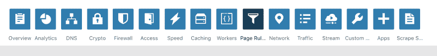
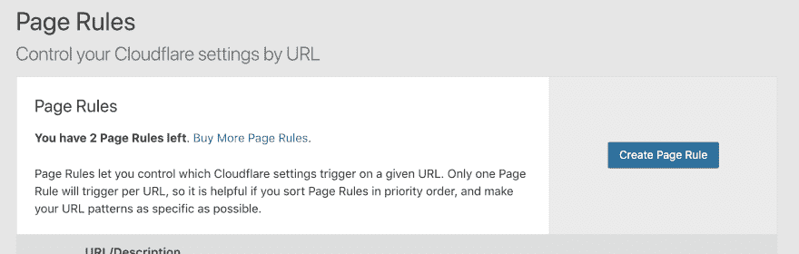
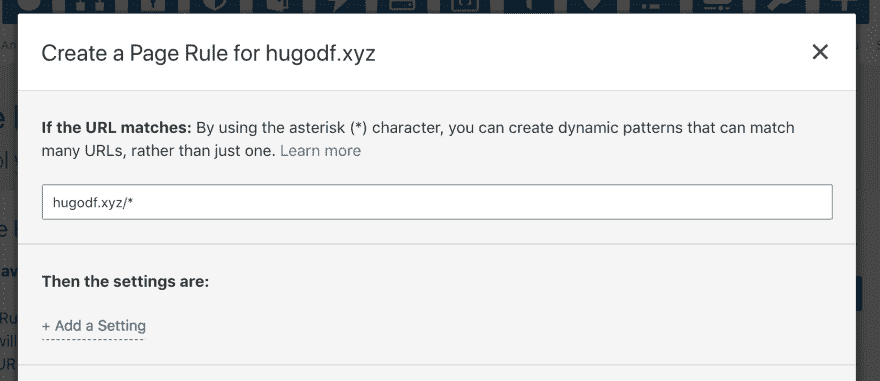
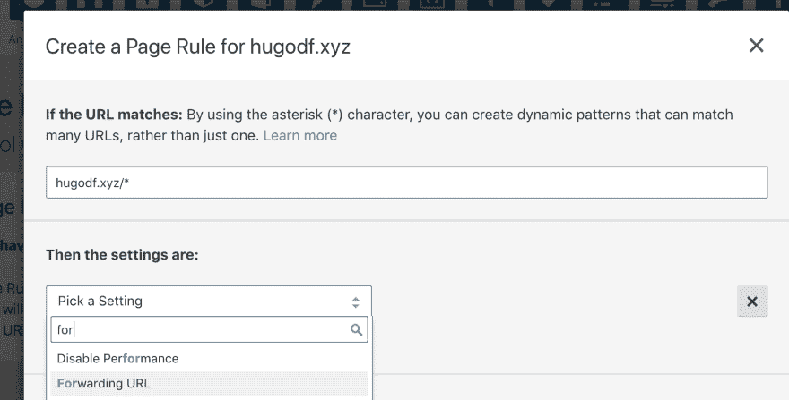
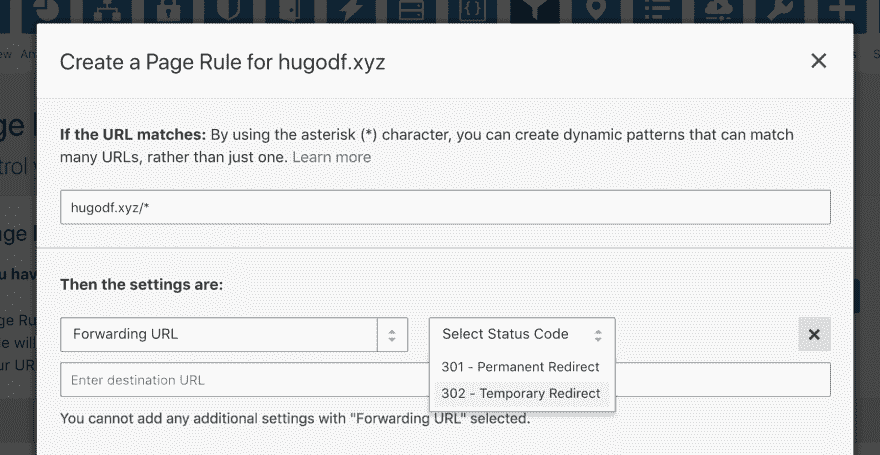
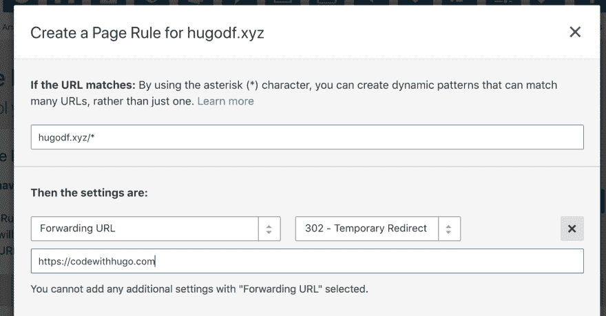
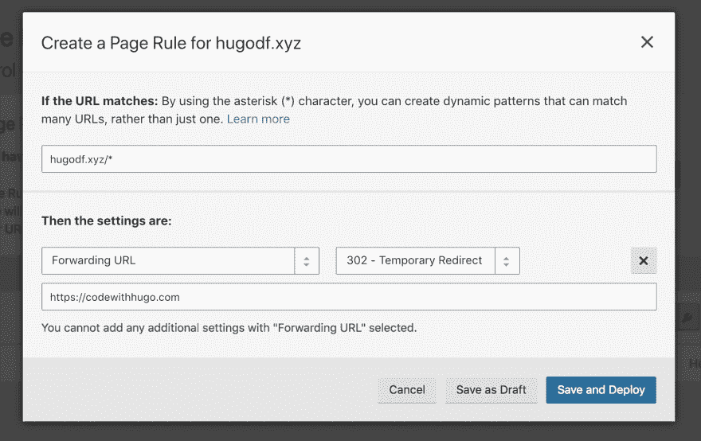

# 使用 Cloudflare 创建域重定向的分步指南

> 原文：<https://dev.to/hugo__df/the-step-by-step-guide-to-create-a-domain-redirect-with-cloudflare-48l6>

登录到您的仪表板。

1.  选择要重定向的域
2.  转到页面规则 

3.  点击【创建页面规则】 

4.  输入`your.domain/*`(匹配所有流量)，URL 的流量将被重定向

5.  点击【添加设置】 

6.  选择【转发网址】 

7.  选择重定向的类型，我推荐 302，因为它们的缓存不那么激进(所以如果你想用那个域做重定向以外的事情，你可以) 

8.  输入您的转发网址 

9.  点击  的【保存并部署】

完成了，您刚刚创建了一个从您的域到另一个域的重定向🙂

安德鲁·普雷布尔