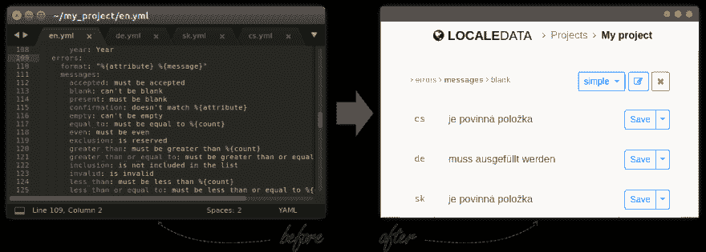
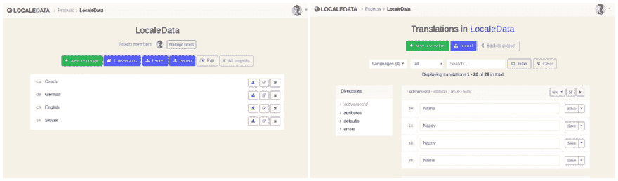
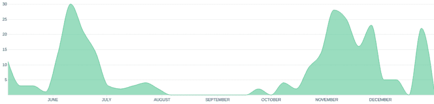

# LocaleData 背后的故事

> 原文：<https://dev.to/jkostolansky/the-story-behind-localedata-3fna>

## 识别痛点

我是一名软件工程师，在一家年轻的教育技术公司工作，开发一个全球性的 Ruby on Rails SaaS 应用程序。我们与外部翻译人员合作，帮助我们将其本地化为多种语言。您可能已经知道，Rails 框架使用 YAML 文件格式来存储翻译。这是一个非常好的默认方法，但是它也有一些缺点。YAML 文件最适合计算机，对程序员来说也够好了，但是对于与非技术翻译人员的合作来说就很糟糕了。所以我们试图找到一个简单又便宜的解决方案。

Rails 允许开发人员使用多个不同的后端来存储他们的翻译。因此，一个可能的解决方案是使用 SQL 数据库来实现这个目的，并构建一个简单的 web 界面来编辑我们的内容。但是我们有一个问题。我们为每位客户部署了一个独立的应用实例。这意味着每个实例都有自己的数据库，我们需要(A)编辑每个实例的翻译，或者(B)通过同步翻译、使用主数据库或类似的方式，将更高的耦合性引入我们的基础架构。这些都不是合适的解决方案。

一个更好的方法是使用微服务来编辑我们现有的 YAML 文件。我们真正需要的是一个供外部翻译使用的集中界面。我们想(1)上传我们的 YAML 文件，(2)邀请一些翻译，(3)让他们做他们的工作，(4)下载结果。我们能够找到并尝试这样的解决方案。不幸的是，它们提供了我们不需要的非常酷的功能，因此对我们来说太贵了。

我一直对作为副业的微服务感兴趣。我读过太多遍*“为自己做点什么，做你的第一个顾客”*的建议。这似乎是这样一个实验的热门人选。好吧，接受挑战！我在 2017 年 5 月买下了 localedata.com 的[域名，并开始着手工作。](https://www.localedata.com)

[T2】](https://res.cloudinary.com/practicaldev/image/fetch/s--FKJW-Vpz--/c_limit%2Cf_auto%2Cfl_progressive%2Cq_auto%2Cw_880/https://thepracticaldev.s3.amazonaws.com/i/cv352rktuehwskjqy6ok.png)

## 打造 MVP

在 2017 年 5 月我决定自己解决这个问题后，是时候选择正确的技术并开始键入代码了。我选择了我已经非常熟悉的堆栈，没有什么花哨的:

*   作为应用程序框架的 Ruby on Rails(显然)
*   带有一些普通 JS 的 Turbolinks 提供了更好的用户体验
*   作为数据库的 PostgreSQL
*   Redis 与 Sidekiq 进行后台工作

没有太多可谈的。这个项目的核心相当简单，我一直在独自工作。我没有使用任何线框或模型。我只是把一堆任务和想法放到我的特雷罗板上，然后…

[T2】](https://res.cloudinary.com/practicaldev/image/fetch/s--A7R45FBb--/c_limit%2Cf_auto%2Cfl_progressive%2Cq_auto%2Cw_880/https://thepracticaldev.s3.amazonaws.com/i/g58q7kvc39pwahyin0n4.png)

从第一个项目创意到第一次公开部署大概需要六个月的时间。这似乎是一段很长的时间，然而，我在夏天的生产力相当低(除了其他事情，我走在美丽的威尔士海岸路径)。它可能会更快完成，但没有理由匆忙。

[T2】](https://res.cloudinary.com/practicaldev/image/fetch/s--eF4PyVz6--/c_limit%2Cf_auto%2Cfl_progressive%2Cq_auto%2Cw_880/https://thepracticaldev.s3.amazonaws.com/i/2bl58jmr0vw5fpqiswcx.png)

除了编写 LocaleData 程序，我还一直在我受雇的公司做全职工作。有时候，很难强迫自己在晚上做一个兼职项目，但关键似乎是定期做一些事情，最好是每天都做。新特性、小的改进，甚至是一个小的 bug 修复。五分钟或五小时。那不重要。我只需要保持这种势头，看到一些真正的进展。我发现这真的有助于我保持动力。

[T2】](https://res.cloudinary.com/practicaldev/image/fetch/s--7xga71wA--/c_limit%2Cf_auto%2Cfl_progressive%2Cq_auto%2Cw_880/https://thepracticaldev.s3.amazonaws.com/i/vkhe71jlqydceln4ftpi.png)

我在 2017 年 11 月公开部署了第一个版本。我取消了我们公司正在使用的第三方订阅，将我们的翻译文件上传到 LocaleData，并向我的队友和我们的翻译介绍了这个新工具。长话短说:与之前昂贵的解决方案相比，他们更喜欢它(而且，令我惊讶的是，不仅仅是因为它的零价格)。

## 要不要试试？

只需前往[www.localedata.com](https://www.localedata.com/)创建您的新账户。如果您有任何问题或者您错过了某个功能，请给我发消息。

* * *

原文:[LocaleData.com 背后的故事](https://www.kostolansky.sk/posts/the-story-behind-localedata-com)