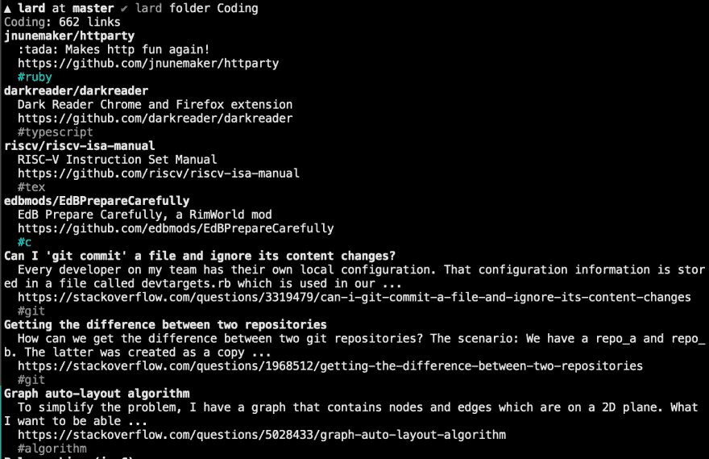

# 我如何使用 Larder.io 为您的书签编写 CLI 的故事

> 原文：<https://dev.to/hawkinjs/the-story-of-how-i-wrote-a-cli-for-your-bookmarks-using-larderio-411c>

故事从我最近开始使用 [Larder](https://larder.io) 开始，虽然我喜欢移动应用程序和浏览器集成，但我真的只是想从命令行使用它。我查看了路线图，发现早在 2016 年就有人提出了一个 CLI，但在这方面没有其他行动。快速浏览一下，发现他们有一个[漂亮简单的 API](http://developer.larder.io) ，于是我打开一个终端，开始工作。

我最近写了越来越多的 Ruby，我一直很喜欢它！我认为这将是成为 ruby gems 的发行者而不仅仅是消费者的一段有趣时光，所以我开始用 ruby 编写这个项目。(此外，我听说了一些重要的 Ruby 库，它们可以使这变得毫不费力，但我们将会谈到这一点。)没过多久，[就有了第一次提交](https://github.com/hawkins/lard/commit/621385ea2eb602fcdc57da9c574dc9799c0d66a8)，它基于从`yaml`文件中提供的令牌打印出用户的信息。不到半个小时后，我也添加了 [`lard folders`](https://github.com/hawkins/lard/commit/83598fe557932de591e80a3ffb96f8b1e4d1c681) 和[漂亮印刷的](https://github.com/hawkins/lard/commit/fa0b694744b4be3299403e39b19fafd00f98c6ea)。稍后我会发布输出的图片，但现在，您可以在项目的自述文件中看到这些:

##  [霍金斯](https://github.com/hawkins) / [猪油](https://github.com/hawkins/lard)

### 📗larder.io 的第三方命令行界面

<article class="markdown-body entry-content container-lg" itemprop="text">

# 猪油

<g-emoji class="g-emoji" alias="green_book" fallback-src="https://github.githubassets.cimg/icons/emoji/unicode/1f4d7.png">📗</g-emoji>larder . io 的第三方命令行接口

注意:这个项目是一个正在进行的工作，因此，可能还没有完全发挥作用。注意这也意味着`0.0.z`发布系列中的补丁版本可能会是重大的突破性变化。直到我们达到一个`0.1.0`，升级风险自担！

[T2】](https://raw.githubusercontent.com/hawkins/lard/master/screenshots/folder.png)

## 装置

要安装，只需运行`gem install lard`。然后，您可以通过调用`lard`来运行二进制文件。

你需要登录才能做更多的事情，所以按照`lard login`中的说明开始吧。

## 贡献的

我欢迎各种贡献！随时打开一个问题来讨论问题、功能请求、思慕雪口味或您想要进行的代码更改。这个项目对每个 Larder 用户都是有用的，所以我很想听到你的意见！

如果您想在本地运行代码，请按照下列步骤操作:

1.  克隆回购
2.  制作…

</article>

[View on GitHub](https://github.com/hawkins/lard)

开始很简单:

```
# lib/lard.rb
require 'httparty'
class Lard
  include HTTParty
  base_uri 'https://larder.io'
  def initialize(token)
    @options = {
      headers: {
        'Authorization' => "Token #{token}"
      }
    }
  end
  def user
    res = self.class.get '/api/1/@me/user', @options
    JSON.parse res.body, symbolize_names: true
  end
end

# ...
# bin/lard
#!/usr/bin/ruby
require 'yaml'
require './lib/lard'

config = YAML.load_file 'lard.yml'
lard = Lard.new config['token']
puts lard.user.inspect 
```

但是等一下，我真的叫它“猪油”吗？什么，我才 5 岁吗？良好的...算是吧。不过，实际上我有一些合理的理由，所以请原谅我:

*   我和 Larder 没有关系，所以这是第三方，不能用他们的名字作为我自己的名字
*   这是一个命令行应用程序，所以输入越少越好——简称规则！
*   不过，它首先是一个 Larder 客户端，所以这个名称应该容易记住
*   再说一次，我才五岁，所以我认为这个名字很傻，但它的其他优点依然存在，足以让它成为一个好名字

我可以告诉你这将会很有趣，而且不会有太大的压力，所以我被说服保留这个项目，并尽可能快地使它的 API 功能完整。因此，为了确保我不会得罪任何人，我给他们发了一条推特，询问是否可以开源我的作品(当时我的回购是私有的)。

> 乔希·霍金斯[@霍金斯](https://dev.to/hawkinjs)[@ larderapp](https://twitter.com/LarderApp)嘿，这还处于非常早期的阶段，但是我已经开始为 larder 编写 cli 脚本了，这要感谢你的开放 API ❤️
> 我注意到你已经在 changemap 上获得了一张 CLI 的入场券——你对我开源我的 CLI(表明它是第三方的)有什么问题吗？2018 年 10 月 22 日上午 03:01[](https://twitter.com/intent/tweet?in_reply_to=1054206203839070210)[](https://twitter.com/intent/retweet?tweet_id=1054206203839070210)0[](https://twitter.com/intent/like?tweet_id=1054206203839070210)1

They very kindly agreed...

> Larder@ larderapp[@ hawk injs](https://twitter.com/hawkinjs)完全没有，太牛逼了！肯定不会拒绝一些制作工具的帮助😊谢谢！2018 年 10 月 22 日上午 03:06[](https://twitter.com/intent/tweet?in_reply_to=1054207395268685826)[](https://twitter.com/intent/retweet?tweet_id=1054207395268685826)0[](https://twitter.com/intent/like?tweet_id=1054207395268685826)1

so I was off to the races!

我又写了一点代码从文件夹中获取书签，通过摆弄 rvm 和 rbenv 并发现它们在我的 mac 上发生了冲突而破坏了我的 ruby 安装，最后上床睡觉。

* * *

第二天早上，我很早就醒了，开始做这个项目，修复我的 ruby 安装程序(很兴奋，对吧！？)并完成获取书签。最后，我跑去工作，但当我回家时，我花了整个晚上来修复 ruby 安装，以便根据需要用 openssl 进行编译，那天晚上我工作到很晚，因为我兴奋得睡不着觉。那天晚上我只写了一个小时的代码，但是我完成了很多工作，因为我可以打印出一整个书签文件夹，用 Larder API 分页等等。

* * *

第二天，我决定是时候停止编写自己的 CLI 工具包，采用一个如此受欢迎的工具，[托尔](http://whatisthor.com/)。这是*超级*好，这是我在这个项目中真正开始学习的地方。我已经学会了如何用`net/http`和`HTTParty`发出基本的 HTTP 请求，但是现在我正在学习一种快速而又好的方法，用 Ruby 毫不费力地编写命令行界面。

我也[几乎承认我是通过提交`.DS_Store`文件在 mac](https://dev.to6c88e7e5a33525de182df74ade778a9d5101d1d3) 上做这些的。🤫

然后，我[发表了猪油 0.0.1](https://github.com/hawkins/lard/commit/2452d940b0a12212919fa3eef5eba77d1520f66a) ，创业板第一版！呜哇！！剧透:我当时并不知道，但`gem install lard`并没有带来猪油的依赖，所以不要麻烦安装这个特定的版本...

最后，我在[发布了一个书签](https://github.com/hawkins/lard/commit/b9a5549a8416529d467faeb834b1afb8c16b4ef7)(结果是你可以在同一个端点发布*和*编辑，它根据你提供的 URL 匹配)。但是它还没有工作——我看到了一个 HTTP 错误`301: Redirection`，我的`POST`请求得到了一个错误返回:

```
{"detail":"Method \"GET\" not allowed."} 
```

但是我正在发送一个`POST`请求！我花了很长时间调试这个。过了一会儿，我打开 wireshark，发现我遇到了一个`301: Redirection`并向重定向的 URL 发送了一个`GET`请求。这很奇怪。我不知道为什么会这样。通常 HTTP 请求会跟随`300`，就像它们根本不存在一样，对吗？

嗯，不是这个要求。时间很晚了，我也累了，我只是想让它工作，这样我就可以自己开始使用 CLI，而不仅仅是开发它。我决定出去透透气，去散散步，拿起一杯奶昔来毁掉我在散步中燃烧的一点点卡路里。我和我的朋友兼编译伙伴 Cameron 聊了聊这些问题，并在回家的路上找到了解决方案。我太累了，不想为它写代码，所以我为它开了一期，然后去睡觉了。

# [ 去掉使用 http party# 4](https://github.com/hawkins/lard/issues/4)

[](https://github.com/hawkins) **[hawkins](https://github.com/hawkins)** posted on [<time datetime="2018-10-26T02:17:17Z">Oct 26, 2018</time>](https://github.com/hawkins/lard/issues/4)

老实说，这个库的不太好的文档和放肆的 api 至少让我有些头疼，所以我把 HTTP 调用简化成非常简单的东西，这样我们就有希望很容易地删除 httparty。

最重要的是，我想重新获得对 ruby < 2 的支持，我想我可以证明用`net/http`或另一个更低级、依赖性更低的库替换`httparty`是正确的。

### 担忧:

*   3xx 代码
    *   如果我没记错的话，`POST https://larder.io/api/1/@me/*`将 301 打到了某个地方，所以我需要我拼凑的任何接口来跟踪重定向并在整个重定向过程中维护 HTTP 动词。
*   容易推断错误
    *   很好——如果可能的话，我不想失去那个语义响应

[View on GitHub](https://github.com/hawkins/lard/issues/4)

* * *

第二天早上，我冷静下来，编写了[补丁来修复 HTTP party](https://github.com/hawkins/lard/commit/5fb28de6e0383c832b2c286ac46715bd4dbbd359#diff-d4e9001d759eec3f96532cd6db835a4eR103)(是的，这是一个愚蠢的函数调用，用来更改一个选项，否则不会公开，这似乎违背了 HTTP 300 的语义)。现在我不想说这个图书馆的坏话——除了这个抱怨，它是*超级*好。但是这个爱好项目应该是有趣的，我不想头痛-我已经受够了那些患有慢性偏头痛的人！所以要知道，如果你使用 HTTParty，那是完全没问题的，但是这个非常小的问题足以让我觉得它很糟糕。在这个项目中，我可以奢侈地提出非常简单的要求，所以回到`net/http`那里，我确切地知道我将得到什么根本不是什么大事。

我现在继续使用 HTTParty，但是我知道它不会在这里停留太久。我想做有趣的事情，功能，而不是重构。于是那天晚上晚些时候，写了[`lard tags`](https://github.com/hawkins/lard/commit/bb92194d6bc9d3ac176d464cfe0135a9a6f03947)[`lard search`](https://github.com/hawkins/lard/commit/be20eeded762242fe0a477751c4b5d65c98336e3)[`lard login`](https://github.com/hawkins/lard/commit/0ef35314e22021cbe5f483ff4b12d400bf647712)。

我在推特上回复了 Larder，现在我有东西要展示了，他们很兴奋！

> 乔希·霍金斯[@霍金斯](https://dev.to/hawkinjs)[@ LarderApp](https://twitter.com/LarderApp)仅供参考:它非常不成熟，代码有点毛，但对于一个早期的 alpha / MVP 来说，它打了一些标记！现在的问题是如何使用它，调整界面，修复错误等等。如果有一天你们中的任何一个愿意尝试它，我会喜欢任何批评！🙂[github.com/hawkins/lard](https://t.co/f3Igogc807)2018 年 10 月 25 日上午 03:25[](https://twitter.com/intent/tweet?in_reply_to=1055299299922362370)[](https://twitter.com/intent/retweet?tweet_id=1055299299922362370)0[](https://twitter.com/intent/like?tweet_id=1055299299922362370)0

> Larder@ larderapp[@ hawk injs](https://twitter.com/hawkinjs)它已经做了这么多了，我们都很感动！很高兴 API 能够很好地工作，这让我很高兴。你愿意和所有人分享吗？如果是这样的话，我会在我们的下一封更新邮件中提到它，否则我可以等到未来的版本😊2018 年 10 月 25 日上午 03:43[](https://twitter.com/intent/tweet?in_reply_to=1055303873638744064)[](https://twitter.com/intent/retweet?tweet_id=1055303873638744064)0[](https://twitter.com/intent/like?tweet_id=1055303873638744064)0

这让我太兴奋了，我真的需要睡觉了，所以我一直在功能之间标记和发布新版本，希望能让我停下来休息，但是[唉](https://github.com/hawkins/lard/commit/f99fa936dec3ac89472064546ebef686ad585ef4) :

```
Bump 0.0.4  … committed 4 days ago

This should've been 2 at this point but I kept thinking I'd stop and go
to bed, but here we are. A few bugs and features later, and this is it. 
```

然后仅仅 [8 分钟后](https://github.com/hawkins/lard/commit/02f4a5084d8c4f000865aa1c8a5914e641839aaf) :

```
Correct nil check  … committed 4 days ago 

I said I was done for the night, but I have no self control when it
comes to side projects 
```

最后，在这之后，我发布了版本`0.0.5`(请注意，仍然没有安装 gem 依赖项)然后睡觉了。

* * *

Larder 的那帮人告诉我，API 将文件夹请求限制为每个请求 200 个项目，所以我一有机会在第二天晚上的[就在代码中应用了这一点。然后我做了很多重构类的事情，让项目工作感觉不那么令人讨厌，从](https://github.com/hawkins/lard/commit/098c219b57927671cc9020acfe83dd5bf933431d)[错误消息](https://github.com/hawkins/lard/commit/f00460d60d79c9c1291741dad8c15a1c67f324f3)开始。然后我了解到了 [rubocop](https://github.com/hawkins/lard/commit/013b619dfdc1a60204be7fd7f18d26ac68c042de) 的魔力，我绝望地质疑没有它我是如何编写大型 ruby 项目的。哇！很久以来我见过的最好的棉绒。我的宠物语言 Druid 在“友好的编译器”方面有很多值得学习的地方...

最令人兴奋的是，我[建立了特拉维斯 CI](https://github.com/hawkins/lard/commit/34901845e2f921afdd86c0e857c28f29b7f29df6) ！如果你不熟悉 Travis，Travis CI 是一个超级棒的免费持续集成平台，它与 GitHub 以及几乎所有流行的语言和软件打包平台(如 RubyGems)集成得非常好。完美的运行测试，林挺，并部署更新到您的软件包自动当您打开一个公关或标签发布！查看 Lard 在 Travis 上的[状态页面，在那里你可以看到它运行的最新版本，是什么触发了它们，以及测试是否通过/失败！](https://travis-ci.org/hawkins/lard)

* * *

第二天，10 月 26 日(连续 6 天吃猪油！)，Larder 的 Josh Sharp 开了一期，让我大吃一惊:

# [ 缺少依赖？ #7](https://github.com/hawkins/lard/issues/7) 

[](https://github.com/joshsharp) **[joshsharp](https://github.com/joshsharp)** posted on [<time datetime="2018-10-27T00:30:00Z">Oct 27, 2018</time>](https://github.com/hawkins/lard/issues/7)

嘿，我昨天试着安装和运行猪油，我遇到了一些问题。我不是 Ruby 的人，但我认为这里的问题是，当我安装 gem 时，它的依赖项没有被安装。

我第一次运行它的时候，我遇到了一个关于`httparty`丢失的问题，我自己想出了如何把它安装成一个 gem<g-emoji class="g-emoji" alias="innocent" fallback-src="https://github.githubassets.cimg/icons/emoji/unicode/1f607.png">😇</g-emoji>但从那以后，我还是会遇到一个错误:

```
hades:~$ lard
Traceback (most recent call last):
        6: from /home/hades/.rvm/gems/ruby-2.5.3/bin/ruby_executable_hooks:24:in `<main>'
 5: from /home/hades/.rvm/gems/ruby-2.5.3/bin/ruby_executable_hooks:24:in `eval'
 4: from /home/hades/.rvm/gems/ruby-2.5.3/bin/lard:23:in `<main>'
 3: from /home/hades/.rvm/gems/ruby-2.5.3/bin/lard:23:in `load'
        2: from /home/hades/.rvm/gems/ruby-2.5.3/gems/lard-0.0.5/bin/lard:3:in `<top (required)>'
 1: from /home/hades/.rvm/rubies/ruby-2.5.3/lib/ruby/site_ruby/2.5.0/rubygems/core_ext/kernel_require.rb:59:in `require'
/home/hades/.rvm/rubies/ruby-2.5.3/lib/ruby/site_ruby/2.5.0/rubygems/core_ext/kernel_require.rb:59:in `require': cannot load such file -- paint (LoadError)
```

如果我做错了什么，请告诉我！否则，希望这能帮助您解决问题。

[View on GitHub](https://github.com/hawkins/lard/issues/7)

哇，两个从 Larder 来的开发人员中的一个尝试了我的项目？厉害！！它灾难性地失败了。！我很尴尬，但我很兴奋，因为他显然发现了一个我可以从中学习的问题！这就是为什么我喜欢开源我所做的一切，因为有人肯定会有不同的体验，我喜欢从这些机会中学习！

马上，我有了一个理论:

# [ 评论为 #7](https://github.com/hawkins/lard/issues/7#issuecomment-433578790) 

[](https://github.com/hawkins) **[hawkins](https://github.com/hawkins)** commented on [<time datetime="2018-10-27T01:08:10Z">Oct 27, 2018</time>](https://github.com/hawkins/lard/issues/7#issuecomment-433578790)

嘿，非常感谢您试用并报告问题！<g-emoji class="g-emoji" alias="tada" fallback-src="https://github.githubassets.cimg/icons/emoji/unicode/1f389.png">🎉</g-emoji>

这实际上是我发布的第一个 ruby gem，所以我想我没有标记列出我们的依赖项(`httparty`、`paint`、`thor`)的 gem 文件来包含在发布的 gem 中，或者类似的东西。哎呀！今晚我会调查的，非常感谢！

与此同时，如果你想继续玩这个应用程序，你也许可以这样做:

```
gem install httparty
gem install paint
gem install thor 
```

这将确保您已经在系统范围内安装了依赖项，但是实际上，`gem install lard` *应该*已经涵盖了这一点，所以我将在这里找出如何跨越 T 的方法。再次感谢！

[View on GitHub](https://github.com/hawkins/lard/issues/7#issuecomment-433578790)

...我同时学到了两件事:

1.  在回答问题之前，我应该做一些非常基本的谷歌搜索。即使我真的只是想尽快解决用户的问题(用我给他的`gem install *`命令)，在快速搜索之后，我可能会给出一个更有见地、更简单的解决方案
2.  Sure enough, I was right about how gem dependencies don't come from `Gemfile`:

    # [  The comment is   # 7](https://github.com/hawkins/lard/issues/7#issuecomment-433579472) 

    [](https://github.com/hawkins) **[hawkins](https://github.com/hawkins)** Commented on [<time datetime="2018-10-27T01:17:49Z">Oct 27, 2018</time>](https://github.com/hawkins/lard/issues/7#issuecomment-433579472)

    I should have kept my mouth shut more-soon Google search found that this was a novice gem publisher's mistake! fixed it with `lard@0.0.6`, so please feel free to run `gem uninstall lard` and `gem install lard` to get the latest version and its dependencies. We can pretend that this never happened.

    [View on GitHub](https://github.com/hawkins/lard/issues/7#issuecomment-433579472)

所以我[给它](https://github.com/hawkins/lard/commit/7562bb667de23145576439df0afea84ecd0c438f)打了补丁，并把它部署为`0.0.6`，这样乔希可以稍后再试。

然后，更多的重构。我决定[将命令行界面从函数库](https://github.com/hawkins/lard/commit/8b124cb3cb36227931a1c6e8c70094885b91d609)中分离出来，这样命令行界面就更容易使用，其他软件包也可以在未来以编程的方式利用`lard`。非常简单，只是将`LardHTTP`从一个模块变成一个类，维护一些状态，并从 CLI 利用这个库。

然而，我不知道的是，它是如何在生产和开发中同时工作的。由于这是我第一次尝试发布 Ruby Gem，我从来没有从文件系统中链接库，我总是可以说“嘿 Gem，帮我找到那个东西”然后就上路了。这次不行！

我首先[将`require 'lard'`保存在将被部署到生产的代码](https://github.com/hawkins/lard/commit/8b124cb3cb36227931a1c6e8c70094885b91d609#diff-d4e9001d759eec3f96532cd6db835a4eR6)中。这个管用，因为当有人运行`gem install lard`的时候，Gem 会知道`lard`在哪里，所以`require 'lard'`会解析成功。不过，在开发中，`lard`并没有安装，我们只有它的源文件。所以当时，我会手动将这一行更改为`require '../lib/lard'`(或使用`require_relative`)，并在提交前将其改回`require 'lard'`，这样生产代码就不会相对地看起来，但开发代码会。恶心。

经过一番挖掘，我最终发现在代码中保留`require 'lard'`是正确的，但是我可以使用命令行参数运行开发二进制文件`bin/lard`，通过使用 [`ruby bin/lard -Ilib`](https://github.com/hawkins/lard/commit/20274836eea0aa41e4f7f2281feeeddc4d9dff7c#diff-04c6e90faac2675aa89e2176d2eec7d8R25) 从源代码链接`lard`库。如果您了解 GCC，这看起来很熟悉，但它是这样工作的:

*   我们运行`ruby`二进制
*   我们传递给它`bin/lard`，这是我的源代码中的一个 ruby 文件，其中包含 CLI 代码(以及文件顶部臭名昭著的`require 'lard'`调用)
*   我们指定`-Ilib`参数来映射`lib`文件夹(T2 所在的位置)作为这个运行时的包含文件夹
*   Ruby 进程`require 'lard'`
*   Gem 无法从其正常文件夹中解析`'lard'`,并认为它不是相对的
*   Gem 发现,`lib`文件夹被链接，并且它包含一个`lard.rb`文件——所以这个`require`被解析为这个文件！

这太棒了。现在，我可以在开发过程中运行该命令，并且不会提交不完整的`require`语句。呜哇！

* * *

现在技术上来说是第 7 天，尽管现在是周五晚上/周六早上的 [12 点，我还是清理了`lard user`命令，最终打印出了用户的详细信息。](https://github.com/hawkins/lard/commit/0bc94fd258dc1a86a32733047a7fe7040147cce6)

在这一点上，这个库在技术上完成了我想要它做的所有事情，至少成为 Larder 的一个可行的命令行界面！

所以我庆祝了一下，最后回去睡觉了，直到第二天晚上才回来(同一天，第二天晚上)。如果你没注意到的话，我周末有点夜行...

这就是我让 Travis 大放异彩的地方——当我在 g it 中标记一个版本时，通过配置它来自动部署新的 gem 版本。呀哈！(我也花了一些时间回去对更漂亮的 Webpack 插件这样做，就像我几年前就应该做的那样)嘿，为什么不呢，无耻的插件:

##  [【霍金斯】](https://github.com/hawkins) / [预处理网页包插件](https://github.com/hawkins/prettier-webpack-plugin)

### 用更漂亮的处理你的网络包依赖

<article class="markdown-body entry-content container-lg" itemprop="text">

# 前端 web 包插件

[ ](https://greenkeeper.io/) [ ](https://raw.githubusercontent.com/hawkins/prettier-webpack-plugin/master/#contributors)

通过 Webpack 捆绑时，使用更漂亮的自动处理您的源文件。

## 它是如何工作的

这个插件读取你的依赖关系图中的所有文件依赖关系。如果发现一个文件有匹配的扩展名，这个文件会被更漂亮的处理并被覆盖。

你可以通过在创建插件时指定选项来提供更漂亮的选项。

## 找装载机？

它还处于早期阶段，但是你可以在这里找到这个插件的加载器版本:[prettle-web pack-loader](https://github.com/hawkins/prettier-webpack-loader)

## 装置

> 注意，为了支持 Webpack 4，请安装 prettle-web pack-plugin @ 1。对于 Webpack < 4，安装 beauty-web pack-plugin @ 0

只需运行`npm install --save-dev prettier prettier-webpack-plugin`或`yarn add --dev prettier prettier-webpack-plugin`即可安装。

然后，在 Webpack 配置文件中，添加以下行:

```
var PrettierPlugin = require("prettier-webpack-plugin");
module.exports = {
  // ... config settings here ...
  plugins: [
    new PrettierPlugin()
  ],
};
```

### 为什么？

在…之间保持风格一致

</article>

[View on GitHub](https://github.com/hawkins/prettier-webpack-plugin)

然后，在一些警告之后，我终于开始着手[移除`httparty`T2。咻！对正在发生的事情有更多一点的控制，并且知道我不再需要阅读库作者的思想来知道如何使用它，这感觉太棒了。好吧好吧，抱歉，我们继续。](https://github.com/hawkins/lard/commit/bd2e2f695c21ee6979040eefd29e1807241e58be)

* * *

延续“完了我就睡”的趋势！，我继续第八天的午夜。我处理的下一个问题是关于发布 Ruby Gems 的另一个有趣的学习点。看看这个:

# [ 我们如何确保用户代理在每个新版本中都得到更新？ #11](https://github.com/hawkins/lard/issues/11) 

[![todo[bot] avatar](img/85b360fec71c43ffed06196787323d42.png)](https://github.com/apps/todo) **[todo[bot]](https://github.com/apps/todo)** posted on [<time datetime="2018-10-28T03:17:35Z">Oct 28, 2018</time>](https://github.com/hawkins/lard/issues/11)

[https://github . com/Hawkins/lard/blob/295 e 5d 9 cf 7 b 86 de 00 f 6376 F9 b 2627 BD 11 b 44 F9 AC/lib/lard . Rb # L100-L112](https://github.com/hawkins/lard/blob/295e5d9cf7b86de00f6376f9b2627bd11b44f9ac/lib/lard.rb#L100-L112)

* * *

###### 本期由 [todo](https://todo.jasonet.co) 根据#10 合并时 295 e 5d 9 cf 7 b 86 de 00 f 6376 F9 b 2627 BD 11 b 44 f 9 AC 中的一条`TODO`评论生成。抄送@霍金斯。

[View on GitHub](https://github.com/hawkins/lard/issues/11)

我想给所有来自猪油的网络流量添加一个用户代理，以表明它来自猪油。问题是，就像上面提到的所有令人头疼的事情一样，我不想在这里手工修改代码来与 gem 版本同步。那就太傻了！电脑比我聪明，它们当然可以自己做这些。我第一个想到的是一个`rake`任务，如果不手动更改就会抱怨。所以当我标记一个版本时，Travis 会发现 rake 抱怨这个版本没有更新用户代理，所以我至少被迫修改了它，而没有发布一个意外错误的用户代理。

好吧，但这并不能解决根本问题。我回想起`gemspec`实际上是如何用 Ruby 编写并利用`Gem`库的。所以我想“也许 Gem 能告诉我我用的是什么版本的`'lard'`

果然可以，用`Gem.loaded_specs['lard'].version`。答对了。但是...等等。不，不行。这只在生产中有效，当 gem 从本地的 gem 库中加载时。不在发展中，当他们虚拟地联系在一起。力量...好吧。我想我可以在库中添加一个常量，然后把它放入`lard.gemspec`，因为`gemspec`毕竟只是 Ruby 代码。所以我尝试了一下...在意识到我[忽略了将`lib/lard.rb`标记为必需的](https://github.com/hawkins/lard/pull/12/commits/2eead1c3be74c7a76fd8e5151ad20968fec7e953#diff-6e7ac0d946e187ec51a3d99ab3a146fcR10)并浪费了`0.0.7`作为测试之后，我发现这个版本风格可以工作！

在这个过程中，我了解到 RubyGems 提供了一种[预发布版本](https://guides.rubygems.org/patterns/#prerelease-gems)的模式，这是为了运送像我刚刚写的可能损坏的代码。厉害！我只是用一个 PR 修复了两个问题！

最后，我决定是时候进行适当的测试了。我喜欢测试，尤其是通过 Travis 进行自动化测试的时候，但是我一直在纠结如何正确地测试这样的程序，原因如下:

*   当我们的图书馆如此依赖外部网络连接时，我们如何有效地进行测试？
*   我们的 CLI 呢，我们测试什么？最终的二进制文件，还是它的模块？
*   我们如何避免测试 CLI 套件的底层功能(Thor)？

在凌晨 1 点头脑风暴之后(总是一个好主意！)，我带着一些想法打开了一个问题，开始工作:

# [ 添加测试 #15](https://github.com/hawkins/lard/issues/15) 

[](https://github.com/hawkins) **[hawkins](https://github.com/hawkins)** posted on [<time datetime="2018-10-28T04:39:35Z">Oct 28, 2018</time>](https://github.com/hawkins/lard/issues/15)

我在这上面等了一会儿，因为我不确定如何最好地测试它，但是这里有一些我想看到的关于实现的想法:

*   测试`Lard` lib 函数，但是模拟 http 响应
*   测试`LardCLI`的功能类似于`print_*`
*   如果我能想出在 Travis 身上放一个 API 令牌的方法，测试一下可执行文件。

[View on GitHub](https://github.com/hawkins/lard/issues/15)

因此，为了结束这个夜晚，我安装了 [RSpec](https://rspec.info) 并编写了一些[基本测试](https://github.com/hawkins/lard/commit/141ea01cb51ce6b0c5c348b7610d5569f9463076#diff-9732b19df1dbcad692c8f2099ce2bcd1R3)来启动这个项目。

```
 # spec/lard_spec.rb
require 'lard'

RSpec.describe Lard, '#authorized' do
  it 'returns false to indicate user is unauthorized' do
    l = Lard.new
    expect(l.authorized).to be false
  end

  it 'returns true to indicate user has a token' do
    # Though we can't actually guarantee the token is authorized
    # without an http request
    l = Lard.new 'token'
    expect(l.authorized).to be true
  end
end

RSpec.describe Lard, '#api_url_prefix' do
  it 'returns the Larder API\'s Base URL' do
    l = Lard.new
    url = l.api_url_prefix
    expect(url).to be_an_instance_of String
    expect(url).to be_an_start_with 'https://'
  end
end

RSpec.describe Lard, '#get' do
  it 'will fail if not authorized' do
    l = Lard.new
    expect(l.authorized).to be false
    expect { l.get 'user' }.to raise_error(RuntimeError)
  end

  it 'can fetch user' do
    l = Lard.new 'token'
    expect(l.get('user')).to be_an_instance_of Hash
    expect(l.get('user')[:links]).to be_an_instance_of Integer
  end
end

# spec/spec_helper.rb
require 'webmock/rspec'
WebMock.disable_net_connect!(allow_localhost: true)

RSpec.configure do |config|
  # Handle web request mocking
  config.before(:each) do
    user_body = { 'id' => 1,
                  'username' => 'username',
                  'first_name' => 'greatest',
                  'last_name' => 'ever',
                  'timezone' => 'America/New_York',
                  'avatar' => nil,
                  'date_joined' => '2016-01-21T03:03:33Z',
                  'links' => 500,
                  'is_trial' => true }
    stub_request(:get, 'https://larder.io/api/1/@me/user/')
      .with(
        headers: {
          'Accept' => '*/*',
          'Authorization' => 'Token token',
          'Host' => 'larder.io',
          'User-Agent' => ['Lard/0.0.8', 'Ruby']
        }
      )
      .to_return(status: 200, body: user_body.to_json)
  end
# ... the rest of `rspec --init` output
end 
```

# 回顾:我学到了什么

我在全职工作于其他项目的同时，在短短的 8 天内编写了一个用于书签管理的 MVP 命令行界面，因此很难对其进行总结，但我已经在这里坐了一个小时，写了一个没有人会阅读的愚蠢故事，所以我不妨对其进行总结，以便我可以用我年轻时的恶作剧来取悦我的孙子们:

*   独立开发者摇滚！拉德尔、[乔希·夏普](http://joshsharp.com.au/)和[贝尔·库珀](http://bellebcooper.com/)这两位幕后推手制作了一款令人敬畏的产品，并在整个过程中给予了大力支持。我迫不及待地想把猪油做得越牛逼越好，哪怕只有我一个用户，就当是对猪油本身的致敬。
*   语言版本管理很难。我的 mac 电脑安装了 Ruby，但是大家都知道你不应该使用它——所以我前段时间安装了 rbenv。嗯，我开始这个的时候不记得 mac 上安装了 Ruby，所以这次抓了 rvm。哎呦！这让我陷入了困境，但是我学会了 rvm 如何链接 Ruby 和它的依赖库(拥有一个非系统依赖的 OpenSSL 对我来说是个问题),并设法解决了这个问题。
*   `Gemfile != gemspec`。几乎我用过的每个 Ruby 项目都有一个`Gemfile`,可以安装你需要的所有东西。这是我自己写的第一个 Ruby gem，所以我必须学习如何在 gem 本身上指定运行时依赖，以及属于`Gemfile`的开发依赖。仍然不清楚如何减少它们之间的重复，但这是另一个故事。
*   Rubocop 规则。我一直喜欢 linters，尤其是像[beautiful](https://prettier.io)这样的自动格式化程序，但在我看来，Rubocop 是两个世界中最好的。
*   除非你知道你需要图书馆，否则不要去找它们。我通常不这样做，但是在像这样的业余爱好项目中，有时我会使用大枪只是为了快速移动，这样我可以玩得开心，而不是做苦工。这一次，这让我非常头疼，所以我有更多的弹药来支持在下一个项目中使用我自己的基础设施。(就像我们在德鲁伊做的一样！)
*   红宝石宝石超级聪明。从链接开发依赖项，使你的 gemfile 只是普通的 Ruby，这样你就可以通过从你的代码中导入一些常量到你的规范中来避免重复你自己，我对与 Ruby Gems 一起工作非常满意。撰写和出版它们是轻而易举的事！尤其是和特拉维斯。
*   哦，特拉维斯 CI 该死的规则。我已经知道这一点，但设置自动部署是这次真正的热点。
*   不要过度思考你的测试过程。我本可以更快地设置测试方式，就 ruby 测试而言，模仿 HTTP 请求是一个很容易解决的问题，正如我昨晚在 RSpec 和 Webmock 的短暂时间所展示的那样。我希望我能早点设置测试，但是我有很多东西要学习和迭代，所以我推迟了太久。

## 猪油的下一步是什么？

嗯，首先，*考*！当我坐下来再次对猪油进行编码时，我绝对会进行适当的测试。但是，令人兴奋的新功能:

*   改进`lard bookmark`,使它更动态、更灵活地描述或改变你的书签
*   用 Thor 混淆命令(所以`lard s`表示`lard search`，等等)
*   离线使用你的书签，这样你就可以在下次上线时进行修改并上传到 Larder 服务器。或者，完全离线工作，如果这是你的工作流程。(但是 Larder 规则，所以猪油将永远是 Larder 的首要客户)

## 结论

写 Lard 是一次爆炸，我对它将如何帮助我的工作流程以及我对 Ruby 及其生态系统的了解感到兴奋。我很高兴看到我能把这个项目进行到什么程度，我希望我说服了至少一个读者在某个地方尝试 Lard 和破解我的代码，或者有一天让他们自己的项目写文章！

如果你想尝试猪油，可以随意运行`gem install lard`和`lard help`开始。或者到我的 GitHub 上查看一下，打个招呼！

##  [霍金斯](https://github.com/hawkins) / [猪油](https://github.com/hawkins/lard)

### 📗larder.io 的第三方命令行界面

<article class="markdown-body entry-content container-lg" itemprop="text">

# 猪油

<g-emoji class="g-emoji" alias="green_book" fallback-src="https://github.githubassets.cimg/icons/emoji/unicode/1f4d7.png">📗</g-emoji>larder . io 的第三方命令行接口

注意:这个项目是一个正在进行的工作，因此，可能还没有完全发挥作用。注意这也意味着`0.0.z`发布系列中的补丁版本可能会是重大的突破性变化。直到我们达到一个`0.1.0`，升级风险自担！

[T2】](https://raw.githubusercontent.com/hawkins/lard/master/screenshots/folder.png)

## 装置

要安装，只需运行`gem install lard`。然后，您可以通过调用`lard`来运行二进制文件。

你需要登录才能做更多的事情，所以按照`lard login`中的说明开始吧。

## 贡献的

我欢迎各种贡献！随时打开一个问题来讨论问题、功能请求、思慕雪口味或您想要进行的代码更改。这个项目对每个 Larder 用户都是有用的，所以我很想听到你的意见！

如果您想在本地运行代码，请按照下列步骤操作:

1.  克隆回购
2.  制作…

</article>

[View on GitHub](https://github.com/hawkins/lard)

好吧，这周我在屏幕前花了太多时间，所以是时候出去享受周末的最后时光了。大家周末快乐，感谢阅读！