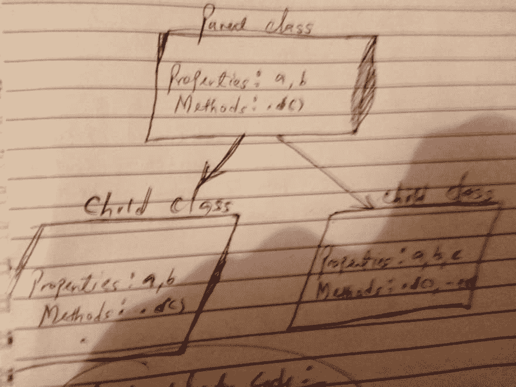

# JavaScript 的语法糖类

> 原文：<https://dev.to/ogwurujohnson/the-syntactical-sugar-classes-of-javascript-5f4n>

在我之前的文章中；

[](/ogwurujohnson) [## JavaScript 对象中使用的 Getters 和 Setters....怎么会？

### 约翰逊·奥格武鲁 5 月 13 日 182 分钟阅读

#javascript #tutorial #programming](/ogwurujohnson/getters-and-setters-used-in-javascript-objectshow-4jef)we looked at Getters and Setters as they apply to objects in JavaScript and i recall promising to show us how we could use getters in Es6 classes, We would also learn a great deal about classes.

首先；我不会以不同的方式谈论他们。我们会讨论类，在编写一些代码时，我会向你展示 getter 是如何在代码中使用的。

类别
它们是大多数开发人员用来快速生成类似对象的工具。

```
let dog = {
            name: "lucky",
            breed: "American Bulldog.",
            age: 2

          } 
```

Enter fullscreen mode Exit fullscreen mode

它们上面的代码看起来像是我们已经知道的- `objects`。现在，假设您拥有一个狗狗日托所，并且想要创建一个属于日托所的所有狗狗的目录，我们可以创建一个`Dog class`作为创建新狗狗对象的模板，而不是为每只加入日托所的狗狗使用上面的语法，这无疑是很麻烦的。因为你可以节省自己为一只特定的狗重写代码的精力，可以肯定的说*类是减少重复代码和调试时间的好方法。*

***类语法:***

```
class Dog{
    constructor(){

    }
    method1(){

    }
    method2(){

    }

} 
```

Enter fullscreen mode Exit fullscreen mode

啊哈....我脑子里有个问题，什么是构造函数？...虽然我也有同感，但还是让我们谈一谈吧。还要注意，上面例子中的方法是我们知道的普通函数，但是当写在一个类中时，它们被称为方法，并且没有使用`function`关键字。

**构造函数**
对象和类之间存在的一个显著区别是`constructors`在类中的使用。JavaScript 每次创建一个类的新实例时都会调用构造函数方法。

```
class Dog{
    constructor(name,breed){
        this.name = name;
        this.breed = breed;
    }
    method1(){

    }
    method2(){

    }
    get method3(){

    }

} 
```

Enter fullscreen mode Exit fullscreen mode

在`constructor()`方法中，我们使用了`this`关键字。在一个类的上下文中`this`指的是那个类的一个实例。

那么什么是一个 ***实例*** ？
实例是包含类的属性名和方法的对象，但是具有唯一的属性值。

***方法*** 有哪些？
Class `methods`和`getter`的语法与对象的语法相同，只是方法之间不能包含逗号。但是我们如何称之为方法呢？

**方法调用:**
在一个方法被调用之前，类的实例被创建并赋给一个变量。

```
const lucky = new Dog('lucky','American Bulldog'); 
```

Enter fullscreen mode Exit fullscreen mode

在一个实例上调用方法和 getters 的语法与在一个对象上调用它们的语法是一样的，这是通过*在实例后面加上一个句点，然后是属性或方法名*来完成的。对于方法，还必须包括左括号和右括号。但是对于吸气剂你不需要。在下面的例子中，我们将展示这一点；

```
lucky.method1() //when we are calling methods
lucky.method3 //when we are calling getters, no parenthesis 
```

Enter fullscreen mode Exit fullscreen mode

我们可以在下面看到一个完整的类、构造函数和方法调用的例子；

```
class Dog{
    constructor(name,breed){
        this._name = name; //when we are using getter and setters we add underscore to our properties.
        this._breed = breed;
        this._behaviour = 0;
    }
    get name(){
        return this._name;
    }
    get breed(){
        return this._breed;
    }
    get behaviour(){
        return this._behaviour;
    }
    incrementBehaviour(){
        this._behaviour++;
    }
}

let lucky = new Dog('lucky','American Bulldog');
console.log(lucky.name)//returns the dogs name
console.log(lucky.breed)//returns the dogs breed
console.log(lucky.behaviour)//return the value of behaviour
lucky.incrementBehaviour(); //increases the count for the behaviour property
console.log(lucky.behaviour)//returns the new value after incrementing. 
```

Enter fullscreen mode Exit fullscreen mode

但是，如果你的日托开始增长，我们开始接受其他宠物，如猫，等等。我们要为他们每个人创建不同的类吗？

```
class Cat{
    constructor(name,breed){
        this._name = name; //when we are using getter and setters we add underscore to our properties.
        this._breed = breed;
        this._behaviour = 0;
    }
    get name(){
        return this._name;
    }
    get breed(){
        return this._breed;
    }
    get behaviour(){
        return this._behaviour;
    }
    incrementBehaviour(){
        this._behaviour++;
    }
}

let kitty = new Dog('Kiity','American Bulldog');
console.log(kitty.name)//returns the dogs name
console.log(kitty.breed)//returns the dogs breed
console.log(kitty.behaviour)//return the value of behaviour
kitty.incrementBehaviour(); //increases the count for the behaviour property
console.log(kitty.behaviour)//returns the new value after incrementing. 
```

Enter fullscreen mode Exit fullscreen mode

这也意味着我们重复代码，这是我们最初避免的事情，但是我们如何解决这个问题，这就是我们在 Es6 类中使用一个叫做*继承*的概念的地方。

**继承:**
当多个类共享属性或方法时，它们成为`inheritance`的候选者。开发人员用来减少他们需要编写的代码量的工具。
通过继承，你可以创建一个`parent class`(也称为`Super Class`)，它具有多个`child classes`(也称为`sub classes`)共享的属性和方法。`child classes`从它们的父类继承属性和方法。

[T2】](https://res.cloudinary.com/practicaldev/image/fetch/s--S0nyf5w3--/c_limit%2Cf_auto%2Cfl_progressive%2Cq_auto%2Cw_880/https://thepracticaldev.s3.amazonaws.com/i/igcd8mui03du7azfsoyc.jpg)

在我们的例子中，我们需要创建一个父类`Animal`，其他类如`cat`和`dog`将继承它。

```
class Animal{
    constructor(name,breed){
        this._name = name; //when we are using getter and setters we add underscore to our properties.
        this._breed = breed;
        this._behaviour = 0;
    }
    get name(){
        return this._name;
    }
    get breed(){
        return this._breed;
    }
    get behaviour(){
        return this._behaviour;
    }
    incrementBehaviour(){
        this._behaviour++;
    }
} 
```

Enter fullscreen mode Exit fullscreen mode

现在创建从父类`Animal`继承的`Dog`类；

```
class Dog extends Animal{
    constructor(name,breed,sound){
        super(name,breed);
        this._sound = sound;
    }
    get sound(){
        return this._sound;
    }
}

class Cat extends Animal{
    constructor(name,breed,size){
        super(name,breed);
        this._size = size;
    }
    get size(){
        return this._size;
    }
}

let lucky = new Dog('lucky','Caucasian','barks');
console.log(lucky.name); //logs lucky
console.log(lucky.breed); //logs caucasian
console.log(lucky.sound); //logs bark
console.log(lucky.behaviour); //logs current value
lucky.incrementBehaviour(); //increments behaviour
console.log(lucky.behaviour); //logs new value

let kitty = new Cat('kitty','dontknow','4kg');
console.log(kitty.name); //logs kitty
console.log(kitty.breed); //logs dontknow
console.log(kitty.size); //logs 4kg
console.log(kitty.behaviour); //logs current value
kitty.incrementBehaviour(); //increments behaviour
console.log(kitty.behaviour); //logs new value 
```

Enter fullscreen mode Exit fullscreen mode

在上面的例子中，我们创建了新的类`extends``Animal`类，让我们特别注意我们的新关键字`extends`和`super`；

1.  Extends 关键字使 animal 类的方法在 cat 或 dog 类中可用。
2.  创建新的猫或狗对象时调用的构造函数接受三个参数(名称、品种、声音或大小)。
3.  super 关键字调用父类的构造函数。在这种情况下，`super(name,breed)`将 cat 类的新参数传递给 animal 类的构造函数。动物构造器运行时，分别设置`this._name`和`this._breed` = `name`和`breed`；对于新的猫或狗实例。
4.  `sound`和`size`分别是 dog 和 cat 特有的新属性，所以我们在构造函数中设置。

***注意:***
我们在调用`this`之前先调用构造函数的第一行`super`，只是为了避免得到 JavaScript 的引用错误抛出。当我们在一个类声明中调用`extends`时，所有的父方法对子类都是可用的。

***概要:***

1.  `Classes`是对象的模板
2.  当我们创建一个类的新实例时，JavaScript 调用构造函数方法。