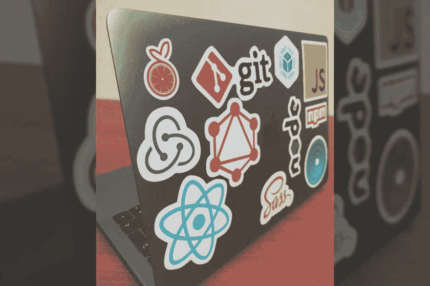

# 我使用的技术工具

> 原文：<https://dev.to/smakosh/the-tech-tools-i-use-2l5h>

> 这篇文章最初发表在我的个人博客 [Smakosh](https://smakosh.com/blog) 上。

[T2】](///static/tech-84f598a3896d271a6bdbaab95494ff67-ab4eb.jpg)

TL；博士我使用 Javascript 的一切:D

所以我想分享一下我个人或在工作中使用的工具，让我们从设计工具开始:

*   Adobe Illustrator 的标志，图标，插图。
*   Adobe XD 或 Invision Studio 用于设计用户界面和线框。
*   用于编辑图片和迷因的 adobe Photoshop :D
*   Adobe After effects 用于编辑视频(我推荐 Adobe Premiere Pro 用于编辑视频& AE 用于添加效果)。
*   为了获得灵感，我在那里分享我的作品，也代表我的行为

现在让我们来看看我在编码时使用的工具:

我分享我的代码，并在以下方面寻找灵感:

*   开源代码库
*   密码笔

如果我只是编写一个可能集成到应用程序(web 或本地)中的界面，我会使用普通的 html/css &普通的 js。

*   Jekyll 或者 Gatsby(我推荐 Gatsby)，我用 Github 托管文件，部署在 Netlify 上。

对于 Css，我很乐意使用现有的任何技术来快速完成我的任务&嗯，我个人使用了 Bootstrap 3 & 4、布尔玛、Lostgrid、Materliaze、Tachyons &制作了我自己的名为 Unnamed 的小框架，在 Github 上有超过 175 颗星星，但我真的更喜欢使用 cssGrid &我总是喜欢从头开始设计我的元素，因为这些组件可以完全重用 react。

如果我正在制作一个 web 应用程序，在前端我使用`create-react-app`样板文件，因为它是 React Js 开发团队的官方文件，但是我总是不得不添加 react-router、Redux、Recompose &许多我最常用的其他模块。

当我在 windows 上时，我显然使用 Git bash 作为我的终端，但当我在 macOS 上时，我使用 macOS & VScode 作为我的代码编辑器(素材主题)。

对于后端，我使用 php/mysql，但我个人不喜欢它，转而使用 node js，所以我目前使用 Express Js/mongose 和 Mongodb 作为数据库来制作 Restful APIs，并部署在 Heroku 上。

忘了说我有时候懒得做后端的时候会用 Firebase。

对于原生应用，我使用 React native 来构建移动应用(Ios 和 Android)。

对于 growth hacking，我更关注于构建用户生活中真正需要的有用产品，我只是在产品搜索、黑客新闻、Reddit 和社交媒体上分享这些产品。

我用的是 Windows 10，MacOs Mojave，我的 MSI GP62 笔记本电脑，我的 macbook pro 2017 touchbar 工作笔记本电脑，Nexus 6p，带 Dbrand 木皮。完整的设置可以在这里找到[。](https://docs.google.com/document/d/1falYEEHhJxq4HIXwOPoc4lk0AYsfHY4U6ZCcY4Srs8g/edit?usp=sharing)