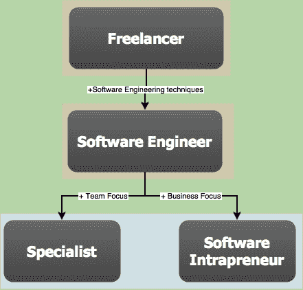

# 软件开发人员的三个成熟度等级

> 原文：<https://dev.to/agilistandre/the-three-levels-of-maturity-for-software-developers-a6d>

在成为敏捷教练之前，我从事了大约十年的软件开发工作。在此之前，我获得了计算机科学的学士和硕士学位。编程书籍和教程表明编写代码很容易。然而，写出好的、高质量的代码是极其困难的，有时会令人沮丧，但却是非常值得的。

那些年里，我开始注意到职业生涯中有不同层次的专业人士。第一个层面，软件职业者的行为和自由职业者是一样的，专注于写代码(也叫程序员或编码员)；第二层是软件工程师，他们也利用工程技能而不是写代码；第三个层次有两条路径:专家和软件内部企业家。这些水平已经假定了软件开发的专业知识水平，它们并不等同于你写代码有多好，也不等同于你多年的经验。这主要取决于你的职业选择。让我们仔细看看它们。

**免责声明** : *本文描述的水平并不意味着取代[梅里尔·佩奇-琼斯描述的软件工程专业知识的七个阶段](http://www.wayland-informatics.com/The%20Seven%20Stages%20of%20Expertise%20in%20Software.htm)；更确切地说，这是从另一个角度看软件开发。*

[T2】](https://res.cloudinary.com/practicaldev/image/fetch/s--RmqkxU6C--/c_limit%2Cf_auto%2Cfl_progressive%2Cq_auto%2Cw_880/http://agilistandre.com/wp-content/uploads/2018/03/Developer-Maturity-Level-3.png)

## 1。自由职业者

自由职业者(程序员或编码员)非常擅长编码，可能拥有完整的堆栈。他们快速交付中小型项目和移动应用，如果不是在创纪录的时间内，并且不害怕尝试具有挑战性和令人兴奋的新技术。如果他们与更多的程序员一起工作，他们将使用分而治之的方法，每个团队成员创建一个不同的拼图块，然后将这些块集成在一起。会议打断了他们的流动状态，应该保持在最低限度，但他们也可能是徒劳的，因为项目经理(pm)或产品负责人(POs)很难理解程序员在说什么。

自由职业者通过写代码来完成他们的工作。

[T2】](https://res.cloudinary.com/practicaldev/image/fetch/s--nXtzD7MN--/c_limit%2Cf_auto%2Cfl_progressive%2Cq_auto%2Cw_880/http://agilistandre.com/wp-content/uploads/2018/02/programming-1873854-300x165.png)

### 你是自由职业者吗？

如果你是一名自由职业者，你会对弄脏自己的手、达到代码水平和构建很酷的东西感到兴奋。这就是这份工作最初吸引你的地方。

我所知道的这个层次的大多数程序员都是自由职业者，或者来自自由职业背景(因此得名)或者一两个人的创业公司，在那里上述所有技能都是惊人的。所以，如果你真的是自由职业者，你可能会通过专注于你最擅长的事情而做得很好。你可能会从下一个级别中获得一些价值，但在你职业生涯的这个阶段，它们可能不是你的重点。

然而，一旦你开始建立一个成长中的初创公司，或者开始从事一个更长、更大的项目，涉及十几个或几十个其他程序员，由于你以前工作类型的性质，可能有几个习惯你应该丢掉:

#### 从自由职业者转型为软件工程师时要丢掉的习惯

*   为了满足自由职业者的截止日期，你可能没有时间写太多的测试。由于你的合同可能不包括维护工作，所以没有真正的动机去开发更高质量的代码，这需要更多的时间。
*   你比积极主动的人更被动。由于你习惯于从客户那里获得需求，你不知道你的最终用户是谁，也不知道你为什么要为他们开发这些应用和功能。
*   自从你受雇以来，你已经习惯了自己动手建造一切。对你来说，从零开始构建东西比在市场上找到合适的产品并与你的应用程序集成更令人沮丧。
*   正因为如此，**你发现在团队中工作极其困难**，因为你需要给你的团队成员提供所有的干扰、同步和指导。

考虑一下 Rick 的例子，一个自由职业者可能会成为一个伟大的程序员，但是[没有成为软件工程师](https://medium.freecodecamp.org/we-fired-our-top-talent-best-decision-we-ever-made-4c0a99728fde)。他的才华并没有转化为长期项目的工作，随着代码库变得越来越大，他的代码越来越不可读，测试越来越少。他陷入了恶性循环，最终被解雇了，项目也被取消了。

在从事大型项目的情况下，这些习惯需要重新评估。但是如果你意识到了这些，你可以比 Rick 更顺利地从自由职业者过渡到软件工程师。现在让我们来看看软件工程师的素质。

## **2。软件工程师**

[T2】](https://res.cloudinary.com/practicaldev/image/fetch/s--8JA_bu6X--/c_limit%2Cf_auto%2Cfl_progressive%2Cq_auto%2Cw_880/http://agilistandre.com/wp-content/uploads/2018/02/devops-3148408_1920-300x180.jpg)

一个更长的项目将不仅包括建设，还包括长期的项目维护。因此，如果已经有一个应用程序可以集成到您的应用程序的业务逻辑中，您可以购买它，以避免维护额外的功能。例如，您不需要为您的电子商务网站编写购物车功能，因为有多家公司专门从事购物车，您只需将您选择的应用程序集成到您的网站中。

像自由职业者一样，软件工程师将拥有开发代码的所有技能。但他们也将拥有其他 T 型技能，因为他们的角色不仅仅是运送产品，而是运送、维护、升级和在运送后的几年里支持用户。正因为如此，软件工程师知道速度不是唯一的因素，质量也是。其他特征包括对团队工作的偏好，以及知道最好的代码设计是在结对编程(有时是 mob 编程)会话中出现的。

#### 软件工程师的素质

软件工程师:

*   练习结对和 mob 编程；
*   了解 TDD、CI、CD(测试驱动开发、持续集成、持续交付)为什么重要，熟悉[几种软件工程实践](https://blog.codecentric.de/en/2014/05/agile-engineering-practices-short-overview/)；
*   在敏捷团队中工作，经常与他们的敏捷蔻驰/Scrum 大师交换想法，并且理解回顾是团队适应更好的合作和成长方式的机会；
*   要知道在项目开始时多花一个小时在质量上可以为项目节省数百个小时和数千美元；
*   自我清理(*即* refactor)。

软件工程师知道他们的工作不仅仅是写代码，而是成为开发人员管弦乐队中的一员，一起为同一个目标工作。软件工程师通过与开发团队一起设计高质量的软件产品来完成他们的工作。

### **你是软件工程师吗？**

作为一名软件工程师，你发现你的工作不是写代码，而是交付价值。事实上，有时您根本不用编写代码，通过构建原型来验证想法，就可以交付价值。在写一行代码之前，你必须计划它，讨论它，原型化它，测试，调查你的用户，然后再测试。在编写代码的整个过程中，您将编写测试来确保它在做您认为它在做的事情。事实上，您甚至可以使用 TDD 技术在产品本身之前编写测试。

通过成为构建软件产品的大师，从这里你有两个选择:1)你可以向内看并加强你在团队中的关系，成为一名导师，或者 2)向外看你的 POs、利益相关者和用户，成为你正在构建的产品的专家。

让我们来看看这两个选项。

## **3.1。专家**

专家不仅知道如何与团队和长期项目合作，他们还关心他们的团队成员和他们正在做的工作。他们也训练他们的团队成员成为软件工程师或专家。

专家是有经验的软件工程师，并且总是最终成为软件团队的团队领导。他们不仅继续掌握自己的手艺，还指导团队成员成长。事实上，他们采用 KPI(关键绩效指标)来衡量队友的成长。比起仅仅做任务，他们更看重有意义的结果。理解这句话的意思“如果我有 8 个小时去砍树，我会用其中的 6 个小时磨利我的斧头”；并且真正理解你不需要为了高效而 100%的时间都在写代码。毕竟，最好的代码是不需要编写的代码。

(敏捷的 12 条原则之一是:“简单——最大化未完成工作量的艺术——至关重要。)

专家们通过营造一种环境来完成他们的工作，在这种环境中，团队总是在不断学习，并以更快、最重要的是可持续的速度交付越来越高质量的产品。

## **3.2。软件内部创业者**

[T2】](https://res.cloudinary.com/practicaldev/image/fetch/s--q3V6FhPw--/c_limit%2Cf_auto%2Cfl_progressive%2Cq_auto%2Cw_880/http://agilistandre.com/wp-content/uploads/2018/02/woman-690036-1024x576.jpg)

对于这种级别的专业人士来说，具有企业家精神是最重要的品质。内部创业者不仅喜欢创造很酷的东西，还会把客户放在心上。他们知道与产品经理或产品所有者保持同步，像软件开发人员和专家一样，不仅要以速度和质量来构建软件，还要关注构建正确的东西。这是有效性和效率的关键区别。当你有效率的时候，你可以把事情做好。但是如果你在建造错误的东西，那有什么好处呢？这就是软件内部创业者的不同之处:他们也是有效的，也就是说，他们构建正确的东西。他们知道自己为客户创造的价值，并能向采购订单提供宝贵的反馈。他们不仅努力精通软件开发，还努力取悦客户。

软件内部创业者管理他们的团队，就好像团队是组织中的一个初创企业。**软件内部创业者通过确保真正的价值被交付给他们的用户来完成他们的工作**

### **你是专家还是软件创业者？**

你知道伟大的软件不是简单的写代码就能完成的。作为一名内部创业者，你将与采购订单或用户交谈，以确切了解他们需要你做什么。作为一名专家，您将确保从初级到高级开发人员，参与构建产品的每个人都将优秀的工艺应用到产品中。你要确保团队在产品开发之前、之中和之后都有足够的支持。你将确保团队在进步，不仅仅是应用程序的开发，而是每个人在他们的工艺中以及作为一个团队在一起。一个团结的团队比团队成员的总和要大得多。有凝聚力的团队比没有凝聚力的团队表现得更好。

那么这两级之后接下来是什么呢？如果你是专家或内部企业家，你可能已经知道答案了。你可能已经有一个这样的博客了。也许你正在考虑写一本书或在一个会议上发言，甚至开始你自己的创业。

## 结论

正如我在开始时提到的，这里给出的水平并不等同于多年的经验。你可以是一个经验丰富、非常成功的自由职业者(可能会用到软件工程师的一两种技巧)，决定把你的职业生涯集中在自由职业世界。或者一个初学者成为一个成功的软件内部企业家。

作为一名敏捷教练，我希望指导敏捷团队的成员成为专家和软件内部企业家，因为他们将是团队中最成功的成员。如果你把你的[软件工程技能和你的职业](https://www.goodreads.com/book/show/6399113-the-passionate-programmer)当作你正在出售的有价值的东西(作为顾问或雇主)，你不应该仅仅关注学习新技术和新语言；而且要学习敏捷和 T2 软技能，这会让你更容易被雇佣。当你和未来(或现在)的雇主协商薪水时，你将占据上风，无论你决定为哪家公司工作，你都将享受到一个更令人兴奋的角色。最重要的是，你将创造出让顾客满意的产品。