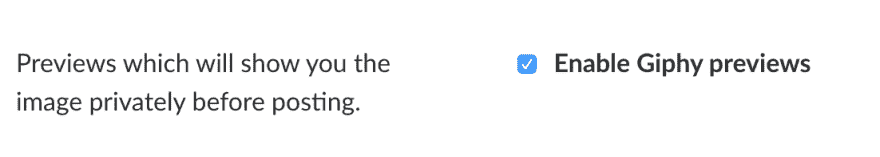

# 我使用的工具，2018 年 7 月版🛠

> 原文：<https://dev.to/michael/the-tools-i-use-july-2018-edition--2l2>

我一直对别人用来完成工作的工具感兴趣。我喜欢评估我的工具，以改进我的工作流程并完成工作。由于我最近换了一个新职位，担任首席技术官，我想我应该分享一下我目前用来完成工作的工具。

**苹果邮件:**自从 Readdle 发布以来，我一直是 [Spark 的忠实粉丝，但随着最新的 2.0 更新，我注意到我的电子邮件变得有点不稳定。最近的电子邮件标题来自超级旧的电子邮件，这让我困惑了好几次。虽然我喜欢 Spark 的用户界面可定制性，但我需要一个可以跨所有平台工作的电子邮件客户端。](https://sparkmailapp.com)

出于这个原因，我又开始在 Mac 和 iPhone 上使用苹果邮件。这种体验在不同平台之间是无缝的，我总是希望它能正常工作。

**终端:**我在命令行上花了很多时间，因此我使用苹果的默认 shell 应用，Terminal.app。在终端之上，我安装了更具体的 Zsh[Oh-my-Zsh](https://github.com/robbyrussell/oh-my-zsh)，它提供了一些额外的细节，如 [git 别名](https://github.com/robbyrussell/oh-my-zsh/wiki/Cheatsheet#git)。我也喜欢用[德古拉主题](https://draculatheme.com/)和 [Fira Mono](https://fonts.google.com/specimen/Fira+Mono) 作为我的字体，大小设为 16px(因为我老了)。

**[Brew:](https://brew.sh/)** Brew 是 macOS 的命令行包管理器。它使得在 Mac 上安装各种工具和应用程序变得更加容易。这是我在安装新机器时安装的第一批工具之一。

**[Tmux:](https://github.com/tmux/tmux)** 随着我的终端设置，我使用 Tmux，一个终端复用器。tmux 提供了将单个会话分割成多个会话的能力，允许在不中断会话的情况下附加和分离会话，并将我的视图分割成多个窗格。这一切都是通过按键完成的，所以它与我的 Vim 文本编辑工作流集成在一起。

[T2】](https://res.cloudinary.com/practicaldev/image/fetch/s--5wtTIfkg--/c_limit%2Cf_auto%2Cfl_progressive%2Cq_auto%2Cw_880/https://thepracticaldev.s3.amazonaws.com/i/yycyti192fll37d2yomp.png)

NeoVim: NeoVim 是我编辑所有文本和大部分代码的地方。这是 Vim 的改良口味。搭配 [Goyo](https://michaelsoolee.com/goyo-vim/) ，这是一个非常好的，不受干扰的写作环境。

我长期使用 Atom 来编辑代码。虽然我从未遇到速度问题，但许多人抱怨说，真正让我的关系难以跟上 Atom 的原因是我选择的代码编辑器不断更新，而且当更新时，Atom 经常会挂起。这使得体验不是很好。

我从来不是 [VS Code](https://code.visualstudio.com/) 的粉丝，尽管看起来很大一部分开发者社区喜欢 VS Code。我决定在我的机器上安装 VS 代码来代替 Atom。虽然这不是我写大部分代码的地方，但是在某些情况下我更喜欢使用文本编辑器而不是 Vim，比如在 Git 中解决合并冲突。

**[吉拉:](https://www.atlassian.com/software/jira)** 我和我的团队的所有工作都在吉拉进行跟踪，这是项目管理的一个同义词工具。虽然我在吉拉不是专业人士，但它帮助我规划工作、完成工作、授权并与团队沟通。

**[Dropbox:](https://db.tt/I0b2M11p)** Dropbox 是我工作流程中很大的一部分。我每天都创建新的笔记。这些笔记包含了我的任务列表和我在与客户和团队成员开会时记下的笔记。因此，Dropbox 就像我的第二个大脑。我把所有笔记都放在 Dropbox 里，这样我就可以在 Mac 和 iPhone 上查看了。因为我的笔记都是用 Markdown 写的，所以转移起来很顺畅。

**[1 密码:](https://1password.com/)** 我将我所有的密码都放入 1 密码中，并通过家庭订阅，这很棒，因为我可以与我的妻子分享密码的子集。我还可以标记密码，这样我就可以快速找到与工作相关的密码。为了安全起见，我还在 1Password 中放置了环境变量，以便在新机器上设置应用程序或让其他开发人员开始运行时能够访问。

我在 Mac 和 iPhone 上同时使用 1Password，并大量使用密码生成器，这样我就不必在创建密码时耗费精力。

VS 代码:同样，我是 Atom 的忠实粉丝，几个月前，我决定当我需要一个拥有更强大特性(如 Git)的代码编辑器时，就转而使用 VS 代码。我可以很容易地看到合并冲突，并在解决冲突时选择合并到哪个源中。除此之外，大多数代码都是用 NeoVim 编写的。

**[眼镜:](https://github.com/eczarny/spectacle)** 眼镜是一款开源的 Mac app，允许你使用组合键来管理窗口。我仍然很惊讶苹果没有在 macOS 中烘焙他们自己的窗口管理系统。当我在写散文或代码时，我喜欢能够快速地将浏览器窗口和我的终端窗口并排放在一起进行研究。

**[火狐:](https://www.mozilla.org/en-US/firefox/developer/)** 我是 Chrome 的粉丝已经很久了。这是一款可靠的浏览器，但我之所以把它作为我的主要浏览器，是因为我使用的谷歌产品让谷歌了解了我生活中的很多事情。虽然我可能永远无法摆脱谷歌，但我想凭良心努力限制我与谷歌的关系。

Firefox 声称重视隐私，所以它看起来是一个不错的选择。Mozilla 有一个名为 [IRL](https://irlpodcast.org/) 的播客，讨论包括隐私在内的在线生活问题。听了几集之后，我很欣赏他们的工作，因此帮助我决定使用 Firefox 作为我的主要浏览器。

最重要的是，由于我做大量的前端开发，我需要开发工具。Firefox，更确切地说是开发者版，为开发者提供了一些非常好的工具。我还喜欢它提供了周到的功能，如生成截图。

Chrome: 虽然 Firefox 是我的默认浏览器，但我仍然保留 Chrome，因为它能很好地处理视频会议等资源密集型服务。我经常开视频会议，因为我时常远离我的团队和客户。因此，我需要确保我的浏览器在播放视频或通过视频分享我的屏幕时是可靠的。

我试过用 Firefox 开视频会议，但不久之后，我的 Mac 就开始爬行，同时风扇大声旋转，笔记本电脑变得非常热。

**[Appear.in:](https://appear.in/)** 我们团队使用 Appear.in 进行视频会议。这很好，因为我们有几个专门用于团队或客户会议的 URL。在我看来，视频和音频是一流的，与视频分享相比，屏幕分享做得非常好。在 Hangouts 中，当共享您的屏幕时，您的视频个人资料将被屏幕共享所取代。但使用“出现”,您的屏幕和视频资料都会显示出来。

**[Figma:](https://www.figma.com/)** Figma 已经成为我设计工具的首选。我在 Figma 做我所有的布局，矢量设计和线框。虽然有很多很棒的工具可以用来制作线框，但是 Figma 真的很适合我的思维和工作方式。因此，创建一组组件，我可以在其中很好地制作线框。

我在一家数字机构担任[首席技术官，做了大量的线框图工作，这在与项目股东和开发者的交流中被证明是有价值的。](https://michaelsoolee.com/cto/)

**[Invision:](https://www.invisionapp.com/)** 一旦我在 Figma 中整合了线框，我将导出这些帧并将其发布到 Invision 上。结合评论，这是在应用程序中通过用户日记讨论某个特性的好方法。这也是向我们的客户索取副本的一个好方法。

**[观念:](https://www.notion.so)** 我最近发现的观念，就是蜜蜂🐝膝盖。在加入 Pathos Ethos 的过程中，我开始记录我们正在开发和创建的知识库。因此，我们需要一个强大的 wiki，既能做好 wiki，又能进行以代码为中心的编辑。凭借对 markdown 的支持和在其他页面中组织页面的能力，它很快成为一个非常好的工具。虽然我仍在为我们的工具带评估这个工具，但我可以说它是一个强大的工具，我很高兴能继续向我们的团队介绍它。

**Google Apps:** 作为首席技术官，沟通是我工作的关键。因此，我写了大量的电子邮件。Gmail 是我们团队在 Pathos Ethos 使用的。事实上，当我使用笔记本电脑或台式机时，我更喜欢 Gmail 浏览器应用程序，而不是苹果的邮件应用程序。我在火狐的一天中一直关注的一个标签是 Gmail。

在过去的几周里，随着我加入这个团队，我不得不开很多会议。因此，我非常依赖谷歌的日历来跟踪客户会议、团队会议以及与个人开发者的一对一会谈。

**[Slack:](https://slack.com/)** 我们的团队使用 Slack 进行实时交流。我们的设置非常简单，因为我们有一个渠道，我们所有的团队成员在工作日都可以进入。在那里，我们有子团队，子团队的关键成员可以就更具体的事情相互交流。例如，开发团队有一个名为`dev`的频道，我们在那里讨论客户工作和其他与开发相关的问题。

除此之外，我还利用了一些集成。使我们能够快速将一个会议室链接到一个频道，从而引导人们即时参加会议。我们也使用 Giphy 使用`/giphy search-term`。除了表情符号，gif 确实有助于我们团队的交流。如果你有 Giphy，我强烈推荐你打开的一个选项是*预览*选项。默认情况下，触发 giphy 就像一个通配符，将返回第一个匹配的 gif。这经常导致我的焦虑，因为返回的 gif 可能不是想要与 gif 交流的内容。通过打开预览选项，它允许你在 gif 发布之前先预览它，如果它不是正确的，它还允许你洗牌。

[T2】](https://res.cloudinary.com/practicaldev/image/fetch/s--70n7Zhpl--/c_limit%2Cf_auto%2Cfl_progressive%2Cq_auto%2Cw_880/https://thepracticaldev.s3.amazonaws.com/i/frpl08u7jmy6vmgsaor6.png)

我希望尽快组装出我们自己的机器人。因为有一些事情是我们团队独有的，我相信有了机器人，它可以帮助改善我们的工作流程。当我们把它放在一起时，我一定会分享更多。

**[fantastic:](https://flexibits.com/fantastical-iphone)**我在谷歌上有所有的日历事件，在我的手机上设置了所有的谷歌账户，fantastic 是一个很好的应用程序，可以帮助管理我的日历。原因是，它借鉴了 iOS 的日历应用。最棒的是，每当我有了新设备，简单地设置我的 Gmail 帐户也意味着 Fantastical 已经准备就绪。

使用 Fantastical 的一个优势是它们的自然语言解析。创建活动时，您可以写出一个句子，Fantastical 将根据您键入的内容填写活动细节。当然，你可以事后编辑事件，但这是一个好的开始。

**[1Writer:](http://1writerapp.com/)** 由于将笔记和任务存储为 markdown 文件并同步到 Dropbox 上是我日常工作流程中至关重要的一部分，我在 iOS 上使用 1Writer 来编辑这些相同的文件。

1Writer 对 Markdown 的支持非常好，配合它对 [Github 风味 markdown](https://help.github.com/articles/basic-writing-and-formatting-syntax/) 的支持，它与我的任务列表工作流配合得非常好，我正在使用 Github 任务列表。在 1Writer 的预览模式下，我可以通过点击复选框来切换任务。

* * *

这些是我目前用来完成工作的工具。我很想听听你的工具箱里有什么能让你完成工作的东西。在评论中分享你的工具。

* * *

Jo Szczepanska 在 Unsplash 上的封面照片

* * *

最初[发布在 michaelsoolee.com](https://michaelsoolee.com/tools-july-2018/)上。

感谢您花时间阅读这篇文章！我很想保持联系，并通过我的时事通讯给你发送编程和设计的技巧，在家工作和制作副业。[点击这里报名](http://eepurl.com/bGXerj)。