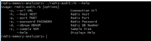

# 6 大免费 Redis 内存分析工具

> 原文：<https://dev.to/scalegrid/the-top-6-free-redis-memory-analysis-tools-2hdi>

[T2】](https://scalegrid.io/blog/the-top-6-free-redis-memory-analysis-tools/)

在分析 Redis 实例的内存使用时，市场上有很多免费和开源的工具，以及一些付费产品。一些最受欢迎的工具是 Jacks(各行各业都有名气)，但如果你想对你的记忆问题进行更深入的分析，你可能会更好地使用一种更有针对性、更少为人知的工具。

在本帖中，我们编辑了一个列表，列出了我们发现在分析 Redis 实例的内存使用情况时最有用的 6 个免费工具:

1.  Redis 内存分析器(RMA)
2.  雷伊斯采样器
3.  RDB 工具
4.  Redis 审计
5.  瑞迪斯工具包
6.  收获

阅读原文:[6 大免费 Redis 内存分析工具](https://scalegrid.io/blog/the-top-6-free-redis-memory-analysis-tools/ "The Top 6 Free Redis Memory Analysis Tools")

* * *

## 1)重定向记忆分析仪

[Redis 内存分析器](https://github.com/gamenet/redis-memory-analyzer "Redis Memory Analyzer (RMA)") (RMA)是 Redis 可用的最全面的 FOSS 内存分析器之一。它支持三种不同级别的详细信息:

[T2】](https://scalegrid.io/blog/wp-content/uploads/2018/06/image13.png)

*   **全局** -内存使用信息概述。
*   **扫描器** -最高级别的密钥空间/前缀级别的内存使用信息-换句话说，使用最短的公共前缀。
*   **RAM** -最低级别的密钥空间/前缀-换句话说，使用最长的公共前缀。

每种模式都有自己的用途——你可以在 [RMA 自述文件](https://github.com/gamenet/redis-memory-analyzer/blob/master/README.rst "RMA on ReadMe")中获得更多细节。

### RMA -全球模式

在全局模式中，RMA 提供一些高级统计信息，如键的数量、系统内存、常驻集大小、键空间大小等。一个独特的特性是“键空间开销”，Redis 系统使用这种内存来存储与键空间相关的信息，比如列表数据结构的指针。

[T2】](https://scalegrid.io/blog/wp-content/uploads/2018/06/image15.png)

### RMA -扫描仪模式

在扫描模式下，我们可以看到我们的键空间的概况。它给出了高级名称空间(因此 a🅱️1 和 a:c:1 组合在一起作为一个*)，以及它的条目类型和该名称空间消耗的内存百分比。从这些信息开始，然后使用“RAM”行为和名称空间模式进行详细的分析是很有用的。

[T2】](https://scalegrid.io/blog/wp-content/uploads/2018/06/image12.png)

### RMA - RAM 模式

在 RAM 模式下，我们得到键空间级别的内存消耗，这是大多数其他 FOSS 内存分析器提供的。所以在这里，a🅱️1 和 a:c:1 分别作为 a🅱️*和 a:c:*我们得到了有关内存使用，实际数据大小，开销，编码，最小和最大 TTL 等详细信息。这有助于确定系统中最大的内存占用者。

[T2】](https://scalegrid.io/blog/wp-content/uploads/2018/06/image11.png)

不幸的是，这个工具并不总是更新(GitHub 上的最后一次提交是在一年多以前)。即便如此，这也是我们发现的用于详细分析的最佳方法之一。

### RMA 安装和使用:

RMA 要求在系统上安装 Python 和 PIP(两者都适用于所有主要的操作系统)。一旦它们被安装，你可以执行一个简单的命令来安装 RDB 工具- ` pip install rma '

从命令行使用非常简单。语法是` RMA[-s HOST][-p PORT][-a PASSWORD][-d DB][-m pattern-to-match][-l number-of-keys-to-scan][-b behavior][-t comma-separated-list-of-data-types-to-scan]'

#### 军事革命的优点:

*   实时工作。
*   使用 scan 命令遍历数据库，因此对性能的影响有限，分析非常准确。
*   证据充分——很容易找到使用示例。
*   支持健壮的定制和过滤选项，包括只分析特定的数据类型，或者只考虑匹配特定模式的键)。
*   可以提供不同级别的细节——名称空间、键或全局值。
*   在我们审计的所有工具中是独一无二的，因为它显示了数据结构开销(也就是说，使用了多少内存来存储内部 Redis 信息，如 list 数据类型的指针)。

#### RMA 缺点:

*   不支持概率抽样。对于大型数据库，线性扫描数据库可能非常慢；一旦返回一定数量的键，可以选择停止扫描以提高性能。
*   输出中有很多细节；虽然对专家有帮助，但可能只会让新手困惑。

* * *

## 2) [重定向采样器](https://github.com/antirez/redis-sampler "Redis Sampler by Antirez")

Redis Sampler 是一个非常强大的工具，可以深入了解 Redis 实例的内存使用情况。它由 Redis 背后的开发者 [antirez](https://github.com/antirez "antirez - Redis Sampler") 维护，Redis 的深厚知识在这个工具中表现得淋漓尽致。该工具并不经常更新——但无论如何也没有太多问题被报告。

[T2】](https://scalegrid.io/blog/wp-content/uploads/2018/06/image7.png)

Redis Sampler 对数据库进行概率扫描，并报告以下信息:

*   键在各种数据类型中的百分比分布——基于键的数量，而不是对象的大小。
*   基于 strlen 的 string 类型的最大键，以及它们占用的内存百分比。
*   对于所有其他数据类型，最大的键被计算并显示为两个单独的列表:一个基于对象的大小，另一个基于对象中的项数。
*   对于每种数据类型，它还显示“2 的幂分布”。这对于理解数据类型中的大小分布非常有用。输出基本上详细说明了给定类型的大小在> 2^x 和< = 2^x+1.范围内的键的百分比

### Redis 取样器的安装和使用:

这是一个单独的 Ruby 脚本。它要求已经安装了 Ruby。您还需要安装“rubygems”和“redis”gems。用法非常简单——从命令行执行`。/redis-sampler.rb '

[T2】](https://scalegrid.io/blog/wp-content/uploads/2018/06/image8.png)

#### 重定向至:

*   使用起来非常简单——不需要调查和理解。
*   即使对于新手来说，输出也很容易理解，但是对于专家对 Redis 实例进行非常详细的分析来说，它包含了足够的信息。各部分界限分明，易于过滤。
*   适用于所有 Redis 版本。
*   不使用任何类似 DEBUG OBJECT 的特权命令，所以可以在任何系统上使用，包括亚马逊的 ElastiCache。
*   它使用特定于数据类型的长度命令来标识数据大小，因此报告的使用情况不受序列化的影响。
*   处理实时数据。虽然建议在环回接口上运行，但它支持远程系统采样。

#### Redis 采样器 Cons:

*   如果样本大小设置得高于数据库基数，它仍然会使用 RANDOMKEYS 而不是 SCAN。
*   没有可用的捆绑包或 Docker 映像。您必须手动安装依赖项(尽管从好的方面来看，只有两个依赖项)。
*   报告数据大小，由于数据结构存储开销，数据大小与 RAM 上占用的空间不完全匹配。
*   如果您的 Redis 实例需要身份验证，则不能开箱即用。您需要修改脚本以获取密码；以最简单的形式，您可以搜索:redis = Redis.new(:host => ARGV[0]，:port => ARGV[1]。to_i，:db => ARGV[2]。to_i)并将其更改为:redis = Redis.new(:host => ARGV[0]，:port => ARGV[1]。to_i，:db => ARGV[2]。to_i，:password = >“在此添加您的密码”)

* * *

## 3) [RDB 工具](https://github.com/sripathikrishnan/redis-rdb-tools "RDB Tools for Redis Memory Analsis")

对于任何认真的 Redis 管理员来说，RDB 工具是一套非常有用的工具。我们能想到的几乎每个用例都有一个工具，但是在这篇文章中，我们将只关注内存分析工具。

[T2】](https://scalegrid.io/blog/wp-content/uploads/2018/06/image9.png)

虽然远不及 RMA 或 Redis Sampler 全面，但 RDB 工具提供了 3 条重要信息:

1)值的(序列化)大小大于 B 字节[B 由用户指定]的所有关键字。

[T2】](https://scalegrid.io/blog/wp-content/uploads/2018/06/image2.png)

2)最大的 N 个密钥[N 由用户指定]。

[T2】](https://scalegrid.io/blog/wp-content/uploads/2018/06/image16.png)

3)特定密钥的大小:这是从数据库中实时读取的。

[T2】](https://scalegrid.io/blog/wp-content/uploads/2018/06/image3.png)

这个套件在 GitHub 上有很多活跃的贡献者，并且更新非常频繁。RDB 工具在互联网上也有很好的记录。维护者 [sripathikrishnan](https://github.com/sripathikrishnan?tab=repositories) 在 Redis 社区中因其多年来提供的许多工具而闻名。

### RDB 工具的安装和使用:

RDB 工具要求在系统上安装 Python 和 PIP(两者都适用于所有主流操作系统)。一旦它们被安装，你可以执行一个简单的命令来安装 RDB 工具-pip install RDB tools python-LZ

用法非常简单:

*   要获得 200 个最大的键，请使用:rd b-c memory/var/redis/6379/dump . RDB–最大的 200 -f memory.csv
*   要获取大于 128 字节的所有键，请使用:rd b-c memory/var/redis/6379/dump . rd b-bytes 128-f memory . CSV
*   获取密钥的大小:redis-memory-for-key-s localhost-p 6379-a my password person:1

#### RDB 工具的优点:

*   输出 CSV 文件，该文件可与其他 FOSS 工具一起使用，轻松创建数据可视化，也可导入 RDBMS-es 以运行分析。
*   非常有据可查。
*   支持定制和过滤选项，因此您可以获得更有用的报告。

#### RDB 工具缺点:

*   他们的分析不适用于实时数据；你必须去 RDB 拉屎。因此，报告的内存使用量是序列化内存，与 RAM 上占用的内存不完全相同。
*   它没有任何对分组的内置支持，所以它找不到最大的名称空间。

* * *

## 4)再审核

[Redis-Audit](https://github.com/snmaynard/redis-audit "Redis-Audit") 是一个概率工具，有助于快速了解内存使用情况。它输出关于密钥组的有用信息，如总内存消耗、组中的最大 TTL、平均最后访问时间、组中过期密钥的百分比等。如果您需要在应用程序中找到最占用内存的键组，这是一个完美的工具。

[T2】](https://scalegrid.io/blog/wp-content/uploads/2018/06/image5.png)

### Redis-Audit 安装和使用:

你必须已经安装了 Ruby 和[包](https://bundler.io/)。安装完成后，你可以[将 Redis-Audit 库](https://github.com/snmaynard/redis-audit.git)克隆到一个文件夹中，或者[下载 zip 文件](https://github.com/snmaynard/redis-audit/archive/master.zip)并解压到一个文件夹中。从该文件夹中，运行“捆绑安装”来完成安装。

用法非常简单:从命令行执行` redis-audit . Rb hostname[port][password][dbmnum][sample _ size]`命令

#### 重定向至:

*   允许您为键空间/前缀分组定义自己的正则表达式。
*   适用于所有 Redis 版本。
*   如果样本大小大于键的实际数量，它将遍历所有键。另一方面，该操作使用键*，而不是扫描-可能会阻止其他操作。

#### redis-cons 审核:

*   使用调试对象命令(在 ElastiCache 中不可用)；因此，它报告的是序列化大小，这与 RAM 上实际占用的大小不同。
*   输出不太容易快速解析，因为它没有列表。

* * *

## 5) [再版工具箱](https://github.com/alexdicianu/redis_toolkit)

Redis Toolkit 是一个基本的监控解决方案，可用于分析两个关键指标:命中率和内存消耗。该项目定期更新错误修复，但没有一些更著名的工具所享有的社区支持。

[T2】](https://scalegrid.io/blog/wp-content/uploads/2018/06/image10.png)

### Redis 工具包的安装和使用:

您的系统上必须安装 Docker。然后，克隆 [GitHub 库](https://github.com/alexdicianu/redis_toolkit.git)(或者[下载为 zip](https://github.com/alexdicianu/redis_toolkit/archive/master.zip) 解压到一个文件夹)。在该文件夹中，安装就像执行`。/redis-toolkit install `

[T2】](https://github.com/alexdicianu/redis_toolkit/blob/master/README.md)

使用纯粹是通过命令行，通过一系列简单的命令。

*   开始监控点击率:。/redis-工具包监视器
*   报告命中率:。/redis-工具包报告-名称名称-类型命中率
*   停止监控命中率:。/redis-工具包停止
*   在本地系统上创建转储文件:。/redis-工具包转储
*   要报告内存使用情况:。/redis-toolkit 报告类型内存名称名称

#### 重定向至:

*   易于理解的界面，为您提供所需的准确信息。
*   可以将前缀分组到对您有用的任何级别(因此，如果您选择 a🅱️1 和 a:c:1，它们将被计为 a:*或单独计算)。
*   适用于所有 Redis 版本；不需要访问 DEBUG OBJECT 等特权命令。
*   证据确凿。

#### Redis 工具包 Cons:

*   内存分析不是实时的；因为它在序列化转储上工作，所以报告的内存使用量不等于实际的 RAM 消耗。
*   必须在运行 Redis Toolkit 的计算机上创建转储。如果您有一个远程 Redis 实例，这可能需要一段时间。
*   监控命中率使用 MONITOR 命令来捕获服务器上运行的所有命令。这可能会降低性能，并且是生产中的一个潜在安全风险。
*   命中率的计算方法为|GET| / (|GET| + |SET|)。因此，如果一个值经常改变，它的命中率将会更低，即使从来没有实际的缓存未命中。

* * *

## 6) [收获](https://github.com/31z4/harvest)

这是一个概率抽样工具，可用于根据键的数量确定 10 个最大的名称空间/前缀。这是最新的工具之一，还没有在 GitHub 上看到多少吸引力。但是，如果您是一名 Redis 新手，想要确定哪种应用程序数据堵塞了您的实例，那么没有比 Harvest 更简单的了。

[T2】](https://github.com/31z4/harvest/tree/v0.2.0)

### Harvest 安装和使用:

这是一个可下载的 Docker 图片。一旦映像准备就绪，您就可以从 CLI 使用命令“docker run-link redis:redis-it-RM 31z 4/harvest redis://redis-URL”运行该工具。

#### 收获优点:

*   处理实时数据。
*   使用“memory usage”命令获取大小信息；因此:
    *   给出准确的大小信息(而不是序列化的大小)。
    *   不需要访问调试对象命令。
*   您的名称空间不需要用:(冒号)来描述。Harvest 识别常见的前缀，而不是依赖基于正则表达式的名称空间识别。

#### 收获缺点:

*   这只是一个小把戏——很难将它用于任何其他用例。
*   该工具仅适用于 Redis v4.0 及更高版本。
*   最少的文件。

* * *

## 自由工具限制

虽然我们发现这些工具对于调试 Redis 实例的内存问题非常有用，但是您应该意识到这些免费工具的局限性。

付费工具几乎总是有某种数据可视化，这是我们审计的任何工具都无法现成提供的。你得到的最好的结果是一个 CSV 输出，你可以用其他的 FOSS 工具来可视化，而许多工具甚至没有这个选项。这导致了一个陡峭的学习曲线，特别是对于 Redis 的新手用户。如果您可能经常进行内存分析，那么查看提供良好可视化的付费工具可能是值得的。

另一个限制是存储历史信息的能力。按照 nix 的一般理念，制造只做一件事但做得很好的小工具，这些工具很少涉足监控领域。甚至没有一个随时间变化的内存消耗图，许多甚至不能分析实时数据。

### 底线

一个单一的工具可能无法满足您的所有需求，但它们是您的武器库中非常好的武器，与 DBaaS 服务提供的监控功能相结合，如 ScaleGrid 的 [Redis hosting](https://scalegrid.io/redis.html "Redis Hosting at ScaleGrid") ！要了解更多关于完全管理的 Redis 托管可用的伟大工具，请查看我们的 [Redis 功能 by Plan](https://help.scalegrid.io/docs/redis-features-by-plan "Redis Hosting Tools") 。