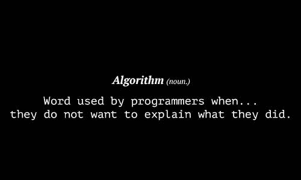

# 算法分析初学者终极指南

> 原文：<https://dev.to/jainroe/the-ultimate-beginners-guide-to-analysis-of-algorithm-84h>

前几天，我在 StackOverflow 上看到一个帖子，上面写着“理论计算机科学(TCS)有用吗？”。我完全措手不及，因为，嗯，我正在学习渐近行为复杂的数学符号，并且想不出一个可以将其应用到我的日常编码中的用例。这篇文章让我思考“如果理论 CS 没有被实际使用，为什么我还需要了解它呢？尤其是当我天生的兴趣和能力更多的在于编程而不是数学分析的时候。

所以在周末，我做了一些调查。为什么这很重要？我每天学习的概念的范围仅限于回答算法复杂性面试问题吗？之后他们的申请呢？

必须有更多！

### 理论计算机科学(TCS)有用吗？

大有！

TCS 不仅仅是数学分析，也不仅仅是程序员在工作面试时应该学习的。如果你计划以程序员为职业，你的工作可能不仅仅是构建当今最酷、最有用的软件，而是以一种最有用、最高效的方式来构建它。你还必须思考你正在做的事情是如何和为什么起作用的，以及它在什么范围内起作用。

这就像成龙和贾登·史密斯在电影《空手道小子》中的场景。在这里，成龙告诉德雷穿上和脱下他的夹克，一遍又一遍。

[https://www.youtube.com/embed/T10ycFr770g](https://www.youtube.com/embed/T10ycFr770g)

你认为杰基是在教他如何穿上和脱下夹克吗？不要！他在教他成为功夫高手所必需的技巧。

这就是 TCS 为我们做的。它为基础抽象概念奠定了坚实的基础，帮助我们作为开发人员做出正确的选择。

在这篇文章中，针对那些对编码了如指掌但没有任何 TCS 背景的程序员，我向你展示了计算机科学最重要的理论概念之一:读完这篇文章，你将能够理解计算机科学家使用的所有常用术语，如“算法”、“算法复杂性分析”、“大θ”、“渐近行为”和“最坏情况分析”。

这篇文章没有任何数学先决条件，我计划建立一个坚实的基础背景来学习不同的算法，更好地理解它们背后的理论。

我们开始吧！

**A)什么是算法？**

> 算法可以定义为一系列步骤，您可以遵循这些步骤来完成任务。

你可能会想，那是个保镖。题目不是读了类似于**初学者**学习算法指南的东西吗？

好吧！我们举个例子来简化定义。假设我想在网上买一本书。看完下面的例子后，再读一遍定义。

```
BuyBook(bookname){
 1\. Open Amazon
 2\. Search for the bookname
 3\. If in stock, add to the cart
 4\. Proceed with checkout process
 5\. Wait dearly for your book to be shipped
}

BuyBook('Into The Water') 
```

所以，我想在网上买一本名为《入水》的书。所以，我做的第一件事就是访问亚马逊。我在亚马逊上搜索我的书《入水》，发现有现货。我继续添加到购物车和最后的结账过程。搞定了。

你现在能试着把这些点和定义联系起来吗？

我上面所做的是按照一系列的步骤来实现一些目标(在我们的例子中是买书)。这就是算法的主要目的

或者看下图！😉

[](https://res.cloudinary.com/practicaldev/image/fetch/s--K1rAcIa0--/c_limit%2Cf_auto%2Cfl_progressive%2Cq_auto%2Cw_880/https://cdn-images-1.medium.com/max/500/1%2AD2Nx7mm3Q-OENTG_Vq_btA.jpeg) 

<figcaption>来源:[第一设计师](https://1stwebdesigner.com/graphic-design-jokes/)</figcaption>

那好吧。

**B)什么是算法分析？为什么我们还要分析它们？**

> 算法分析可以定义为对计算机程序**性能**和资源使用的理论研究。

所以，我在上面的定义中用粗体字写了单词 performance。原因很简单，因为我们在本文中主要关注的是计算机程序的性能。

但是，在我们开始讨论它之前，您能想到比编程中的性能更重要的其他事情吗？

嗯，就像程序可能超级快，但给出错误的输出？

这能行吗？不要！

有很多东西，比如正确性、简单性、可维护性、健壮性、安全性、功能性以及最重要的用户友好性，这些比程序的性能更重要。

例子: [Snapchat 首席执行官埃文·斯皮格尔计划重新设计 Snapchat。](https://www.recode.net/2017/11/7/16620812/snapchat-evan-spiegel-redesign-users-q3-earnings)

Snapchat 应用程序按照预期运行，但埃文·斯皮格尔仍计划对其进行重新设计。因为根据反馈，他们发现该应用程序有点难以理解，他们计划通过使其更易于使用来改进它。在这里，用户友好性显然比算法更重要。

因此，很明显，与上述特性相比，性能处于最底层。那么，我为什么要写一篇关于性能的文章呢？

因为有时用户友好性与性能直接相关。

[](https://res.cloudinary.com/practicaldev/image/fetch/s--RAHQwiz---/c_limit%2Cf_auto%2Cfl_progressive%2Cq_auto%2Cw_880/https://cdn-images-1.medium.com/max/491/1%2AvfbJLo5_iFw6ItRr9-jNtA.jpeg) 

<figcaption>我就在这里等。(来源:imgflip.com)</figcaption>

想象一下坐在一个永远无法加载的网站前。通常，绩效衡量的是可行和不可行之间的界限。在实时设置中，如果一个应用程序不够快，它就是不起作用的。或者如果它占用了太多的内存，对我们来说就没用了。

有了这些知识，让我们试着分析一个简单的排序问题:

现在，我们将使用一种叫做冒泡排序的算法。我将用伪代码(一种用英语写的编程语言)写这个算法

```
Bubblesort( var a as array )
    for i from 1 to N
        for j from 0 to N - i
           if a[j] > a[j + 1]
              swap( a[j], a[j + 1] )
end func 
```

这里，输入将有一个数字序列，输出将给出一个排序的数字列表。函数 Bubblesort 接受一个数据数组作为输入，并将生成一个排序后的数字列表。

难以理解？让我们举一个简单的例子

这里我们对 BubbleSort 函数的输入是{6，5，3}。我们希望我们的算法给出我们想要的输出，像这样的排序列表{3，5，6}

我们的算法是如何工作的:

**第一轮:**

```
# Our aim to to sort our list from smallest to largest. If we find numbers out of order, we swap them.

# Start with first element and compare it with next.
{ **6, 5** , 3}

# Compare 6 and 5\. Since 6 > 5 -> Perform swap
{5, 6, 3}

# Now,look at second and third element and compare.
{5, **6, 3** }

# Compare 6 and 3\. Since 6 > 3 -> Perform swap
{5, 3, 6}

# Round 1 output:{5, 3, 6}
# The list is still not sorted. 
```

在这里，我们从比较第一个和第二个数字开始，在我们的例子中是 6 和 5，当它们是无序的时候交换它们。我们继续比较第二个和第三个元素，6 和 3，并交换它们，因为 3 比 6 小。我们继续这样做，直到我们到达最后一个元素，我们得到一个列表{5，3，6}，就像这样。

列表仍然没有排序，我们继续用类似的方法，直到整个列表排序。

**第二轮:**

```
# First round gave us list {5, 3, 6}. We continue with our steps of comparing and swapping if we find elements out of order.

# Start with first element and compare it with next.
{ **5, 3** , 6}

# Compare 5 and 3\. Since 5 > 3-> Perform swap
{3, 5, 6}

# Now,look at second and third element and compare.
{3, **5, 6** }

# Compare 5 and 6\. Since 5 < 6 -> NO SWAPPING
{3, 5, 6}

# The list is sorted now. We got our desired output. 
```

我们的名单终于排好了。

简单吧？(如果你觉得理解冒泡排序很难，或者想了解更多，[我已经在这篇文章中讲述了它的所有本质](http://jshilpa.com/bubbleology%E2%80%8A-%E2%80%8Athe-study-of-bubble-sort/)

**C)我们来分析一下上面的算法**

每个开发人员都有时间思考。我的程序需要多长时间才能给出我想要的输出？

但是算法的运行时间取决于许多因素:

1.  **取决于输入:**

现在让我们假设给我们的冒泡排序的输入列表({3，5 **，** 6})已经被排序了。在这种情况下，冒泡排序并没有太大的作用。但是，如果输入列表(6，5，3)是反向排序的呢？冒泡排序需要做很多工作来给我们一个排序列表，因为每个元素都需要交换。

1.  **取决于输入尺寸**:

现在想象对一个有 6 个元素的列表和一个有 6 *个 10⁹元素的列表进行排序。哪个程序会给我们一个排序更快的列表？

所以，当我们谈到用运行时间分析一个算法的时候，一般会看*上界*。例如，如果我说这个算法执行时间不会超过 3 秒，我们有一个最大限制，我们知道这在现实生活中是如何工作的。这个上限向用户保证完成这个任务所花费的时间不会超过这个数量。

**完成不同类型的分析**:

在分析一个算法而不是一段代码时，我们将尝试并预测该算法的*“主要活动”*被执行的次数。例如，如果我们正在分析像冒泡排序这样的排序算法，我们可能会计算执行的比较次数。

1.  **最坏情况(通常完成)**:

在最坏情况分析中，我们计算算法运行时间的上限。通常情况下，会导致对所有大小为 n 的输入执行最大数量的操作。例如，在冒泡排序中，当数组列表反向排序时，会发生最大数量的比较。

2) **一般情况:** ( **有时做**)

可以说，平均案件是最有用的措施。不幸的是，这通常很难衡量。在平均案例分析中，我们采用所有可能的输入，并计算所有输入的计算时间。将所有计算值相加，然后除以输入总数。我们必须知道(或预测)案例在所有大小为 n 的数据集中的分布。

3) **最佳情况:(不常用)**

在最佳情况分析中，我们计算算法运行时间的下限。在这种情况下，从大小为 n 的输入中执行的操作数量最少。例如，如果输入已经排序，我们可能会从冒泡排序算法中获得最佳行为。

### 算法复杂度:

那么，让我们试着计算一下冒泡排序的最坏情况时间？让我们试着正式测量一下这个算法的运行速度。

但是我应该在哪里运行这个算法呢？你的电脑还是我的？等等，如果我在超级计算机上运行它，它会运行得超级快。

大问题！

很明显，我们需要在思想层面上比较两种算法，忽略底层细节，比如实现编程语言、算法运行的硬件等等。

表演时间到了！渐近分析！

这里，我们忽略与机器相关的常数，而不是查看实际运行时间，而是查看运行时间的增长。

等等！怎么了？

相信我，在看完下面的例子后，再读一遍这个定义。

以下 3 个渐近符号主要用于表示算法的时间复杂度。

1)θ符号(Theta 符号)

2)大 O 符号

3)ω记数法(ω记数法)

让我们看一下θ符号，了解它是如何解决我们的问题的。

θ符号符号遵循简单的两条规则:

1.  删除低位术语
2.  忽略前导常数。

考虑这个例子:

```
3n³ + 40n² - 10n + 409

# Let's look at Θ Notation first point, drop lower order terms
# Here, n^3 is a bigger term then n2\. So we drop all lower order n terms and 409

# Now, our equation looks like 3n³. Let's look at second point now. Ignore leading constants. So, we drop 3 too.

#so, we finally get n³

3n³ + 40n² - 10n + 409 = Θ(n³) #Theta of n cube

# This is an engineering way of manipulating theta notation. 
# There is a mathematical way too 
```

我们把这个函数，也就是我们放在θ(这里)内的东西，叫做时间复杂度，或者只是我们算法的复杂度。

当 n 趋近于无穷大时，θ(n)将总是击败θ(n)。低阶项或前导常数是什么并不重要。即使你在较慢的电脑上运行θ(n)算法，在较快的电脑上运行θ(n)算法，当我们看增长的时候，随着 n 的大小增加，θ(n)算法会更快。

在复杂性分析中，我们只关心当程序输入(n)变大时，我们算法的*主活动*执行了多少次。这符合我们的“最坏情况”行为。如果对于非常大的输入数 n，algo1 在时间上击败 algo2，很明显，即使输入数 n 很小，它也会这样做。因此，考虑到这一点，我们将丢弃所有增长缓慢的项，只保留随着 n 变大而增长迅速的项。

这种如上所述的“丢弃所有因素”和“保持最大增长项”的过滤器就是我们所说的*渐近行为*。

哦，好家伙！这个帖子好大啊！

刚刚结束。在上一节中，我介绍了另外两种符号，大 O 和欧米伽符号。大 O 非常受欢迎，因为它处理算法的上限(记住我们最坏情况下的时间复杂度)。我已经在另一篇文章中报道过了，看看吧！。(没有这个帖子长，我保证！)

### 期末备注:

感谢阅读！读完这篇文章后，(我希望)你理解像“算法”、“算法复杂性分析”、“大θ”、“渐近行为”和“最坏情况分析”这样的术语。

我在这里 发布我每天学的东西 [**或者你可以在**](http://jshilpa.com) **[**Twitter**](https://twitter.com/JainShilpa26) **上关注我。****

本文使用的资源:

[https://www . geeks forgeeks . org/analysis-of-algorithms-set-1-obremental-analysis/](https://www.geeksforgeeks.org/analysis-of-algorithms-set-1-asymptotic-analysis/)

[http://discrete.gr/complexity/](http://discrete.gr/complexity/)

[https://www.youtube.com/watch?v=JPyuH4qXLZ0](https://www.youtube.com/watch?v=JPyuH4qXLZ0)

* * *