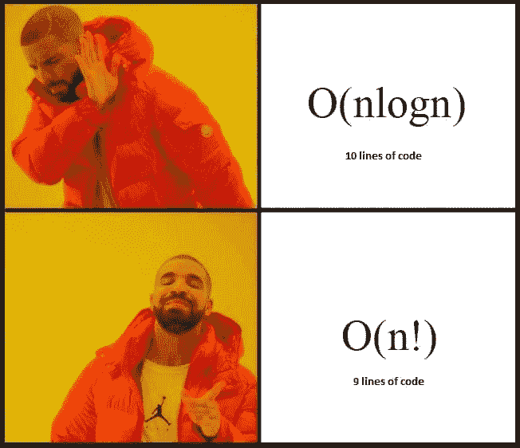

# 大 O 符号——通过例子学习

> 原文：<https://dev.to/jainroe/the-ultimate-guide-to-big-o-notation--learning-through-examples-5ecp>

大 O 符号用于描述或计算算法的时间复杂度(最坏情况下的性能)。这篇文章将展示大 O 符号的具体例子。

 

<figcaption>在发现算法的复杂度不会被考虑到考试中之后。(来源: [Reddit](https://www.reddit.com/r/ProgrammerHumor/comments/7jty1d/after_discovering_that_complexicity_of_the/) )</figcaption>

**一些需要注意的事情**

1.  本文是为中级开发人员编写的，并假设您已经对时间复杂性(最坏情况下的行为)有所了解。
2.  如果这个词没有印象，[我在这里写了一个全面的指南(免费文章)。](https://jshilpa.com/the-ultimate-beginners-guide-to-analysis-of-algorithm/)

### 现实生活中的大 O

现实生活中的许多“操作”可以帮助我们找到顺序。在分析算法/运算时，我们往往会考虑最坏的情况。我们的算法可能发生的最坏情况是什么，我们的算法什么时候需要最多的指令来完成执行？大 O 符号将总是假设算法将执行最大迭代次数的上限。

假设我站在一班学生的前面，其中一个拿了我的包。这里有几个场景和方法，我可以找到我的包和他们相应的符号顺序。

### O(n) —线性时间:

**场景:**我班只有一个藏包的同学知道这件事。

方法:我必须单独询问班上的每个学生是否拿了我的包。如果他们没有，我会继续问下一个学生。

最坏的情况:在最坏的情况下，我将不得不问 *n* 个问题。

给我看看代码！