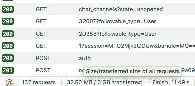
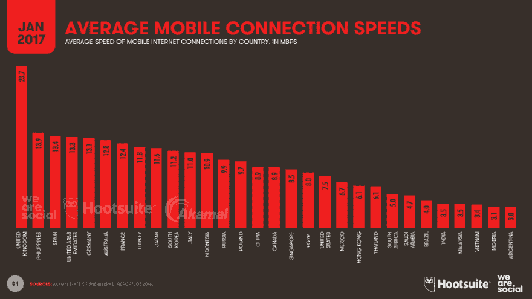

# 我想要的网络

> 原文：<https://dev.to/quii/the-web-i-want-43o>

这篇文章听起来很像是我希望你们都离开我的草坪——因为我就是这么想的。

## web 怎么变成这样了？

[T2】](https://res.cloudinary.com/practicaldev/image/fetch/s--YaL-WUiu--/c_limit%2Cf_auto%2Cfl_progressive%2Cq_auto%2Cw_880/https://i.imgur.com/en9Fc0c.png)

前几天，我的合作伙伴在她用了两年的 Chromebook 上浏览网页，它很难运行许多网站，因为它们加载了广告、gif、视频和大量的 JavaScript，完全没有任何价值。

每天，当我的手机发出轧轧声试图显示一篇博客文章时，我都很沮丧。这篇文章在 JavaScript 和自动播放视频的海洋后面。

这听起来有点像第一世界的问题，但对发展中国家的人来说，情况要糟糕得多。你知道和我们大多数西方人相比，卫星网络有多糟糕吗？太可怕了。

[T2】](https://res.cloudinary.com/practicaldev/image/fetch/s--MBi-C1uC--/c_limit%2Cf_auto%2Cfl_progressive%2Cq_auto%2Cw_880/https://wearesocial-net.s3.amazonaws.com/uk/wp-content/uploads/sites/2/2017/01/Slide091.png)

万维网被认为是一个平等的平台，可以把知识带到任何地方，然而开发者每天都在让那些最需要互联网的人变得更难工作。

让我们来看看互联网是如何“进步”的。

## 二十多年前

大约 20 年前，我建立了自己的第一个网站，它提供的内容和今天大多数网站一样多。它比你在这里读到的 90%的东西更容易访问，运行速度更快，更容易开发。

20 年后，我打开几个标签浏览互联网，不知何故下载了许多兆字节的数据，我的笔记本电脑着火了，然而就实际内容交付而言，什么也没有真正改变。

使用的技术:

*   超文本标记语言

## 10-15 年前

人们厌倦了嵌套的表格和间隔图像。网络正在失去其作为内容交付平台的根基。

我在攻读学位的第一年就在类似上面的网站上工作。我开始在[上阅读关于我们应该如何推动*语义标记*的文章，其中 HTML 简单地描述了一个内容文档，然后使用这个叫做 CSS 的东西对其进行样式化。](https://alistapart.com)

最终我跑进了 CSS Zen Garden，这是一个展示你可以用 CSS 做什么的网站。

这个想法是标记是相同的，网站上有开发者提交的展示不同设计的纯粹使用 CSS。

> HTML 保持不变，唯一改变的是外部 CSS 文件。是的，真的。

这个网站对我对网络开发的态度产生了深远的影响。点击了。HTML 代表内容，CSS 代表风格。不需要 JavaScript，布局不需要表格，没有间隔图像。

**只是用 CSS 装饰的纯 HTML。**

作为一个以尽可能简洁、简单和容易理解的方式提供漂亮内容的社区的一员，我感到很兴奋。

这不仅使网站更易访问、运行更快，而且在某些方面使它们更容易开发。突然从服务器生成标记并不可怕！

事情仍然很困难。CSS 支持并不令人惊讶，我们仍然没有 HTML4 的很多语义元素，所以有很多*的`div`的*。Firebug 刚刚推出，这是一个巨大的推动，但仍然很难做出一致的体验。

我似乎记得 Gmail 是在这个时候出现的，这太棒了。突然间，网络可能成为真正的应用程序。这很有趣，也很有突破性，但也产生了真正的负面影响。很快，人们认为他们当地酒吧的推广网站必须拥有和 Gmail 一样多的 JavaScript。

## 5 年左右至今

以下是对当今态度的一个毫不夸张的总结

许多人只是想传递他们的内容，让它看起来稍微好一点，他们相信你需要世界上所有的网络技术来传递文本。

除非你知道 Vue/React/什么，否则你不是前端开发人员。如果你敢只写你网站所需的最低限度的 JavaScript 代码，你会被嘲笑

> 我是 developer@ iamdevloper“我不需要反应，或者有棱角，我可以在香草 JS 中建造我自己的就好了谢谢”
> 
> *2 周后*2016 年 3 月 10:03 日

页面刷新对用户来说是一个大问题，必须不惜一切代价避免。

出于某种原因，人们正在建立大量的 SPAs(单页网络应用程序)。陈述的原因是为了开发人员使用的速度和方便。我不相信向浏览器发送大量的 JavaScript 会比发送一些该死的 HTML 快。同样，这也不像把一些 HTML 文件放到互联网上那么简单

你会看到这些*可笑的*帖子，在这些帖子中，开发人员为了让他们的网站“快速而高效”而经历了许多考验。他们因为潜在的技术选择而挣扎，然后我仍然下载半兆字节的数据来阅读 500 个单词。很尴尬。

### 我想让你从这篇文章中学到一些东西

*   大多数网站都是关于传递内容的。HTML 在这一点上令人惊奇，你不需要 JavaScript。
*   事实上 JavaScript 是非常有害的。它对低功率设备是毒药，对低带宽的人是可怕的，并且需要额外的努力来保持它的可访问性和速度。
*   这么多的努力都倾注在这些 JavaScript 上。你似乎必须学习很多东西，新的框架，新的构建工具，新的测试方法；**大多数时候，这让你的用户体验变得更糟**。
*   在实践中，你的网站会做它需要做的一切，用一些链接到 CSS 的 HTML 文件。

### 那么我想要的网络是什么样的

*   语义的，可访问的，HTML。这意味着它适用于所有人，下载速度快，比编写 React 组件更省力。
*   CSS 使它看起来很漂亮。不要为了视觉效果而使用 JavaScript。
*   需要时，小图像。受够了这些*搞笑的*4mb gif。
*   下载 10kb 后，大多数网站都可以阅读了。
*   如果我不打开 JavaScript 就不能使用你的网站，那么你就不知道你在做什么。

#### 这么没有 JavaScript，真的？

当然，JavaScript 仍然有它的位置，如果使用得当，可以提高网站的可用性。然而，请仔细考虑您引入的库和框架。也许你不需要引入 JQuery 就可以完成你需要的东西，现代浏览器已经内置了优秀的 API。用 JS 瞄准*渐进增强*。即使没有打开 JS，你的网站也应该可以工作。

关于单页应用程序，我真的相信有太多的人在制作它们。GMail 是一个网络应用程序，因此应该有一个框架。你的博客平台？没有那么多。请记住，这些框架不仅给用户体验带来很大压力，而且还有很多东西需要学习。也许你的时间可以更好地服务。

#### 但是我的产品负责人说我们需要所有这些附加功能！

作为一个专业人士，你应该表明立场。你是专家，而不是顾客。

*   你应该告诉他们，亚马逊是如何知道每 100 毫秒的页面加载会让他们损失 1%的销售额的。
*   你应该告诉他们，制作他们产品目录的旋转木马既慢又烦人*而且*比仅仅在`<ul>`中列出它们要贵。
*   你应该让他们知道，如果他们真的想让他们开创性的诗歌传播到世界各地，他们最好确保他们的网站在互联网连接缓慢的旧硬件上工作。

如果我告诉我的房子的建造者用稻草建造，我希望她能说服我。

当然，情况很复杂，有时人们会忽视你，但是当你看一些流行网站的状态时，你只能得出结论，人们要么不知道他们在做什么，要么就是没有足够地抵制不好的要求。

## 包装完毕

看看你的网站的开发者工具中的性能标签。这让你骄傲吗？如果没有，拿出点自尊，开始砍掉你认为你需要的东西。

让我们通过使用在任何地方都有效的简单技术，让我们的网站变得精简、可访问、更简单。采取这种方法有道德和技术上的理由。

请记住，大多数网站的目标是提供有用的文本内容，而你真正需要的是 HTML。

这样我们就不必每两年买一台新的笔记本电脑，那些没有你幸运的人也有机会真正使用网络；它原本的样子。