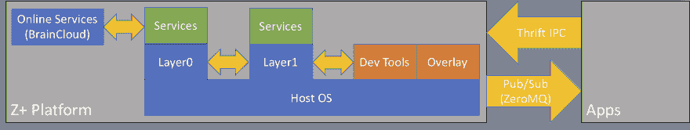

# Z+系统软件

> 原文：<https://dev.to/jeikabu/the-z-system-software-1jnd>

在 ChinaJoy 2018(7 月底)上，我们宣布了“ **Z+** ”，这是一款基于半定制 AMD [SoC](https://en.wikipedia.org/wiki/System_on_a_chip) (类似于[乌鸦岭](https://en.wikipedia.org/wiki/Ryzen#Raven_Ridge)的锐龙 CPU 和织女星 GPU)的两用 PC 和游戏主机。附加信息:

*   [Anandtech](https://www.anandtech.com/show/13163/more-details-about-the-zhongshan-subor-z-console-with-custom-amd-ryzen-soc)
*   [欧洲玩家](https://www.eurogamer.net/articles/digitalfoundry-2018-hands-on-with-subor-z-plus-ryzen-vega-chinese-console)
*   我们的网站(简体中文)
*   [法米松](https://www.famitsu.com/news/201808/05161964.html)(日语)

下个月，我们将把它作为一台 PC 出货，在 2019 年 Q1 奥运会上，我们将发布游戏主机功能。

在项目开始时，我们对系统软件有几个高层次的目标:

*   UI 与业务逻辑完全分离，多个通信客户端
*   多核友好，异步[一直到](https://en.wikipedia.org/wiki/Turtles_all_the_way_down)
*   便携；多平台友好
*   模块化和松散耦合，以简化测试并启用[功能标志](https://en.wikipedia.org/wiki/Feature_toggle)

虽然在内部我有意避免使用“微服务”这个术语，因为它倾向于关注服务器端架构，但这正是我们系统软件的设计方式。我们花了几个月的时间开发一个原型，花了将近一年半的时间全面生产，增加了 10 名全职软件工程师来开发系统软件。接下来是对仍然是“测试版”软件的架构概述和事后分析。

## 施法

[我们的 Github 文档](https://github.com/subor/sdk/blob/master/docs/README.md)有一个粗略的[平台图](https://github.com/subor/sdk/blob/master/docs/topics/layer0.md)但是我们需要用一些更详细和准确的东西来更新它:

机器运行 Windows 10 物联网企业版(与“[物联网核心](https://docs.microsoft.com/en-us/windows/iot-core/windows-iot-core)”无关，令人困惑)。

第 0 层是一个[窗口服务](//./windows-service-in-c-1m79)，作为微服务容器。 [Layer1](//./layer1-17dj) 是一个子容器，带有需要访问用户桌面的附加服务。

服务本身是 MEF 扩展。通信是通过 Thrift RPC 以及 [ZeroMQ](//./apache-thrift-over-zeromq-66e) 为 [pub/sub](https://en.wikipedia.org/wiki/Publish%E2%80%93subscribe_pattern) 完成的。

一些服务示例:

| 名字 | 层 | 描述 |
| --- | --- | --- |
| 在线的 | Zero | 连接到 Braincloud，并在我们的平台和他们的 REST API 之间架起桥梁 |
| 用户 | Zero | 用户会话管理:将用户绑定到输入设备，管理游戏/用户/平台到在线服务的连接 |
| 设置 | Zero | 用户和系统设置/配置 |
| 投入 | one | 管理输入设备(尤其是游戏手柄) |
| 覆盖物 | one | 覆盖的通信和管理、显示弹出通知等。 |
| 电力和照明 | one | 处理电源按钮事件、LPM 转换、LED 控制 |

有几个不同的客户，但最重要的是:

*   主客户端使用[Chromium Embedded Framework(CEF)](https://bitbucket.org/chromiumembedded/cef)来呈现我们基于 HTML5 的 UI ( [Vue.js](https://vuejs.org/)
*   Overlay 基于从 [Evolve](https://www.evolvehq.com) 获得授权的技术，处理应用/游戏上的 UI 显示(也是 CEF/HTML5)

后端是运行在[阿里云/“阿里云”PaaS](https://www.alibabacloud.com/) 之上的 [Braincloud](https://getbraincloud.com/) 的定制实例(非常类似于 AWS)。

## 好人

### 粒度

最初，有人担心过于细粒度和过多的通信开销(“聊天”服务)。一个团队成员问，“我们应该把服务做得多小？”对此我回答说“如果两个模块只相互通信，那么它们应该在同一个服务中”。这在当时是一句轻率的话，但在实践中证明效果很好。

### 客户端模块化

我们能够构建几个客户端:主客户端、叠加、minipower ( [WPF](https://docs.microsoft.com/en-us/dotnet/framework/wpf/getting-started/introduction-to-wpf-in-vs) )、[示例](https://github.com/subor/sample_unity_space_shooter)、[游戏](https://github.com/subor/sample_ue4_platformer)等。我们可以为这项工作选择合适的工具，并支持广泛的第三方应用程序([包括 Rust](//./rust-w-apache-thrift-h8a) )。

我们的[低功耗模式(LPM)](https://github.com/subor/sdk/blob/master/docs/topics/lpm.md) 对 SoC 进行电源门控，因此只有一个 CPU 内核开启，内存/GPU 受到时钟门控。这是为了进行后台下载/更新，系统消耗大约 35W(我们最初的目标是 20W，但没有成功)。作为比较:在正常操作下，系统闲置在 60W，运行像*古墓丽影*的游戏是 180W 以上，CPU/GPU 压力测试可以达到 220W。第 1 层、主客户端和覆盖层都可以关闭，只留下相当少的第 0 层用于基本系统功能。

### 服务模块化/隔离

当我们将第 0 层转换为 Windows 服务时，我们需要创建第 1 层，并将几个模块移入其中。我们将 4 项服务从第 0 层移至第 1 层，这是一个完全独立的过程。它花了大约一周的时间，主要是处理产卵和管理第二个过程。一般来说，服务可能会(也确实会)失败，而且不会导致整个应用程序崩溃。

### 排比

由于每个服务都有自己的线程，并且明智地使用线程池，我们充分利用了所有 4 个 CPU 内核和 8 个硬件线程。

后台上传/下载、延迟敏感输入处理、UI 更新以及与在线服务的交互都可以同时进行，不会出现任何问题。

### 代码重用/平台不可知

Layer0 运行在 Windows 7 到 Windows 10 上，我们已经有原型运行在物联网核心上，通过 Mono 运行在 OSX 上，通过 [Xamarin](https://docs.microsoft.com/en-us/xamarin/) 运行在 Android(可能还有 iOS)上。

## 坏的和/或丑陋的

### 错综复杂的开/关机过程和使用寿命

这在一开始并不明显，然后随着时间的推移逐渐形成。

### 彻底改造依赖注入——差强人意

`static`班级？检查。单身族？检查。传递上下文/工厂？检查。服务中平台特定代码的“迷你插件”？检查。一些实际的依赖注入？很自然。

### 开销和资源使用情况

上次普查我们有 24 个服务和 48 个二进制文件(可执行文件和库——不包括测试和第三方/框架依赖)。启动时间比期望的差一点。

第一个实现使用线程-每个服务 2 个。24 小时服务，嗯…你自己算吧。包括非服务组件在内，我们正在产生大约 60 个线程。理所当然的，大部分都被屏蔽在`accept()`之类的。我们做了一些跑腿的工作，将所有东西都转移到`Task`和任务并行库，但是这还没有完成。

转移到两个进程需要将 ZeroMQ 从`inproc://`切换到`tcp://`，因为它不支持命名管道。我认为我们正在使用大约 100 个端口…记住这是在使用`TMultiplexedProtocol`之后。

乍一看，这似乎没那么糟糕。但是，请记住，我们的平台不是主要的应用程序，我们需要为游戏保留大部分硬件资源。

### 冗余层和间接层

由于历史原因，来自层 0/层 1 的消息首先通过主客户端的 C#/CEF 部分，然后被转发到托管的 HTML5/Javascript。

每个服务都有一个内部和外部接口。这是为了提供内部和外部 API，分别由我们和外部开发人员使用。不幸的是，它以额外的抽象层(以及额外的线程和连接)的形式出现。

### 自作自受的依赖和僵化

几个服务等待另一个服务启动。因此，如果该服务失败，基本上什么都不会启动。我们还有其他一些微服务反模式，比如服务之间的同步请求/响应调用链(相对较短)。虽然我们可以使用 ZeroMQ 的 pub/sub 来处理异步请求和[集成事件](https://github.com/dotnet/docs/blob/master/docs/standard/microservices-architecture/multi-container-microservice-net-applications/integration-event-based-microservice-communications.md)，但实际上我们并没有这样做。

## 结论

简而言之，我们实现了一些目标，但未能利用微服务架构的所有优势——尤其是自主性。这主要是由于我们对模式不熟悉和缺乏经验。然而，总的来说，我相信团队的大多数人会认为这个实验是成功的。

这是相当高的水平，我掩饰了大部分细节，但我打算用它作为谈论我们的系统软件的“第二代”的起点。