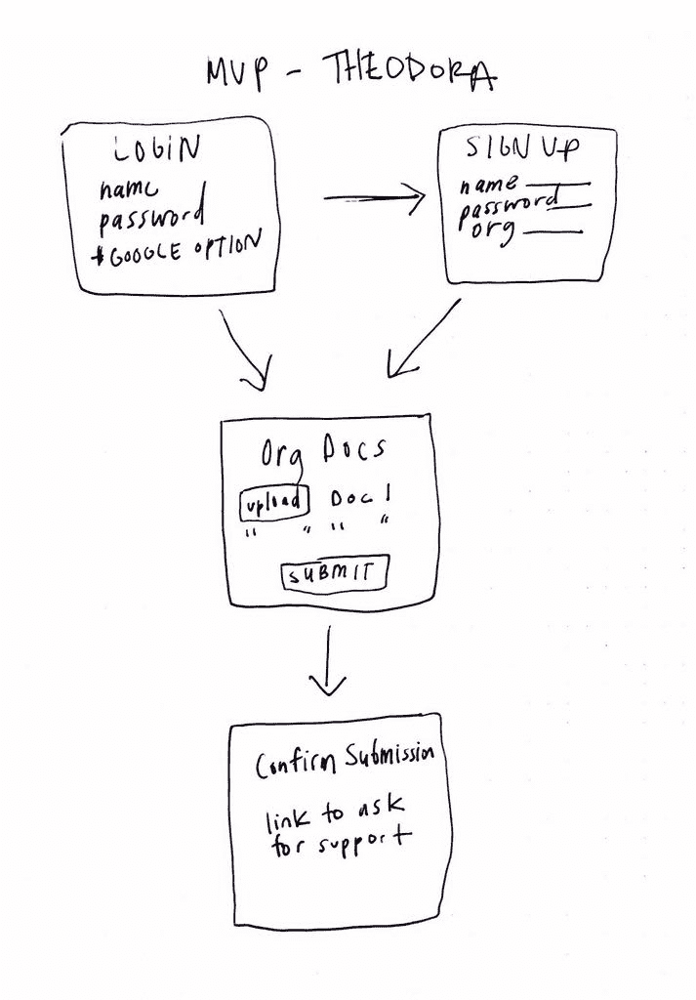
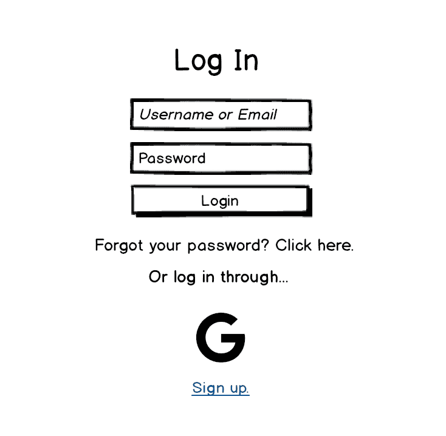
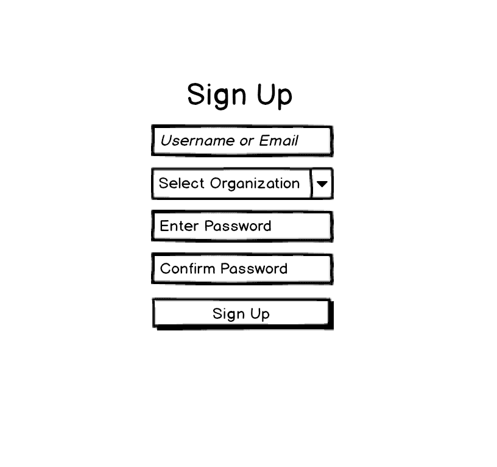
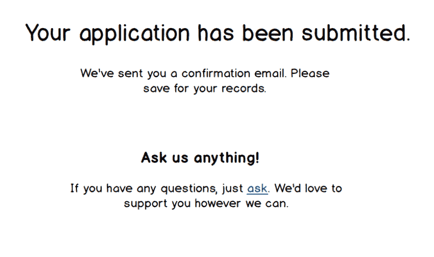
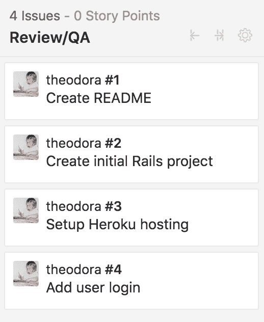

# 提奥多拉:开始一个开源项目

> 原文：<https://dev.to/ketoaustin/theodora-starting-an-open-source-project-2clf>

我正在开发一个开源的 rails 应用程序，旨在让非营利组织能够有效地管理政府拨款。它叫做[提奥多拉](https://github.com/hcarnes/theodora)👑。大型非营利组织通常有这样一种结构，一个行政组织在多个较小的非营利组织之间分配拨款。这种结构类似于快餐🍔连锁企业是中央公司办公室的附属机构。

这篇文章将分享我创建提奥多拉开源项目的步骤。下面是我将讨论的每个步骤的概述:

*   确定目标
*   确定堆栈
*   确定架构
*   概述这个想法
*   创建一个线框
*   使用 Zenhub

## 确定目标

提奥多拉将允许一个行政办公室通过一个应用程序来管理每个当地非营利组织的文件。如果没有这个应用程序，文档将不得不通过电子邮件发送，从而导致多个附件。通过电子邮件附件发送和接收信息为人为错误(忘记附件)创造了空间😱通过多个电子邮件接收附件等。).

提奥多拉旨在通过提供一个上传和提交所有文件的地方来解决这个问题。将来，我想添加创建文档模板的功能，以便用户填写表单，而不是上传 Word 或 Excel 文档。
[T3】](https://res.cloudinary.com/practicaldev/image/fetch/s--z6m89G0n--/c_limit%2Cf_auto%2Cfl_progressive%2Cq_auto%2Cw_880/https://i.imgur.com/15lULox.png%3F1)

## 确定堆栈

Ruby on Rails 是一个固执己见的框架，它允许我快速设置应用程序。在构建特性时，有一个很大的 Rails 开发人员社区可供学习，也有大量的库可供选择。对于 MVP，前端不需要使用 JavaScript 框架。随着我将来构建更多的交互特性，我计划使用 React。

[T2】](https://res.cloudinary.com/practicaldev/image/fetch/s--ZJKfVLyD--/c_limit%2Cf_auto%2Cfl_progressive%2Cq_auto%2Cw_880/https://upload.wikimedia.org/wikipedia/commons/f/f1/Ruby_logo.png)

## 确定架构

因为每个本地非营利组织都需要登录才能上传、编辑和提交文档，所以提奥多拉将是一个多租户软件即服务(SaaS)应用程序。多租户意味着多个管理组织可以使用同一个应用程序。这样，开发人员只需要维护一个代码库，同时为组织提供相同的服务。对提奥多拉来说，行政机构将是“租户”，当地非营利组织将是“用户”。

## 勾画想法

为了开始，我草拟了最小可行产品(MVP)。我的目标是快速画出我的想法，这样我就可以很容易地建立一个更详细的线框。

[T2】](https://res.cloudinary.com/practicaldev/image/fetch/s--CqbSMoAi--/c_limit%2Cf_auto%2Cfl_progressive%2Cq_auto%2Cw_880/https://i.imgur.com/iLqCV14h.jpg)

## 创建线框

接下来，我使用 [Balsamiq](https://balsamiq.com/) 创建了一个线框。我选择 Balsamiq 是因为我可以使用免费试用，而且它很容易使用。

> 注意:如果你想导出你的线框到 PDF 和 PNG，Balsamiq 会创建一个低质量的文档。还有其他工具，比如 [Sketch](https://www.sketchapp.com/) ，可以让你快速构建网络和移动线框，还可以导出高质量的文档。

我用 Balsamiq 制定了这个计划:

提示用户手动或通过谷歌登录。
 
如果用户点击注册，让用户注册并确保他们选择一个组织。注册立即登录用户。
 
用户登录后，向他们显示自定义组织页面，他们可以在其中上传文档。如果所有文档都已上传，用户可以提交文档。

[T2】](https://res.cloudinary.com/practicaldev/image/fetch/s--Mb7SsYTJ--/c_limit%2Cf_auto%2Cfl_progressive%2Cq_auto%2Cw_880/https://i.imgur.com/0lTXCii.png%3F1)

用户提交文档后，显示一条确认消息，以及一个向管理员提问的链接。

[T2】](https://res.cloudinary.com/practicaldev/image/fetch/s--cDt60bRo--/c_limit%2Cf_auto%2Cfl_progressive%2Cq_auto%2Cw_880/https://i.imgur.com/zCBwMKc.png%3F1)

## 使用 Zenhub

有了 MVP 的计划，我可以很容易地带着明确的目标开始开发。我在 Github 中为提奥多拉创建了一个存储库，并创建了一个 [ZenHub Board](https://www.zenhub.com/guides/setup-my-zenhub-boards) 来可视化工作流，并允许其他人对问题做出贡献。我已经有一个人提交了拉取请求！

[T2】](https://res.cloudinary.com/practicaldev/image/fetch/s--FZXEdr4O--/c_limit%2Cf_auto%2Cfl_progressive%2Cq_auto%2Cw_880/https://i.imgur.com/2BKUHUV.png)

## 下一步

至此，是时候开始研究和编码了。我希望这篇文章能激励其他人参与到这个项目中来。请继续关注关于在 Rails 中构建多租户的新帖子，如果您有兴趣了解更多信息，请随时联系我们。