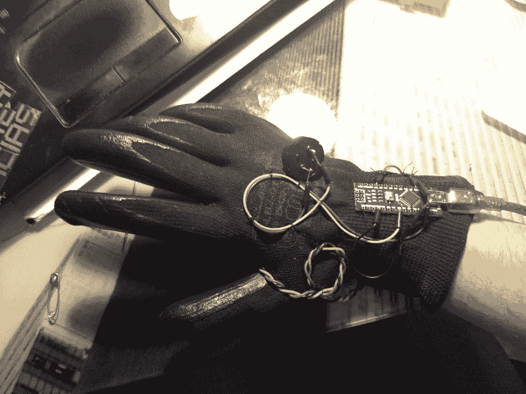
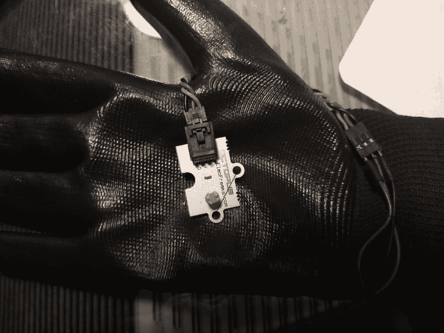
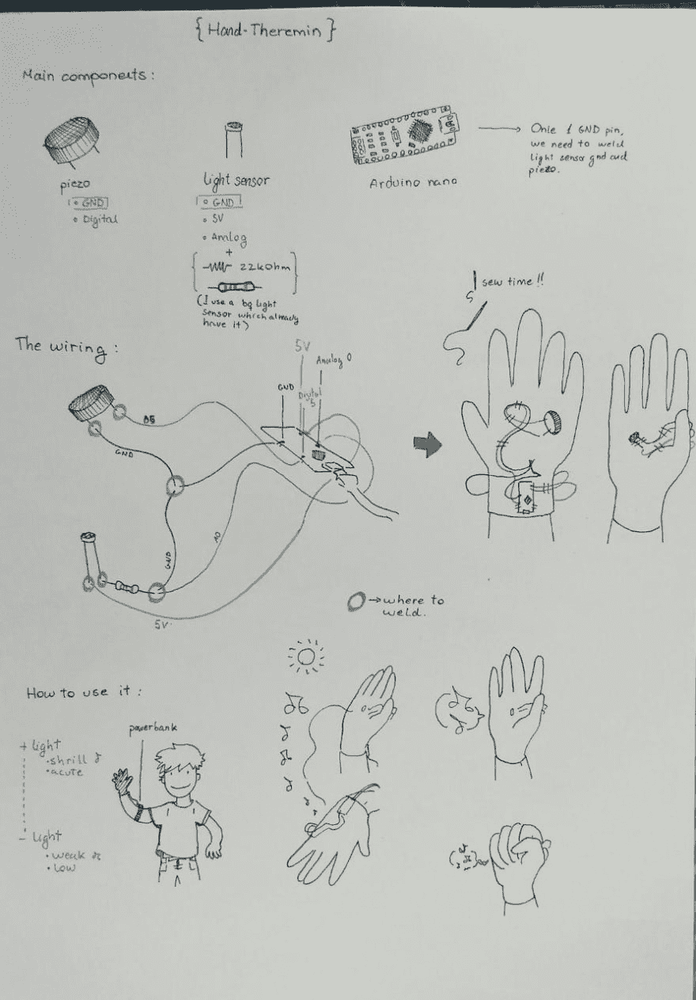

# 特雷门手套

> 原文：<https://dev.to/terceranexus6/theremind-glove--1f9>

[](https://res.cloudinary.com/practicaldev/image/fetch/s--yjtqnZoK--/c_limit%2Cf_auto%2Cfl_progressive%2Cq_auto%2Cw_880/https://thepracticaldev.s3.amazonaws.com/i/7m650firwnjb09o5oky5.jpg)
[T6】](https://res.cloudinary.com/practicaldev/image/fetch/s--GtD5Gym---/c_limit%2Cf_auto%2Cfl_progressive%2Cq_auto%2Cw_880/https://thepracticaldev.s3.amazonaws.com/i/i7kynvcahlenecy1j7qq.jpg)

不久前，我在 gearbest 看到了一台 Arduino Nano。我已经用了 arduino uno，我喜欢开放的硬件和小工具，所以我买了一个来玩玩。昨天它到家了，我决定做一只 [**手特雷门琴**](https://vimeo.com/255092272) 我可以和它一起跳舞和玩耍。如果我想在街上舒服地使用它，我需要焊接一些部件，而不是像在我的大多数项目中那样使用试验板。首先，我用了:

*   压力
*   光传感器+ 20 千欧
*   Arduino nano

压电传感器需要连接到 GND 和数字引脚，光传感器需要连接到模拟引脚、5V 和地。我的光传感器是一个 bq 模块准备布线，但在我的原理图，我提供了正常传感器的焊接说明。

现在，代码必须通过 arduino IDE 上传，使用 c。我的是:

```
//sensor value and its limits
int sensorValue;
int sensorLow = 1023;
int sensorHigh = 0;

//for connection checking, no need to put the led in the actual circuit
const int ledPin= 13;

void setup() {
  pinMode(ledPin, OUTPUT);
  digitalWrite(ledPin, HIGH);
  while (millis() < 5000) {
    sensorValue = analogRead(A0);
          if (sensorValue > sensorHigh) {
                    sensorHigh = sensorValue;
          }
          if (sensorValue < sensorLow) {
                    sensorLow = sensorValue;
          }
  }//end of while.
  digitalWrite(ledPin, LOW);
 }

void loop() { 
  sensorValue = analogRead(A0);

  int pitch = map(sensorValue, sensorLow, sensorHigh, 50, 4000);
  // I connected the piezo in digital 5
  tone(5,pitch,20);
  delay(10);

} 
```

Enter fullscreen mode Exit fullscreen mode

这是接线和其他相关说明:

[T2】](https://res.cloudinary.com/practicaldev/image/fetch/s--KGlwg6Tw--/c_limit%2Cf_auto%2Cfl_progressive%2Cq_auto%2Cw_880/https://thepracticaldev.s3.amazonaws.com/i/uot7a88hk31cepi409dg.jpg)

对于电源，我建议使用连接到手臂的电源组。现在去好好玩吧！